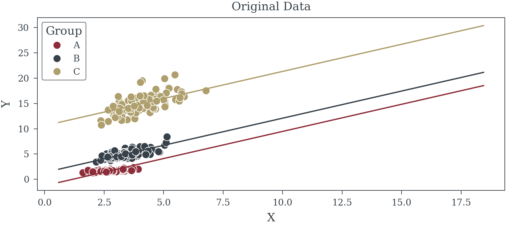
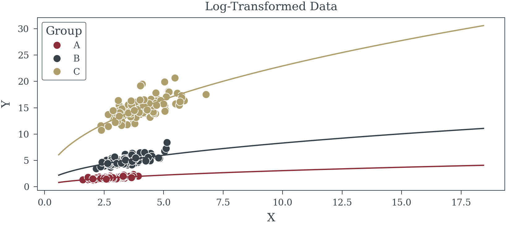
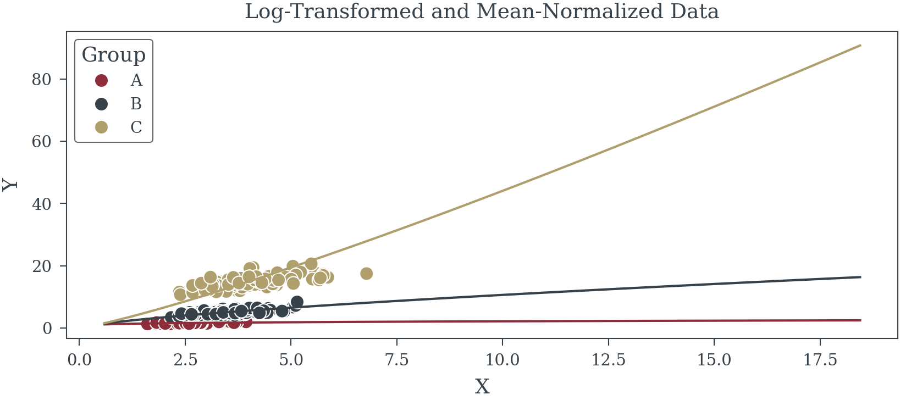
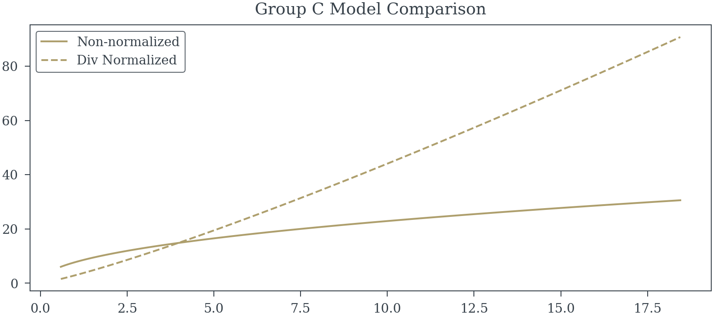

# A Comparison of Normalization Techniques for Group Level Data
Matthew Reda

<!-- WARNING: THIS FILE WAS AUTOGENERATED! DO NOT EDIT! -->

------------------------------------------------------------------------

<a
href="https://github.com/redam94/common_regression_issues/blob/main/common_regression_issues/normalization.py#L17"
target="_blank" style="float:right; font-size:smaller">source</a>

### perform_fixed_effects

>      perform_fixed_effects (df:pandas.core.frame.DataFrame, dependent_var:str,
>                             independent_var:str, group:None|str=None)

<table>
<thead>
<tr class="header">
<th></th>
<th><strong>Type</strong></th>
<th><strong>Default</strong></th>
<th><strong>Details</strong></th>
</tr>
</thead>
<tbody>
<tr class="odd">
<td>df</td>
<td>DataFrame</td>
<td></td>
<td>Data</td>
</tr>
<tr class="even">
<td>dependent_var</td>
<td>str</td>
<td></td>
<td>Dependent Variable Name</td>
</tr>
<tr class="odd">
<td>independent_var</td>
<td>str</td>
<td></td>
<td>Independent Variable Name</td>
</tr>
<tr class="even">
<td>group</td>
<td>None | str</td>
<td>None</td>
<td>Grouping Name</td>
</tr>
</tbody>
</table>

<div class="panel-tabset" group="Regression">

## Linear Regression

``` python
model_original = perform_fixed_effects(df, 'Y', 'X', group="Group")
```

<div class="cell-output cell-output-stdout">

                                OLS Regression Results                            
    ==============================================================================
    Dep. Variable:                      Y   R-squared:                       0.975
    Model:                            OLS   Adj. R-squared:                  0.974
    Method:                 Least Squares   F-statistic:                     321.0
    Date:                Wed, 20 Nov 2024   Prob (F-statistic):            0.00310
    Time:                        23:41:40   Log-Likelihood:                -400.16
    No. Observations:                 300   AIC:                             808.3
    Df Residuals:                     296   BIC:                             823.1
    Df Model:                           3                                         
    Covariance Type:              cluster                                         
    ==============================================================================
                     coef    std err          z      P>|z|      [0.025      0.975]
    ------------------------------------------------------------------------------
    const         -1.2542      0.763     -1.644      0.100      -2.749       0.241
    X              1.0725      0.282      3.805      0.000       0.520       1.625
    B              2.6161      0.199     13.124      0.000       2.225       3.007
    C             11.8617      0.382     31.044      0.000      11.113      12.611
    ==============================================================================
    Omnibus:                       74.420   Durbin-Watson:                   2.001
    Prob(Omnibus):                  0.000   Jarque-Bera (JB):              379.356
    Skew:                           0.904   Prob(JB):                     4.21e-83
    Kurtosis:                       8.204   Cond. No.                         18.2
    ==============================================================================

    Notes:
    [1] Standard Errors are robust to cluster correlation (cluster)

</div>

## Log-Log Model No Div Normalize

``` python
model_log = perform_fixed_effects(df, 'log_Y', 'log_X', "Group")
```

<div class="cell-output cell-output-stdout">

                                OLS Regression Results                            
    ==============================================================================
    Dep. Variable:                  log_Y   R-squared:                       0.988
    Model:                            OLS   Adj. R-squared:                  0.988
    Method:                 Least Squares   F-statistic:                     49.98
    Date:                Wed, 20 Nov 2024   Prob (F-statistic):             0.0194
    Time:                        23:51:17   Log-Likelihood:                 269.61
    No. Observations:                 300   AIC:                            -531.2
    Df Residuals:                     296   BIC:                            -516.4
    Df Model:                           3                                         
    Covariance Type:              cluster                                         
    ==============================================================================
                     coef    std err          z      P>|z|      [0.025      0.975]
    ------------------------------------------------------------------------------
    const          0.0305      0.065      0.470      0.639      -0.097       0.158
    log_X          0.4711      0.066      7.099      0.000       0.341       0.601
    B              1.0007      0.015     64.917      0.000       0.970       1.031
    C              2.0174      0.027     75.848      0.000       1.965       2.070
    ==============================================================================
    Omnibus:                        5.308   Durbin-Watson:                   1.950
    Prob(Omnibus):                  0.070   Jarque-Bera (JB):                5.394
    Skew:                           0.325   Prob(JB):                       0.0674
    Kurtosis:                       2.905   Cond. No.                         12.9
    ==============================================================================

    Notes:
    [1] Standard Errors are robust to cluster correlation (cluster)

</div>

## Log-Log with Div Normalization

``` python
model_log_norm = perform_fixed_effects(df, 'log_Y_norm', 'log_X', 'Group')
```

<div class="cell-output cell-output-stdout">

                                OLS Regression Results                            
    ==============================================================================
    Dep. Variable:             log_Y_norm   R-squared:                       0.284
    Model:                            OLS   Adj. R-squared:                  0.277
    Method:                 Least Squares   F-statistic:                     4.051
    Date:                Wed, 20 Nov 2024   Prob (F-statistic):              0.182
    Time:                        23:53:36   Log-Likelihood:                 183.09
    No. Observations:                 300   AIC:                            -358.2
    Df Residuals:                     296   BIC:                            -343.4
    Df Model:                           3                                         
    Covariance Type:              cluster                                         
    ==============================================================================
                     coef    std err          z      P>|z|      [0.025      0.975]
    ------------------------------------------------------------------------------
    const          0.5718      0.213      2.688      0.007       0.155       0.989
    log_X          0.4372      0.217      2.013      0.044       0.011       0.863
    B             -0.1016      0.050     -2.013      0.044      -0.200      -0.003
    C             -0.1752      0.087     -2.013      0.044      -0.346      -0.005
    ==============================================================================
    Omnibus:                       30.117   Durbin-Watson:                   2.240
    Prob(Omnibus):                  0.000   Jarque-Bera (JB):              106.155
    Skew:                           0.321   Prob(JB):                     8.89e-24
    Kurtosis:                       5.843   Cond. No.                         12.9
    ==============================================================================

    Notes:
    [1] Standard Errors are robust to cluster correlation (cluster)

</div>

</div>

<div class="panel-tabset" group="Regression">

## Linear Regression



## Log-Log Model No Div Normalize



## Log-Log with Div Normalization



</div>


