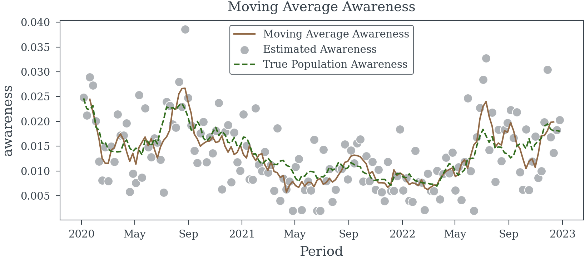

# Measurement Error in Exogenous Variables


<!-- WARNING: THIS FILE WAS AUTOGENERATED! DO NOT EDIT! -->

There are numerous problems that can occur when exogenous variables with
measurment error are used in a regression model improperly. This
notebook will demonstrate the problems that can occur when measurement
error is present in the exogenous variables of a regression model. And
some methods for mitigating the problems that can occur when measurement
error is present in the exogenous variables of a regression model.

## Survey Data

When working with surveys and samples from a population, it is important
to consider the precision of the population parameter estimates. The
precision of the population parameter estimates is influenced by the
sample size, the sampling design, and the measurement error in the
survey data.

When imprecise measures are used in a regression model, the estimates of
the coefficients of the model will be biased and inconsistent. This can
occur even when the sampling design is unbiased and respondents answers
are entirely accurate. For survey data samples size is often limited,
and the sampling design is often complex. This means that the
measurement error in the survey data can have a significant impact on
the precision of the population parameter estimates.

## Completely random measurement error in a binary outcome variable

Consider the following example:

> A survey is conducted weekly with an average of 500 participants each
> week. The survey asks participants if they recall seeing a particular
> brand’s advertisement. Survey participents are randomly selected from
> the population and are well representative of the total population.
> The survey is conducted by phone and online.

First lets assume that all participants are able to recall the brand’s
advertisement with 100% accuracy. We would like to estimate the effect
of a populations ability to recall the brand’s advertisement on the
brand’s sales. We will use a simple linear regression model to estimate
the effect of the populations ability to recall the brand’s
advertisement on the brand’s sales.

Let us simulate the 3 years of survey data.

------------------------------------------------------------------------

<a
href="https://github.com/redam94/common_regression_issues/blob/main/common_regression_issues/measurement_error.py#L21"
target="_blank" style="float:right; font-size:smaller">source</a>

### random_walk_awareness_model

>      random_walk_awareness_model
>                                   (periods:list|pandas.core.indexes.datetimes.
>                                   DatetimeIndex|numpy.ndarray)

<table>
<colgroup>
<col style="width: 9%" />
<col style="width: 38%" />
<col style="width: 52%" />
</colgroup>
<thead>
<tr class="header">
<th></th>
<th><strong>Type</strong></th>
<th><strong>Details</strong></th>
</tr>
</thead>
<tbody>
<tr class="odd">
<td>periods</td>
<td>list | pandas.core.indexes.datetimes.DatetimeIndex |
numpy.ndarray</td>
<td>Time periods to simulate</td>
</tr>
<tr class="even">
<td><strong>Returns</strong></td>
<td><strong>Model</strong></td>
<td><strong>PyMC model for the random walk awareness model</strong></td>
</tr>
</tbody>
</table>

``` python
dates = pd.date_range(start='2021-01-01', periods=156, freq='W-MON')
awareness_model = random_walk_awareness_model(dates)
starting_awareness = 0.025
logit_starting_awareness = np.log(starting_awareness/(1-starting_awareness))
generative_model = pm.do(
  awareness_model, 
  {
    'weekly_variation': .1, 
    'initial_awareness': logit_starting_awareness,
    'weekly_shock': .01
  }
)
population_awareness = pm.draw(generative_model['awareness'], random_seed=23)
population_awareness = xr.DataArray(
  population_awareness,
  dims=['Period'],
  coords={'Period': dates}
)
```


------------------------------------------------------------------------

<a
href="https://github.com/redam94/common_regression_issues/blob/main/common_regression_issues/measurement_error.py#L43"
target="_blank" style="float:right; font-size:smaller">source</a>

### survey_obs_model

>      survey_obs_model (population_awareness:xarray.core.dataarray.DataArray|py
>                        tensor.tensor.variable.TensorVariable,
>                        avg_weekly_participants:float=500.0, coords:dict=None,
>                        model:pymc.model.core.Model=None)

<table>
<colgroup>
<col style="width: 6%" />
<col style="width: 25%" />
<col style="width: 34%" />
<col style="width: 34%" />
</colgroup>
<thead>
<tr class="header">
<th></th>
<th><strong>Type</strong></th>
<th><strong>Default</strong></th>
<th><strong>Details</strong></th>
</tr>
</thead>
<tbody>
<tr class="odd">
<td>population_awareness</td>
<td>xarray.core.dataarray.DataArray |
pytensor.tensor.variable.TensorVariable</td>
<td></td>
<td>Population awareness</td>
</tr>
<tr class="even">
<td>avg_weekly_participants</td>
<td>float</td>
<td>500.0</td>
<td>Average number of participants per week</td>
</tr>
<tr class="odd">
<td>coords</td>
<td>dict</td>
<td>None</td>
<td>Coordinates for the PyMC model</td>
</tr>
<tr class="even">
<td>model</td>
<td>Model</td>
<td>None</td>
<td>PyMC model to add the survey observation model</td>
</tr>
<tr class="odd">
<td><strong>Returns</strong></td>
<td><strong>Model</strong></td>
<td></td>
<td></td>
</tr>
</tbody>
</table>

------------------------------------------------------------------------

<a
href="https://github.com/redam94/common_regression_issues/blob/main/common_regression_issues/measurement_error.py#L65"
target="_blank" style="float:right; font-size:smaller">source</a>

### simulate_awareness_survey_data

>      simulate_awareness_survey_data (start_date:str='2020-01-01',
>                                      n_weeks:int=156,
>                                      avg_weekly_participants:float=500.0,
>                                      weekly_awareness_variation:float=0.08,
>                                      starting_population_aware:float=0.025,
>                                      weekly_shock:float=0.01,
>                                      random_seed:int=42)

<table>
<colgroup>
<col style="width: 6%" />
<col style="width: 25%" />
<col style="width: 34%" />
<col style="width: 34%" />
</colgroup>
<thead>
<tr class="header">
<th></th>
<th><strong>Type</strong></th>
<th><strong>Default</strong></th>
<th><strong>Details</strong></th>
</tr>
</thead>
<tbody>
<tr class="odd">
<td>start_date</td>
<td>str</td>
<td>2020-01-01</td>
<td>Start date of the survey data</td>
</tr>
<tr class="even">
<td>n_weeks</td>
<td>int</td>
<td>156</td>
<td>Number of weeks to simulate</td>
</tr>
<tr class="odd">
<td>avg_weekly_participants</td>
<td>float</td>
<td>500.0</td>
<td>Average number of participants per week</td>
</tr>
<tr class="even">
<td>weekly_awareness_variation</td>
<td>float</td>
<td>0.08</td>
<td>Std. dev. of gaussian inovations for weekly awareness</td>
</tr>
<tr class="odd">
<td>starting_population_aware</td>
<td>float</td>
<td>0.025</td>
<td>Starting population awareness</td>
</tr>
<tr class="even">
<td>weekly_shock</td>
<td>float</td>
<td>0.01</td>
<td>Std. dev. of gaussian noise for weekly deviation from random
walk</td>
</tr>
<tr class="odd">
<td>random_seed</td>
<td>int</td>
<td>42</td>
<td>Random seed for reproducibility</td>
</tr>
<tr class="even">
<td><strong>Returns</strong></td>
<td><strong>Dataset</strong></td>
<td></td>
<td><strong>Simulated awareness survey data as an xarray
dataset</strong></td>
</tr>
</tbody>
</table>

------------------------------------------------------------------------

<a
href="https://github.com/redam94/common_regression_issues/blob/main/common_regression_issues/measurement_error.py#L94"
target="_blank" style="float:right; font-size:smaller">source</a>

### plot_survey_sim_data

>      plot_survey_sim_data (data:xarray.core.dataset.Dataset)

<table>
<colgroup>
<col style="width: 9%" />
<col style="width: 38%" />
<col style="width: 52%" />
</colgroup>
<thead>
<tr class="header">
<th></th>
<th><strong>Type</strong></th>
<th><strong>Details</strong></th>
</tr>
</thead>
<tbody>
<tr class="odd">
<td>data</td>
<td>Dataset</td>
<td>Simulated survey data must contain ‘awareness’ and
‘estimated_awareness’ variables</td>
</tr>
<tr class="even">
<td><strong>Returns</strong></td>
<td><strong>None</strong></td>
<td><strong>Plot of the simulated survey data</strong></td>
</tr>
</tbody>
</table>

``` python
trace = simulate_awareness_survey_data(random_seed=23)
plot_survey_sim_data(trace)
```


## Let’s simulate some sales data

The sales data is simulated using the following equation:

<span id="eq-sales">
$$
\begin{align\*}
log(S_t) &= \beta \text{pop\\awareness}\_t + \alpha + \varepsilon_t \\
\varepsilon_t &\sim \mathcal{N}(0, \sigma^2)
\end{align\*}
 \qquad(1)$$
</span>

Lets see if the true coeff *β* can be estimated using the simulated
data.

``` python
ACTUAL_AWARENESS_COEFF = 30
log_sales = trace.awareness*ACTUAL_AWARENESS_COEFF + 10 + np.random.normal(0, 0.03, trace.awareness.shape)
sales = np.exp(log_sales)
```


### The naive model

Let’s try ignoring the data generation process and fit a simple linear
regression model to the data.

<div class="cell-output cell-output-display">

<table class="simpletable do-not-create-environment cell"
data-quarto-postprocess="true">
<caption>OLS Regression Results</caption>
<tbody>
<tr class="odd">
<td data-quarto-table-cell-role="th">Dep. Variable:</td>
<td>awareness</td>
<td data-quarto-table-cell-role="th">R-squared:</td>
<td>0.392</td>
</tr>
<tr class="even">
<td data-quarto-table-cell-role="th">Model:</td>
<td>OLS</td>
<td data-quarto-table-cell-role="th">Adj. R-squared:</td>
<td>0.388</td>
</tr>
<tr class="odd">
<td data-quarto-table-cell-role="th">Method:</td>
<td>Least Squares</td>
<td data-quarto-table-cell-role="th">F-statistic:</td>
<td>79.99</td>
</tr>
<tr class="even">
<td data-quarto-table-cell-role="th">Date:</td>
<td>Sun, 03 Nov 2024</td>
<td data-quarto-table-cell-role="th">Prob (F-statistic):</td>
<td>1.11e-15</td>
</tr>
<tr class="odd">
<td data-quarto-table-cell-role="th">Time:</td>
<td>23:36:41</td>
<td data-quarto-table-cell-role="th">Log-Likelihood:</td>
<td>134.30</td>
</tr>
<tr class="even">
<td data-quarto-table-cell-role="th">No. Observations:</td>
<td>156</td>
<td data-quarto-table-cell-role="th">AIC:</td>
<td>-264.6</td>
</tr>
<tr class="odd">
<td data-quarto-table-cell-role="th">Df Residuals:</td>
<td>154</td>
<td data-quarto-table-cell-role="th">BIC:</td>
<td>-258.5</td>
</tr>
<tr class="even">
<td data-quarto-table-cell-role="th">Df Model:</td>
<td>1</td>
<td data-quarto-table-cell-role="th"></td>
<td></td>
</tr>
<tr class="odd">
<td data-quarto-table-cell-role="th">Covariance Type:</td>
<td>HAC</td>
<td data-quarto-table-cell-role="th"></td>
<td></td>
</tr>
</tbody>
</table>

OLS Regression Results

<table class="simpletable do-not-create-environment cell"
data-quarto-postprocess="true">
<tbody>
<tr class="odd">
<td></td>
<td data-quarto-table-cell-role="th">coef</td>
<td data-quarto-table-cell-role="th">std err</td>
<td data-quarto-table-cell-role="th">z</td>
<td data-quarto-table-cell-role="th">P&gt;|z|</td>
<td data-quarto-table-cell-role="th">[0.025</td>
<td data-quarto-table-cell-role="th">0.975]</td>
</tr>
<tr class="even">
<td data-quarto-table-cell-role="th">const</td>
<td>10.2534</td>
<td>0.018</td>
<td>563.568</td>
<td>0.000</td>
<td>10.218</td>
<td>10.289</td>
</tr>
<tr class="odd">
<td data-quarto-table-cell-role="th">estimated_awareness</td>
<td>11.6927</td>
<td>1.307</td>
<td>8.944</td>
<td>0.000</td>
<td>9.130</td>
<td>14.255</td>
</tr>
</tbody>
</table>

<table class="simpletable do-not-create-environment cell"
data-quarto-postprocess="true">
<tbody>
<tr class="odd">
<td data-quarto-table-cell-role="th">Omnibus:</td>
<td>0.715</td>
<td data-quarto-table-cell-role="th">Durbin-Watson:</td>
<td>0.981</td>
</tr>
<tr class="even">
<td data-quarto-table-cell-role="th">Prob(Omnibus):</td>
<td>0.699</td>
<td data-quarto-table-cell-role="th">Jarque-Bera (JB):</td>
<td>0.803</td>
</tr>
<tr class="odd">
<td data-quarto-table-cell-role="th">Skew:</td>
<td>0.048</td>
<td data-quarto-table-cell-role="th">Prob(JB):</td>
<td>0.669</td>
</tr>
<tr class="even">
<td data-quarto-table-cell-role="th">Kurtosis:</td>
<td>2.662</td>
<td data-quarto-table-cell-role="th">Cond. No.</td>
<td>142.</td>
</tr>
</tbody>
</table>

<br/><br/>Notes:<br/>[1] Standard Errors are heteroscedasticity and autocorrelation robust (HAC) using 1 lags and without small sample correction

</div>

We can see from the results in
<a href="#tbl-measurement-error" class="quarto-xref">Table 1</a> that
the estimated coefficient is biased. The true coefficient for the effect
of the populations ability to recall the brand’s advertisement on the
brand’s sales is 30. The estimated coefficient is much less.

### Next the simple moving average model

Let’s try a simple moving average model to see if we can improve the
estimate of the coefficient. We will ignore the data generation process
and take the moving average of the estimated awareness directly.



<div class="cell-output cell-output-display">

<table class="simpletable do-not-create-environment cell"
data-quarto-postprocess="true">
<caption>OLS Regression Results</caption>
<tbody>
<tr class="odd">
<td data-quarto-table-cell-role="th">Dep. Variable:</td>
<td>awareness</td>
<td data-quarto-table-cell-role="th">R-squared:</td>
<td>0.702</td>
</tr>
<tr class="even">
<td data-quarto-table-cell-role="th">Model:</td>
<td>OLS</td>
<td data-quarto-table-cell-role="th">Adj. R-squared:</td>
<td>0.700</td>
</tr>
<tr class="odd">
<td data-quarto-table-cell-role="th">Method:</td>
<td>Least Squares</td>
<td data-quarto-table-cell-role="th">F-statistic:</td>
<td>210.6</td>
</tr>
<tr class="even">
<td data-quarto-table-cell-role="th">Date:</td>
<td>Sun, 03 Nov 2024</td>
<td data-quarto-table-cell-role="th">Prob (F-statistic):</td>
<td>2.27e-30</td>
</tr>
<tr class="odd">
<td data-quarto-table-cell-role="th">Time:</td>
<td>23:36:43</td>
<td data-quarto-table-cell-role="th">Log-Likelihood:</td>
<td>191.21</td>
</tr>
<tr class="even">
<td data-quarto-table-cell-role="th">No. Observations:</td>
<td>152</td>
<td data-quarto-table-cell-role="th">AIC:</td>
<td>-378.4</td>
</tr>
<tr class="odd">
<td data-quarto-table-cell-role="th">Df Residuals:</td>
<td>150</td>
<td data-quarto-table-cell-role="th">BIC:</td>
<td>-372.4</td>
</tr>
<tr class="even">
<td data-quarto-table-cell-role="th">Df Model:</td>
<td>1</td>
<td data-quarto-table-cell-role="th"></td>
<td></td>
</tr>
<tr class="odd">
<td data-quarto-table-cell-role="th">Covariance Type:</td>
<td>HAC</td>
<td data-quarto-table-cell-role="th"></td>
<td></td>
</tr>
</tbody>
</table>

OLS Regression Results

<table class="simpletable do-not-create-environment cell"
data-quarto-postprocess="true">
<tbody>
<tr class="odd">
<td></td>
<td data-quarto-table-cell-role="th">coef</td>
<td data-quarto-table-cell-role="th">std err</td>
<td data-quarto-table-cell-role="th">z</td>
<td data-quarto-table-cell-role="th">P&gt;|z|</td>
<td data-quarto-table-cell-role="th">[0.025</td>
<td data-quarto-table-cell-role="th">0.975]</td>
</tr>
<tr class="even">
<td data-quarto-table-cell-role="th">const</td>
<td>10.1138</td>
<td>0.019</td>
<td>537.906</td>
<td>0.000</td>
<td>10.077</td>
<td>10.151</td>
</tr>
<tr class="odd">
<td data-quarto-table-cell-role="th">estimated_awareness</td>
<td>22.0472</td>
<td>1.519</td>
<td>14.513</td>
<td>0.000</td>
<td>19.070</td>
<td>25.025</td>
</tr>
</tbody>
</table>

<table class="simpletable do-not-create-environment cell"
data-quarto-postprocess="true">
<tbody>
<tr class="odd">
<td data-quarto-table-cell-role="th">Omnibus:</td>
<td>1.179</td>
<td data-quarto-table-cell-role="th">Durbin-Watson:</td>
<td>0.728</td>
</tr>
<tr class="even">
<td data-quarto-table-cell-role="th">Prob(Omnibus):</td>
<td>0.554</td>
<td data-quarto-table-cell-role="th">Jarque-Bera (JB):</td>
<td>0.776</td>
</tr>
<tr class="odd">
<td data-quarto-table-cell-role="th">Skew:</td>
<td>0.083</td>
<td data-quarto-table-cell-role="th">Prob(JB):</td>
<td>0.678</td>
</tr>
<tr class="even">
<td data-quarto-table-cell-role="th">Kurtosis:</td>
<td>3.309</td>
<td data-quarto-table-cell-role="th">Cond. No.</td>
<td>209.</td>
</tr>
</tbody>
</table>

<br/><br/>Notes:<br/>[1] Standard Errors are heteroscedasticity and autocorrelation robust (HAC) using 1 lags and without small sample correction

</div>

We can see from
<a href="#tbl-moving-avg-model" class="quarto-xref">Table 2</a> that we
are doing better than the naive model. The estimated coefficient is
closer to the true coefficient. However, the estimated coefficient is
still biased.

### Moving Average (Correctly this time)

Let’s try a moving average model again, but this time we will take the
moving average of the number of survey participants and the number of
positive results before dividing each.

``` python
moving_sum_n_positive = trace.n_positive.rolling(Period=5).sum().shift(Period=-2)
moving_sum_n_participants = trace.n_survey_participants.rolling(Period=5).sum().shift(Period=-2)
moving_avg_awareness = moving_sum_n_positive/moving_sum_n_participants
```


<div class="cell-output cell-output-display">

<table class="simpletable do-not-create-environment cell"
data-quarto-postprocess="true">
<caption>OLS Regression Results</caption>
<tbody>
<tr class="odd">
<td data-quarto-table-cell-role="th">Dep. Variable:</td>
<td>awareness</td>
<td data-quarto-table-cell-role="th">R-squared:</td>
<td>0.700</td>
</tr>
<tr class="even">
<td data-quarto-table-cell-role="th">Model:</td>
<td>OLS</td>
<td data-quarto-table-cell-role="th">Adj. R-squared:</td>
<td>0.698</td>
</tr>
<tr class="odd">
<td data-quarto-table-cell-role="th">Method:</td>
<td>Least Squares</td>
<td data-quarto-table-cell-role="th">F-statistic:</td>
<td>215.2</td>
</tr>
<tr class="even">
<td data-quarto-table-cell-role="th">Date:</td>
<td>Sun, 03 Nov 2024</td>
<td data-quarto-table-cell-role="th">Prob (F-statistic):</td>
<td>8.75e-31</td>
</tr>
<tr class="odd">
<td data-quarto-table-cell-role="th">Time:</td>
<td>23:36:44</td>
<td data-quarto-table-cell-role="th">Log-Likelihood:</td>
<td>190.75</td>
</tr>
<tr class="even">
<td data-quarto-table-cell-role="th">No. Observations:</td>
<td>152</td>
<td data-quarto-table-cell-role="th">AIC:</td>
<td>-377.5</td>
</tr>
<tr class="odd">
<td data-quarto-table-cell-role="th">Df Residuals:</td>
<td>150</td>
<td data-quarto-table-cell-role="th">BIC:</td>
<td>-371.5</td>
</tr>
<tr class="even">
<td data-quarto-table-cell-role="th">Df Model:</td>
<td>1</td>
<td data-quarto-table-cell-role="th"></td>
<td></td>
</tr>
<tr class="odd">
<td data-quarto-table-cell-role="th">Covariance Type:</td>
<td>HAC</td>
<td data-quarto-table-cell-role="th"></td>
<td></td>
</tr>
</tbody>
</table>

OLS Regression Results

<table class="simpletable do-not-create-environment cell"
data-quarto-postprocess="true">
<tbody>
<tr class="odd">
<td></td>
<td data-quarto-table-cell-role="th">coef</td>
<td data-quarto-table-cell-role="th">std err</td>
<td data-quarto-table-cell-role="th">z</td>
<td data-quarto-table-cell-role="th">P&gt;|z|</td>
<td data-quarto-table-cell-role="th">[0.025</td>
<td data-quarto-table-cell-role="th">0.975]</td>
</tr>
<tr class="even">
<td data-quarto-table-cell-role="th">const</td>
<td>10.1127</td>
<td>0.019</td>
<td>538.811</td>
<td>0.000</td>
<td>10.076</td>
<td>10.149</td>
</tr>
<tr class="odd">
<td data-quarto-table-cell-role="th">Moving Avg Awareness</td>
<td>22.1776</td>
<td>1.512</td>
<td>14.670</td>
<td>0.000</td>
<td>19.215</td>
<td>25.141</td>
</tr>
</tbody>
</table>

<table class="simpletable do-not-create-environment cell"
data-quarto-postprocess="true">
<tbody>
<tr class="odd">
<td data-quarto-table-cell-role="th">Omnibus:</td>
<td>1.616</td>
<td data-quarto-table-cell-role="th">Durbin-Watson:</td>
<td>0.727</td>
</tr>
<tr class="even">
<td data-quarto-table-cell-role="th">Prob(Omnibus):</td>
<td>0.446</td>
<td data-quarto-table-cell-role="th">Jarque-Bera (JB):</td>
<td>1.204</td>
</tr>
<tr class="odd">
<td data-quarto-table-cell-role="th">Skew:</td>
<td>0.109</td>
<td data-quarto-table-cell-role="th">Prob(JB):</td>
<td>0.548</td>
</tr>
<tr class="even">
<td data-quarto-table-cell-role="th">Kurtosis:</td>
<td>3.377</td>
<td data-quarto-table-cell-role="th">Cond. No.</td>
<td>210.</td>
</tr>
</tbody>
</table>

<br/><br/>Notes:<br/>[1] Standard Errors are heteroscedasticity and autocorrelation robust (HAC) using 1 lags and without small sample correction

</div>

This model
(<a href="#tbl-corrected-moving-avg" class="quarto-xref">Table 3</a>) is
only slightly better than the simple moving average model. The estimated
coefficient is still biased.

### Latent Variable Model

Let us now try to first estimate the population level awareness using a
bayesian model and then use the estimated population level awareness in
the regression model.

``` python
dates = trace["Period"].values
awareness_model = random_walk_awareness_model(dates)

with awareness_model as survey_model:
    survey_obs_model(awareness_model['awareness'], avg_weekly_participants=500, coords={'Period': dates})
    
with pm.observe(
  pm.do(
    survey_model, 
    {'n_survey_participants': trace.n_survey_participants.values} # apply the number of survey participants
    ), 
  {'n_positive': trace.n_positive.values} # observe the number of positive responses
  ):
    obs_trace = pm.sample(random_seed=42)
```


<div class="cell-output cell-output-display">

<table class="simpletable do-not-create-environment cell"
data-quarto-postprocess="true">
<caption>OLS Regression Results</caption>
<tbody>
<tr class="odd">
<td data-quarto-table-cell-role="th">Dep. Variable:</td>
<td>awareness</td>
<td data-quarto-table-cell-role="th">R-squared:</td>
<td>0.825</td>
</tr>
<tr class="even">
<td data-quarto-table-cell-role="th">Model:</td>
<td>OLS</td>
<td data-quarto-table-cell-role="th">Adj. R-squared:</td>
<td>0.824</td>
</tr>
<tr class="odd">
<td data-quarto-table-cell-role="th">Method:</td>
<td>Least Squares</td>
<td data-quarto-table-cell-role="th">F-statistic:</td>
<td>470.6</td>
</tr>
<tr class="even">
<td data-quarto-table-cell-role="th">Date:</td>
<td>Sun, 03 Nov 2024</td>
<td data-quarto-table-cell-role="th">Prob (F-statistic):</td>
<td>1.11e-48</td>
</tr>
<tr class="odd">
<td data-quarto-table-cell-role="th">Time:</td>
<td>23:37:16</td>
<td data-quarto-table-cell-role="th">Log-Likelihood:</td>
<td>231.41</td>
</tr>
<tr class="even">
<td data-quarto-table-cell-role="th">No. Observations:</td>
<td>156</td>
<td data-quarto-table-cell-role="th">AIC:</td>
<td>-458.8</td>
</tr>
<tr class="odd">
<td data-quarto-table-cell-role="th">Df Residuals:</td>
<td>154</td>
<td data-quarto-table-cell-role="th">BIC:</td>
<td>-452.7</td>
</tr>
<tr class="even">
<td data-quarto-table-cell-role="th">Df Model:</td>
<td>1</td>
<td data-quarto-table-cell-role="th"></td>
<td></td>
</tr>
<tr class="odd">
<td data-quarto-table-cell-role="th">Covariance Type:</td>
<td>HAC</td>
<td data-quarto-table-cell-role="th"></td>
<td></td>
</tr>
</tbody>
</table>

OLS Regression Results

<table class="simpletable do-not-create-environment cell"
data-quarto-postprocess="true">
<tbody>
<tr class="odd">
<td></td>
<td data-quarto-table-cell-role="th">coef</td>
<td data-quarto-table-cell-role="th">std err</td>
<td data-quarto-table-cell-role="th">z</td>
<td data-quarto-table-cell-role="th">P&gt;|z|</td>
<td data-quarto-table-cell-role="th">[0.025</td>
<td data-quarto-table-cell-role="th">0.975]</td>
</tr>
<tr class="even">
<td data-quarto-table-cell-role="th">const</td>
<td>10.0305</td>
<td>0.017</td>
<td>581.640</td>
<td>0.000</td>
<td>9.997</td>
<td>10.064</td>
</tr>
<tr class="odd">
<td data-quarto-table-cell-role="th">awareness</td>
<td>28.3588</td>
<td>1.307</td>
<td>21.693</td>
<td>0.000</td>
<td>25.797</td>
<td>30.921</td>
</tr>
</tbody>
</table>

<table class="simpletable do-not-create-environment cell"
data-quarto-postprocess="true">
<tbody>
<tr class="odd">
<td data-quarto-table-cell-role="th">Omnibus:</td>
<td>3.075</td>
<td data-quarto-table-cell-role="th">Durbin-Watson:</td>
<td>0.839</td>
</tr>
<tr class="even">
<td data-quarto-table-cell-role="th">Prob(Omnibus):</td>
<td>0.215</td>
<td data-quarto-table-cell-role="th">Jarque-Bera (JB):</td>
<td>2.768</td>
</tr>
<tr class="odd">
<td data-quarto-table-cell-role="th">Skew:</td>
<td>-0.194</td>
<td data-quarto-table-cell-role="th">Prob(JB):</td>
<td>0.251</td>
</tr>
<tr class="even">
<td data-quarto-table-cell-role="th">Kurtosis:</td>
<td>3.524</td>
<td data-quarto-table-cell-role="th">Cond. No.</td>
<td>238.</td>
</tr>
</tbody>
</table>

<br/><br/>Notes:<br/>[1] Standard Errors are heteroscedasticity and autocorrelation robust (HAC) using 1 lags and without small sample correction

</div>

Compared to the previous models the Latent Variable Model is much better
at recovering the ground truth. While the estimated coefficient is still
biased (we haven’t removed all the measurement error), it is much closer
to the true coefficient, than the previous models. Given that the model
can be train quickly on the data and the estimated coefficient is much
closer to the true coefficient, using the latent model is a good choice.

### Using the true awareness

Finally, let’s see how well we can do if we use the true awareness in
the regression model. This is not likely to be possible in practice, but
it should provide a good comparison point.

<div class="cell-output cell-output-display">

<table class="simpletable do-not-create-environment cell"
data-quarto-postprocess="true">
<caption>OLS Regression Results</caption>
<tbody>
<tr class="odd">
<td data-quarto-table-cell-role="th">Dep. Variable:</td>
<td>awareness</td>
<td data-quarto-table-cell-role="th">R-squared:</td>
<td>0.945</td>
</tr>
<tr class="even">
<td data-quarto-table-cell-role="th">Model:</td>
<td>OLS</td>
<td data-quarto-table-cell-role="th">Adj. R-squared:</td>
<td>0.944</td>
</tr>
<tr class="odd">
<td data-quarto-table-cell-role="th">Method:</td>
<td>Least Squares</td>
<td data-quarto-table-cell-role="th">F-statistic:</td>
<td>2617.</td>
</tr>
<tr class="even">
<td data-quarto-table-cell-role="th">Date:</td>
<td>Sun, 03 Nov 2024</td>
<td data-quarto-table-cell-role="th">Prob (F-statistic):</td>
<td>1.51e-98</td>
</tr>
<tr class="odd">
<td data-quarto-table-cell-role="th">Time:</td>
<td>23:37:16</td>
<td data-quarto-table-cell-role="th">Log-Likelihood:</td>
<td>321.17</td>
</tr>
<tr class="even">
<td data-quarto-table-cell-role="th">No. Observations:</td>
<td>156</td>
<td data-quarto-table-cell-role="th">AIC:</td>
<td>-638.3</td>
</tr>
<tr class="odd">
<td data-quarto-table-cell-role="th">Df Residuals:</td>
<td>154</td>
<td data-quarto-table-cell-role="th">BIC:</td>
<td>-632.2</td>
</tr>
<tr class="even">
<td data-quarto-table-cell-role="th">Df Model:</td>
<td>1</td>
<td data-quarto-table-cell-role="th"></td>
<td></td>
</tr>
<tr class="odd">
<td data-quarto-table-cell-role="th">Covariance Type:</td>
<td>HAC</td>
<td data-quarto-table-cell-role="th"></td>
<td></td>
</tr>
</tbody>
</table>

OLS Regression Results

<table class="simpletable do-not-create-environment cell"
data-quarto-postprocess="true">
<tbody>
<tr class="odd">
<td></td>
<td data-quarto-table-cell-role="th">coef</td>
<td data-quarto-table-cell-role="th">std err</td>
<td data-quarto-table-cell-role="th">z</td>
<td data-quarto-table-cell-role="th">P&gt;|z|</td>
<td data-quarto-table-cell-role="th">[0.025</td>
<td data-quarto-table-cell-role="th">0.975]</td>
</tr>
<tr class="even">
<td data-quarto-table-cell-role="th">const</td>
<td>10.0060</td>
<td>0.008</td>
<td>1199.233</td>
<td>0.000</td>
<td>9.990</td>
<td>10.022</td>
</tr>
<tr class="odd">
<td data-quarto-table-cell-role="th">awareness</td>
<td>29.4043</td>
<td>0.575</td>
<td>51.154</td>
<td>0.000</td>
<td>28.278</td>
<td>30.531</td>
</tr>
</tbody>
</table>

<table class="simpletable do-not-create-environment cell"
data-quarto-postprocess="true">
<tbody>
<tr class="odd">
<td data-quarto-table-cell-role="th">Omnibus:</td>
<td>3.585</td>
<td data-quarto-table-cell-role="th">Durbin-Watson:</td>
<td>1.701</td>
</tr>
<tr class="even">
<td data-quarto-table-cell-role="th">Prob(Omnibus):</td>
<td>0.167</td>
<td data-quarto-table-cell-role="th">Jarque-Bera (JB):</td>
<td>3.311</td>
</tr>
<tr class="odd">
<td data-quarto-table-cell-role="th">Skew:</td>
<td>-0.355</td>
<td data-quarto-table-cell-role="th">Prob(JB):</td>
<td>0.191</td>
</tr>
<tr class="even">
<td data-quarto-table-cell-role="th">Kurtosis:</td>
<td>3.065</td>
<td data-quarto-table-cell-role="th">Cond. No.</td>
<td>231.</td>
</tr>
</tbody>
</table>

<br/><br/>Notes:<br/>[1] Standard Errors are heteroscedasticity and autocorrelation robust (HAC) using 1 lags and without small sample correction

</div>

Here we see that not only is the estimate spot on, but the standard
error is also much lower than the other models. The better the measure
of the exogenous variable, the more precise the estimate of the
coefficient we can achieve.
