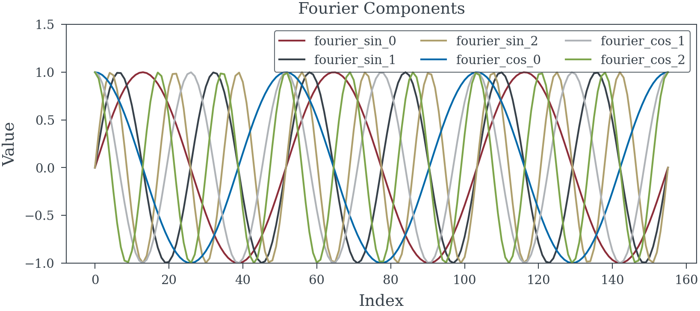
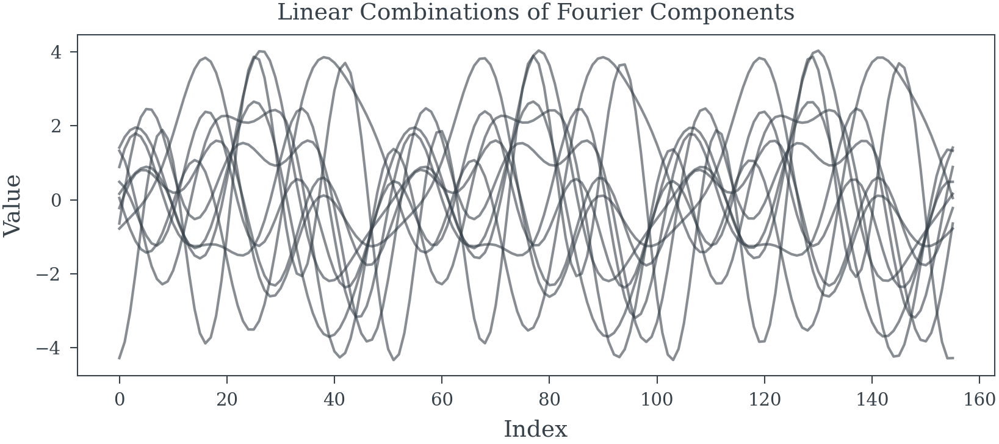

# Fourier Components


<!-- WARNING: THIS FILE WAS AUTOGENERATED! DO NOT EDIT! -->

------------------------------------------------------------------------

<a
href="https://github.com/redam94/common_regression_issues/blob/main/common_regression_issues/model_helpers/fourier.py#L13"
target="_blank" style="float:right; font-size:smaller">source</a>

### generate_fourier_components

>  generate_fourier_components (N_samples:int, N_components:int=3,
>                                   period:int=52)

*Generate Fourier components for a given number of samples and
components.*

<table>
<colgroup>
<col style="width: 6%" />
<col style="width: 25%" />
<col style="width: 34%" />
<col style="width: 34%" />
</colgroup>
<thead>
<tr>
<th></th>
<th><strong>Type</strong></th>
<th><strong>Default</strong></th>
<th><strong>Details</strong></th>
</tr>
</thead>
<tbody>
<tr>
<td>N_samples</td>
<td>int</td>
<td></td>
<td>Number of samples</td>
</tr>
<tr>
<td>N_components</td>
<td>int</td>
<td>3</td>
<td>Half the number of Fourier components</td>
</tr>
<tr>
<td>period</td>
<td>int</td>
<td>52</td>
<td>Yearly period of weekly data</td>
</tr>
<tr>
<td><strong>Returns</strong></td>
<td><strong>DataFrame</strong></td>
<td></td>
<td><strong>Dataframe with fourier components</strong></td>
</tr>
</tbody>
</table>

``` python
period = pd.date_range("2021-01-01", periods=156, freq="W-MON")
fourier_components = generate_fourier_components(period.shape[0], 3, 52)
fourier_components.head()
```

<div>
<style scoped>
    .dataframe tbody tr th:only-of-type {
        vertical-align: middle;
    }
&#10;    .dataframe tbody tr th {
        vertical-align: top;
    }
&#10;    .dataframe thead th {
        text-align: right;
    }
</style>

<table class="dataframe" data-quarto-postprocess="true" data-border="1">
<thead>
<tr style="text-align: right;">
<th data-quarto-table-cell-role="th"></th>
<th data-quarto-table-cell-role="th">fourier_sin_0</th>
<th data-quarto-table-cell-role="th">fourier_sin_1</th>
<th data-quarto-table-cell-role="th">fourier_sin_2</th>
<th data-quarto-table-cell-role="th">fourier_cos_0</th>
<th data-quarto-table-cell-role="th">fourier_cos_1</th>
<th data-quarto-table-cell-role="th">fourier_cos_2</th>
</tr>
</thead>
<tbody>
<tr>
<td data-quarto-table-cell-role="th">0</td>
<td>0.000000</td>
<td>0.000000</td>
<td>0.000000</td>
<td>1.000000</td>
<td>1.000000</td>
<td>1.000000</td>
</tr>
<tr>
<td data-quarto-table-cell-role="th">1</td>
<td>0.121311</td>
<td>0.240829</td>
<td>0.356791</td>
<td>0.992615</td>
<td>0.970568</td>
<td>0.934184</td>
</tr>
<tr>
<td data-quarto-table-cell-role="th">2</td>
<td>0.240829</td>
<td>0.467482</td>
<td>0.666616</td>
<td>0.970568</td>
<td>0.884003</td>
<td>0.745401</td>
</tr>
<tr>
<td data-quarto-table-cell-role="th">3</td>
<td>0.356791</td>
<td>0.666616</td>
<td>0.888695</td>
<td>0.934184</td>
<td>0.745401</td>
<td>0.458499</td>
</tr>
<tr>
<td data-quarto-table-cell-role="th">4</td>
<td>0.467482</td>
<td>0.826511</td>
<td>0.993793</td>
<td>0.884003</td>
<td>0.562921</td>
<td>0.111245</td>
</tr>
</tbody>
</table>

</div>




