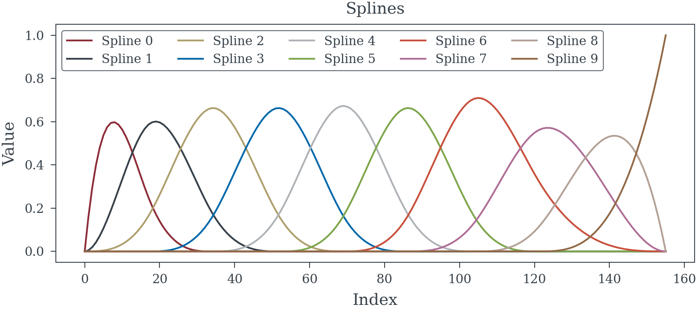
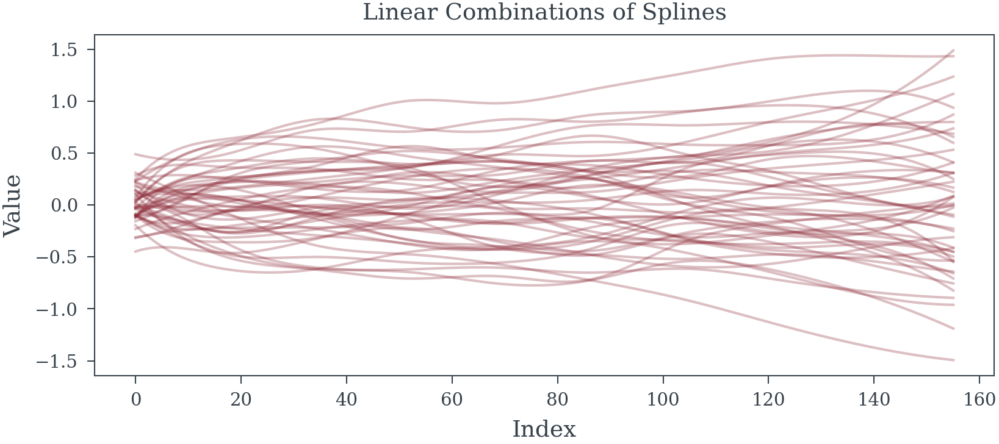
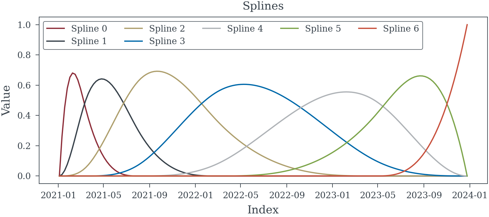
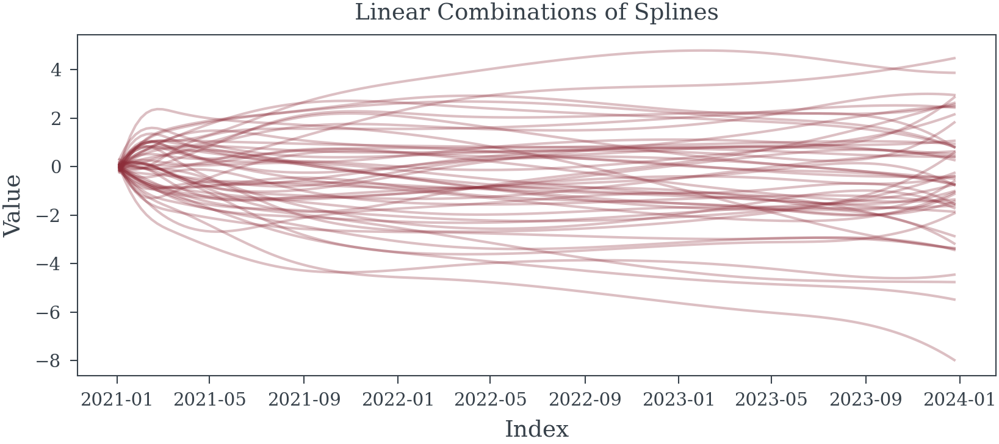
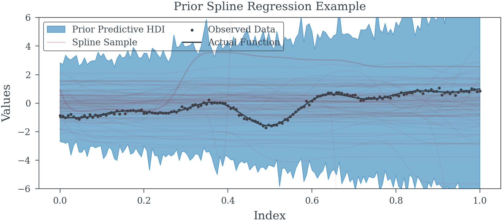
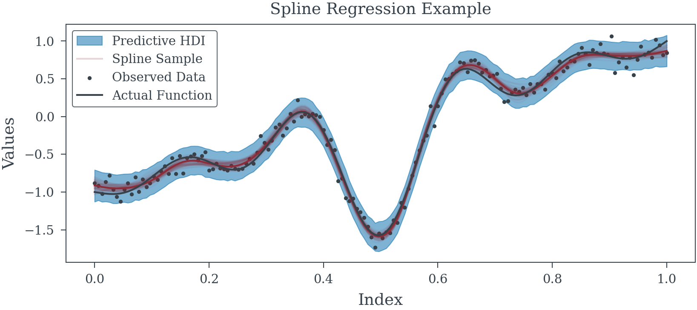

# Splines


<!-- WARNING: THIS FILE WAS AUTOGENERATED! DO NOT EDIT! -->

------------------------------------------------------------------------

<a
href="https://github.com/redam94/common_regression_issues/blob/main/common_regression_issues/model_helpers/spline_models.py#L19"
target="_blank" style="float:right; font-size:smaller">source</a>

### spline_component

>      spline_component (knots:Union[int,List[~T]], index:Iterable[~T],
>                        degree:int=3)

<table>
<thead>
<tr class="header">
<th></th>
<th><strong>Type</strong></th>
<th><strong>Default</strong></th>
<th><strong>Details</strong></th>
</tr>
</thead>
<tbody>
<tr class="odd">
<td>knots</td>
<td>Union</td>
<td></td>
<td>Number of knots or interior knots to use</td>
</tr>
<tr class="even">
<td>index</td>
<td>Iterable</td>
<td></td>
<td>index</td>
</tr>
<tr class="odd">
<td>degree</td>
<td>int</td>
<td>3</td>
<td>Knot degree defaults to cubic splines</td>
</tr>
</tbody>
</table>

<div id="exm-num-splines-def" class="theorem example">

<span class="theorem-title">**Example 1 (If knots are an
integer)**</span>  

``` python
N_SPLINES = 9
INDEX = [i for i in range(156)]
splines = spline_component(
    N_SPLINES,
    INDEX
)
```





</div>

<div id="exm-knots-defined" class="theorem example">

<span class="theorem-title">**Example 2 (Knots can be directly
specified)**</span>  

``` python
INDEX = pd.date_range('01/01/2021', periods=156, freq="W-MON")
KNOTS = [INDEX[10], INDEX[30], INDEX[60], INDEX[120]]
splines_date = spline_component(
    list(map(INDEX.get_loc, KNOTS)),
    np.arange(len(INDEX))
)
```





</div>

<div id="exm-spline-regression-model" class="theorem example">

<span class="theorem-title">**Example 3 (Spline Regression
Model)**</span>  

``` python
INDEX = np.linspace(0, 1, 156)

spline_data = spline_component(19, INDEX, degree=3) # 19 Splines
fun = np.sin(2*np.pi*5*INDEX)/(20*(INDEX-.5)) + (INDEX-.5) * 2# Complex Non-linear function to learn
y_obs = fun + np.random.normal(0, .1, size=spline_data.shape[0]) # Noisy observation process

with pm.Model() as model:
    global_scale = pm.HalfNormal('scale', .05)
    tau = pm.HalfCauchy("tau", 1, shape=spline_data.shape[1])
    betas_ = pm.Normal("betas_", 0, global_scale*tau)
    betas = pm.Deterministic("betas", pm.math.cumsum(betas_)) # Enforce Random Walk Process

    alpha = pm.Normal("alpha", 0, 1)

    spline_trend = pm.Deterministic("splines", spline_data@betas + alpha)
    precision = pm.HalfCauchy("precision", 2)
    pm.Normal("mu", mu=spline_trend, tau=precision, observed=y_obs)
```



<div class="cell-output cell-output-display">

<div>
<style scoped>
    .dataframe tbody tr th:only-of-type {
        vertical-align: middle;
    }
&#10;    .dataframe tbody tr th {
        vertical-align: top;
    }
&#10;    .dataframe thead th {
        text-align: right;
    }
</style>

<table class="dataframe do-not-create-environment cell"
data-quarto-postprocess="true" data-border="1">
<thead>
<tr class="header" style="text-align: right;">
<th data-quarto-table-cell-role="th"></th>
<th data-quarto-table-cell-role="th">mean</th>
<th data-quarto-table-cell-role="th">sd</th>
<th data-quarto-table-cell-role="th">hdi_3%</th>
<th data-quarto-table-cell-role="th">hdi_97%</th>
<th data-quarto-table-cell-role="th">mcse_mean</th>
<th data-quarto-table-cell-role="th">mcse_sd</th>
<th data-quarto-table-cell-role="th">ess_bulk</th>
<th data-quarto-table-cell-role="th">ess_tail</th>
<th data-quarto-table-cell-role="th">r_hat</th>
</tr>
</thead>
<tbody>
<tr class="odd">
<td data-quarto-table-cell-role="th">betas[0]</td>
<td>-0.034</td>
<td>0.078</td>
<td>-0.197</td>
<td>0.110</td>
<td>0.002</td>
<td>0.002</td>
<td>1307.0</td>
<td>1322.0</td>
<td>1.0</td>
</tr>
<tr class="even">
<td data-quarto-table-cell-role="th">betas[1]</td>
<td>-0.066</td>
<td>0.092</td>
<td>-0.250</td>
<td>0.095</td>
<td>0.003</td>
<td>0.002</td>
<td>1174.0</td>
<td>1521.0</td>
<td>1.0</td>
</tr>
<tr class="odd">
<td data-quarto-table-cell-role="th">betas[2]</td>
<td>0.040</td>
<td>0.091</td>
<td>-0.140</td>
<td>0.205</td>
<td>0.002</td>
<td>0.002</td>
<td>1342.0</td>
<td>1792.0</td>
<td>1.0</td>
</tr>
<tr class="even">
<td data-quarto-table-cell-role="th">betas[3]</td>
<td>0.389</td>
<td>0.092</td>
<td>0.219</td>
<td>0.561</td>
<td>0.002</td>
<td>0.002</td>
<td>1386.0</td>
<td>2521.0</td>
<td>1.0</td>
</tr>
<tr class="odd">
<td data-quarto-table-cell-role="th">betas[4]</td>
<td>0.261</td>
<td>0.081</td>
<td>0.106</td>
<td>0.407</td>
<td>0.002</td>
<td>0.002</td>
<td>1298.0</td>
<td>2278.0</td>
<td>1.0</td>
</tr>
<tr class="even">
<td data-quarto-table-cell-role="th">betas[5]</td>
<td>0.207</td>
<td>0.085</td>
<td>0.033</td>
<td>0.356</td>
<td>0.002</td>
<td>0.002</td>
<td>1288.0</td>
<td>2140.0</td>
<td>1.0</td>
</tr>
<tr class="odd">
<td data-quarto-table-cell-role="th">betas[6]</td>
<td>0.667</td>
<td>0.097</td>
<td>0.492</td>
<td>0.850</td>
<td>0.003</td>
<td>0.002</td>
<td>1355.0</td>
<td>2160.0</td>
<td>1.0</td>
</tr>
<tr class="even">
<td data-quarto-table-cell-role="th">betas[7]</td>
<td>1.181</td>
<td>0.096</td>
<td>1.001</td>
<td>1.355</td>
<td>0.003</td>
<td>0.002</td>
<td>1188.0</td>
<td>2127.0</td>
<td>1.0</td>
</tr>
<tr class="odd">
<td data-quarto-table-cell-role="th">betas[8]</td>
<td>0.447</td>
<td>0.094</td>
<td>0.277</td>
<td>0.624</td>
<td>0.002</td>
<td>0.002</td>
<td>1452.0</td>
<td>2148.0</td>
<td>1.0</td>
</tr>
<tr class="even">
<td data-quarto-table-cell-role="th">betas[9]</td>
<td>-0.758</td>
<td>0.078</td>
<td>-0.904</td>
<td>-0.608</td>
<td>0.002</td>
<td>0.001</td>
<td>1474.0</td>
<td>2311.0</td>
<td>1.0</td>
</tr>
<tr class="odd">
<td data-quarto-table-cell-role="th">betas[10]</td>
<td>-0.735</td>
<td>0.080</td>
<td>-0.883</td>
<td>-0.579</td>
<td>0.002</td>
<td>0.001</td>
<td>1472.0</td>
<td>2205.0</td>
<td>1.0</td>
</tr>
<tr class="even">
<td data-quarto-table-cell-role="th">betas[11]</td>
<td>0.849</td>
<td>0.090</td>
<td>0.684</td>
<td>1.018</td>
<td>0.002</td>
<td>0.002</td>
<td>1494.0</td>
<td>2157.0</td>
<td>1.0</td>
</tr>
<tr class="odd">
<td data-quarto-table-cell-role="th">betas[12]</td>
<td>1.672</td>
<td>0.091</td>
<td>1.513</td>
<td>1.855</td>
<td>0.003</td>
<td>0.002</td>
<td>1218.0</td>
<td>1655.0</td>
<td>1.0</td>
</tr>
<tr class="even">
<td data-quarto-table-cell-role="th">betas[13]</td>
<td>1.566</td>
<td>0.096</td>
<td>1.369</td>
<td>1.740</td>
<td>0.003</td>
<td>0.002</td>
<td>1031.0</td>
<td>1157.0</td>
<td>1.0</td>
</tr>
<tr class="odd">
<td data-quarto-table-cell-role="th">betas[14]</td>
<td>1.087</td>
<td>0.109</td>
<td>0.890</td>
<td>1.298</td>
<td>0.004</td>
<td>0.003</td>
<td>910.0</td>
<td>863.0</td>
<td>1.0</td>
</tr>
<tr class="even">
<td data-quarto-table-cell-role="th">betas[15]</td>
<td>1.388</td>
<td>0.101</td>
<td>1.201</td>
<td>1.581</td>
<td>0.003</td>
<td>0.002</td>
<td>1188.0</td>
<td>2073.0</td>
<td>1.0</td>
</tr>
<tr class="odd">
<td data-quarto-table-cell-role="th">betas[16]</td>
<td>1.759</td>
<td>0.083</td>
<td>1.604</td>
<td>1.919</td>
<td>0.002</td>
<td>0.001</td>
<td>1665.0</td>
<td>1864.0</td>
<td>1.0</td>
</tr>
<tr class="even">
<td data-quarto-table-cell-role="th">betas[17]</td>
<td>1.699</td>
<td>0.078</td>
<td>1.556</td>
<td>1.843</td>
<td>0.002</td>
<td>0.001</td>
<td>1637.0</td>
<td>2160.0</td>
<td>1.0</td>
</tr>
<tr class="odd">
<td data-quarto-table-cell-role="th">betas[18]</td>
<td>1.704</td>
<td>0.080</td>
<td>1.557</td>
<td>1.858</td>
<td>0.002</td>
<td>0.001</td>
<td>1735.0</td>
<td>2486.0</td>
<td>1.0</td>
</tr>
<tr class="even">
<td data-quarto-table-cell-role="th">betas[19]</td>
<td>1.786</td>
<td>0.085</td>
<td>1.623</td>
<td>1.942</td>
<td>0.002</td>
<td>0.001</td>
<td>1831.0</td>
<td>976.0</td>
<td>1.0</td>
</tr>
<tr class="odd">
<td data-quarto-table-cell-role="th">alpha</td>
<td>-0.909</td>
<td>0.062</td>
<td>-1.015</td>
<td>-0.783</td>
<td>0.001</td>
<td>0.001</td>
<td>1828.0</td>
<td>2193.0</td>
<td>1.0</td>
</tr>
<tr class="even">
<td data-quarto-table-cell-role="th">scale</td>
<td>0.128</td>
<td>0.030</td>
<td>0.072</td>
<td>0.181</td>
<td>0.001</td>
<td>0.000</td>
<td>2605.0</td>
<td>3014.0</td>
<td>1.0</td>
</tr>
</tbody>
</table>

</div>

</div>



</div>
