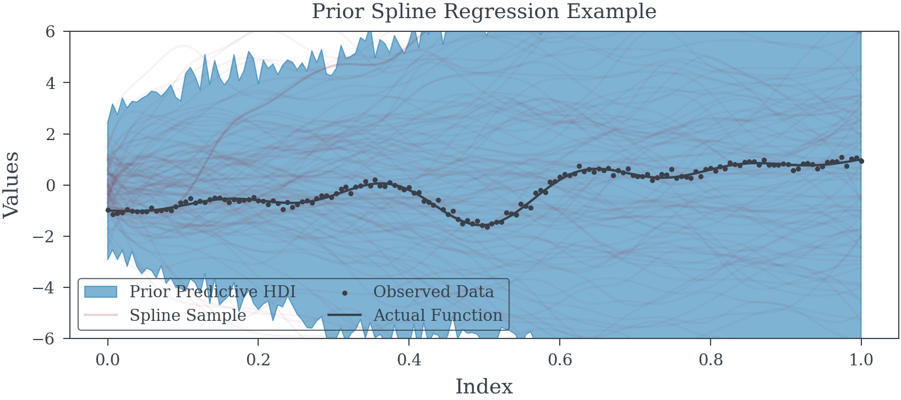

# Splines


<!-- WARNING: THIS FILE WAS AUTOGENERATED! DO NOT EDIT! -->

------------------------------------------------------------------------

<a
href="https://github.com/redam94/common_regression_issues/blob/main/common_regression_issues/model_helpers/spline_models.py#L19"
target="_blank" style="float:right; font-size:smaller">source</a>

### spline_component

>  spline_component (knots:Union[int,List[~T]], index:Iterable[~T],
>                        degree:int=3)

<table>
<thead>
<tr>
<th></th>
<th><strong>Type</strong></th>
<th><strong>Default</strong></th>
<th><strong>Details</strong></th>
</tr>
</thead>
<tbody>
<tr>
<td>knots</td>
<td>Union</td>
<td></td>
<td>Number of knots or interior knots to use</td>
</tr>
<tr>
<td>index</td>
<td>Iterable</td>
<td></td>
<td>index</td>
</tr>
<tr>
<td>degree</td>
<td>int</td>
<td>3</td>
<td>Knot degree defaults to cubic splines</td>
</tr>
</tbody>
</table>

<div id="exm-num-splines-def" class="theorem example">

<span class="theorem-title">**Example 1 (If knots are an
integer)**</span>  

``` python
N_SPLINES = 9
INDEX = [i for i in range(156)]
splines = spline_component(
    N_SPLINES,
    INDEX
)
```


</div>

<div id="exm-knots-defined" class="theorem example">

<span class="theorem-title">**Example 2 (Knots can be directly
specified)**</span>  

``` python
INDEX = pd.date_range('01/01/2021', periods=156, freq="W-MON")
KNOTS = [INDEX[10], INDEX[30], INDEX[60], INDEX[120]]
splines_date = spline_component(
    list(map(INDEX.get_loc, KNOTS)),
    np.arange(len(INDEX))
)
```


</div>

<div id="exm-spline-regression-model" class="theorem example">

<span class="theorem-title">**Example 3 (Spline Regression
Model)**</span>  

``` python
INDEX = np.linspace(0, 1, 156)

spline_data = spline_component(19, INDEX, degree=3) # 19 Splines
fun_ = lambda x: np.sin(2*np.pi*5*x)/(20*(x-.5)) + (x-.5) * 2
fun = fun_(INDEX)# Complex Non-linear function to learn

y_obs = fun + np.random.normal(0, .1, size=spline_data.shape[0]) # Noisy observation process

tau_scale = 1.0
c_scale = 0.1
with pm.Model() as model:
    tau = pm.HalfCauchy('tau', tau_scale)
    lambdas = pm.HalfCauchy("lambdas", 1, shape=spline_data.shape[1])
    c = pm.HalfCauchy("c", beta=c_scale)

    sigma_coeff = pm.Deterministic("sigma_coeff", tau * lambdas / pm.math.sqrt(c**2 + (tau * lambdas)**2))
    betas_ = pm.Normal("betas_", 0, sigma_coeff)
    betas = pm.Deterministic("betas", pm.math.cumsum(betas_)) # Enforce Random Walk Process

    alpha = pm.Normal("alpha", 0, 1)

    spline_trend = pm.Deterministic("splines", spline_data@betas + alpha)
    precision = pm.HalfCauchy("precision", 2)
    pm.Normal("mu", mu=spline_trend, tau=precision, observed=y_obs)
```



<div class="cell-output cell-output-display">

<div>
<style scoped>
    .dataframe tbody tr th:only-of-type {
        vertical-align: middle;
    }
&#10;    .dataframe tbody tr th {
        vertical-align: top;
    }
&#10;    .dataframe thead th {
        text-align: right;
    }
</style>

<table class="dataframe do-not-create-environment cell"
data-quarto-postprocess="true" data-border="1">
<thead>
<tr style="text-align: right;">
<th data-quarto-table-cell-role="th"></th>
<th data-quarto-table-cell-role="th">mean</th>
<th data-quarto-table-cell-role="th">sd</th>
<th data-quarto-table-cell-role="th">hdi_3%</th>
<th data-quarto-table-cell-role="th">hdi_97%</th>
<th data-quarto-table-cell-role="th">mcse_mean</th>
<th data-quarto-table-cell-role="th">mcse_sd</th>
<th data-quarto-table-cell-role="th">ess_bulk</th>
<th data-quarto-table-cell-role="th">ess_tail</th>
<th data-quarto-table-cell-role="th">r_hat</th>
</tr>
</thead>
<tbody>
<tr>
<td data-quarto-table-cell-role="th">betas[0]</td>
<td>0.009</td>
<td>0.131</td>
<td>-0.243</td>
<td>0.262</td>
<td>0.003</td>
<td>0.002</td>
<td>1407.0</td>
<td>2094.0</td>
<td>1.0</td>
</tr>
<tr>
<td data-quarto-table-cell-role="th">betas[1]</td>
<td>-0.063</td>
<td>0.118</td>
<td>-0.281</td>
<td>0.159</td>
<td>0.003</td>
<td>0.002</td>
<td>2027.0</td>
<td>2518.0</td>
<td>1.0</td>
</tr>
<tr>
<td data-quarto-table-cell-role="th">betas[2]</td>
<td>0.378</td>
<td>0.114</td>
<td>0.173</td>
<td>0.598</td>
<td>0.003</td>
<td>0.002</td>
<td>1621.0</td>
<td>2392.0</td>
<td>1.0</td>
</tr>
<tr>
<td data-quarto-table-cell-role="th">betas[3]</td>
<td>0.548</td>
<td>0.112</td>
<td>0.324</td>
<td>0.743</td>
<td>0.003</td>
<td>0.002</td>
<td>1845.0</td>
<td>2276.0</td>
<td>1.0</td>
</tr>
<tr>
<td data-quarto-table-cell-role="th">betas[4]</td>
<td>0.389</td>
<td>0.109</td>
<td>0.177</td>
<td>0.590</td>
<td>0.003</td>
<td>0.002</td>
<td>1625.0</td>
<td>2538.0</td>
<td>1.0</td>
</tr>
<tr>
<td data-quarto-table-cell-role="th">betas[5]</td>
<td>0.197</td>
<td>0.113</td>
<td>-0.034</td>
<td>0.391</td>
<td>0.003</td>
<td>0.002</td>
<td>1607.0</td>
<td>2097.0</td>
<td>1.0</td>
</tr>
<tr>
<td data-quarto-table-cell-role="th">betas[6]</td>
<td>0.977</td>
<td>0.111</td>
<td>0.757</td>
<td>1.175</td>
<td>0.003</td>
<td>0.002</td>
<td>1613.0</td>
<td>1949.0</td>
<td>1.0</td>
</tr>
<tr>
<td data-quarto-table-cell-role="th">betas[7]</td>
<td>1.206</td>
<td>0.113</td>
<td>1.009</td>
<td>1.435</td>
<td>0.003</td>
<td>0.002</td>
<td>1537.0</td>
<td>2096.0</td>
<td>1.0</td>
</tr>
<tr>
<td data-quarto-table-cell-role="th">betas[8]</td>
<td>0.692</td>
<td>0.109</td>
<td>0.469</td>
<td>0.883</td>
<td>0.002</td>
<td>0.002</td>
<td>1924.0</td>
<td>2232.0</td>
<td>1.0</td>
</tr>
<tr>
<td data-quarto-table-cell-role="th">betas[9]</td>
<td>-0.551</td>
<td>0.107</td>
<td>-0.756</td>
<td>-0.350</td>
<td>0.003</td>
<td>0.002</td>
<td>1737.0</td>
<td>2105.0</td>
<td>1.0</td>
</tr>
<tr>
<td data-quarto-table-cell-role="th">betas[10]</td>
<td>-0.544</td>
<td>0.106</td>
<td>-0.734</td>
<td>-0.341</td>
<td>0.002</td>
<td>0.002</td>
<td>2018.0</td>
<td>2124.0</td>
<td>1.0</td>
</tr>
<tr>
<td data-quarto-table-cell-role="th">betas[11]</td>
<td>1.054</td>
<td>0.110</td>
<td>0.851</td>
<td>1.265</td>
<td>0.002</td>
<td>0.002</td>
<td>1973.0</td>
<td>2353.0</td>
<td>1.0</td>
</tr>
<tr>
<td data-quarto-table-cell-role="th">betas[12]</td>
<td>1.833</td>
<td>0.111</td>
<td>1.622</td>
<td>2.037</td>
<td>0.003</td>
<td>0.002</td>
<td>1930.0</td>
<td>2226.0</td>
<td>1.0</td>
</tr>
<tr>
<td data-quarto-table-cell-role="th">betas[13]</td>
<td>1.488</td>
<td>0.111</td>
<td>1.281</td>
<td>1.702</td>
<td>0.003</td>
<td>0.002</td>
<td>1957.0</td>
<td>2474.0</td>
<td>1.0</td>
</tr>
<tr>
<td data-quarto-table-cell-role="th">betas[14]</td>
<td>1.369</td>
<td>0.104</td>
<td>1.173</td>
<td>1.565</td>
<td>0.003</td>
<td>0.002</td>
<td>1728.0</td>
<td>2645.0</td>
<td>1.0</td>
</tr>
<tr>
<td data-quarto-table-cell-role="th">betas[15]</td>
<td>1.458</td>
<td>0.109</td>
<td>1.247</td>
<td>1.655</td>
<td>0.002</td>
<td>0.002</td>
<td>2259.0</td>
<td>2227.0</td>
<td>1.0</td>
</tr>
<tr>
<td data-quarto-table-cell-role="th">betas[16]</td>
<td>2.077</td>
<td>0.109</td>
<td>1.865</td>
<td>2.279</td>
<td>0.003</td>
<td>0.002</td>
<td>1800.0</td>
<td>1994.0</td>
<td>1.0</td>
</tr>
<tr>
<td data-quarto-table-cell-role="th">betas[17]</td>
<td>1.644</td>
<td>0.133</td>
<td>1.367</td>
<td>1.864</td>
<td>0.003</td>
<td>0.002</td>
<td>2406.0</td>
<td>2565.0</td>
<td>1.0</td>
</tr>
<tr>
<td data-quarto-table-cell-role="th">betas[18]</td>
<td>1.939</td>
<td>0.129</td>
<td>1.687</td>
<td>2.169</td>
<td>0.003</td>
<td>0.002</td>
<td>2225.0</td>
<td>2990.0</td>
<td>1.0</td>
</tr>
<tr>
<td data-quarto-table-cell-role="th">betas[19]</td>
<td>2.060</td>
<td>0.106</td>
<td>1.875</td>
<td>2.274</td>
<td>0.002</td>
<td>0.001</td>
<td>2802.0</td>
<td>3035.0</td>
<td>1.0</td>
</tr>
<tr>
<td data-quarto-table-cell-role="th">alpha</td>
<td>-1.054</td>
<td>0.078</td>
<td>-1.200</td>
<td>-0.905</td>
<td>0.002</td>
<td>0.001</td>
<td>2102.0</td>
<td>2160.0</td>
<td>1.0</td>
</tr>
<tr>
<td data-quarto-table-cell-role="th">tau</td>
<td>1.020</td>
<td>5.563</td>
<td>0.003</td>
<td>2.581</td>
<td>0.113</td>
<td>0.080</td>
<td>2561.0</td>
<td>2382.0</td>
<td>1.0</td>
</tr>
</tbody>
</table>

</div>

</div>


</div>
