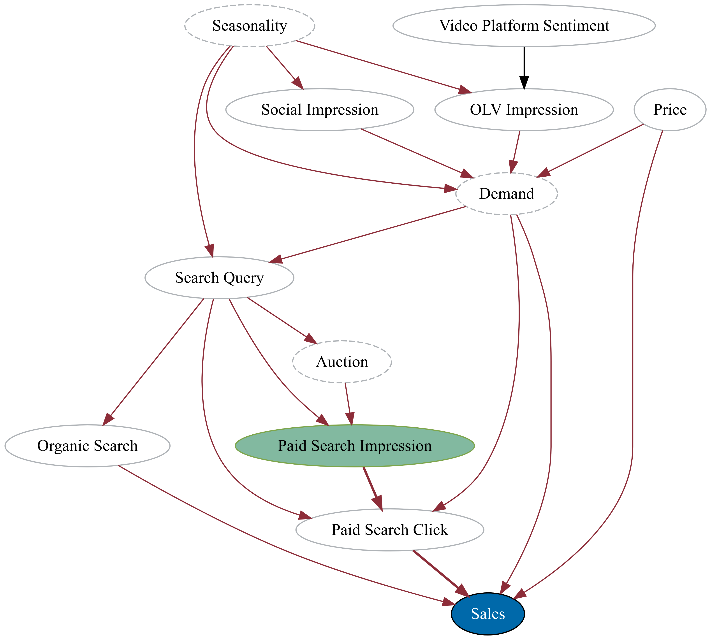
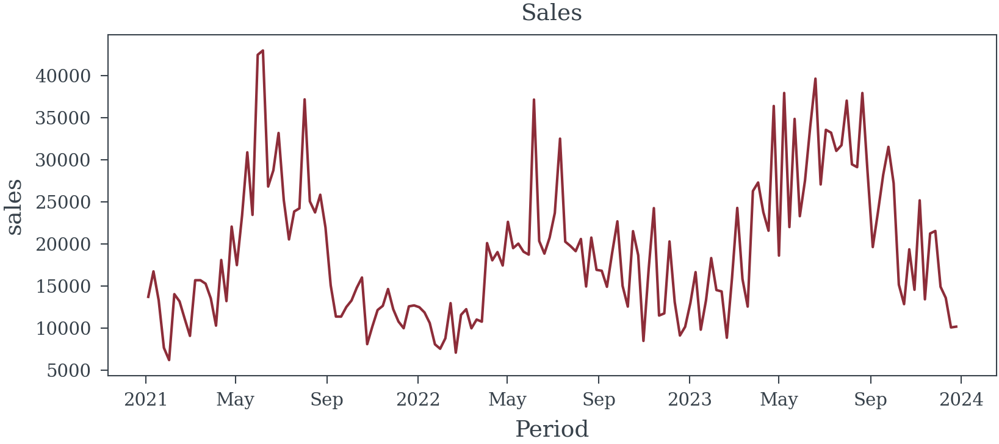

# When is Multicollinearity an Issue?

<!-- WARNING: THIS FILE WAS AUTOGENERATED! DO NOT EDIT! -->

## The DAG

> **How to read a DAG**
>
> A Directed Acyclic Graph (DAG) serves as a model of causality, where
> directional relationships between nodes indicate that causes flow from
> one node to another along the arrows, forming a distinct pathway of
> influence. Each arrow represents a causal link, signaling how changes
> in one node could potentially impact another. In a DAG, the
> relationships between nodes (depicted by an arrow) are not restricted
> to being linear; they can incorporate complex, non-linear
> interactions.
>
> Edges will be color-coded to emphasize whether they represent causal
> paths (green
> <button disabled style="background-color: #326E1E; height: 13px; width: 11px;"></button>),
> biasing paths (red
> <button disabled style="background-color: #8D2D39; height: 13px; width: 11px;"></button>),
> or non-causal paths (black
> <button disabled style="background-color: #000000; height: 13px; width: 11px;"></button>).
> Refer to
> <a href="#fig-causal-graph-paid-search" class="quarto-xref">Figure 2</a>
> and <a href="#fig-causal-graph-paid-search-adjusted"
> class="quarto-xref">Figure 3</a>.
>
> Nodes indicating exposures (factors for which we want to understand
> the effect) will have a green background
> (<button disabled style="background-color: #82B9A0; height: 13px; width: 11px;"></button>).
> The outcome variable of interest will have a blue background
> (<button disabled style="background-color: #0069AA; height: 13px; width: 11px;"></button>),
> while variables adjusted for will have a light gray background
> (<button disabled style="background-color: #AFB3B7; height: 13px; width: 11px;"></button>).
> Nodes with a dashed outline represent elements that are challenging or
> impossible to observe directly, while nodes with a solid outline and
> no fill represent variables for which data is available or can be
> acquired.

### How Effective is Paid Search at Driving Sales?

To accurately measure the impact of Paid Search on Sales, we must
carefully consider the causal pathways influencing this relationship.
The causal model presented in
<a href="#fig-causal-graph" class="quarto-xref">Figure 1</a> reveals
several open biasing paths from both **paid search impressions** and
**paid search clicks** to **sales**. These open paths introduce
potential sources of bias that can distort our understanding of Paid
Search’s effectiveness.

Additionally, the DAG highlights a complex correlation structure within
the data, which suggests that variables may be highly interrelated. This
correlation can lead to high Variance Inflation Factors (VIFs) in a
regression model.

Elevated VIFs inflate standard errors and reduce the precision of our
estimates, but excluding the wrong variables could result in biased
estimates. Balancing these considerations—minimizing multicollinearity
without overlooking key variables—is essential for creating a model that
yields accurate and precise estimates of paid search’s impact on sales.

#### Solution

To get an unbiased estimate of the effect of **paid search impressions**
on **sale**, given the bias introduced by **demand** (an unobserved
variable), focusing on **search query** as an adjustment variable is a
sound approach. Here’s a breakdown of the reasoning and approach based
on the DAG structure:

1.  Direct Path and Biasing Path:
    - **Paid search clicks** have a direct impact on sales, but due to
      **demand** (which is unobserved and thus unadjustable in this
      analysis), there’s a risk of confounding.
    - Since **demand** also influences **search query**, which in turn
      influences both **paid search impressions** and **paid search
      clicks**, **search query** becomes a potential control variable to
      block the non-causal path through **demand**. See
      <a href="#fig-causal-graph-paid-search" class="quarto-xref">Figure 2</a>
2.  Adjustment for Search Query:
    - By adjusting for search query, we aim to block the path from
      demand that leads through **search query** to both **paid search
      impressions** and **paid search clicks**. This adjustment helps
      remove the confounding influence of demand on sales via search
      query, allowing for a more accurate estimate of paid search
      impressions’ effect on sales. See
      <a href="#fig-causal-graph-paid-search-adjusted"
      class="quarto-xref">Figure 3</a>
3.  Outcome:
    - Adjusting for **search query** should allow for a clearer view of
      the total effect of **paid search impressions** on **sales** by
      blocking the biasing path from **demand**, leading to a more
      reliable analysis.

In summary, adjusting for **search query** effectively helps control for
the unobserved demand factor, allowing us to examine the impact of
**paid search impressions** on **sales** with minimized bias. We can
also increase the precision of this estimate by controlling for
**price**.

## Un-Adjusted Model

## Adjusted Model

## Correlation Matrix

<table id="T_43dbe" data-quarto-postprocess="true">
<thead>
<tr class="header">
<th class="blank level0" data-quarto-table-cell-role="th"> </th>
<th id="T_43dbe_level0_col0" class="col_heading level0 col0"
data-quarto-table-cell-role="th">paid_search_impressions</th>
<th id="T_43dbe_level0_col1" class="col_heading level0 col1"
data-quarto-table-cell-role="th">search_query</th>
<th id="T_43dbe_level0_col2" class="col_heading level0 col2"
data-quarto-table-cell-role="th">price</th>
<th id="T_43dbe_level0_col3" class="col_heading level0 col3"
data-quarto-table-cell-role="th">sales</th>
</tr>
</thead>
<tbody>
<tr class="odd">
<td id="T_43dbe_level0_row0" class="row_heading level0 row0"
data-quarto-table-cell-role="th">paid_search_impressions</td>
<td id="T_43dbe_row0_col0" class="data row0 col0">1.00</td>
<td id="T_43dbe_row0_col1" class="data row0 col1">0.86</td>
<td id="T_43dbe_row0_col2" class="data row0 col2">-0.23</td>
<td id="T_43dbe_row0_col3" class="data row0 col3">0.81</td>
</tr>
<tr class="even">
<td id="T_43dbe_level0_row1" class="row_heading level0 row1"
data-quarto-table-cell-role="th">search_query</td>
<td id="T_43dbe_row1_col0" class="data row1 col0">0.86</td>
<td id="T_43dbe_row1_col1" class="data row1 col1">1.00</td>
<td id="T_43dbe_row1_col2" class="data row1 col2">-0.30</td>
<td id="T_43dbe_row1_col3" class="data row1 col3">0.83</td>
</tr>
<tr class="odd">
<td id="T_43dbe_level0_row2" class="row_heading level0 row2"
data-quarto-table-cell-role="th">price</td>
<td id="T_43dbe_row2_col0" class="data row2 col0">-0.23</td>
<td id="T_43dbe_row2_col1" class="data row2 col1">-0.30</td>
<td id="T_43dbe_row2_col2" class="data row2 col2">1.00</td>
<td id="T_43dbe_row2_col3" class="data row2 col3">-0.18</td>
</tr>
<tr class="even">
<td id="T_43dbe_level0_row3" class="row_heading level0 row3"
data-quarto-table-cell-role="th">sales</td>
<td id="T_43dbe_row3_col0" class="data row3 col0">0.81</td>
<td id="T_43dbe_row3_col1" class="data row3 col1">0.83</td>
<td id="T_43dbe_row3_col2" class="data row3 col2">-0.18</td>
<td id="T_43dbe_row3_col3" class="data row3 col3">1.00</td>
</tr>
</tbody>
</table>

## VIFs

                               VIF
    paid_search_impressions  : 13.59
    search_query             : 16.06
    price                    : 3.48

With our adjustment set established, let’s examine the correlation
structure among the key variables (paid search impressions, search
query, price, and sales). As shown in
<a href="#fig-corr-matrix" class="quarto-xref">Figure 4</a>, search
query and paid search impressions exhibit a high correlation.
Additionally, the VIF values presented in
<a href="#tbl-vifs" class="quarto-xref">Table 1</a> reveal some extreme
figures.

Rather than being immediately concerned about the high VIFs (even those
exceeding 10), let’s proceed by running the regression to assess the
actual impact.

In <a href="#tbl-adjusted" class="quarto-xref">Table 3</a>, the standard
errors for the coefficients are reasonably sized. Since this is
synthetic data, we can compare the estimated coefficient for **paid
search impressions** to the expected value of 0.4, which indeed falls
within the confidence interval for this coefficient.

In <a href="#tbl-unadjusted" class="quarto-xref">Table 2</a>, where
**search query** is excluded from the model, we observe a reduction in
standard errors. However, this reduction comes at the expense of
introducing bias into the estimate of **paid search impressions’**
effect on sales.

Given that the correctly adjusted model provides an estimate with
reasonable precision, it should be preferred, even in light of the high
VIFs.

## Un-Adjusted Model

<table class="simpletable do-not-create-environment cell"
data-quarto-postprocess="true">
<caption>OLS Regression Results</caption>
<tbody>
<tr class="odd">
<td data-quarto-table-cell-role="th">Dep. Variable:</td>
<td>sales</td>
<td data-quarto-table-cell-role="th">R-squared:</td>
<td>0.711</td>
</tr>
<tr class="even">
<td data-quarto-table-cell-role="th">Model:</td>
<td>OLS</td>
<td data-quarto-table-cell-role="th">Adj. R-squared:</td>
<td>0.708</td>
</tr>
<tr class="odd">
<td data-quarto-table-cell-role="th">Method:</td>
<td>Least Squares</td>
<td data-quarto-table-cell-role="th">F-statistic:</td>
<td>188.6</td>
</tr>
<tr class="even">
<td data-quarto-table-cell-role="th">Date:</td>
<td>Thu, 14 Nov 2024</td>
<td data-quarto-table-cell-role="th">Prob (F-statistic):</td>
<td>5.17e-42</td>
</tr>
<tr class="odd">
<td data-quarto-table-cell-role="th">Time:</td>
<td>00:18:00</td>
<td data-quarto-table-cell-role="th">Log-Likelihood:</td>
<td>8.7320</td>
</tr>
<tr class="even">
<td data-quarto-table-cell-role="th">No. Observations:</td>
<td>156</td>
<td data-quarto-table-cell-role="th">AIC:</td>
<td>-11.46</td>
</tr>
<tr class="odd">
<td data-quarto-table-cell-role="th">Df Residuals:</td>
<td>153</td>
<td data-quarto-table-cell-role="th">BIC:</td>
<td>-2.314</td>
</tr>
<tr class="even">
<td data-quarto-table-cell-role="th">Df Model:</td>
<td>2</td>
<td data-quarto-table-cell-role="th"></td>
<td></td>
</tr>
<tr class="odd">
<td data-quarto-table-cell-role="th">Covariance Type:</td>
<td>nonrobust</td>
<td data-quarto-table-cell-role="th"></td>
<td></td>
</tr>
</tbody>
</table>

OLS Regression Results

<table class="simpletable do-not-create-environment cell"
data-quarto-postprocess="true">
<tbody>
<tr class="odd">
<td></td>
<td data-quarto-table-cell-role="th">coef</td>
<td data-quarto-table-cell-role="th">std err</td>
<td data-quarto-table-cell-role="th">t</td>
<td data-quarto-table-cell-role="th">P&gt;|t|</td>
<td data-quarto-table-cell-role="th">[0.025</td>
<td data-quarto-table-cell-role="th">0.975]</td>
</tr>
<tr class="even">
<td data-quarto-table-cell-role="th">const</td>
<td>2.0859</td>
<td>0.476</td>
<td>4.386</td>
<td>0.000</td>
<td>1.146</td>
<td>3.025</td>
</tr>
<tr class="odd">
<td data-quarto-table-cell-role="th">paid_search_impressions</td>
<td>0.5680</td>
<td>0.030</td>
<td>19.097</td>
<td>0.000</td>
<td>0.509</td>
<td>0.627</td>
</tr>
<tr class="even">
<td data-quarto-table-cell-role="th">price</td>
<td>0.1980</td>
<td>0.123</td>
<td>1.609</td>
<td>0.110</td>
<td>-0.045</td>
<td>0.441</td>
</tr>
</tbody>
</table>

<table class="simpletable do-not-create-environment cell"
data-quarto-postprocess="true">
<tbody>
<tr class="odd">
<td data-quarto-table-cell-role="th">Omnibus:</td>
<td>14.522</td>
<td data-quarto-table-cell-role="th">Durbin-Watson:</td>
<td>1.012</td>
</tr>
<tr class="even">
<td data-quarto-table-cell-role="th">Prob(Omnibus):</td>
<td>0.001</td>
<td data-quarto-table-cell-role="th">Jarque-Bera (JB):</td>
<td>6.628</td>
</tr>
<tr class="odd">
<td data-quarto-table-cell-role="th">Skew:</td>
<td>0.278</td>
<td data-quarto-table-cell-role="th">Prob(JB):</td>
<td>0.0364</td>
</tr>
<tr class="even">
<td data-quarto-table-cell-role="th">Kurtosis:</td>
<td>2.157</td>
<td data-quarto-table-cell-role="th">Cond. No.</td>
<td>343.</td>
</tr>
</tbody>
</table>

  Notes: [1] Standard Errors assume that the covariance matrix of the errors is correctly specified.

## Adjusted Model

<table class="simpletable do-not-create-environment cell"
data-quarto-postprocess="true">
<caption>OLS Regression Results</caption>
<tbody>
<tr class="odd">
<td data-quarto-table-cell-role="th">Dep. Variable:</td>
<td>sales</td>
<td data-quarto-table-cell-role="th">R-squared:</td>
<td>0.750</td>
</tr>
<tr class="even">
<td data-quarto-table-cell-role="th">Model:</td>
<td>OLS</td>
<td data-quarto-table-cell-role="th">Adj. R-squared:</td>
<td>0.745</td>
</tr>
<tr class="odd">
<td data-quarto-table-cell-role="th">Method:</td>
<td>Least Squares</td>
<td data-quarto-table-cell-role="th">F-statistic:</td>
<td>152.0</td>
</tr>
<tr class="even">
<td data-quarto-table-cell-role="th">Date:</td>
<td>Thu, 14 Nov 2024</td>
<td data-quarto-table-cell-role="th">Prob (F-statistic):</td>
<td>1.50e-45</td>
</tr>
<tr class="odd">
<td data-quarto-table-cell-role="th">Time:</td>
<td>00:18:01</td>
<td data-quarto-table-cell-role="th">Log-Likelihood:</td>
<td>19.936</td>
</tr>
<tr class="even">
<td data-quarto-table-cell-role="th">No. Observations:</td>
<td>156</td>
<td data-quarto-table-cell-role="th">AIC:</td>
<td>-31.87</td>
</tr>
<tr class="odd">
<td data-quarto-table-cell-role="th">Df Residuals:</td>
<td>152</td>
<td data-quarto-table-cell-role="th">BIC:</td>
<td>-19.67</td>
</tr>
<tr class="even">
<td data-quarto-table-cell-role="th">Df Model:</td>
<td>3</td>
<td data-quarto-table-cell-role="th"></td>
<td></td>
</tr>
<tr class="odd">
<td data-quarto-table-cell-role="th">Covariance Type:</td>
<td>nonrobust</td>
<td data-quarto-table-cell-role="th"></td>
<td></td>
</tr>
</tbody>
</table>

OLS Regression Results

<table class="simpletable do-not-create-environment cell"
data-quarto-postprocess="true">
<tbody>
<tr class="odd">
<td></td>
<td data-quarto-table-cell-role="th">coef</td>
<td data-quarto-table-cell-role="th">std err</td>
<td data-quarto-table-cell-role="th">t</td>
<td data-quarto-table-cell-role="th">P&gt;|t|</td>
<td data-quarto-table-cell-role="th">[0.025</td>
<td data-quarto-table-cell-role="th">0.975]</td>
</tr>
<tr class="even">
<td data-quarto-table-cell-role="th">const</td>
<td>-0.0161</td>
<td>0.621</td>
<td>-0.026</td>
<td>0.979</td>
<td>-1.243</td>
<td>1.210</td>
</tr>
<tr class="odd">
<td data-quarto-table-cell-role="th">paid_search_impressions</td>
<td>0.3240</td>
<td>0.058</td>
<td>5.634</td>
<td>0.000</td>
<td>0.210</td>
<td>0.438</td>
</tr>
<tr class="even">
<td data-quarto-table-cell-role="th">search_query</td>
<td>0.3319</td>
<td>0.069</td>
<td>4.846</td>
<td>0.000</td>
<td>0.197</td>
<td>0.467</td>
</tr>
<tr class="odd">
<td data-quarto-table-cell-role="th">price</td>
<td>0.2894</td>
<td>0.116</td>
<td>2.485</td>
<td>0.014</td>
<td>0.059</td>
<td>0.520</td>
</tr>
</tbody>
</table>

<table class="simpletable do-not-create-environment cell"
data-quarto-postprocess="true">
<tbody>
<tr class="odd">
<td data-quarto-table-cell-role="th">Omnibus:</td>
<td>11.120</td>
<td data-quarto-table-cell-role="th">Durbin-Watson:</td>
<td>1.209</td>
</tr>
<tr class="even">
<td data-quarto-table-cell-role="th">Prob(Omnibus):</td>
<td>0.004</td>
<td data-quarto-table-cell-role="th">Jarque-Bera (JB):</td>
<td>5.251</td>
</tr>
<tr class="odd">
<td data-quarto-table-cell-role="th">Skew:</td>
<td>0.212</td>
<td data-quarto-table-cell-role="th">Prob(JB):</td>
<td>0.0724</td>
</tr>
<tr class="even">
<td data-quarto-table-cell-role="th">Kurtosis:</td>
<td>2.208</td>
<td data-quarto-table-cell-role="th">Cond. No.</td>
<td>735.</td>
</tr>
</tbody>
</table>

  Notes: [1] Standard Errors assume that the covariance matrix of the errors is correctly specified.

### When High VIFs are an issue

While high VIFs are not inherently problematic, they serve as a useful
diagnostic tool for identifying potential issues in regression results.
Let’s explore this further with a slightly more complex example.

### How effective is OLV at driving sales?

From the causal model, we can see that **seasonality** is part of the
necessary adjustment set to accurately estimate the effect of **OLV
impressions** on **sales**. Although seasonality is unobserved, we can
reasonably approximate it using a periodic function (e.g., sine or
cosine terms) to capture seasonal fluctuations over time.

## Appendix (A view of the data)

## Sales

## Paid Search Impressions

## Search Query Volume

## Price

