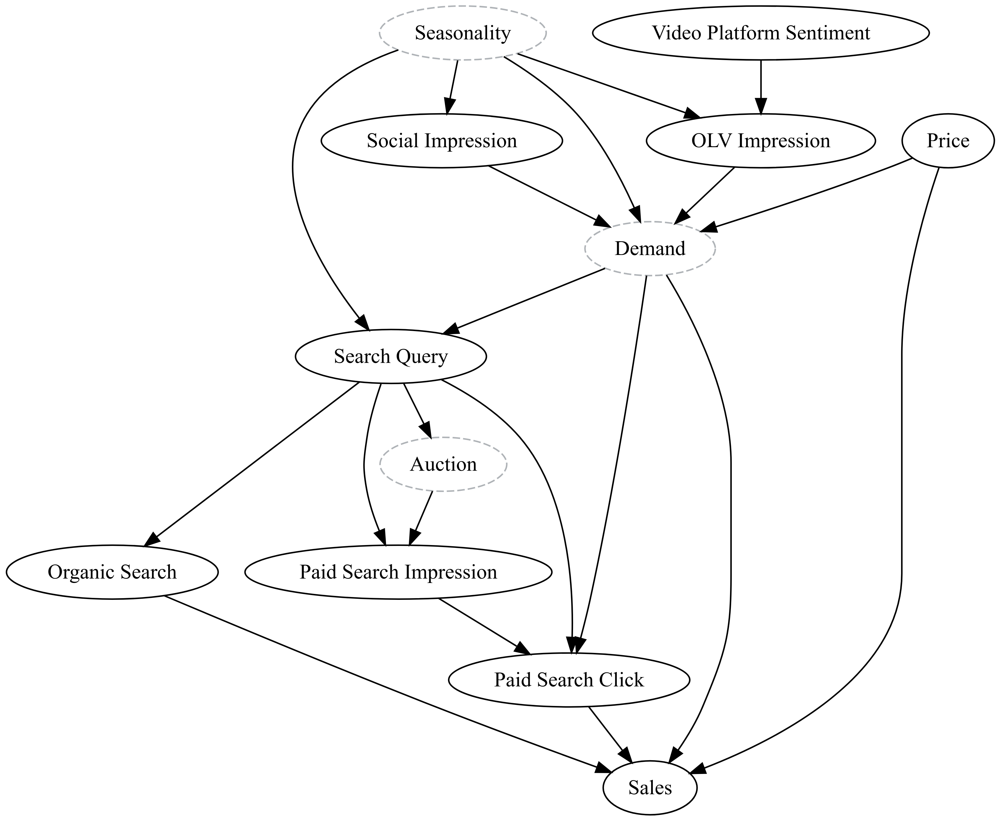
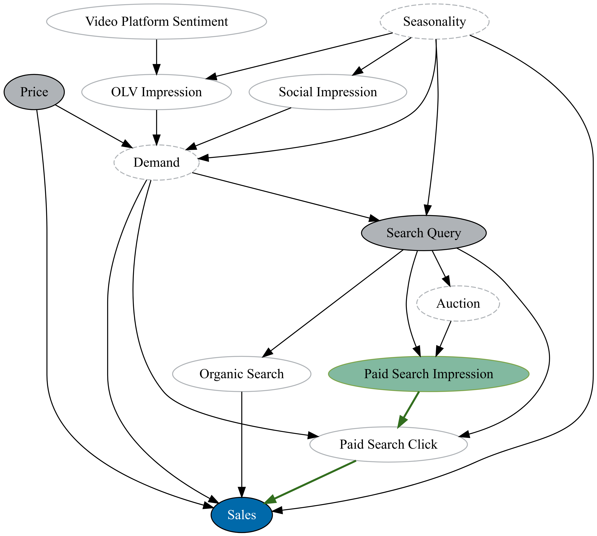
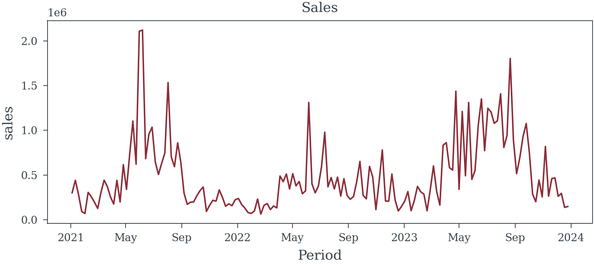
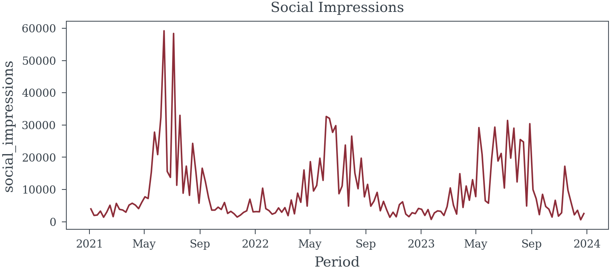
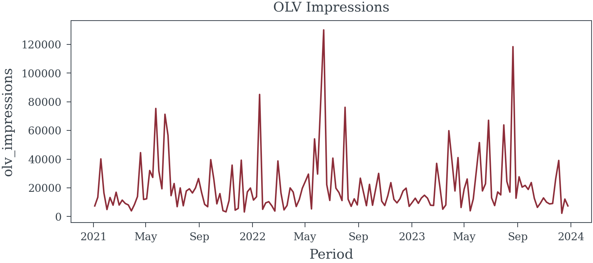
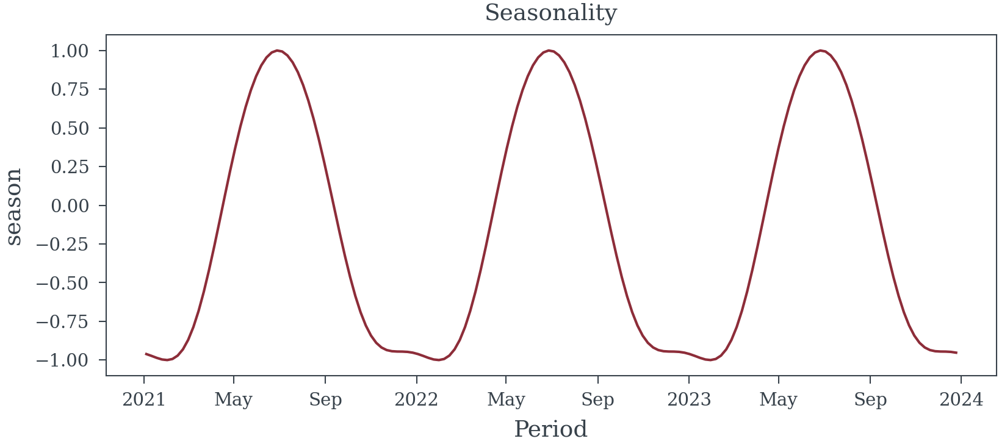

# When is Multicollinearity an Issue?


<!-- WARNING: THIS FILE WAS AUTOGENERATED! DO NOT EDIT! -->

## The Causal Model (and Related Syntax)

<div>



</div>

I will be using
<a href="#fig-causal-graph" class="quarto-xref">Figure 1</a> for the
rest of the examples on this page.

Edges will be colored to highlight if they represent causal paths (green
<button disabled style="background-color: #326E1E; height: 13px; width: 11px;"></button>),
biasing paths (red
<button disabled style="background-color: #8D2D39; height: 13px; width: 11px;"></button>),
or non-causal paths (black
<button disabled style="background-color: #000000; height: 13px; width: 11px;"></button>).
See
<a href="#fig-causal-graph-paid-search" class="quarto-xref">Figure 2</a>
and <a href="#fig-causal-graph-paid-search-adjusted"
class="quarto-xref">Figure 3</a>

Nodes that represent exposures (things for which we would like to know
the effect of) will be filled with a green
(<button disabled style="background-color: #82B9A0; height: 13px; width: 11px;"></button>)
background. The outcome variable of interest will be filled with a blue
background
(<button disabled style="background-color: #0069AA; height: 13px; width: 11px;"></button>).
Variables that are adjusted for are filled with a light gray color
(<button disabled style="background-color: #AFB3B7; height: 13px; width: 11px;"></button>)
Nodes with a dashed outline are difficult if not impossible to directly
observe. Nodes that are not filled and have a solid outline are
variables for which we have data (or for which data can be aqcuired).

<div class="panel-tabset" group="Models">

## Un-Adjusted Model

<div>



</div>

## Adjusted Model

<div>


</div>

</div>

------------------------------------------------------------------------

<a
href="https://github.com/redam94/common_regression_issues/blob/main/common_regression_issues/multicollinearity.py#L14"
target="_blank" style="float:right; font-size:smaller">source</a>

### sample_random_data

>      sample_random_data (N_weeks:int, include_hidden_confounds:bool=False,
>                          random_seed:int|None=None)

<table>
<colgroup>
<col style="width: 6%" />
<col style="width: 25%" />
<col style="width: 34%" />
<col style="width: 34%" />
</colgroup>
<thead>
<tr class="header">
<th></th>
<th><strong>Type</strong></th>
<th><strong>Default</strong></th>
<th><strong>Details</strong></th>
</tr>
</thead>
<tbody>
<tr class="odd">
<td>N_weeks</td>
<td>int</td>
<td></td>
<td>Number of weeks to generate</td>
</tr>
<tr class="even">
<td>include_hidden_confounds</td>
<td>bool</td>
<td>False</td>
<td>Should hidden confounds be included in the dataset</td>
</tr>
<tr class="odd">
<td>random_seed</td>
<td>int | None</td>
<td>None</td>
<td>Random Seed</td>
</tr>
<tr class="even">
<td><strong>Returns</strong></td>
<td><strong>Dataset</strong></td>
<td></td>
<td><strong>Dataset containing the variables described by the above
causal model</strong></td>
</tr>
</tbody>
</table>

``` python
dataset = sample_random_data(156, random_seed=2, include_hidden_confounds=True)
dataset.head()
```

<div><svg style="position: absolute; width: 0; height: 0; overflow: hidden">
<defs>
<symbol id="icon-database" viewBox="0 0 32 32">
<path d="M16 0c-8.837 0-16 2.239-16 5v4c0 2.761 7.163 5 16 5s16-2.239 16-5v-4c0-2.761-7.163-5-16-5z"></path>
<path d="M16 17c-8.837 0-16-2.239-16-5v6c0 2.761 7.163 5 16 5s16-2.239 16-5v-6c0 2.761-7.163 5-16 5z"></path>
<path d="M16 26c-8.837 0-16-2.239-16-5v6c0 2.761 7.163 5 16 5s16-2.239 16-5v-6c0 2.761-7.163 5-16 5z"></path>
</symbol>
<symbol id="icon-file-text2" viewBox="0 0 32 32">
<path d="M28.681 7.159c-0.694-0.947-1.662-2.053-2.724-3.116s-2.169-2.030-3.116-2.724c-1.612-1.182-2.393-1.319-2.841-1.319h-15.5c-1.378 0-2.5 1.121-2.5 2.5v27c0 1.378 1.122 2.5 2.5 2.5h23c1.378 0 2.5-1.122 2.5-2.5v-19.5c0-0.448-0.137-1.23-1.319-2.841zM24.543 5.457c0.959 0.959 1.712 1.825 2.268 2.543h-4.811v-4.811c0.718 0.556 1.584 1.309 2.543 2.268zM28 29.5c0 0.271-0.229 0.5-0.5 0.5h-23c-0.271 0-0.5-0.229-0.5-0.5v-27c0-0.271 0.229-0.5 0.5-0.5 0 0 15.499-0 15.5 0v7c0 0.552 0.448 1 1 1h7v19.5z"></path>
<path d="M23 26h-14c-0.552 0-1-0.448-1-1s0.448-1 1-1h14c0.552 0 1 0.448 1 1s-0.448 1-1 1z"></path>
<path d="M23 22h-14c-0.552 0-1-0.448-1-1s0.448-1 1-1h14c0.552 0 1 0.448 1 1s-0.448 1-1 1z"></path>
<path d="M23 18h-14c-0.552 0-1-0.448-1-1s0.448-1 1-1h14c0.552 0 1 0.448 1 1s-0.448 1-1 1z"></path>
</symbol>
</defs>
</svg>
<style>/* CSS stylesheet for displaying xarray objects in jupyterlab.
 *
 */
&#10;:root {
  --xr-font-color0: var(--jp-content-font-color0, rgba(0, 0, 0, 1));
  --xr-font-color2: var(--jp-content-font-color2, rgba(0, 0, 0, 0.54));
  --xr-font-color3: var(--jp-content-font-color3, rgba(0, 0, 0, 0.38));
  --xr-border-color: var(--jp-border-color2, #e0e0e0);
  --xr-disabled-color: var(--jp-layout-color3, #bdbdbd);
  --xr-background-color: var(--jp-layout-color0, white);
  --xr-background-color-row-even: var(--jp-layout-color1, white);
  --xr-background-color-row-odd: var(--jp-layout-color2, #eeeeee);
}
&#10;html[theme=dark],
html[data-theme=dark],
body[data-theme=dark],
body.vscode-dark {
  --xr-font-color0: rgba(255, 255, 255, 1);
  --xr-font-color2: rgba(255, 255, 255, 0.54);
  --xr-font-color3: rgba(255, 255, 255, 0.38);
  --xr-border-color: #1F1F1F;
  --xr-disabled-color: #515151;
  --xr-background-color: #111111;
  --xr-background-color-row-even: #111111;
  --xr-background-color-row-odd: #313131;
}
&#10;.xr-wrap {
  display: block !important;
  min-width: 300px;
  max-width: 700px;
}
&#10;.xr-text-repr-fallback {
  /* fallback to plain text repr when CSS is not injected (untrusted notebook) */
  display: none;
}
&#10;.xr-header {
  padding-top: 6px;
  padding-bottom: 6px;
  margin-bottom: 4px;
  border-bottom: solid 1px var(--xr-border-color);
}
&#10;.xr-header > div,
.xr-header > ul {
  display: inline;
  margin-top: 0;
  margin-bottom: 0;
}
&#10;.xr-obj-type,
.xr-array-name {
  margin-left: 2px;
  margin-right: 10px;
}
&#10;.xr-obj-type {
  color: var(--xr-font-color2);
}
&#10;.xr-sections {
  padding-left: 0 !important;
  display: grid;
  grid-template-columns: 150px auto auto 1fr 0 20px 0 20px;
}
&#10;.xr-section-item {
  display: contents;
}
&#10;.xr-section-item input {
  display: inline-block;
  opacity: 0;
}
&#10;.xr-section-item input + label {
  color: var(--xr-disabled-color);
}
&#10;.xr-section-item input:enabled + label {
  cursor: pointer;
  color: var(--xr-font-color2);
}
&#10;.xr-section-item input:focus + label {
  border: 2px solid var(--xr-font-color0);
}
&#10;.xr-section-item input:enabled + label:hover {
  color: var(--xr-font-color0);
}
&#10;.xr-section-summary {
  grid-column: 1;
  color: var(--xr-font-color2);
  font-weight: 500;
}
&#10;.xr-section-summary > span {
  display: inline-block;
  padding-left: 0.5em;
}
&#10;.xr-section-summary-in:disabled + label {
  color: var(--xr-font-color2);
}
&#10;.xr-section-summary-in + label:before {
  display: inline-block;
  content: '►';
  font-size: 11px;
  width: 15px;
  text-align: center;
}
&#10;.xr-section-summary-in:disabled + label:before {
  color: var(--xr-disabled-color);
}
&#10;.xr-section-summary-in:checked + label:before {
  content: '▼';
}
&#10;.xr-section-summary-in:checked + label > span {
  display: none;
}
&#10;.xr-section-summary,
.xr-section-inline-details {
  padding-top: 4px;
  padding-bottom: 4px;
}
&#10;.xr-section-inline-details {
  grid-column: 2 / -1;
}
&#10;.xr-section-details {
  display: none;
  grid-column: 1 / -1;
  margin-bottom: 5px;
}
&#10;.xr-section-summary-in:checked ~ .xr-section-details {
  display: contents;
}
&#10;.xr-array-wrap {
  grid-column: 1 / -1;
  display: grid;
  grid-template-columns: 20px auto;
}
&#10;.xr-array-wrap > label {
  grid-column: 1;
  vertical-align: top;
}
&#10;.xr-preview {
  color: var(--xr-font-color3);
}
&#10;.xr-array-preview,
.xr-array-data {
  padding: 0 5px !important;
  grid-column: 2;
}
&#10;.xr-array-data,
.xr-array-in:checked ~ .xr-array-preview {
  display: none;
}
&#10;.xr-array-in:checked ~ .xr-array-data,
.xr-array-preview {
  display: inline-block;
}
&#10;.xr-dim-list {
  display: inline-block !important;
  list-style: none;
  padding: 0 !important;
  margin: 0;
}
&#10;.xr-dim-list li {
  display: inline-block;
  padding: 0;
  margin: 0;
}
&#10;.xr-dim-list:before {
  content: '(';
}
&#10;.xr-dim-list:after {
  content: ')';
}
&#10;.xr-dim-list li:not(:last-child):after {
  content: ',';
  padding-right: 5px;
}
&#10;.xr-has-index {
  font-weight: bold;
}
&#10;.xr-var-list,
.xr-var-item {
  display: contents;
}
&#10;.xr-var-item > div,
.xr-var-item label,
.xr-var-item > .xr-var-name span {
  background-color: var(--xr-background-color-row-even);
  margin-bottom: 0;
}
&#10;.xr-var-item > .xr-var-name:hover span {
  padding-right: 5px;
}
&#10;.xr-var-list > li:nth-child(odd) > div,
.xr-var-list > li:nth-child(odd) > label,
.xr-var-list > li:nth-child(odd) > .xr-var-name span {
  background-color: var(--xr-background-color-row-odd);
}
&#10;.xr-var-name {
  grid-column: 1;
}
&#10;.xr-var-dims {
  grid-column: 2;
}
&#10;.xr-var-dtype {
  grid-column: 3;
  text-align: right;
  color: var(--xr-font-color2);
}
&#10;.xr-var-preview {
  grid-column: 4;
}
&#10;.xr-index-preview {
  grid-column: 2 / 5;
  color: var(--xr-font-color2);
}
&#10;.xr-var-name,
.xr-var-dims,
.xr-var-dtype,
.xr-preview,
.xr-attrs dt {
  white-space: nowrap;
  overflow: hidden;
  text-overflow: ellipsis;
  padding-right: 10px;
}
&#10;.xr-var-name:hover,
.xr-var-dims:hover,
.xr-var-dtype:hover,
.xr-attrs dt:hover {
  overflow: visible;
  width: auto;
  z-index: 1;
}
&#10;.xr-var-attrs,
.xr-var-data,
.xr-index-data {
  display: none;
  background-color: var(--xr-background-color) !important;
  padding-bottom: 5px !important;
}
&#10;.xr-var-attrs-in:checked ~ .xr-var-attrs,
.xr-var-data-in:checked ~ .xr-var-data,
.xr-index-data-in:checked ~ .xr-index-data {
  display: block;
}
&#10;.xr-var-data > table {
  float: right;
}
&#10;.xr-var-name span,
.xr-var-data,
.xr-index-name div,
.xr-index-data,
.xr-attrs {
  padding-left: 25px !important;
}
&#10;.xr-attrs,
.xr-var-attrs,
.xr-var-data,
.xr-index-data {
  grid-column: 1 / -1;
}
&#10;dl.xr-attrs {
  padding: 0;
  margin: 0;
  display: grid;
  grid-template-columns: 125px auto;
}
&#10;.xr-attrs dt,
.xr-attrs dd {
  padding: 0;
  margin: 0;
  float: left;
  padding-right: 10px;
  width: auto;
}
&#10;.xr-attrs dt {
  font-weight: normal;
  grid-column: 1;
}
&#10;.xr-attrs dt:hover span {
  display: inline-block;
  background: var(--xr-background-color);
  padding-right: 10px;
}
&#10;.xr-attrs dd {
  grid-column: 2;
  white-space: pre-wrap;
  word-break: break-all;
}
&#10;.xr-icon-database,
.xr-icon-file-text2,
.xr-no-icon {
  display: inline-block;
  vertical-align: middle;
  width: 1em;
  height: 1.5em !important;
  stroke-width: 0;
  stroke: currentColor;
  fill: currentColor;
}
</style><pre class='xr-text-repr-fallback'>&lt;xarray.Dataset&gt; Size: 480B
Dimensions:                  (Period: 5)
Coordinates:
  * Period                   (Period) datetime64[ns] 40B 2021-01-04 ... 2021-...
Data variables:
    price                    (Period) float64 40B 3.856 3.767 3.767 4.3 4.3
    season                   (Period) float64 40B -0.9613 -0.9732 ... -1.0
    social_impressions       (Period) float64 40B 3.972e+03 ... 1.385e+03
    olv_impressions          (Period) float64 40B 7.405e+03 ... 4.911e+03
    demand                   (Period) float64 40B 35.99 38.55 39.04 32.23 28.31
    search_query             (Period) float64 40B 3.612e+06 ... 1.636e+06
    auction                  (Period) float64 40B 0.1327 0.1269 ... 0.08248
    paid_search_impressions  (Period) float64 40B 4.794e+05 ... 1.349e+05
    paid_search_clicks       (Period) float64 40B 1.974e+03 2.884e+03 ... 552.6
    organic_search           (Period) float64 40B 3.154e+06 ... 1.432e+06
    sales                    (Period) float64 40B 1.373e+04 ... 6.214e+03</pre><div class='xr-wrap' style='display:none'><div class='xr-header'><div class='xr-obj-type'>xarray.Dataset</div></div><ul class='xr-sections'><li class='xr-section-item'><input id='section-cb56a6b2-7e05-4d3d-9895-51ecf5eb60c3' class='xr-section-summary-in' type='checkbox' disabled ><label for='section-cb56a6b2-7e05-4d3d-9895-51ecf5eb60c3' class='xr-section-summary'  title='Expand/collapse section'>Dimensions:</label><div class='xr-section-inline-details'><ul class='xr-dim-list'><li><span class='xr-has-index'>Period</span>: 5</li></ul></div><div class='xr-section-details'></div></li><li class='xr-section-item'><input id='section-99e931a6-c719-4956-a397-7831657bc2fb' class='xr-section-summary-in' type='checkbox'  checked><label for='section-99e931a6-c719-4956-a397-7831657bc2fb' class='xr-section-summary' >Coordinates: <span>(1)</span></label><div class='xr-section-inline-details'></div><div class='xr-section-details'><ul class='xr-var-list'><li class='xr-var-item'><div class='xr-var-name'><span class='xr-has-index'>Period</span></div><div class='xr-var-dims'>(Period)</div><div class='xr-var-dtype'>datetime64[ns]</div><div class='xr-var-preview xr-preview'>2021-01-04 ... 2021-02-01</div><input id='attrs-efc1b8d2-2753-4415-a140-c8f005bf9fa5' class='xr-var-attrs-in' type='checkbox' disabled><label for='attrs-efc1b8d2-2753-4415-a140-c8f005bf9fa5' title='Show/Hide attributes'><svg class='icon xr-icon-file-text2'><use xlink:href='#icon-file-text2'></use></svg></label><input id='data-268caed0-ba13-46df-95ff-a743de3fb64b' class='xr-var-data-in' type='checkbox'><label for='data-268caed0-ba13-46df-95ff-a743de3fb64b' title='Show/Hide data repr'><svg class='icon xr-icon-database'><use xlink:href='#icon-database'></use></svg></label><div class='xr-var-attrs'><dl class='xr-attrs'></dl></div><div class='xr-var-data'><pre>array([&#x27;2021-01-04T00:00:00.000000000&#x27;, &#x27;2021-01-11T00:00:00.000000000&#x27;,
       &#x27;2021-01-18T00:00:00.000000000&#x27;, &#x27;2021-01-25T00:00:00.000000000&#x27;,
       &#x27;2021-02-01T00:00:00.000000000&#x27;], dtype=&#x27;datetime64[ns]&#x27;)</pre></div></li></ul></div></li><li class='xr-section-item'><input id='section-b23515b8-e204-4367-a53e-25958834d659' class='xr-section-summary-in' type='checkbox'  checked><label for='section-b23515b8-e204-4367-a53e-25958834d659' class='xr-section-summary' >Data variables: <span>(11)</span></label><div class='xr-section-inline-details'></div><div class='xr-section-details'><ul class='xr-var-list'><li class='xr-var-item'><div class='xr-var-name'><span>price</span></div><div class='xr-var-dims'>(Period)</div><div class='xr-var-dtype'>float64</div><div class='xr-var-preview xr-preview'>3.856 3.767 3.767 4.3 4.3</div><input id='attrs-efe97f15-7b65-41c0-9215-46d0dcc41144' class='xr-var-attrs-in' type='checkbox' disabled><label for='attrs-efe97f15-7b65-41c0-9215-46d0dcc41144' title='Show/Hide attributes'><svg class='icon xr-icon-file-text2'><use xlink:href='#icon-file-text2'></use></svg></label><input id='data-b4983caf-5ccb-4b0c-b485-ac69ee62eef0' class='xr-var-data-in' type='checkbox'><label for='data-b4983caf-5ccb-4b0c-b485-ac69ee62eef0' title='Show/Hide data repr'><svg class='icon xr-icon-database'><use xlink:href='#icon-database'></use></svg></label><div class='xr-var-attrs'><dl class='xr-attrs'></dl></div><div class='xr-var-data'><pre>array([3.85623064, 3.76666366, 3.76666366, 4.30004006, 4.30004006])</pre></div></li><li class='xr-var-item'><div class='xr-var-name'><span>season</span></div><div class='xr-var-dims'>(Period)</div><div class='xr-var-dtype'>float64</div><div class='xr-var-preview xr-preview'>-0.9613 -0.9732 -0.986 -0.9962 -1.0</div><input id='attrs-ca5f4913-c1fd-49b9-bdb6-1a8174943bae' class='xr-var-attrs-in' type='checkbox' disabled><label for='attrs-ca5f4913-c1fd-49b9-bdb6-1a8174943bae' title='Show/Hide attributes'><svg class='icon xr-icon-file-text2'><use xlink:href='#icon-file-text2'></use></svg></label><input id='data-7f74c88b-9386-45d3-91d2-1fc8947db6b4' class='xr-var-data-in' type='checkbox'><label for='data-7f74c88b-9386-45d3-91d2-1fc8947db6b4' title='Show/Hide data repr'><svg class='icon xr-icon-database'><use xlink:href='#icon-database'></use></svg></label><div class='xr-var-attrs'><dl class='xr-attrs'></dl></div><div class='xr-var-data'><pre>array([-0.96125225, -0.97320297, -0.9859537 , -0.99622428, -1.        ])</pre></div></li><li class='xr-var-item'><div class='xr-var-name'><span>social_impressions</span></div><div class='xr-var-dims'>(Period)</div><div class='xr-var-dtype'>float64</div><div class='xr-var-preview xr-preview'>3.972e+03 1.946e+03 ... 1.385e+03</div><input id='attrs-f0ff9c86-efdd-4578-a2aa-84f478ef2aeb' class='xr-var-attrs-in' type='checkbox' disabled><label for='attrs-f0ff9c86-efdd-4578-a2aa-84f478ef2aeb' title='Show/Hide attributes'><svg class='icon xr-icon-file-text2'><use xlink:href='#icon-file-text2'></use></svg></label><input id='data-0a906578-636f-4e2c-abc1-c4b06047f09b' class='xr-var-data-in' type='checkbox'><label for='data-0a906578-636f-4e2c-abc1-c4b06047f09b' title='Show/Hide data repr'><svg class='icon xr-icon-database'><use xlink:href='#icon-database'></use></svg></label><div class='xr-var-attrs'><dl class='xr-attrs'></dl></div><div class='xr-var-data'><pre>array([3972.21549561, 1945.77414735, 2066.2420529 , 3293.8620532 ,
       1385.34750594])</pre></div></li><li class='xr-var-item'><div class='xr-var-name'><span>olv_impressions</span></div><div class='xr-var-dims'>(Period)</div><div class='xr-var-dtype'>float64</div><div class='xr-var-preview xr-preview'>7.405e+03 1.347e+04 ... 4.911e+03</div><input id='attrs-6145c7de-06b5-47ea-a40f-214808b01601' class='xr-var-attrs-in' type='checkbox' disabled><label for='attrs-6145c7de-06b5-47ea-a40f-214808b01601' title='Show/Hide attributes'><svg class='icon xr-icon-file-text2'><use xlink:href='#icon-file-text2'></use></svg></label><input id='data-85f7344a-19b3-43b2-980a-2cda2001dcc9' class='xr-var-data-in' type='checkbox'><label for='data-85f7344a-19b3-43b2-980a-2cda2001dcc9' title='Show/Hide data repr'><svg class='icon xr-icon-database'><use xlink:href='#icon-database'></use></svg></label><div class='xr-var-attrs'><dl class='xr-attrs'></dl></div><div class='xr-var-data'><pre>array([ 7405.39696936, 13471.59887313, 40209.71587712, 16569.33544424,
        4911.35391657])</pre></div></li><li class='xr-var-item'><div class='xr-var-name'><span>demand</span></div><div class='xr-var-dims'>(Period)</div><div class='xr-var-dtype'>float64</div><div class='xr-var-preview xr-preview'>35.99 38.55 39.04 32.23 28.31</div><input id='attrs-0cad75ef-5ad5-4a1b-99c4-34f651c0e6b2' class='xr-var-attrs-in' type='checkbox' disabled><label for='attrs-0cad75ef-5ad5-4a1b-99c4-34f651c0e6b2' title='Show/Hide attributes'><svg class='icon xr-icon-file-text2'><use xlink:href='#icon-file-text2'></use></svg></label><input id='data-6cc40a39-0f98-4898-a648-8b69713cd1d0' class='xr-var-data-in' type='checkbox'><label for='data-6cc40a39-0f98-4898-a648-8b69713cd1d0' title='Show/Hide data repr'><svg class='icon xr-icon-database'><use xlink:href='#icon-database'></use></svg></label><div class='xr-var-attrs'><dl class='xr-attrs'></dl></div><div class='xr-var-data'><pre>array([35.99428502, 38.55416717, 39.03610144, 32.23118042, 28.30560453])</pre></div></li><li class='xr-var-item'><div class='xr-var-name'><span>search_query</span></div><div class='xr-var-dims'>(Period)</div><div class='xr-var-dtype'>float64</div><div class='xr-var-preview xr-preview'>3.612e+06 6.408e+06 ... 1.636e+06</div><input id='attrs-6cb61277-c74c-44f4-b034-20a3f7e2d385' class='xr-var-attrs-in' type='checkbox' disabled><label for='attrs-6cb61277-c74c-44f4-b034-20a3f7e2d385' title='Show/Hide attributes'><svg class='icon xr-icon-file-text2'><use xlink:href='#icon-file-text2'></use></svg></label><input id='data-19e38d05-81bd-4455-9d14-9d4f8103291f' class='xr-var-data-in' type='checkbox'><label for='data-19e38d05-81bd-4455-9d14-9d4f8103291f' title='Show/Hide data repr'><svg class='icon xr-icon-database'><use xlink:href='#icon-database'></use></svg></label><div class='xr-var-attrs'><dl class='xr-attrs'></dl></div><div class='xr-var-data'><pre>array([3611857.13102823, 6407702.90037047, 4008767.89451317, 2152393.3229281 ,
       1635513.05712211])</pre></div></li><li class='xr-var-item'><div class='xr-var-name'><span>auction</span></div><div class='xr-var-dims'>(Period)</div><div class='xr-var-dtype'>float64</div><div class='xr-var-preview xr-preview'>0.1327 0.1269 ... 0.06859 0.08248</div><input id='attrs-5f3089d4-1781-4770-9b85-f7ef8cc56b38' class='xr-var-attrs-in' type='checkbox' disabled><label for='attrs-5f3089d4-1781-4770-9b85-f7ef8cc56b38' title='Show/Hide attributes'><svg class='icon xr-icon-file-text2'><use xlink:href='#icon-file-text2'></use></svg></label><input id='data-d43d1e78-7950-4c4a-8541-86ceffc96a41' class='xr-var-data-in' type='checkbox'><label for='data-d43d1e78-7950-4c4a-8541-86ceffc96a41' title='Show/Hide data repr'><svg class='icon xr-icon-database'><use xlink:href='#icon-database'></use></svg></label><div class='xr-var-attrs'><dl class='xr-attrs'></dl></div><div class='xr-var-data'><pre>array([0.13273633, 0.12693621, 0.09623563, 0.06859021, 0.08247725])</pre></div></li><li class='xr-var-item'><div class='xr-var-name'><span>paid_search_impressions</span></div><div class='xr-var-dims'>(Period)</div><div class='xr-var-dtype'>float64</div><div class='xr-var-preview xr-preview'>4.794e+05 8.134e+05 ... 1.349e+05</div><input id='attrs-fc461e7f-1ba3-4749-9b3d-5f901cdd3e4d' class='xr-var-attrs-in' type='checkbox' disabled><label for='attrs-fc461e7f-1ba3-4749-9b3d-5f901cdd3e4d' title='Show/Hide attributes'><svg class='icon xr-icon-file-text2'><use xlink:href='#icon-file-text2'></use></svg></label><input id='data-97e4a596-b0d4-4970-beb8-e0ae2d8428a4' class='xr-var-data-in' type='checkbox'><label for='data-97e4a596-b0d4-4970-beb8-e0ae2d8428a4' title='Show/Hide data repr'><svg class='icon xr-icon-database'><use xlink:href='#icon-database'></use></svg></label><div class='xr-var-attrs'><dl class='xr-attrs'></dl></div><div class='xr-var-data'><pre>array([479424.65135716, 813369.52052709, 385786.28808314, 147633.10742862,
       134892.62427787])</pre></div></li><li class='xr-var-item'><div class='xr-var-name'><span>paid_search_clicks</span></div><div class='xr-var-dims'>(Period)</div><div class='xr-var-dtype'>float64</div><div class='xr-var-preview xr-preview'>1.974e+03 2.884e+03 ... 662.0 552.6</div><input id='attrs-5b4214a0-1761-4423-8762-c9605a65c0ee' class='xr-var-attrs-in' type='checkbox' disabled><label for='attrs-5b4214a0-1761-4423-8762-c9605a65c0ee' title='Show/Hide attributes'><svg class='icon xr-icon-file-text2'><use xlink:href='#icon-file-text2'></use></svg></label><input id='data-501fa4a7-aeaf-4906-ad6e-2a10aba47942' class='xr-var-data-in' type='checkbox'><label for='data-501fa4a7-aeaf-4906-ad6e-2a10aba47942' title='Show/Hide data repr'><svg class='icon xr-icon-database'><use xlink:href='#icon-database'></use></svg></label><div class='xr-var-attrs'><dl class='xr-attrs'></dl></div><div class='xr-var-data'><pre>array([1973.97790244, 2883.77954853, 1930.15471784,  662.04005707,
        552.58508123])</pre></div></li><li class='xr-var-item'><div class='xr-var-name'><span>organic_search</span></div><div class='xr-var-dims'>(Period)</div><div class='xr-var-dtype'>float64</div><div class='xr-var-preview xr-preview'>3.154e+06 5.833e+06 ... 1.432e+06</div><input id='attrs-e0809406-7776-419e-a42c-c5df678c57dd' class='xr-var-attrs-in' type='checkbox' disabled><label for='attrs-e0809406-7776-419e-a42c-c5df678c57dd' title='Show/Hide attributes'><svg class='icon xr-icon-file-text2'><use xlink:href='#icon-file-text2'></use></svg></label><input id='data-7678ece1-8bfd-453c-9a66-11b2ff73b347' class='xr-var-data-in' type='checkbox'><label for='data-7678ece1-8bfd-453c-9a66-11b2ff73b347' title='Show/Hide data repr'><svg class='icon xr-icon-database'><use xlink:href='#icon-database'></use></svg></label><div class='xr-var-attrs'><dl class='xr-attrs'></dl></div><div class='xr-var-data'><pre>array([3153890.5817659 , 5833085.18330815, 3641071.38873564, 1921294.81933767,
       1431525.33497832])</pre></div></li><li class='xr-var-item'><div class='xr-var-name'><span>sales</span></div><div class='xr-var-dims'>(Period)</div><div class='xr-var-dtype'>float64</div><div class='xr-var-preview xr-preview'>1.373e+04 1.675e+04 ... 6.214e+03</div><input id='attrs-ba966abd-64cf-49b0-850e-d801ab299fb1' class='xr-var-attrs-in' type='checkbox' disabled><label for='attrs-ba966abd-64cf-49b0-850e-d801ab299fb1' title='Show/Hide attributes'><svg class='icon xr-icon-file-text2'><use xlink:href='#icon-file-text2'></use></svg></label><input id='data-eeabeb27-0d08-4303-9dce-f84c48a522b0' class='xr-var-data-in' type='checkbox'><label for='data-eeabeb27-0d08-4303-9dce-f84c48a522b0' title='Show/Hide data repr'><svg class='icon xr-icon-database'><use xlink:href='#icon-database'></use></svg></label><div class='xr-var-attrs'><dl class='xr-attrs'></dl></div><div class='xr-var-data'><pre>array([13728.15666748, 16754.49221798, 13321.8860107 ,  7670.83942862,
        6214.0459675 ])</pre></div></li></ul></div></li><li class='xr-section-item'><input id='section-6f61ae0a-9faf-47b5-a2b8-1aadd4587a55' class='xr-section-summary-in' type='checkbox'  ><label for='section-6f61ae0a-9faf-47b5-a2b8-1aadd4587a55' class='xr-section-summary' >Indexes: <span>(1)</span></label><div class='xr-section-inline-details'></div><div class='xr-section-details'><ul class='xr-var-list'><li class='xr-var-item'><div class='xr-index-name'><div>Period</div></div><div class='xr-index-preview'>PandasIndex</div><div></div><input id='index-c5a7afcc-769c-4edd-93f5-9b37f12b112b' class='xr-index-data-in' type='checkbox'/><label for='index-c5a7afcc-769c-4edd-93f5-9b37f12b112b' title='Show/Hide index repr'><svg class='icon xr-icon-database'><use xlink:href='#icon-database'></use></svg></label><div class='xr-index-data'><pre>PandasIndex(DatetimeIndex([&#x27;2021-01-04&#x27;, &#x27;2021-01-11&#x27;, &#x27;2021-01-18&#x27;, &#x27;2021-01-25&#x27;,
               &#x27;2021-02-01&#x27;],
              dtype=&#x27;datetime64[ns]&#x27;, name=&#x27;Period&#x27;, freq=&#x27;W-MON&#x27;))</pre></div></li></ul></div></li><li class='xr-section-item'><input id='section-309a8ee1-5e3b-4c31-b53f-c51c20fbb28e' class='xr-section-summary-in' type='checkbox' disabled ><label for='section-309a8ee1-5e3b-4c31-b53f-c51c20fbb28e' class='xr-section-summary'  title='Expand/collapse section'>Attributes: <span>(0)</span></label><div class='xr-section-inline-details'></div><div class='xr-section-details'><dl class='xr-attrs'></dl></div></li></ul></div></div>

<div class="panel-tabset">

## Correlation Matrix

<style type="text/css">
#T_62a50_row0_col0, #T_62a50_row1_col1, #T_62a50_row2_col2, #T_62a50_row3_col3 {
  background-color: #006837;
  color: #f1f1f1;
}
#T_62a50_row0_col1, #T_62a50_row1_col0 {
  background-color: #118848;
  color: #f1f1f1;
}
#T_62a50_row0_col2, #T_62a50_row2_col0 {
  background-color: #feda86;
  color: #000000;
}
#T_62a50_row0_col3, #T_62a50_row3_col0 {
  background-color: #18954f;
  color: #f1f1f1;
}
#T_62a50_row1_col2, #T_62a50_row2_col1 {
  background-color: #fec877;
  color: #000000;
}
#T_62a50_row1_col3, #T_62a50_row3_col1 {
  background-color: #15904c;
  color: #f1f1f1;
}
#T_62a50_row2_col3, #T_62a50_row3_col2 {
  background-color: #fee28f;
  color: #000000;
}
</style>

<table id="T_62a50" data-quarto-postprocess="true">
<thead>
<tr class="header">
<th class="blank level0" data-quarto-table-cell-role="th"> </th>
<th id="T_62a50_level0_col0" class="col_heading level0 col0"
data-quarto-table-cell-role="th">paid_search_impressions</th>
<th id="T_62a50_level0_col1" class="col_heading level0 col1"
data-quarto-table-cell-role="th">search_query</th>
<th id="T_62a50_level0_col2" class="col_heading level0 col2"
data-quarto-table-cell-role="th">price</th>
<th id="T_62a50_level0_col3" class="col_heading level0 col3"
data-quarto-table-cell-role="th">sales</th>
</tr>
</thead>
<tbody>
<tr class="odd">
<td id="T_62a50_level0_row0" class="row_heading level0 row0"
data-quarto-table-cell-role="th">paid_search_impressions</td>
<td id="T_62a50_row0_col0" class="data row0 col0">1.000000</td>
<td id="T_62a50_row0_col1" class="data row0 col1">0.864750</td>
<td id="T_62a50_row0_col2" class="data row0 col2">-0.225242</td>
<td id="T_62a50_row0_col3" class="data row0 col3">0.812185</td>
</tr>
<tr class="even">
<td id="T_62a50_level0_row1" class="row_heading level0 row1"
data-quarto-table-cell-role="th">search_query</td>
<td id="T_62a50_row1_col0" class="data row1 col0">0.864750</td>
<td id="T_62a50_row1_col1" class="data row1 col1">1.000000</td>
<td id="T_62a50_row1_col2" class="data row1 col2">-0.296845</td>
<td id="T_62a50_row1_col3" class="data row1 col3">0.829057</td>
</tr>
<tr class="odd">
<td id="T_62a50_level0_row2" class="row_heading level0 row2"
data-quarto-table-cell-role="th">price</td>
<td id="T_62a50_row2_col0" class="data row2 col0">-0.225242</td>
<td id="T_62a50_row2_col1" class="data row2 col1">-0.296845</td>
<td id="T_62a50_row2_col2" class="data row2 col2">1.000000</td>
<td id="T_62a50_row2_col3" class="data row2 col3">-0.181592</td>
</tr>
<tr class="even">
<td id="T_62a50_level0_row3" class="row_heading level0 row3"
data-quarto-table-cell-role="th">sales</td>
<td id="T_62a50_row3_col0" class="data row3 col0">0.812185</td>
<td id="T_62a50_row3_col1" class="data row3 col1">0.829057</td>
<td id="T_62a50_row3_col2" class="data row3 col2">-0.181592</td>
<td id="T_62a50_row3_col3" class="data row3 col3">1.000000</td>
</tr>
</tbody>
</table>

## VIFs

<div class="cell-output cell-output-stdout">

                               VIF
    paid_search_impressions  : 13.59
    search_query             : 16.06
    price                    : 3.48

</div>

</div>

The correct effect of search would be given by a coefficient of 0.4. In
the adjusted model this coefficient is recovered with reasonable
accuracy despite the large VIF caused by search_query being included in
the model as seen in
<a href="#tbl-adjusted" class="quarto-xref">Table 3</a>.

<div class="panel-tabset" group="Models">

## Un-Adjusted Model

<div class="cell-output cell-output-display">

<table class="simpletable do-not-create-environment cell"
data-quarto-postprocess="true">
<caption>OLS Regression Results</caption>
<tbody>
<tr class="odd">
<td data-quarto-table-cell-role="th">Dep. Variable:</td>
<td>sales</td>
<td data-quarto-table-cell-role="th">R-squared:</td>
<td>0.711</td>
</tr>
<tr class="even">
<td data-quarto-table-cell-role="th">Model:</td>
<td>OLS</td>
<td data-quarto-table-cell-role="th">Adj. R-squared:</td>
<td>0.708</td>
</tr>
<tr class="odd">
<td data-quarto-table-cell-role="th">Method:</td>
<td>Least Squares</td>
<td data-quarto-table-cell-role="th">F-statistic:</td>
<td>188.6</td>
</tr>
<tr class="even">
<td data-quarto-table-cell-role="th">Date:</td>
<td>Mon, 11 Nov 2024</td>
<td data-quarto-table-cell-role="th">Prob (F-statistic):</td>
<td>5.17e-42</td>
</tr>
<tr class="odd">
<td data-quarto-table-cell-role="th">Time:</td>
<td>23:02:15</td>
<td data-quarto-table-cell-role="th">Log-Likelihood:</td>
<td>8.7320</td>
</tr>
<tr class="even">
<td data-quarto-table-cell-role="th">No. Observations:</td>
<td>156</td>
<td data-quarto-table-cell-role="th">AIC:</td>
<td>-11.46</td>
</tr>
<tr class="odd">
<td data-quarto-table-cell-role="th">Df Residuals:</td>
<td>153</td>
<td data-quarto-table-cell-role="th">BIC:</td>
<td>-2.314</td>
</tr>
<tr class="even">
<td data-quarto-table-cell-role="th">Df Model:</td>
<td>2</td>
<td data-quarto-table-cell-role="th"></td>
<td></td>
</tr>
<tr class="odd">
<td data-quarto-table-cell-role="th">Covariance Type:</td>
<td>nonrobust</td>
<td data-quarto-table-cell-role="th"></td>
<td></td>
</tr>
</tbody>
</table>

OLS Regression Results

<table class="simpletable do-not-create-environment cell"
data-quarto-postprocess="true">
<tbody>
<tr class="odd">
<td></td>
<td data-quarto-table-cell-role="th">coef</td>
<td data-quarto-table-cell-role="th">std err</td>
<td data-quarto-table-cell-role="th">t</td>
<td data-quarto-table-cell-role="th">P&gt;|t|</td>
<td data-quarto-table-cell-role="th">[0.025</td>
<td data-quarto-table-cell-role="th">0.975]</td>
</tr>
<tr class="even">
<td data-quarto-table-cell-role="th">const</td>
<td>2.0859</td>
<td>0.476</td>
<td>4.386</td>
<td>0.000</td>
<td>1.146</td>
<td>3.025</td>
</tr>
<tr class="odd">
<td data-quarto-table-cell-role="th">paid_search_impressions</td>
<td>0.5680</td>
<td>0.030</td>
<td>19.097</td>
<td>0.000</td>
<td>0.509</td>
<td>0.627</td>
</tr>
<tr class="even">
<td data-quarto-table-cell-role="th">price</td>
<td>0.1980</td>
<td>0.123</td>
<td>1.609</td>
<td>0.110</td>
<td>-0.045</td>
<td>0.441</td>
</tr>
</tbody>
</table>

<table class="simpletable do-not-create-environment cell"
data-quarto-postprocess="true">
<tbody>
<tr class="odd">
<td data-quarto-table-cell-role="th">Omnibus:</td>
<td>14.522</td>
<td data-quarto-table-cell-role="th">Durbin-Watson:</td>
<td>1.012</td>
</tr>
<tr class="even">
<td data-quarto-table-cell-role="th">Prob(Omnibus):</td>
<td>0.001</td>
<td data-quarto-table-cell-role="th">Jarque-Bera (JB):</td>
<td>6.628</td>
</tr>
<tr class="odd">
<td data-quarto-table-cell-role="th">Skew:</td>
<td>0.278</td>
<td data-quarto-table-cell-role="th">Prob(JB):</td>
<td>0.0364</td>
</tr>
<tr class="even">
<td data-quarto-table-cell-role="th">Kurtosis:</td>
<td>2.157</td>
<td data-quarto-table-cell-role="th">Cond. No.</td>
<td>343.</td>
</tr>
</tbody>
</table>

<br/><br/>Notes:<br/>[1] Standard Errors assume that the covariance matrix of the errors is correctly specified.

</div>

## Adjusted Model

<div class="cell-output cell-output-display">

<table class="simpletable do-not-create-environment cell"
data-quarto-postprocess="true">
<caption>OLS Regression Results</caption>
<tbody>
<tr class="odd">
<td data-quarto-table-cell-role="th">Dep. Variable:</td>
<td>sales</td>
<td data-quarto-table-cell-role="th">R-squared:</td>
<td>0.750</td>
</tr>
<tr class="even">
<td data-quarto-table-cell-role="th">Model:</td>
<td>OLS</td>
<td data-quarto-table-cell-role="th">Adj. R-squared:</td>
<td>0.745</td>
</tr>
<tr class="odd">
<td data-quarto-table-cell-role="th">Method:</td>
<td>Least Squares</td>
<td data-quarto-table-cell-role="th">F-statistic:</td>
<td>152.0</td>
</tr>
<tr class="even">
<td data-quarto-table-cell-role="th">Date:</td>
<td>Mon, 11 Nov 2024</td>
<td data-quarto-table-cell-role="th">Prob (F-statistic):</td>
<td>1.50e-45</td>
</tr>
<tr class="odd">
<td data-quarto-table-cell-role="th">Time:</td>
<td>23:02:20</td>
<td data-quarto-table-cell-role="th">Log-Likelihood:</td>
<td>19.936</td>
</tr>
<tr class="even">
<td data-quarto-table-cell-role="th">No. Observations:</td>
<td>156</td>
<td data-quarto-table-cell-role="th">AIC:</td>
<td>-31.87</td>
</tr>
<tr class="odd">
<td data-quarto-table-cell-role="th">Df Residuals:</td>
<td>152</td>
<td data-quarto-table-cell-role="th">BIC:</td>
<td>-19.67</td>
</tr>
<tr class="even">
<td data-quarto-table-cell-role="th">Df Model:</td>
<td>3</td>
<td data-quarto-table-cell-role="th"></td>
<td></td>
</tr>
<tr class="odd">
<td data-quarto-table-cell-role="th">Covariance Type:</td>
<td>nonrobust</td>
<td data-quarto-table-cell-role="th"></td>
<td></td>
</tr>
</tbody>
</table>

OLS Regression Results

<table class="simpletable do-not-create-environment cell"
data-quarto-postprocess="true">
<tbody>
<tr class="odd">
<td></td>
<td data-quarto-table-cell-role="th">coef</td>
<td data-quarto-table-cell-role="th">std err</td>
<td data-quarto-table-cell-role="th">t</td>
<td data-quarto-table-cell-role="th">P&gt;|t|</td>
<td data-quarto-table-cell-role="th">[0.025</td>
<td data-quarto-table-cell-role="th">0.975]</td>
</tr>
<tr class="even">
<td data-quarto-table-cell-role="th">const</td>
<td>-0.0161</td>
<td>0.621</td>
<td>-0.026</td>
<td>0.979</td>
<td>-1.243</td>
<td>1.210</td>
</tr>
<tr class="odd">
<td data-quarto-table-cell-role="th">paid_search_impressions</td>
<td>0.3240</td>
<td>0.058</td>
<td>5.634</td>
<td>0.000</td>
<td>0.210</td>
<td>0.438</td>
</tr>
<tr class="even">
<td data-quarto-table-cell-role="th">search_query</td>
<td>0.3319</td>
<td>0.069</td>
<td>4.846</td>
<td>0.000</td>
<td>0.197</td>
<td>0.467</td>
</tr>
<tr class="odd">
<td data-quarto-table-cell-role="th">price</td>
<td>0.2894</td>
<td>0.116</td>
<td>2.485</td>
<td>0.014</td>
<td>0.059</td>
<td>0.520</td>
</tr>
</tbody>
</table>

<table class="simpletable do-not-create-environment cell"
data-quarto-postprocess="true">
<tbody>
<tr class="odd">
<td data-quarto-table-cell-role="th">Omnibus:</td>
<td>11.120</td>
<td data-quarto-table-cell-role="th">Durbin-Watson:</td>
<td>1.209</td>
</tr>
<tr class="even">
<td data-quarto-table-cell-role="th">Prob(Omnibus):</td>
<td>0.004</td>
<td data-quarto-table-cell-role="th">Jarque-Bera (JB):</td>
<td>5.251</td>
</tr>
<tr class="odd">
<td data-quarto-table-cell-role="th">Skew:</td>
<td>0.212</td>
<td data-quarto-table-cell-role="th">Prob(JB):</td>
<td>0.0724</td>
</tr>
<tr class="even">
<td data-quarto-table-cell-role="th">Kurtosis:</td>
<td>2.208</td>
<td data-quarto-table-cell-role="th">Cond. No.</td>
<td>735.</td>
</tr>
</tbody>
</table>

<br/><br/>Notes:<br/>[1] Standard Errors assume that the covariance matrix of the errors is correctly specified.

</div>

</div>

## Appendix (A view of the data)

<div class="panel-tabset">

## Sales



## Paid Search Impressions



## Search Query Volume



## Price



</div>
