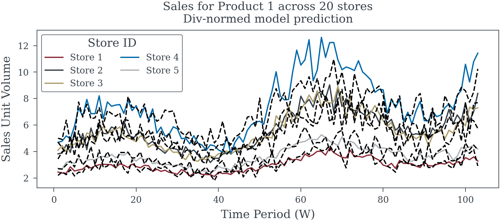
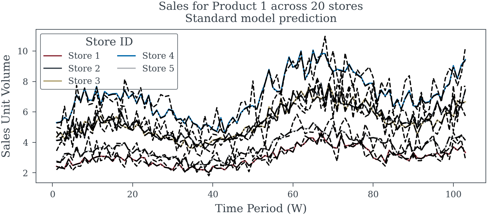
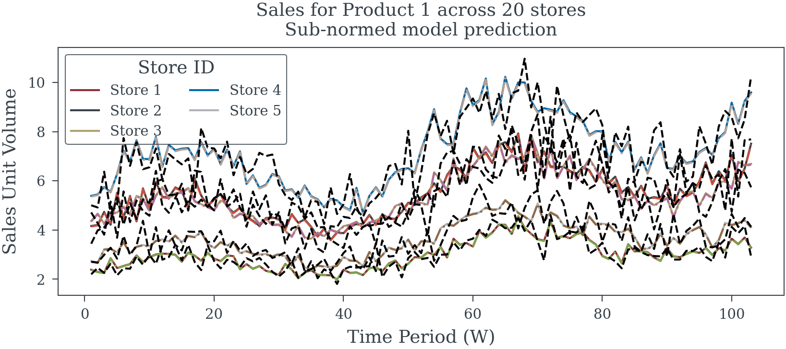
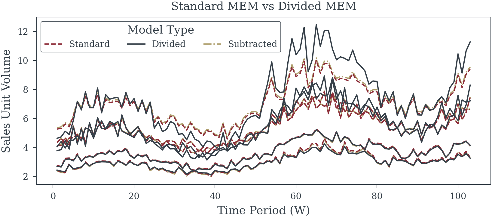

# Centering in Panel Models
Matthew Reda

<!-- WARNING: THIS FILE WAS AUTOGENERATED! DO NOT EDIT! -->

``` python
sales_demo_data
```

<div><svg style="position: absolute; width: 0; height: 0; overflow: hidden">
<defs>
<symbol id="icon-database" viewBox="0 0 32 32">
<path d="M16 0c-8.837 0-16 2.239-16 5v4c0 2.761 7.163 5 16 5s16-2.239 16-5v-4c0-2.761-7.163-5-16-5z"></path>
<path d="M16 17c-8.837 0-16-2.239-16-5v6c0 2.761 7.163 5 16 5s16-2.239 16-5v-6c0 2.761-7.163 5-16 5z"></path>
<path d="M16 26c-8.837 0-16-2.239-16-5v6c0 2.761 7.163 5 16 5s16-2.239 16-5v-6c0 2.761-7.163 5-16 5z"></path>
</symbol>
<symbol id="icon-file-text2" viewBox="0 0 32 32">
<path d="M28.681 7.159c-0.694-0.947-1.662-2.053-2.724-3.116s-2.169-2.030-3.116-2.724c-1.612-1.182-2.393-1.319-2.841-1.319h-15.5c-1.378 0-2.5 1.121-2.5 2.5v27c0 1.378 1.122 2.5 2.5 2.5h23c1.378 0 2.5-1.122 2.5-2.5v-19.5c0-0.448-0.137-1.23-1.319-2.841zM24.543 5.457c0.959 0.959 1.712 1.825 2.268 2.543h-4.811v-4.811c0.718 0.556 1.584 1.309 2.543 2.268zM28 29.5c0 0.271-0.229 0.5-0.5 0.5h-23c-0.271 0-0.5-0.229-0.5-0.5v-27c0-0.271 0.229-0.5 0.5-0.5 0 0 15.499-0 15.5 0v7c0 0.552 0.448 1 1 1h7v19.5z"></path>
<path d="M23 26h-14c-0.552 0-1-0.448-1-1s0.448-1 1-1h14c0.552 0 1 0.448 1 1s-0.448 1-1 1z"></path>
<path d="M23 22h-14c-0.552 0-1-0.448-1-1s0.448-1 1-1h14c0.552 0 1 0.448 1 1s-0.448 1-1 1z"></path>
<path d="M23 18h-14c-0.552 0-1-0.448-1-1s0.448-1 1-1h14c0.552 0 1 0.448 1 1s-0.448 1-1 1z"></path>
</symbol>
</defs>
</svg>
<style>/* CSS stylesheet for displaying xarray objects in jupyterlab.
 *
 */
&#10;:root {
  --xr-font-color0: var(--jp-content-font-color0, rgba(0, 0, 0, 1));
  --xr-font-color2: var(--jp-content-font-color2, rgba(0, 0, 0, 0.54));
  --xr-font-color3: var(--jp-content-font-color3, rgba(0, 0, 0, 0.38));
  --xr-border-color: var(--jp-border-color2, #e0e0e0);
  --xr-disabled-color: var(--jp-layout-color3, #bdbdbd);
  --xr-background-color: var(--jp-layout-color0, white);
  --xr-background-color-row-even: var(--jp-layout-color1, white);
  --xr-background-color-row-odd: var(--jp-layout-color2, #eeeeee);
}
&#10;html[theme="dark"],
html[data-theme="dark"],
body[data-theme="dark"],
body.vscode-dark {
  --xr-font-color0: rgba(255, 255, 255, 1);
  --xr-font-color2: rgba(255, 255, 255, 0.54);
  --xr-font-color3: rgba(255, 255, 255, 0.38);
  --xr-border-color: #1f1f1f;
  --xr-disabled-color: #515151;
  --xr-background-color: #111111;
  --xr-background-color-row-even: #111111;
  --xr-background-color-row-odd: #313131;
}
&#10;.xr-wrap {
  display: block !important;
  min-width: 300px;
  max-width: 700px;
}
&#10;.xr-text-repr-fallback {
  /* fallback to plain text repr when CSS is not injected (untrusted notebook) */
  display: none;
}
&#10;.xr-header {
  padding-top: 6px;
  padding-bottom: 6px;
  margin-bottom: 4px;
  border-bottom: solid 1px var(--xr-border-color);
}
&#10;.xr-header > div,
.xr-header > ul {
  display: inline;
  margin-top: 0;
  margin-bottom: 0;
}
&#10;.xr-obj-type,
.xr-array-name {
  margin-left: 2px;
  margin-right: 10px;
}
&#10;.xr-obj-type {
  color: var(--xr-font-color2);
}
&#10;.xr-sections {
  padding-left: 0 !important;
  display: grid;
  grid-template-columns: 150px auto auto 1fr 0 20px 0 20px;
}
&#10;.xr-section-item {
  display: contents;
}
&#10;.xr-section-item input {
  display: inline-block;
  opacity: 0;
  height: 0;
}
&#10;.xr-section-item input + label {
  color: var(--xr-disabled-color);
}
&#10;.xr-section-item input:enabled + label {
  cursor: pointer;
  color: var(--xr-font-color2);
}
&#10;.xr-section-item input:focus + label {
  border: 2px solid var(--xr-font-color0);
}
&#10;.xr-section-item input:enabled + label:hover {
  color: var(--xr-font-color0);
}
&#10;.xr-section-summary {
  grid-column: 1;
  color: var(--xr-font-color2);
  font-weight: 500;
}
&#10;.xr-section-summary > span {
  display: inline-block;
  padding-left: 0.5em;
}
&#10;.xr-section-summary-in:disabled + label {
  color: var(--xr-font-color2);
}
&#10;.xr-section-summary-in + label:before {
  display: inline-block;
  content: "►";
  font-size: 11px;
  width: 15px;
  text-align: center;
}
&#10;.xr-section-summary-in:disabled + label:before {
  color: var(--xr-disabled-color);
}
&#10;.xr-section-summary-in:checked + label:before {
  content: "▼";
}
&#10;.xr-section-summary-in:checked + label > span {
  display: none;
}
&#10;.xr-section-summary,
.xr-section-inline-details {
  padding-top: 4px;
  padding-bottom: 4px;
}
&#10;.xr-section-inline-details {
  grid-column: 2 / -1;
}
&#10;.xr-section-details {
  display: none;
  grid-column: 1 / -1;
  margin-bottom: 5px;
}
&#10;.xr-section-summary-in:checked ~ .xr-section-details {
  display: contents;
}
&#10;.xr-array-wrap {
  grid-column: 1 / -1;
  display: grid;
  grid-template-columns: 20px auto;
}
&#10;.xr-array-wrap > label {
  grid-column: 1;
  vertical-align: top;
}
&#10;.xr-preview {
  color: var(--xr-font-color3);
}
&#10;.xr-array-preview,
.xr-array-data {
  padding: 0 5px !important;
  grid-column: 2;
}
&#10;.xr-array-data,
.xr-array-in:checked ~ .xr-array-preview {
  display: none;
}
&#10;.xr-array-in:checked ~ .xr-array-data,
.xr-array-preview {
  display: inline-block;
}
&#10;.xr-dim-list {
  display: inline-block !important;
  list-style: none;
  padding: 0 !important;
  margin: 0;
}
&#10;.xr-dim-list li {
  display: inline-block;
  padding: 0;
  margin: 0;
}
&#10;.xr-dim-list:before {
  content: "(";
}
&#10;.xr-dim-list:after {
  content: ")";
}
&#10;.xr-dim-list li:not(:last-child):after {
  content: ",";
  padding-right: 5px;
}
&#10;.xr-has-index {
  font-weight: bold;
}
&#10;.xr-var-list,
.xr-var-item {
  display: contents;
}
&#10;.xr-var-item > div,
.xr-var-item label,
.xr-var-item > .xr-var-name span {
  background-color: var(--xr-background-color-row-even);
  margin-bottom: 0;
}
&#10;.xr-var-item > .xr-var-name:hover span {
  padding-right: 5px;
}
&#10;.xr-var-list > li:nth-child(odd) > div,
.xr-var-list > li:nth-child(odd) > label,
.xr-var-list > li:nth-child(odd) > .xr-var-name span {
  background-color: var(--xr-background-color-row-odd);
}
&#10;.xr-var-name {
  grid-column: 1;
}
&#10;.xr-var-dims {
  grid-column: 2;
}
&#10;.xr-var-dtype {
  grid-column: 3;
  text-align: right;
  color: var(--xr-font-color2);
}
&#10;.xr-var-preview {
  grid-column: 4;
}
&#10;.xr-index-preview {
  grid-column: 2 / 5;
  color: var(--xr-font-color2);
}
&#10;.xr-var-name,
.xr-var-dims,
.xr-var-dtype,
.xr-preview,
.xr-attrs dt {
  white-space: nowrap;
  overflow: hidden;
  text-overflow: ellipsis;
  padding-right: 10px;
}
&#10;.xr-var-name:hover,
.xr-var-dims:hover,
.xr-var-dtype:hover,
.xr-attrs dt:hover {
  overflow: visible;
  width: auto;
  z-index: 1;
}
&#10;.xr-var-attrs,
.xr-var-data,
.xr-index-data {
  display: none;
  background-color: var(--xr-background-color) !important;
  padding-bottom: 5px !important;
}
&#10;.xr-var-attrs-in:checked ~ .xr-var-attrs,
.xr-var-data-in:checked ~ .xr-var-data,
.xr-index-data-in:checked ~ .xr-index-data {
  display: block;
}
&#10;.xr-var-data > table {
  float: right;
}
&#10;.xr-var-name span,
.xr-var-data,
.xr-index-name div,
.xr-index-data,
.xr-attrs {
  padding-left: 25px !important;
}
&#10;.xr-attrs,
.xr-var-attrs,
.xr-var-data,
.xr-index-data {
  grid-column: 1 / -1;
}
&#10;dl.xr-attrs {
  padding: 0;
  margin: 0;
  display: grid;
  grid-template-columns: 125px auto;
}
&#10;.xr-attrs dt,
.xr-attrs dd {
  padding: 0;
  margin: 0;
  float: left;
  padding-right: 10px;
  width: auto;
}
&#10;.xr-attrs dt {
  font-weight: normal;
  grid-column: 1;
}
&#10;.xr-attrs dt:hover span {
  display: inline-block;
  background: var(--xr-background-color);
  padding-right: 10px;
}
&#10;.xr-attrs dd {
  grid-column: 2;
  white-space: pre-wrap;
  word-break: break-all;
}
&#10;.xr-icon-database,
.xr-icon-file-text2,
.xr-no-icon {
  display: inline-block;
  vertical-align: middle;
  width: 1em;
  height: 1.5em !important;
  stroke-width: 0;
  stroke: currentColor;
  fill: currentColor;
}
</style><pre class='xr-text-repr-fallback'>&lt;xarray.Dataset&gt; Size: 76kB
Dimensions:      (store_id: 20, time_period: 156, product_id: 1)
Coordinates:
  * store_id     (store_id) int64 160B 1 2 3 4 5 6 7 8 ... 14 15 16 17 18 19 20
  * time_period  (time_period) int64 1kB 1 2 3 4 5 6 ... 151 152 153 154 155 156
  * product_id   (product_id) int64 8B 1
Data variables:
    sales        (store_id, time_period, product_id) float64 25kB 2.2 ... 10.04
    covariate_1  (store_id, time_period, product_id) float64 25kB 0.4296 ... ...
    covariate_2  (store_id, time_period, product_id) float64 25kB 0.6666 ... ...
Attributes:
    betas:                       [-0.01237172  0.07431322]
    seasonality_amplitude:       0.22150897038028766
    trend_slope:                 0.005464504127199977
    store_effects:               [-0.44475205  0.12756087  0.11161652  0.4042...
    base_log_sales_per_product:  [1.24908024]</pre><div class='xr-wrap' style='display:none'><div class='xr-header'><div class='xr-obj-type'>xarray.Dataset</div></div><ul class='xr-sections'><li class='xr-section-item'><input id='section-f503a403-a440-4b10-9003-faf627855a3d' class='xr-section-summary-in' type='checkbox' disabled ><label for='section-f503a403-a440-4b10-9003-faf627855a3d' class='xr-section-summary'  title='Expand/collapse section'>Dimensions:</label><div class='xr-section-inline-details'><ul class='xr-dim-list'><li><span class='xr-has-index'>store_id</span>: 20</li><li><span class='xr-has-index'>time_period</span>: 156</li><li><span class='xr-has-index'>product_id</span>: 1</li></ul></div><div class='xr-section-details'></div></li><li class='xr-section-item'><input id='section-8821a865-30bf-4d0d-a4a3-6404741201d4' class='xr-section-summary-in' type='checkbox'  checked><label for='section-8821a865-30bf-4d0d-a4a3-6404741201d4' class='xr-section-summary' >Coordinates: <span>(3)</span></label><div class='xr-section-inline-details'></div><div class='xr-section-details'><ul class='xr-var-list'><li class='xr-var-item'><div class='xr-var-name'><span class='xr-has-index'>store_id</span></div><div class='xr-var-dims'>(store_id)</div><div class='xr-var-dtype'>int64</div><div class='xr-var-preview xr-preview'>1 2 3 4 5 6 7 ... 15 16 17 18 19 20</div><input id='attrs-6d2339ee-0aff-4f8f-addc-91f2d2fb728c' class='xr-var-attrs-in' type='checkbox' disabled><label for='attrs-6d2339ee-0aff-4f8f-addc-91f2d2fb728c' title='Show/Hide attributes'><svg class='icon xr-icon-file-text2'><use xlink:href='#icon-file-text2'></use></svg></label><input id='data-aa90a504-156b-4e08-9125-2bc3bf9f8965' class='xr-var-data-in' type='checkbox'><label for='data-aa90a504-156b-4e08-9125-2bc3bf9f8965' title='Show/Hide data repr'><svg class='icon xr-icon-database'><use xlink:href='#icon-database'></use></svg></label><div class='xr-var-attrs'><dl class='xr-attrs'></dl></div><div class='xr-var-data'><pre>array([ 1,  2,  3,  4,  5,  6,  7,  8,  9, 10, 11, 12, 13, 14, 15, 16, 17, 18,
       19, 20])</pre></div></li><li class='xr-var-item'><div class='xr-var-name'><span class='xr-has-index'>time_period</span></div><div class='xr-var-dims'>(time_period)</div><div class='xr-var-dtype'>int64</div><div class='xr-var-preview xr-preview'>1 2 3 4 5 6 ... 152 153 154 155 156</div><input id='attrs-723f266a-d25c-437d-a046-f6ce7248a10b' class='xr-var-attrs-in' type='checkbox' disabled><label for='attrs-723f266a-d25c-437d-a046-f6ce7248a10b' title='Show/Hide attributes'><svg class='icon xr-icon-file-text2'><use xlink:href='#icon-file-text2'></use></svg></label><input id='data-25eac520-bea8-4e73-9f45-5be9b43193c3' class='xr-var-data-in' type='checkbox'><label for='data-25eac520-bea8-4e73-9f45-5be9b43193c3' title='Show/Hide data repr'><svg class='icon xr-icon-database'><use xlink:href='#icon-database'></use></svg></label><div class='xr-var-attrs'><dl class='xr-attrs'></dl></div><div class='xr-var-data'><pre>array([  1,   2,   3,   4,   5,   6,   7,   8,   9,  10,  11,  12,  13,  14,
        15,  16,  17,  18,  19,  20,  21,  22,  23,  24,  25,  26,  27,  28,
        29,  30,  31,  32,  33,  34,  35,  36,  37,  38,  39,  40,  41,  42,
        43,  44,  45,  46,  47,  48,  49,  50,  51,  52,  53,  54,  55,  56,
        57,  58,  59,  60,  61,  62,  63,  64,  65,  66,  67,  68,  69,  70,
        71,  72,  73,  74,  75,  76,  77,  78,  79,  80,  81,  82,  83,  84,
        85,  86,  87,  88,  89,  90,  91,  92,  93,  94,  95,  96,  97,  98,
        99, 100, 101, 102, 103, 104, 105, 106, 107, 108, 109, 110, 111, 112,
       113, 114, 115, 116, 117, 118, 119, 120, 121, 122, 123, 124, 125, 126,
       127, 128, 129, 130, 131, 132, 133, 134, 135, 136, 137, 138, 139, 140,
       141, 142, 143, 144, 145, 146, 147, 148, 149, 150, 151, 152, 153, 154,
       155, 156])</pre></div></li><li class='xr-var-item'><div class='xr-var-name'><span class='xr-has-index'>product_id</span></div><div class='xr-var-dims'>(product_id)</div><div class='xr-var-dtype'>int64</div><div class='xr-var-preview xr-preview'>1</div><input id='attrs-f7577411-a567-4278-b721-4d1a591cfbf5' class='xr-var-attrs-in' type='checkbox' disabled><label for='attrs-f7577411-a567-4278-b721-4d1a591cfbf5' title='Show/Hide attributes'><svg class='icon xr-icon-file-text2'><use xlink:href='#icon-file-text2'></use></svg></label><input id='data-2e8341bc-f153-45b3-8ec9-4cfacdec561b' class='xr-var-data-in' type='checkbox'><label for='data-2e8341bc-f153-45b3-8ec9-4cfacdec561b' title='Show/Hide data repr'><svg class='icon xr-icon-database'><use xlink:href='#icon-database'></use></svg></label><div class='xr-var-attrs'><dl class='xr-attrs'></dl></div><div class='xr-var-data'><pre>array([1])</pre></div></li></ul></div></li><li class='xr-section-item'><input id='section-5c1d31ed-ff83-451c-9011-48e5b56a66e0' class='xr-section-summary-in' type='checkbox'  checked><label for='section-5c1d31ed-ff83-451c-9011-48e5b56a66e0' class='xr-section-summary' >Data variables: <span>(3)</span></label><div class='xr-section-inline-details'></div><div class='xr-section-details'><ul class='xr-var-list'><li class='xr-var-item'><div class='xr-var-name'><span>sales</span></div><div class='xr-var-dims'>(store_id, time_period, product_id)</div><div class='xr-var-dtype'>float64</div><div class='xr-var-preview xr-preview'>2.2 2.46 2.257 ... 7.872 8.87 10.04</div><input id='attrs-2474ac5f-ef11-426b-baaf-d199b7b66131' class='xr-var-attrs-in' type='checkbox' disabled><label for='attrs-2474ac5f-ef11-426b-baaf-d199b7b66131' title='Show/Hide attributes'><svg class='icon xr-icon-file-text2'><use xlink:href='#icon-file-text2'></use></svg></label><input id='data-8fd693b2-f592-454e-b3ad-a9e382e7430b' class='xr-var-data-in' type='checkbox'><label for='data-8fd693b2-f592-454e-b3ad-a9e382e7430b' title='Show/Hide data repr'><svg class='icon xr-icon-database'><use xlink:href='#icon-database'></use></svg></label><div class='xr-var-attrs'><dl class='xr-attrs'></dl></div><div class='xr-var-data'><pre>array([[[ 2.20014538],
        [ 2.46006697],
        [ 2.25713195],
        ...,
        [ 4.99957635],
        [ 6.54083394],
        [ 5.98004403]],
&#10;       [[ 3.44366332],
        [ 3.98512642],
        [ 4.10876074],
        ...,
        [ 7.9728716 ],
        [ 9.49967535],
        [ 9.83488601]],
&#10;       [[ 4.71521497],
        [ 4.27953578],
        [ 3.81123469],
        ...,
...
        ...,
        [ 8.74263671],
        [ 8.43012539],
        [10.71933388]],
&#10;       [[ 9.16110797],
        [11.47300089],
        [11.29541857],
        ...,
        [20.25258712],
        [22.9180807 ],
        [21.40687927]],
&#10;       [[ 3.87633769],
        [ 3.76098006],
        [ 4.49038221],
        ...,
        [ 7.87187451],
        [ 8.87007886],
        [10.04150868]]])</pre></div></li><li class='xr-var-item'><div class='xr-var-name'><span>covariate_1</span></div><div class='xr-var-dims'>(store_id, time_period, product_id)</div><div class='xr-var-dtype'>float64</div><div class='xr-var-preview xr-preview'>0.4296 -1.009 ... 0.2061 -0.2842</div><input id='attrs-952e6743-aaa0-4b76-95a0-75af427fd205' class='xr-var-attrs-in' type='checkbox' disabled><label for='attrs-952e6743-aaa0-4b76-95a0-75af427fd205' title='Show/Hide attributes'><svg class='icon xr-icon-file-text2'><use xlink:href='#icon-file-text2'></use></svg></label><input id='data-c2da8f6e-7239-4f64-8829-7fe6143af6e4' class='xr-var-data-in' type='checkbox'><label for='data-c2da8f6e-7239-4f64-8829-7fe6143af6e4' title='Show/Hide data repr'><svg class='icon xr-icon-database'><use xlink:href='#icon-database'></use></svg></label><div class='xr-var-attrs'><dl class='xr-attrs'></dl></div><div class='xr-var-data'><pre>array([[[ 0.42958216],
        [-1.00886032],
        [-1.63511595],
        ...,
        [-0.03117877],
        [ 0.45840429],
        [ 2.14985844]],
&#10;       [[-0.0708224 ],
        [-0.21249966],
        [ 1.11349753],
        ...,
        [-0.92979536],
        [ 0.50266762],
        [-0.29202794]],
&#10;       [[ 1.54458913],
        [ 1.41137034],
        [ 0.00548954],
        ...,
...
        ...,
        [-0.24282971],
        [-2.123726  ],
        [ 0.07961794]],
&#10;       [[-1.80021537],
        [ 1.16170186],
        [-1.37146226],
        ...,
        [ 0.90555776],
        [-0.79729777],
        [-0.24175421]],
&#10;       [[-0.2531813 ],
        [ 0.09395003],
        [-0.35201606],
        ...,
        [-0.88867211],
        [ 0.20608888],
        [-0.284199  ]]])</pre></div></li><li class='xr-var-item'><div class='xr-var-name'><span>covariate_2</span></div><div class='xr-var-dims'>(store_id, time_period, product_id)</div><div class='xr-var-dtype'>float64</div><div class='xr-var-preview xr-preview'>0.6666 -0.5858 ... 0.2851 0.2037</div><input id='attrs-63653c70-1083-45d8-ad5f-999e59e613e9' class='xr-var-attrs-in' type='checkbox' disabled><label for='attrs-63653c70-1083-45d8-ad5f-999e59e613e9' title='Show/Hide attributes'><svg class='icon xr-icon-file-text2'><use xlink:href='#icon-file-text2'></use></svg></label><input id='data-83398758-cca1-4a1c-8871-d76902ac2a82' class='xr-var-data-in' type='checkbox'><label for='data-83398758-cca1-4a1c-8871-d76902ac2a82' title='Show/Hide data repr'><svg class='icon xr-icon-database'><use xlink:href='#icon-database'></use></svg></label><div class='xr-var-attrs'><dl class='xr-attrs'></dl></div><div class='xr-var-data'><pre>array([[[ 0.66657458],
        [-0.58575575],
        [-1.39282621],
        ...,
        [-0.08985905],
        [ 0.23471522],
        [ 2.43593884]],
&#10;       [[-0.00458811],
        [-0.34196549],
        [ 1.11175663],
        ...,
        [-1.21112759],
        [ 0.48983728],
        [-0.02517022]],
&#10;       [[ 1.26184199],
        [ 1.6979829 ],
        [-0.27172106],
        ...,
...
        ...,
        [-0.17222864],
        [-1.81783533],
        [ 0.14365546]],
&#10;       [[-1.47751046],
        [ 1.50453944],
        [-0.87181092],
        ...,
        [ 0.99883275],
        [-0.84396878],
        [-0.34967486]],
&#10;       [[ 0.00729364],
        [ 0.22927749],
        [-0.29032389],
        ...,
        [-1.06890621],
        [ 0.28512372],
        [ 0.20369718]]])</pre></div></li></ul></div></li><li class='xr-section-item'><input id='section-d63fcec2-5f35-4c5f-a5c9-b3c1b849e0e4' class='xr-section-summary-in' type='checkbox'  ><label for='section-d63fcec2-5f35-4c5f-a5c9-b3c1b849e0e4' class='xr-section-summary' >Indexes: <span>(3)</span></label><div class='xr-section-inline-details'></div><div class='xr-section-details'><ul class='xr-var-list'><li class='xr-var-item'><div class='xr-index-name'><div>store_id</div></div><div class='xr-index-preview'>PandasIndex</div><input type='checkbox' disabled/><label></label><input id='index-de9432d5-eafa-4232-a0fb-c4a220d6337f' class='xr-index-data-in' type='checkbox'/><label for='index-de9432d5-eafa-4232-a0fb-c4a220d6337f' title='Show/Hide index repr'><svg class='icon xr-icon-database'><use xlink:href='#icon-database'></use></svg></label><div class='xr-index-data'><pre>PandasIndex(Index([1, 2, 3, 4, 5, 6, 7, 8, 9, 10, 11, 12, 13, 14, 15, 16, 17, 18, 19, 20], dtype=&#x27;int64&#x27;, name=&#x27;store_id&#x27;))</pre></div></li><li class='xr-var-item'><div class='xr-index-name'><div>time_period</div></div><div class='xr-index-preview'>PandasIndex</div><input type='checkbox' disabled/><label></label><input id='index-4933c23d-5bb9-4ed1-81e4-d6a100b1f077' class='xr-index-data-in' type='checkbox'/><label for='index-4933c23d-5bb9-4ed1-81e4-d6a100b1f077' title='Show/Hide index repr'><svg class='icon xr-icon-database'><use xlink:href='#icon-database'></use></svg></label><div class='xr-index-data'><pre>PandasIndex(Index([  1,   2,   3,   4,   5,   6,   7,   8,   9,  10,
       ...
       147, 148, 149, 150, 151, 152, 153, 154, 155, 156],
      dtype=&#x27;int64&#x27;, name=&#x27;time_period&#x27;, length=156))</pre></div></li><li class='xr-var-item'><div class='xr-index-name'><div>product_id</div></div><div class='xr-index-preview'>PandasIndex</div><input type='checkbox' disabled/><label></label><input id='index-ea438a43-75c6-40d2-8fa4-75658473da70' class='xr-index-data-in' type='checkbox'/><label for='index-ea438a43-75c6-40d2-8fa4-75658473da70' title='Show/Hide index repr'><svg class='icon xr-icon-database'><use xlink:href='#icon-database'></use></svg></label><div class='xr-index-data'><pre>PandasIndex(Index([1], dtype=&#x27;int64&#x27;, name=&#x27;product_id&#x27;))</pre></div></li></ul></div></li><li class='xr-section-item'><input id='section-eebcacc5-c4f7-4a62-83c4-4ac162ee5211' class='xr-section-summary-in' type='checkbox'  checked><label for='section-eebcacc5-c4f7-4a62-83c4-4ac162ee5211' class='xr-section-summary' >Attributes: <span>(5)</span></label><div class='xr-section-inline-details'></div><div class='xr-section-details'><dl class='xr-attrs'><dt><span>betas :</span></dt><dd>[-0.01237172  0.07431322]</dd><dt><span>seasonality_amplitude :</span></dt><dd>0.22150897038028766</dd><dt><span>trend_slope :</span></dt><dd>0.005464504127199977</dd><dt><span>store_effects :</span></dt><dd>[-0.44475205  0.12756087  0.11161652  0.40420611 -0.23235125 -0.21006792
 -0.22855207 -0.36963314 -1.04501961  0.38014787  0.32657803 -0.6095504
 -0.17121843 -0.29696273 -0.28133752 -0.85584826 -0.25178998  0.23908819
  1.02379521  0.15769321]</dd><dt><span>base_log_sales_per_product :</span></dt><dd>[1.24908024]</dd></dl></div></li></ul></div></div>

``` python
time_index = sales_normed.time_period.values.astype(int)

seasonal_control = np.sin(2 * np.pi * time_index / 52)
trend = time_index/52

# Fit a linear regression model
sales_df = sales_demo_data.to_dataframe().reset_index()
control_df = pd.DataFrame({
    'seasonal_control': seasonal_control,
    'trend': trend,
    'time_period': time_index
})
control_df['time_period'] = control_df['time_period']

total_df = sales_df.merge(control_df, on='time_period',  how='left')

train_df = total_df[total_df['time_period'] < 104].copy().set_index(['store_id', 'time_period'])
test_df = total_df[total_df['time_period'] >= 104].copy().set_index(['store_id', 'time_period'])

# Creat the dependent variable and independent variables
X_train = sm.add_constant(train_df[['seasonal_control', 'trend', 'covariate_1', 'covariate_2']])
y_train = np.log(train_df['sales'])
y_train_div = y_train/y_train.groupby('store_id').mean()
y_train_sub = y_train-y_train.groupby('store_id').mean()

# Fit the regression model
ME_model_standard = lm.RandomEffects(y_train, X_train)
ME_model_div = lm.RandomEffects(y_train_div, X_train)
ME_model_sub = lm.RandomEffects(y_train_sub, X_train)

# Fit the model
fitted_model_standard = ME_model_standard.fit()
fitted_model_div = ME_model_div.fit()
fitted_model_sub = ME_model_sub.fit()
```

<div class="panel-tabset">

## Div ‘Normed’ Model



<div>

> **Model Summary**
>
> ``` python
> fitted_model_div.summary
> ```
>
> ``` python
> (sales_demo_data.attrs['betas'][None,:]/y_train.groupby('store_id').mean().values.flatten()[:, None]).mean(axis=0)
> ```
>
>     array([-0.00995315,  0.05978558])
>
> ``` python
> fitted_model_div.variance_decomposition
> ```
>
>     Effects                   0.000000
>     Residual                  0.013185
>     Percent due to Effects    0.000000
>     Name: Variance Decomposition, dtype: float64

</div>

## Standard MEM



<div>

> **Model summary**
>
> ``` python
> fitted_model_standard.summary
> ```
>
> ``` python
> sales_demo_data.attrs['betas']
> ```
>
>     array([-0.01237172,  0.07431322])
>
> ``` python
> fitted_model_standard.variance_decomposition
> ```
>
>     Effects                   0.264310
>     Residual                  0.010396
>     Percent due to Effects    0.962157
>     Name: Variance Decomposition, dtype: float64

</div>

## Dependant Sub-Normalized



<div>

> **Model Summary**
>
> ``` python
> fitted_model_sub.summary
> ```
>
> ``` python
> sales_demo_data.attrs['betas']
> ```
>
>     array([-0.01237172,  0.07431322])
>
> ``` python
> fitted_model_sub.variance_decomposition
> ```
>
>     Effects                   0.000000
>     Residual                  0.010396
>     Percent due to Effects    0.000000
>     Name: Variance Decomposition, dtype: float64

</div>

## Comparison of Normalization



</div>
