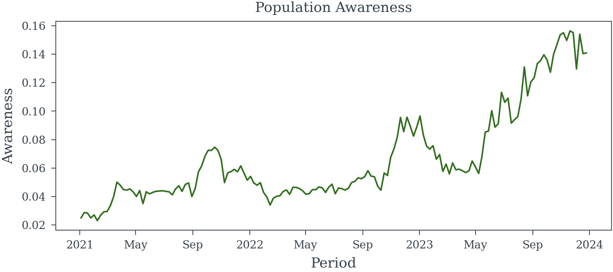
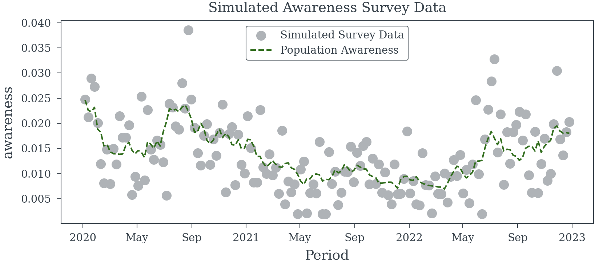
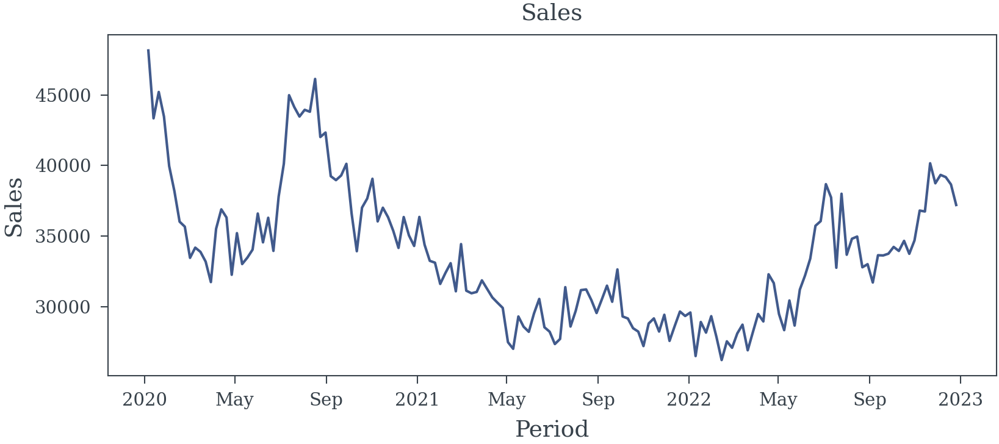
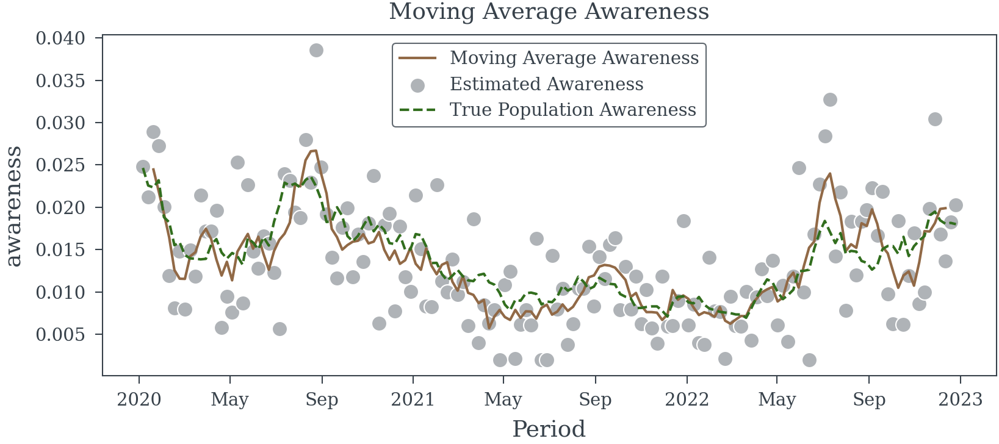
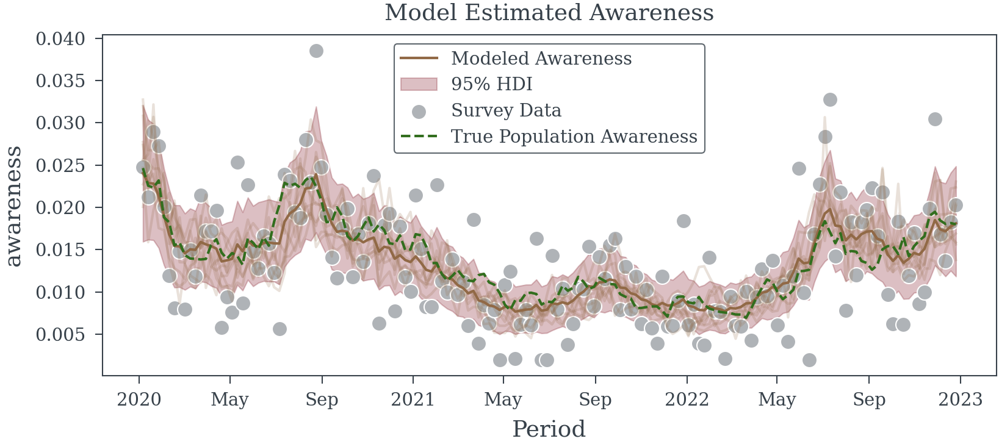

# Sampling Error in Exogenous Variables
Matthew Reda

<!-- WARNING: THIS FILE WAS AUTOGENERATED! DO NOT EDIT! -->

Error in exogenous variables—those not influenced by other variables in
a model—can significantly compromise the integrity of regression
analyses. When these variables are inaccurately measured and the errors
are not properly addressed, several issues may arise:

- **Attenuation Bias**: This occurs when sampling errors lead to biased
  and inconsistent parameter estimates, typically causing the estimated
  coefficients to be closer to zero than their true values (Bound,
  Brown, and Mathiowetz 2001).
- **Reduced Statistical Power**: Sampling errors increase the variance
  of estimators, making it more challenging to detect significant
  relationships between variables.  
- **Misleading Inferences**: Ignoring sampling errors can result in
  incorrect conclusions about the relationships between variables,
  potentially leading to flawed policy decisions or interpretations
  (Bound, Brown, and Mathiowetz 2001).

This website is dedicated to exploring the challenges posed by sampling
errors in exogenous variables within regression models. We provide
comprehensive insights into how these errors can distort results and
discuss effective strategies to mitigate their impact.

By understanding and addressing sampling errors in exogenous variables,
data scientists can enhance the validity and reliability of their
regression analyses.

## Survey Data

When analyzing survey data, it’s crucial to assess the precision of
population parameter estimates. This precision is influenced by factors
such as sample size, sampling design, and measurement error within the
survey data.

## Impact of Sampling Error on Regression Models

Incorporating imprecise measurements into regression models can lead to
biased and inconsistent coefficient estimates. This issue persists even
with unbiased sampling designs and accurate respondent answers. In
survey research, where sample sizes are often limited and sampling
designs complex, measurement errors can significantly affect the
precision of population parameter estimates.

<div id="exm-binary-outcome" class="theorem example">

<span class="theorem-title">**Example 1 (Sampling Error in a Binary
Outcome Variable)**</span> Consider a weekly survey involving
approximately 500 participants, selected randomly to represent the
general population. Participants are asked if they recall seeing a
specific brand’s advertisement, with data collected via phone and online
methods.

Assuming perfect recall accuracy, we aim to estimate the effect of
advertisement recall on the brand’s sales using a simple linear
regression model. To explore this, we can simulate three years of survey
data to analyze the relationship between advertisement recall and sales.

</div>

<div>

> **Helper Functions**
>
> ------------------------------------------------------------------------
>
> <a
> href="https://github.com/redam94/common_regression_issues/blob/main/common_regression_issues/measurement_error.py#L21"
> target="_blank" style="float:right; font-size:smaller">source</a>
>
> ### random_walk_awareness_model
>
> >  random_walk_awareness_model
> >                                   (periods:list|pandas.core.indexes.datetimes.
> >                                   DatetimeIndex|numpy.ndarray)
>
> <table>
> <colgroup>
> <col style="width: 9%" />
> <col style="width: 38%" />
> <col style="width: 52%" />
> </colgroup>
> <thead>
> <tr>
> <th></th>
> <th><strong>Type</strong></th>
> <th><strong>Details</strong></th>
> </tr>
> </thead>
> <tbody>
> <tr>
> <td>periods</td>
> <td>list | pandas.core.indexes.datetimes.DatetimeIndex |
> numpy.ndarray</td>
> <td>Time periods to simulate</td>
> </tr>
> <tr>
> <td><strong>Returns</strong></td>
> <td><strong>Model</strong></td>
> <td><strong>PyMC model for the random walk awareness model</strong></td>
> </tr>
> </tbody>
> </table>
>
> ``` python
> dates = pd.date_range(start='2021-01-01', periods=156, freq='W-MON')
> awareness_model = random_walk_awareness_model(dates)
> starting_awareness = 0.025
> logit_starting_awareness = np.log(starting_awareness/(1-starting_awareness))
> generative_model = pm.do(
>   awareness_model, 
>   {
>     'weekly_variation': .1, 
>     'initial_awareness': logit_starting_awareness,
>     'weekly_shock': .01
>   }
> )
> population_awareness = pm.draw(generative_model['awareness'], random_seed=23)
> population_awareness = xr.DataArray(
>   population_awareness,
>   dims=['Period'],
>   coords={'Period': dates}
> )
> ```
>
> 
>
> ------------------------------------------------------------------------
>
> <a
> href="https://github.com/redam94/common_regression_issues/blob/main/common_regression_issues/measurement_error.py#L43"
> target="_blank" style="float:right; font-size:smaller">source</a>
>
> ### survey_obs_model
>
> >  survey_obs_model (population_awareness:xarray.core.dataarray.DataArray|py
> >                        tensor.tensor.variable.TensorVariable,
> >                        avg_weekly_participants:float=500.0, coords:dict=None,
> >                        model:pymc.model.core.Model=None)
>
> <table>
> <colgroup>
> <col style="width: 6%" />
> <col style="width: 25%" />
> <col style="width: 34%" />
> <col style="width: 34%" />
> </colgroup>
> <thead>
> <tr>
> <th></th>
> <th><strong>Type</strong></th>
> <th><strong>Default</strong></th>
> <th><strong>Details</strong></th>
> </tr>
> </thead>
> <tbody>
> <tr>
> <td>population_awareness</td>
> <td>xarray.core.dataarray.DataArray |
> pytensor.tensor.variable.TensorVariable</td>
> <td></td>
> <td>Population awareness</td>
> </tr>
> <tr>
> <td>avg_weekly_participants</td>
> <td>float</td>
> <td>500.0</td>
> <td>Average number of participants per week</td>
> </tr>
> <tr>
> <td>coords</td>
> <td>dict</td>
> <td>None</td>
> <td>Coordinates for the PyMC model</td>
> </tr>
> <tr>
> <td>model</td>
> <td>Model</td>
> <td>None</td>
> <td>PyMC model to add the survey observation model</td>
> </tr>
> <tr>
> <td><strong>Returns</strong></td>
> <td><strong>Model</strong></td>
> <td></td>
> <td></td>
> </tr>
> </tbody>
> </table>
>
> ------------------------------------------------------------------------
>
> <a
> href="https://github.com/redam94/common_regression_issues/blob/main/common_regression_issues/measurement_error.py#L65"
> target="_blank" style="float:right; font-size:smaller">source</a>
>
> ### simulate_awareness_survey_data
>
> >  simulate_awareness_survey_data (start_date:str='2020-01-01',
> >                                      n_weeks:int=156,
> >                                      avg_weekly_participants:float=500.0,
> >                                      weekly_awareness_variation:float=0.08,
> >                                      starting_population_aware:float=0.025,
> >                                      weekly_shock:float=0.01,
> >                                      random_seed:int=42)
>
> <table>
> <colgroup>
> <col style="width: 6%" />
> <col style="width: 25%" />
> <col style="width: 34%" />
> <col style="width: 34%" />
> </colgroup>
> <thead>
> <tr>
> <th></th>
> <th><strong>Type</strong></th>
> <th><strong>Default</strong></th>
> <th><strong>Details</strong></th>
> </tr>
> </thead>
> <tbody>
> <tr>
> <td>start_date</td>
> <td>str</td>
> <td>2020-01-01</td>
> <td>Start date of the survey data</td>
> </tr>
> <tr>
> <td>n_weeks</td>
> <td>int</td>
> <td>156</td>
> <td>Number of weeks to simulate</td>
> </tr>
> <tr>
> <td>avg_weekly_participants</td>
> <td>float</td>
> <td>500.0</td>
> <td>Average number of participants per week</td>
> </tr>
> <tr>
> <td>weekly_awareness_variation</td>
> <td>float</td>
> <td>0.08</td>
> <td>Std. dev. of gaussian inovations for weekly awareness</td>
> </tr>
> <tr>
> <td>starting_population_aware</td>
> <td>float</td>
> <td>0.025</td>
> <td>Starting population awareness</td>
> </tr>
> <tr>
> <td>weekly_shock</td>
> <td>float</td>
> <td>0.01</td>
> <td>Std. dev. of gaussian noise for weekly deviation from random
> walk</td>
> </tr>
> <tr>
> <td>random_seed</td>
> <td>int</td>
> <td>42</td>
> <td>Random seed for reproducibility</td>
> </tr>
> <tr>
> <td><strong>Returns</strong></td>
> <td><strong>Dataset</strong></td>
> <td></td>
> <td><strong>Simulated awareness survey data as an xarray
> dataset</strong></td>
> </tr>
> </tbody>
> </table>
>
> ------------------------------------------------------------------------
>
> <a
> href="https://github.com/redam94/common_regression_issues/blob/main/common_regression_issues/measurement_error.py#L94"
> target="_blank" style="float:right; font-size:smaller">source</a>
>
> ### plot_survey_sim_data
>
> >  plot_survey_sim_data (data:xarray.core.dataset.Dataset)
>
> <table>
> <colgroup>
> <col style="width: 9%" />
> <col style="width: 38%" />
> <col style="width: 52%" />
> </colgroup>
> <thead>
> <tr>
> <th></th>
> <th><strong>Type</strong></th>
> <th><strong>Details</strong></th>
> </tr>
> </thead>
> <tbody>
> <tr>
> <td>data</td>
> <td>Dataset</td>
> <td>Simulated survey data must contain ‘awareness’ and
> ‘estimated_awareness’ variables</td>
> </tr>
> <tr>
> <td><strong>Returns</strong></td>
> <td><strong>None</strong></td>
> <td><strong>Plot of the simulated survey data</strong></td>
> </tr>
> </tbody>
> </table>

</div>

## Simulation Approach

1.  **Data Generation**: Create a dataset representing weekly survey
    responses over three years, including variables for advertisement
    recall (binary) and corresponding sales figures.
2.  **Model Specification**: Define a linear regression model with sales
    as the dependent variable and advertisement recall as the
    independent variable.
3.  **Analysis**: Fit the model to the simulated data to assess the
    estimated effect of advertisement recall on sales.

#### Generate Survey Responses

``` python
trace = simulate_awareness_survey_data(random_seed=23)
plot_survey_sim_data(trace)
```

    Sampling: [_noise, logit_awareness, n_positive, n_survey_participants]



#### Generate Sales Data

The sales data is simulated using the following equation:

<span id="eq-sales">
$$
\begin{align\*}
log(S_t) &= \beta \text{pop\\awareness}\_t + \alpha + \varepsilon_t \\
\varepsilon_t &\sim \mathcal{N}(0, \sigma^2)
\end{align\*}
 \qquad(1)$$
</span>

Lets see if the true coeff *β* can be estimated using the simulated
data.

``` python
ACTUAL_AWARENESS_COEFF = 30
log_sales = trace.awareness*ACTUAL_AWARENESS_COEFF + 10 + np.random.normal(0, 0.03, trace.awareness.shape)
sales = np.exp(log_sales)
```



### The naive model

Let’s try ignoring the data generation process and fit a simple linear
regression model to the data.

<div class="cell-output cell-output-display">

<table class="simpletable do-not-create-environment cell"
data-quarto-postprocess="true">
<caption>OLS Regression Results</caption>
<tbody>
<tr>
<td data-quarto-table-cell-role="th">Dep. Variable:</td>
<td>awareness</td>
<td data-quarto-table-cell-role="th">R-squared:</td>
<td>0.416</td>
</tr>
<tr>
<td data-quarto-table-cell-role="th">Model:</td>
<td>OLS</td>
<td data-quarto-table-cell-role="th">Adj. R-squared:</td>
<td>0.413</td>
</tr>
<tr>
<td data-quarto-table-cell-role="th">Method:</td>
<td>Least Squares</td>
<td data-quarto-table-cell-role="th">F-statistic:</td>
<td>89.24</td>
</tr>
<tr>
<td data-quarto-table-cell-role="th">Date:</td>
<td>Fri, 17 Jan 2025</td>
<td data-quarto-table-cell-role="th">Prob (F-statistic):</td>
<td>5.44e-17</td>
</tr>
<tr>
<td data-quarto-table-cell-role="th">Time:</td>
<td>03:12:36</td>
<td data-quarto-table-cell-role="th">Log-Likelihood:</td>
<td>131.73</td>
</tr>
<tr>
<td data-quarto-table-cell-role="th">No. Observations:</td>
<td>156</td>
<td data-quarto-table-cell-role="th">AIC:</td>
<td>-259.5</td>
</tr>
<tr>
<td data-quarto-table-cell-role="th">Df Residuals:</td>
<td>154</td>
<td data-quarto-table-cell-role="th">BIC:</td>
<td>-253.4</td>
</tr>
<tr>
<td data-quarto-table-cell-role="th">Df Model:</td>
<td>1</td>
<td data-quarto-table-cell-role="th"></td>
<td></td>
</tr>
<tr>
<td data-quarto-table-cell-role="th">Covariance Type:</td>
<td>HAC</td>
<td data-quarto-table-cell-role="th"></td>
<td></td>
</tr>
</tbody>
</table>

<table class="simpletable do-not-create-environment cell"
data-quarto-postprocess="true">
<tbody>
<tr>
<td></td>
<td data-quarto-table-cell-role="th">coef</td>
<td data-quarto-table-cell-role="th">std err</td>
<td data-quarto-table-cell-role="th">z</td>
<td data-quarto-table-cell-role="th">P&gt;|z|</td>
<td data-quarto-table-cell-role="th">[0.025</td>
<td data-quarto-table-cell-role="th">0.975]</td>
</tr>
<tr>
<td data-quarto-table-cell-role="th">const</td>
<td>10.2451</td>
<td>0.019</td>
<td>540.755</td>
<td>0.000</td>
<td>10.208</td>
<td>10.282</td>
</tr>
<tr>
<td data-quarto-table-cell-role="th">estimated_awareness</td>
<td>12.5093</td>
<td>1.324</td>
<td>9.446</td>
<td>0.000</td>
<td>9.914</td>
<td>15.105</td>
</tr>
</tbody>
</table>

<table class="simpletable do-not-create-environment cell"
data-quarto-postprocess="true">
<tbody>
<tr>
<td data-quarto-table-cell-role="th">Omnibus:</td>
<td>4.668</td>
<td data-quarto-table-cell-role="th">Durbin-Watson:</td>
<td>1.021</td>
</tr>
<tr>
<td data-quarto-table-cell-role="th">Prob(Omnibus):</td>
<td>0.097</td>
<td data-quarto-table-cell-role="th">Jarque-Bera (JB):</td>
<td>3.383</td>
</tr>
<tr>
<td data-quarto-table-cell-role="th">Skew:</td>
<td>0.219</td>
<td data-quarto-table-cell-role="th">Prob(JB):</td>
<td>0.184</td>
</tr>
<tr>
<td data-quarto-table-cell-role="th">Kurtosis:</td>
<td>2.427</td>
<td data-quarto-table-cell-role="th">Cond. No.</td>
<td>142.</td>
</tr>
</tbody>
</table>

<br/><br/>Notes:<br/>[1] Standard Errors are heteroscedasticity and autocorrelation robust (HAC) using 1 lags and without small sample correction

</div>

We can see from the results in
<a href="#tbl-measurement-error" class="quarto-xref">Table 1</a> that
the estimated coefficient is biased. The true coefficient for the effect
of the populations ability to recall the brand’s advertisement on the
brand’s sales is 30. The estimated coefficient is much less.

### Next the simple moving average model

Let’s try a simple moving average model to see if we can improve the
estimate of the coefficient. We will ignore the data generation process
and take the moving average of the estimated awareness directly.



<div class="cell-output cell-output-display">

<table class="simpletable do-not-create-environment cell"
data-quarto-postprocess="true">
<caption>OLS Regression Results</caption>
<tbody>
<tr>
<td data-quarto-table-cell-role="th">Dep. Variable:</td>
<td>awareness</td>
<td data-quarto-table-cell-role="th">R-squared:</td>
<td>0.733</td>
</tr>
<tr>
<td data-quarto-table-cell-role="th">Model:</td>
<td>OLS</td>
<td data-quarto-table-cell-role="th">Adj. R-squared:</td>
<td>0.731</td>
</tr>
<tr>
<td data-quarto-table-cell-role="th">Method:</td>
<td>Least Squares</td>
<td data-quarto-table-cell-role="th">F-statistic:</td>
<td>263.4</td>
</tr>
<tr>
<td data-quarto-table-cell-role="th">Date:</td>
<td>Fri, 17 Jan 2025</td>
<td data-quarto-table-cell-role="th">Prob (F-statistic):</td>
<td>7.67e-35</td>
</tr>
<tr>
<td data-quarto-table-cell-role="th">Time:</td>
<td>03:12:39</td>
<td data-quarto-table-cell-role="th">Log-Likelihood:</td>
<td>192.63</td>
</tr>
<tr>
<td data-quarto-table-cell-role="th">No. Observations:</td>
<td>152</td>
<td data-quarto-table-cell-role="th">AIC:</td>
<td>-381.3</td>
</tr>
<tr>
<td data-quarto-table-cell-role="th">Df Residuals:</td>
<td>150</td>
<td data-quarto-table-cell-role="th">BIC:</td>
<td>-375.2</td>
</tr>
<tr>
<td data-quarto-table-cell-role="th">Df Model:</td>
<td>1</td>
<td data-quarto-table-cell-role="th"></td>
<td></td>
</tr>
<tr>
<td data-quarto-table-cell-role="th">Covariance Type:</td>
<td>HAC</td>
<td data-quarto-table-cell-role="th"></td>
<td></td>
</tr>
</tbody>
</table>

<table class="simpletable do-not-create-environment cell"
data-quarto-postprocess="true">
<tbody>
<tr>
<td></td>
<td data-quarto-table-cell-role="th">coef</td>
<td data-quarto-table-cell-role="th">std err</td>
<td data-quarto-table-cell-role="th">z</td>
<td data-quarto-table-cell-role="th">P&gt;|z|</td>
<td data-quarto-table-cell-role="th">[0.025</td>
<td data-quarto-table-cell-role="th">0.975]</td>
</tr>
<tr>
<td data-quarto-table-cell-role="th">const</td>
<td>10.0966</td>
<td>0.017</td>
<td>580.819</td>
<td>0.000</td>
<td>10.063</td>
<td>10.131</td>
</tr>
<tr>
<td data-quarto-table-cell-role="th">estimated_awareness</td>
<td>23.5746</td>
<td>1.452</td>
<td>16.231</td>
<td>0.000</td>
<td>20.728</td>
<td>26.421</td>
</tr>
</tbody>
</table>

<table class="simpletable do-not-create-environment cell"
data-quarto-postprocess="true">
<tbody>
<tr>
<td data-quarto-table-cell-role="th">Omnibus:</td>
<td>1.668</td>
<td data-quarto-table-cell-role="th">Durbin-Watson:</td>
<td>0.903</td>
</tr>
<tr>
<td data-quarto-table-cell-role="th">Prob(Omnibus):</td>
<td>0.434</td>
<td data-quarto-table-cell-role="th">Jarque-Bera (JB):</td>
<td>1.307</td>
</tr>
<tr>
<td data-quarto-table-cell-role="th">Skew:</td>
<td>0.058</td>
<td data-quarto-table-cell-role="th">Prob(JB):</td>
<td>0.520</td>
</tr>
<tr>
<td data-quarto-table-cell-role="th">Kurtosis:</td>
<td>3.439</td>
<td data-quarto-table-cell-role="th">Cond. No.</td>
<td>209.</td>
</tr>
</tbody>
</table>

<br/><br/>Notes:<br/>[1] Standard Errors are heteroscedasticity and autocorrelation robust (HAC) using 1 lags and without small sample correction

</div>

We can see from
<a href="#tbl-moving-avg-model" class="quarto-xref">Table 2</a> that we
are doing better than the naive model. The estimated coefficient is
closer to the true coefficient. However, the estimated coefficient is
still biased.

### Moving Average (Correctly this time)

Let’s try a moving average model again, but this time we will take the
moving average of the number of survey participants and the number of
positive results before dividing each.

``` python
moving_sum_n_positive = trace.n_positive.rolling(Period=5).sum().shift(Period=-2)
moving_sum_n_participants = trace.n_survey_participants.rolling(Period=5).sum().shift(Period=-2)
moving_avg_awareness = moving_sum_n_positive/moving_sum_n_participants
```


<div class="cell-output cell-output-display">

<table class="simpletable do-not-create-environment cell"
data-quarto-postprocess="true">
<caption>OLS Regression Results</caption>
<tbody>
<tr>
<td data-quarto-table-cell-role="th">Dep. Variable:</td>
<td>awareness</td>
<td data-quarto-table-cell-role="th">R-squared:</td>
<td>0.732</td>
</tr>
<tr>
<td data-quarto-table-cell-role="th">Model:</td>
<td>OLS</td>
<td data-quarto-table-cell-role="th">Adj. R-squared:</td>
<td>0.730</td>
</tr>
<tr>
<td data-quarto-table-cell-role="th">Method:</td>
<td>Least Squares</td>
<td data-quarto-table-cell-role="th">F-statistic:</td>
<td>166.6</td>
</tr>
<tr>
<td data-quarto-table-cell-role="th">Date:</td>
<td>Fri, 17 Jan 2025</td>
<td data-quarto-table-cell-role="th">Prob (F-statistic):</td>
<td>4.18e-26</td>
</tr>
<tr>
<td data-quarto-table-cell-role="th">Time:</td>
<td>03:12:43</td>
<td data-quarto-table-cell-role="th">Log-Likelihood:</td>
<td>192.21</td>
</tr>
<tr>
<td data-quarto-table-cell-role="th">No. Observations:</td>
<td>152</td>
<td data-quarto-table-cell-role="th">AIC:</td>
<td>-380.4</td>
</tr>
<tr>
<td data-quarto-table-cell-role="th">Df Residuals:</td>
<td>150</td>
<td data-quarto-table-cell-role="th">BIC:</td>
<td>-374.4</td>
</tr>
<tr>
<td data-quarto-table-cell-role="th">Df Model:</td>
<td>1</td>
<td data-quarto-table-cell-role="th"></td>
<td></td>
</tr>
<tr>
<td data-quarto-table-cell-role="th">Covariance Type:</td>
<td>HAC</td>
<td data-quarto-table-cell-role="th"></td>
<td></td>
</tr>
</tbody>
</table>

<table class="simpletable do-not-create-environment cell"
data-quarto-postprocess="true">
<tbody>
<tr>
<td></td>
<td data-quarto-table-cell-role="th">coef</td>
<td data-quarto-table-cell-role="th">std err</td>
<td data-quarto-table-cell-role="th">z</td>
<td data-quarto-table-cell-role="th">P&gt;|z|</td>
<td data-quarto-table-cell-role="th">[0.025</td>
<td data-quarto-table-cell-role="th">0.975]</td>
</tr>
<tr>
<td data-quarto-table-cell-role="th">const</td>
<td>10.0953</td>
<td>0.022</td>
<td>463.446</td>
<td>0.000</td>
<td>10.053</td>
<td>10.138</td>
</tr>
<tr>
<td data-quarto-table-cell-role="th">Moving Avg Awareness</td>
<td>23.7208</td>
<td>1.838</td>
<td>12.907</td>
<td>0.000</td>
<td>20.119</td>
<td>27.323</td>
</tr>
</tbody>
</table>

<table class="simpletable do-not-create-environment cell"
data-quarto-postprocess="true">
<tbody>
<tr>
<td data-quarto-table-cell-role="th">Omnibus:</td>
<td>2.137</td>
<td data-quarto-table-cell-role="th">Durbin-Watson:</td>
<td>0.897</td>
</tr>
<tr>
<td data-quarto-table-cell-role="th">Prob(Omnibus):</td>
<td>0.344</td>
<td data-quarto-table-cell-role="th">Jarque-Bera (JB):</td>
<td>1.827</td>
</tr>
<tr>
<td data-quarto-table-cell-role="th">Skew:</td>
<td>0.098</td>
<td data-quarto-table-cell-role="th">Prob(JB):</td>
<td>0.401</td>
</tr>
<tr>
<td data-quarto-table-cell-role="th">Kurtosis:</td>
<td>3.500</td>
<td data-quarto-table-cell-role="th">Cond. No.</td>
<td>210.</td>
</tr>
</tbody>
</table>

<br/><br/>Notes:<br/>[1] Standard Errors are heteroscedasticity and autocorrelation robust (HAC) using 5 lags and without small sample correction

</div>

This model
(<a href="#tbl-corrected-moving-avg" class="quarto-xref">Table 3</a>) is
only slightly better than the simple moving average model. The estimated
coefficient is still biased.

### Latent Variable Model

Let us now try to first estimate the population level awareness using a
bayesian model and then use the estimated population level awareness in
the regression model.

``` python
dates = trace["Period"].values
awareness_model = random_walk_awareness_model(dates)

with awareness_model as survey_model:
    survey_obs_model(awareness_model['awareness'], avg_weekly_participants=500, coords={'Period': dates})
    
with pm.observe(
  pm.do(
    survey_model, 
    {'n_survey_participants': trace.n_survey_participants.values} # apply the number of survey participants
    ), 
  {'n_positive': trace.n_positive.values} # observe the number of positive responses
  ):
    obs_trace = pm.sample(nuts_sampler='nutpie', random_seed=42)
```



<div class="cell-output cell-output-display">

<table class="simpletable do-not-create-environment cell"
data-quarto-postprocess="true">
<caption>OLS Regression Results</caption>
<tbody>
<tr>
<td data-quarto-table-cell-role="th">Dep. Variable:</td>
<td>awareness</td>
<td data-quarto-table-cell-role="th">R-squared:</td>
<td>0.845</td>
</tr>
<tr>
<td data-quarto-table-cell-role="th">Model:</td>
<td>OLS</td>
<td data-quarto-table-cell-role="th">Adj. R-squared:</td>
<td>0.844</td>
</tr>
<tr>
<td data-quarto-table-cell-role="th">Method:</td>
<td>Least Squares</td>
<td data-quarto-table-cell-role="th">F-statistic:</td>
<td>366.1</td>
</tr>
<tr>
<td data-quarto-table-cell-role="th">Date:</td>
<td>Fri, 17 Jan 2025</td>
<td data-quarto-table-cell-role="th">Prob (F-statistic):</td>
<td>1.51e-42</td>
</tr>
<tr>
<td data-quarto-table-cell-role="th">Time:</td>
<td>03:12:57</td>
<td data-quarto-table-cell-role="th">Log-Likelihood:</td>
<td>235.25</td>
</tr>
<tr>
<td data-quarto-table-cell-role="th">No. Observations:</td>
<td>156</td>
<td data-quarto-table-cell-role="th">AIC:</td>
<td>-466.5</td>
</tr>
<tr>
<td data-quarto-table-cell-role="th">Df Residuals:</td>
<td>154</td>
<td data-quarto-table-cell-role="th">BIC:</td>
<td>-460.4</td>
</tr>
<tr>
<td data-quarto-table-cell-role="th">Df Model:</td>
<td>1</td>
<td data-quarto-table-cell-role="th"></td>
<td></td>
</tr>
<tr>
<td data-quarto-table-cell-role="th">Covariance Type:</td>
<td>HAC</td>
<td data-quarto-table-cell-role="th"></td>
<td></td>
</tr>
</tbody>
</table>

<table class="simpletable do-not-create-environment cell"
data-quarto-postprocess="true">
<tbody>
<tr>
<td></td>
<td data-quarto-table-cell-role="th">coef</td>
<td data-quarto-table-cell-role="th">std err</td>
<td data-quarto-table-cell-role="th">z</td>
<td data-quarto-table-cell-role="th">P&gt;|z|</td>
<td data-quarto-table-cell-role="th">[0.025</td>
<td data-quarto-table-cell-role="th">0.975]</td>
</tr>
<tr>
<td data-quarto-table-cell-role="th">const</td>
<td>10.0118</td>
<td>0.019</td>
<td>533.362</td>
<td>0.000</td>
<td>9.975</td>
<td>10.049</td>
</tr>
<tr>
<td data-quarto-table-cell-role="th">awareness</td>
<td>29.9679</td>
<td>1.566</td>
<td>19.135</td>
<td>0.000</td>
<td>26.898</td>
<td>33.037</td>
</tr>
</tbody>
</table>

<table class="simpletable do-not-create-environment cell"
data-quarto-postprocess="true">
<tbody>
<tr>
<td data-quarto-table-cell-role="th">Omnibus:</td>
<td>2.650</td>
<td data-quarto-table-cell-role="th">Durbin-Watson:</td>
<td>1.050</td>
</tr>
<tr>
<td data-quarto-table-cell-role="th">Prob(Omnibus):</td>
<td>0.266</td>
<td data-quarto-table-cell-role="th">Jarque-Bera (JB):</td>
<td>2.187</td>
</tr>
<tr>
<td data-quarto-table-cell-role="th">Skew:</td>
<td>-0.261</td>
<td data-quarto-table-cell-role="th">Prob(JB):</td>
<td>0.335</td>
</tr>
<tr>
<td data-quarto-table-cell-role="th">Kurtosis:</td>
<td>3.252</td>
<td data-quarto-table-cell-role="th">Cond. No.</td>
<td>239.</td>
</tr>
</tbody>
</table>

<br/><br/>Notes:<br/>[1] Standard Errors are heteroscedasticity and autocorrelation robust (HAC) using 5 lags and without small sample correction

</div>

Compared to the previous models the Latent Variable Model is much better
at recovering the ground truth. While the estimated coefficient is still
biased (we haven’t removed all the measurement error), it is much closer
to the true coefficient, than the previous models. Given that the model
can be train quickly on the data and the estimated coefficient is much
closer to the true coefficient, using the latent model is a good choice.

### Using the true awareness

Finally, let’s see how well we can do if we use the true awareness in
the regression model. This is not likely to be possible in practice, but
it should provide a good comparison point.

<div class="cell-output cell-output-display">

<table class="simpletable do-not-create-environment cell"
data-quarto-postprocess="true">
<caption>OLS Regression Results</caption>
<tbody>
<tr>
<td data-quarto-table-cell-role="th">Dep. Variable:</td>
<td>awareness</td>
<td data-quarto-table-cell-role="th">R-squared:</td>
<td>0.957</td>
</tr>
<tr>
<td data-quarto-table-cell-role="th">Model:</td>
<td>OLS</td>
<td data-quarto-table-cell-role="th">Adj. R-squared:</td>
<td>0.957</td>
</tr>
<tr>
<td data-quarto-table-cell-role="th">Method:</td>
<td>Least Squares</td>
<td data-quarto-table-cell-role="th">F-statistic:</td>
<td>4545.</td>
</tr>
<tr>
<td data-quarto-table-cell-role="th">Date:</td>
<td>Fri, 17 Jan 2025</td>
<td data-quarto-table-cell-role="th">Prob (F-statistic):</td>
<td>3.24e-116</td>
</tr>
<tr>
<td data-quarto-table-cell-role="th">Time:</td>
<td>03:13:00</td>
<td data-quarto-table-cell-role="th">Log-Likelihood:</td>
<td>335.30</td>
</tr>
<tr>
<td data-quarto-table-cell-role="th">No. Observations:</td>
<td>156</td>
<td data-quarto-table-cell-role="th">AIC:</td>
<td>-666.6</td>
</tr>
<tr>
<td data-quarto-table-cell-role="th">Df Residuals:</td>
<td>154</td>
<td data-quarto-table-cell-role="th">BIC:</td>
<td>-660.5</td>
</tr>
<tr>
<td data-quarto-table-cell-role="th">Df Model:</td>
<td>1</td>
<td data-quarto-table-cell-role="th"></td>
<td></td>
</tr>
<tr>
<td data-quarto-table-cell-role="th">Covariance Type:</td>
<td>HAC</td>
<td data-quarto-table-cell-role="th"></td>
<td></td>
</tr>
</tbody>
</table>

<table class="simpletable do-not-create-environment cell"
data-quarto-postprocess="true">
<tbody>
<tr>
<td></td>
<td data-quarto-table-cell-role="th">coef</td>
<td data-quarto-table-cell-role="th">std err</td>
<td data-quarto-table-cell-role="th">z</td>
<td data-quarto-table-cell-role="th">P&gt;|z|</td>
<td data-quarto-table-cell-role="th">[0.025</td>
<td data-quarto-table-cell-role="th">0.975]</td>
</tr>
<tr>
<td data-quarto-table-cell-role="th">const</td>
<td>9.9905</td>
<td>0.007</td>
<td>1465.262</td>
<td>0.000</td>
<td>9.977</td>
<td>10.004</td>
</tr>
<tr>
<td data-quarto-table-cell-role="th">awareness</td>
<td>30.7167</td>
<td>0.456</td>
<td>67.415</td>
<td>0.000</td>
<td>29.824</td>
<td>31.610</td>
</tr>
</tbody>
</table>

<table class="simpletable do-not-create-environment cell"
data-quarto-postprocess="true">
<tbody>
<tr>
<td data-quarto-table-cell-role="th">Omnibus:</td>
<td>0.434</td>
<td data-quarto-table-cell-role="th">Durbin-Watson:</td>
<td>2.231</td>
</tr>
<tr>
<td data-quarto-table-cell-role="th">Prob(Omnibus):</td>
<td>0.805</td>
<td data-quarto-table-cell-role="th">Jarque-Bera (JB):</td>
<td>0.372</td>
</tr>
<tr>
<td data-quarto-table-cell-role="th">Skew:</td>
<td>-0.119</td>
<td data-quarto-table-cell-role="th">Prob(JB):</td>
<td>0.830</td>
</tr>
<tr>
<td data-quarto-table-cell-role="th">Kurtosis:</td>
<td>2.973</td>
<td data-quarto-table-cell-role="th">Cond. No.</td>
<td>231.</td>
</tr>
</tbody>
</table>

<br/><br/>Notes:<br/>[1] Standard Errors are heteroscedasticity and autocorrelation robust (HAC) using 5 lags and without small sample correction

</div>

Here we see that not only is the estimate spot on, but the standard
error is also much lower than the other models. The better the measure
of the exogenous variable, the more precise the estimate of the
coefficient we can achieve.

<div id="refs" class="references csl-bib-body hanging-indent"
entry-spacing="0">

<div id="ref-Bound_Brown_Mathiowetz_2001" class="csl-entry">

Bound, John, Charles Brown, and Nancy Mathiowetz. 2001. “Measurement
Error in Survey Data.” In *Handbook of Econometrics*, 3705–3843.
<https://doi.org/10.1016/s1573-4412(01)05012-7>.

</div>

</div>
