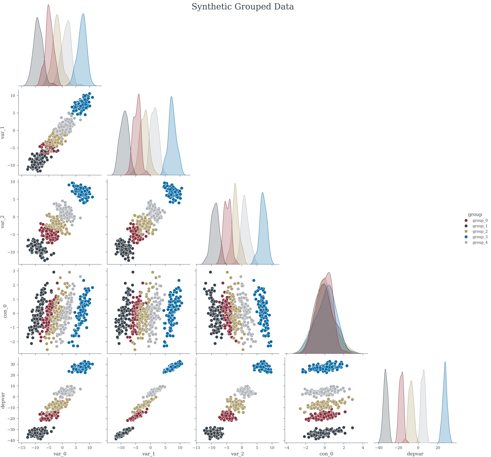

# Grouped Regression Data


<!-- WARNING: THIS FILE WAS AUTOGENERATED! DO NOT EDIT! -->

------------------------------------------------------------------------

<a
href="https://github.com/redam94/common_regression_issues/blob/main/common_regression_issues/synthetic_data/grouped_regression_data.py#L17"
target="_blank" style="float:right; font-size:smaller">source</a>

### generate_grouped_data

>  generate_grouped_data (sample_size:int, n_exogenous_vars:int,
>                             n_confounders:int=0, n_groups:int=1,
>                             n_group_attributes:int=0, group_var:float=3,
>                             noise_sigma:float=1,
>                             random_effect_assumption_satified:bool=True,
>                             random_seed:Optional[int]=None)

*Generate grouped regression data*

<table>
<colgroup>
<col style="width: 6%" />
<col style="width: 25%" />
<col style="width: 34%" />
<col style="width: 34%" />
</colgroup>
<thead>
<tr>
<th></th>
<th><strong>Type</strong></th>
<th><strong>Default</strong></th>
<th><strong>Details</strong></th>
</tr>
</thead>
<tbody>
<tr>
<td>sample_size</td>
<td>int</td>
<td></td>
<td>Number of samples per group</td>
</tr>
<tr>
<td>n_exogenous_vars</td>
<td>int</td>
<td></td>
<td>Number of exogenous variables</td>
</tr>
<tr>
<td>n_confounders</td>
<td>int</td>
<td>0</td>
<td>Number of confounder variables</td>
</tr>
<tr>
<td>n_groups</td>
<td>int</td>
<td>1</td>
<td>Number of independent groups</td>
</tr>
<tr>
<td>n_group_attributes</td>
<td>int</td>
<td>0</td>
<td>Number of group level attributes</td>
</tr>
<tr>
<td>group_var</td>
<td>float</td>
<td>3</td>
<td>Variance between groups</td>
</tr>
<tr>
<td>noise_sigma</td>
<td>float</td>
<td>1</td>
<td>Std of noise for each observation</td>
</tr>
<tr>
<td>random_effect_assumption_satified</td>
<td>bool</td>
<td>True</td>
<td>Is random effect assumption valid</td>
</tr>
<tr>
<td>random_seed</td>
<td>Optional</td>
<td>None</td>
<td></td>
</tr>
<tr>
<td><strong>Returns</strong></td>
<td><strong>Dataset</strong></td>
<td></td>
<td><strong>Synthetic dataset</strong></td>
</tr>
</tbody>
</table>

``` python
data = generate_grouped_data(
    100, 3, 
    n_confounders=1, n_groups=5, 
    random_seed=42, 
    random_effect_assumption_satified=False)
```

``` python
data.head()
```

<div><svg style="position: absolute; width: 0; height: 0; overflow: hidden">
<defs>
<symbol id="icon-database" viewBox="0 0 32 32">
<path d="M16 0c-8.837 0-16 2.239-16 5v4c0 2.761 7.163 5 16 5s16-2.239 16-5v-4c0-2.761-7.163-5-16-5z"></path>
<path d="M16 17c-8.837 0-16-2.239-16-5v6c0 2.761 7.163 5 16 5s16-2.239 16-5v-6c0 2.761-7.163 5-16 5z"></path>
<path d="M16 26c-8.837 0-16-2.239-16-5v6c0 2.761 7.163 5 16 5s16-2.239 16-5v-6c0 2.761-7.163 5-16 5z"></path>
</symbol>
<symbol id="icon-file-text2" viewBox="0 0 32 32">
<path d="M28.681 7.159c-0.694-0.947-1.662-2.053-2.724-3.116s-2.169-2.030-3.116-2.724c-1.612-1.182-2.393-1.319-2.841-1.319h-15.5c-1.378 0-2.5 1.121-2.5 2.5v27c0 1.378 1.122 2.5 2.5 2.5h23c1.378 0 2.5-1.122 2.5-2.5v-19.5c0-0.448-0.137-1.23-1.319-2.841zM24.543 5.457c0.959 0.959 1.712 1.825 2.268 2.543h-4.811v-4.811c0.718 0.556 1.584 1.309 2.543 2.268zM28 29.5c0 0.271-0.229 0.5-0.5 0.5h-23c-0.271 0-0.5-0.229-0.5-0.5v-27c0-0.271 0.229-0.5 0.5-0.5 0 0 15.499-0 15.5 0v7c0 0.552 0.448 1 1 1h7v19.5z"></path>
<path d="M23 26h-14c-0.552 0-1-0.448-1-1s0.448-1 1-1h14c0.552 0 1 0.448 1 1s-0.448 1-1 1z"></path>
<path d="M23 22h-14c-0.552 0-1-0.448-1-1s0.448-1 1-1h14c0.552 0 1 0.448 1 1s-0.448 1-1 1z"></path>
<path d="M23 18h-14c-0.552 0-1-0.448-1-1s0.448-1 1-1h14c0.552 0 1 0.448 1 1s-0.448 1-1 1z"></path>
</symbol>
</defs>
</svg>
<style>/* CSS stylesheet for displaying xarray objects in jupyterlab.
 *
 */
&#10;:root {
  --xr-font-color0: var(--jp-content-font-color0, rgba(0, 0, 0, 1));
  --xr-font-color2: var(--jp-content-font-color2, rgba(0, 0, 0, 0.54));
  --xr-font-color3: var(--jp-content-font-color3, rgba(0, 0, 0, 0.38));
  --xr-border-color: var(--jp-border-color2, #e0e0e0);
  --xr-disabled-color: var(--jp-layout-color3, #bdbdbd);
  --xr-background-color: var(--jp-layout-color0, white);
  --xr-background-color-row-even: var(--jp-layout-color1, white);
  --xr-background-color-row-odd: var(--jp-layout-color2, #eeeeee);
}
&#10;html[theme=dark],
html[data-theme=dark],
body[data-theme=dark],
body.vscode-dark {
  --xr-font-color0: rgba(255, 255, 255, 1);
  --xr-font-color2: rgba(255, 255, 255, 0.54);
  --xr-font-color3: rgba(255, 255, 255, 0.38);
  --xr-border-color: #1F1F1F;
  --xr-disabled-color: #515151;
  --xr-background-color: #111111;
  --xr-background-color-row-even: #111111;
  --xr-background-color-row-odd: #313131;
}
&#10;.xr-wrap {
  display: block !important;
  min-width: 300px;
  max-width: 700px;
}
&#10;.xr-text-repr-fallback {
  /* fallback to plain text repr when CSS is not injected (untrusted notebook) */
  display: none;
}
&#10;.xr-header {
  padding-top: 6px;
  padding-bottom: 6px;
  margin-bottom: 4px;
  border-bottom: solid 1px var(--xr-border-color);
}
&#10;.xr-header > div,
.xr-header > ul {
  display: inline;
  margin-top: 0;
  margin-bottom: 0;
}
&#10;.xr-obj-type,
.xr-array-name {
  margin-left: 2px;
  margin-right: 10px;
}
&#10;.xr-obj-type {
  color: var(--xr-font-color2);
}
&#10;.xr-sections {
  padding-left: 0 !important;
  display: grid;
  grid-template-columns: 150px auto auto 1fr 0 20px 0 20px;
}
&#10;.xr-section-item {
  display: contents;
}
&#10;.xr-section-item input {
  display: inline-block;
  opacity: 0;
}
&#10;.xr-section-item input + label {
  color: var(--xr-disabled-color);
}
&#10;.xr-section-item input:enabled + label {
  cursor: pointer;
  color: var(--xr-font-color2);
}
&#10;.xr-section-item input:focus + label {
  border: 2px solid var(--xr-font-color0);
}
&#10;.xr-section-item input:enabled + label:hover {
  color: var(--xr-font-color0);
}
&#10;.xr-section-summary {
  grid-column: 1;
  color: var(--xr-font-color2);
  font-weight: 500;
}
&#10;.xr-section-summary > span {
  display: inline-block;
  padding-left: 0.5em;
}
&#10;.xr-section-summary-in:disabled + label {
  color: var(--xr-font-color2);
}
&#10;.xr-section-summary-in + label:before {
  display: inline-block;
  content: '►';
  font-size: 11px;
  width: 15px;
  text-align: center;
}
&#10;.xr-section-summary-in:disabled + label:before {
  color: var(--xr-disabled-color);
}
&#10;.xr-section-summary-in:checked + label:before {
  content: '▼';
}
&#10;.xr-section-summary-in:checked + label > span {
  display: none;
}
&#10;.xr-section-summary,
.xr-section-inline-details {
  padding-top: 4px;
  padding-bottom: 4px;
}
&#10;.xr-section-inline-details {
  grid-column: 2 / -1;
}
&#10;.xr-section-details {
  display: none;
  grid-column: 1 / -1;
  margin-bottom: 5px;
}
&#10;.xr-section-summary-in:checked ~ .xr-section-details {
  display: contents;
}
&#10;.xr-array-wrap {
  grid-column: 1 / -1;
  display: grid;
  grid-template-columns: 20px auto;
}
&#10;.xr-array-wrap > label {
  grid-column: 1;
  vertical-align: top;
}
&#10;.xr-preview {
  color: var(--xr-font-color3);
}
&#10;.xr-array-preview,
.xr-array-data {
  padding: 0 5px !important;
  grid-column: 2;
}
&#10;.xr-array-data,
.xr-array-in:checked ~ .xr-array-preview {
  display: none;
}
&#10;.xr-array-in:checked ~ .xr-array-data,
.xr-array-preview {
  display: inline-block;
}
&#10;.xr-dim-list {
  display: inline-block !important;
  list-style: none;
  padding: 0 !important;
  margin: 0;
}
&#10;.xr-dim-list li {
  display: inline-block;
  padding: 0;
  margin: 0;
}
&#10;.xr-dim-list:before {
  content: '(';
}
&#10;.xr-dim-list:after {
  content: ')';
}
&#10;.xr-dim-list li:not(:last-child):after {
  content: ',';
  padding-right: 5px;
}
&#10;.xr-has-index {
  font-weight: bold;
}
&#10;.xr-var-list,
.xr-var-item {
  display: contents;
}
&#10;.xr-var-item > div,
.xr-var-item label,
.xr-var-item > .xr-var-name span {
  background-color: var(--xr-background-color-row-even);
  margin-bottom: 0;
}
&#10;.xr-var-item > .xr-var-name:hover span {
  padding-right: 5px;
}
&#10;.xr-var-list > li:nth-child(odd) > div,
.xr-var-list > li:nth-child(odd) > label,
.xr-var-list > li:nth-child(odd) > .xr-var-name span {
  background-color: var(--xr-background-color-row-odd);
}
&#10;.xr-var-name {
  grid-column: 1;
}
&#10;.xr-var-dims {
  grid-column: 2;
}
&#10;.xr-var-dtype {
  grid-column: 3;
  text-align: right;
  color: var(--xr-font-color2);
}
&#10;.xr-var-preview {
  grid-column: 4;
}
&#10;.xr-index-preview {
  grid-column: 2 / 5;
  color: var(--xr-font-color2);
}
&#10;.xr-var-name,
.xr-var-dims,
.xr-var-dtype,
.xr-preview,
.xr-attrs dt {
  white-space: nowrap;
  overflow: hidden;
  text-overflow: ellipsis;
  padding-right: 10px;
}
&#10;.xr-var-name:hover,
.xr-var-dims:hover,
.xr-var-dtype:hover,
.xr-attrs dt:hover {
  overflow: visible;
  width: auto;
  z-index: 1;
}
&#10;.xr-var-attrs,
.xr-var-data,
.xr-index-data {
  display: none;
  background-color: var(--xr-background-color) !important;
  padding-bottom: 5px !important;
}
&#10;.xr-var-attrs-in:checked ~ .xr-var-attrs,
.xr-var-data-in:checked ~ .xr-var-data,
.xr-index-data-in:checked ~ .xr-index-data {
  display: block;
}
&#10;.xr-var-data > table {
  float: right;
}
&#10;.xr-var-name span,
.xr-var-data,
.xr-index-name div,
.xr-index-data,
.xr-attrs {
  padding-left: 25px !important;
}
&#10;.xr-attrs,
.xr-var-attrs,
.xr-var-data,
.xr-index-data {
  grid-column: 1 / -1;
}
&#10;dl.xr-attrs {
  padding: 0;
  margin: 0;
  display: grid;
  grid-template-columns: 125px auto;
}
&#10;.xr-attrs dt,
.xr-attrs dd {
  padding: 0;
  margin: 0;
  float: left;
  padding-right: 10px;
  width: auto;
}
&#10;.xr-attrs dt {
  font-weight: normal;
  grid-column: 1;
}
&#10;.xr-attrs dt:hover span {
  display: inline-block;
  background: var(--xr-background-color);
  padding-right: 10px;
}
&#10;.xr-attrs dd {
  grid-column: 2;
  white-space: pre-wrap;
  word-break: break-all;
}
&#10;.xr-icon-database,
.xr-icon-file-text2,
.xr-no-icon {
  display: inline-block;
  vertical-align: middle;
  width: 1em;
  height: 1.5em !important;
  stroke-width: 0;
  stroke: currentColor;
  fill: currentColor;
}
</style><pre class='xr-text-repr-fallback'>&lt;xarray.Dataset&gt; Size: 1kB
Dimensions:  (group: 5, index: 5)
Coordinates:
  * group    (group) &lt;U7 140B &#x27;group_0&#x27; &#x27;group_1&#x27; &#x27;group_2&#x27; &#x27;group_3&#x27; &#x27;group_4&#x27;
  * index    (index) int64 40B 0 1 2 3 4
Data variables:
    var_0    (group, index) float64 200B -4.29 -5.247 -3.251 ... 2.224 2.565
    var_1    (group, index) float64 200B -6.002 -6.595 -4.969 ... 3.201 2.787
    var_2    (group, index) float64 200B -6.836 -5.554 -4.949 ... 0.9918 1.975
    con_0    (group, index) float64 200B 0.3047 -1.04 0.7505 ... -0.3937 0.5212
    depvar   (group, index) float64 200B -20.39 -19.84 -17.33 ... 6.005 7.054
Attributes:
    true_alpha:  [[ -9.12693519]\n [-17.69415699]\n [ -3.57316472]\n [ 14.463...
    true_betas:  {&#x27;var_0&#x27;: -0.0102, &#x27;var_1&#x27;: 1.5902, &#x27;var_2&#x27;: 0.1593}</pre><div class='xr-wrap' style='display:none'><div class='xr-header'><div class='xr-obj-type'>xarray.Dataset</div></div><ul class='xr-sections'><li class='xr-section-item'><input id='section-6a301970-4999-421b-9040-8f260afc61e6' class='xr-section-summary-in' type='checkbox' disabled ><label for='section-6a301970-4999-421b-9040-8f260afc61e6' class='xr-section-summary'  title='Expand/collapse section'>Dimensions:</label><div class='xr-section-inline-details'><ul class='xr-dim-list'><li><span class='xr-has-index'>group</span>: 5</li><li><span class='xr-has-index'>index</span>: 5</li></ul></div><div class='xr-section-details'></div></li><li class='xr-section-item'><input id='section-f9358ddd-8fcf-4a1f-a170-a23922f94dc2' class='xr-section-summary-in' type='checkbox'  checked><label for='section-f9358ddd-8fcf-4a1f-a170-a23922f94dc2' class='xr-section-summary' >Coordinates: <span>(2)</span></label><div class='xr-section-inline-details'></div><div class='xr-section-details'><ul class='xr-var-list'><li class='xr-var-item'><div class='xr-var-name'><span class='xr-has-index'>group</span></div><div class='xr-var-dims'>(group)</div><div class='xr-var-dtype'>&lt;U7</div><div class='xr-var-preview xr-preview'>&#x27;group_0&#x27; &#x27;group_1&#x27; ... &#x27;group_4&#x27;</div><input id='attrs-ca9474a6-f9cf-4d97-8cf0-e666c1cf9e7d' class='xr-var-attrs-in' type='checkbox' disabled><label for='attrs-ca9474a6-f9cf-4d97-8cf0-e666c1cf9e7d' title='Show/Hide attributes'><svg class='icon xr-icon-file-text2'><use xlink:href='#icon-file-text2'></use></svg></label><input id='data-848f57d8-e371-4ca4-8e16-4d8d697bdf0c' class='xr-var-data-in' type='checkbox'><label for='data-848f57d8-e371-4ca4-8e16-4d8d697bdf0c' title='Show/Hide data repr'><svg class='icon xr-icon-database'><use xlink:href='#icon-database'></use></svg></label><div class='xr-var-attrs'><dl class='xr-attrs'></dl></div><div class='xr-var-data'><pre>array([&#x27;group_0&#x27;, &#x27;group_1&#x27;, &#x27;group_2&#x27;, &#x27;group_3&#x27;, &#x27;group_4&#x27;], dtype=&#x27;&lt;U7&#x27;)</pre></div></li><li class='xr-var-item'><div class='xr-var-name'><span class='xr-has-index'>index</span></div><div class='xr-var-dims'>(index)</div><div class='xr-var-dtype'>int64</div><div class='xr-var-preview xr-preview'>0 1 2 3 4</div><input id='attrs-350f6d8d-86a6-40d9-affc-8d2e4596ea34' class='xr-var-attrs-in' type='checkbox' disabled><label for='attrs-350f6d8d-86a6-40d9-affc-8d2e4596ea34' title='Show/Hide attributes'><svg class='icon xr-icon-file-text2'><use xlink:href='#icon-file-text2'></use></svg></label><input id='data-77e6b64d-68b2-46b6-85c1-f27bae6a98dd' class='xr-var-data-in' type='checkbox'><label for='data-77e6b64d-68b2-46b6-85c1-f27bae6a98dd' title='Show/Hide data repr'><svg class='icon xr-icon-database'><use xlink:href='#icon-database'></use></svg></label><div class='xr-var-attrs'><dl class='xr-attrs'></dl></div><div class='xr-var-data'><pre>array([0, 1, 2, 3, 4])</pre></div></li></ul></div></li><li class='xr-section-item'><input id='section-9106f780-9610-466c-b583-00eff6293562' class='xr-section-summary-in' type='checkbox'  checked><label for='section-9106f780-9610-466c-b583-00eff6293562' class='xr-section-summary' >Data variables: <span>(5)</span></label><div class='xr-section-inline-details'></div><div class='xr-section-details'><ul class='xr-var-list'><li class='xr-var-item'><div class='xr-var-name'><span>var_0</span></div><div class='xr-var-dims'>(group, index)</div><div class='xr-var-dtype'>float64</div><div class='xr-var-preview xr-preview'>-4.29 -5.247 -3.251 ... 2.224 2.565</div><input id='attrs-a215e848-c364-4c83-8acf-a064ef33a1c0' class='xr-var-attrs-in' type='checkbox' disabled><label for='attrs-a215e848-c364-4c83-8acf-a064ef33a1c0' title='Show/Hide attributes'><svg class='icon xr-icon-file-text2'><use xlink:href='#icon-file-text2'></use></svg></label><input id='data-36aa72e8-5fe6-489a-90e3-183b20c3d6c4' class='xr-var-data-in' type='checkbox'><label for='data-36aa72e8-5fe6-489a-90e3-183b20c3d6c4' title='Show/Hide data repr'><svg class='icon xr-icon-database'><use xlink:href='#icon-database'></use></svg></label><div class='xr-var-attrs'><dl class='xr-attrs'></dl></div><div class='xr-var-data'><pre>array([[ -4.28993336,  -5.24701375,  -3.25126756,  -2.66829812,  -7.96874031],
       [ -8.87000995,  -7.83520097, -10.5691001 ,  -7.08088071,  -9.83225184],
       [ -1.49435767,  -0.23375686,  -3.03502379,  -2.62791234,  -4.05308145],
       [  9.05369034,   4.48173864,   8.6913756 ,   6.35172464,   7.36224679],
       [  0.45741539,   2.58032894,   3.60114386,   2.22384135,   2.56476205]])</pre></div></li><li class='xr-var-item'><div class='xr-var-name'><span>var_1</span></div><div class='xr-var-dims'>(group, index)</div><div class='xr-var-dtype'>float64</div><div class='xr-var-preview xr-preview'>-6.002 -6.595 ... 3.201 2.787</div><input id='attrs-a747580e-683a-4f25-836d-54cbc1362562' class='xr-var-attrs-in' type='checkbox' disabled><label for='attrs-a747580e-683a-4f25-836d-54cbc1362562' title='Show/Hide attributes'><svg class='icon xr-icon-file-text2'><use xlink:href='#icon-file-text2'></use></svg></label><input id='data-340e29b5-be01-4653-847c-1ef5ee44291c' class='xr-var-data-in' type='checkbox'><label for='data-340e29b5-be01-4653-847c-1ef5ee44291c' title='Show/Hide data repr'><svg class='icon xr-icon-database'><use xlink:href='#icon-database'></use></svg></label><div class='xr-var-attrs'><dl class='xr-attrs'></dl></div><div class='xr-var-data'><pre>array([[-6.00174201, -6.59544669, -4.96867735, -3.7252721 , -6.63981273],
       [-9.37953311, -7.53548951, -9.04050391, -7.00667713, -9.99760142],
       [-2.35404051, -3.3344299 , -3.23959722, -3.17685254, -6.02774525],
       [ 9.15203236,  6.39415109,  9.81129207,  6.70474757,  7.5229281 ],
       [ 2.42470019,  2.86860677,  1.20691427,  3.20135074,  2.78657969]])</pre></div></li><li class='xr-var-item'><div class='xr-var-name'><span>var_2</span></div><div class='xr-var-dims'>(group, index)</div><div class='xr-var-dtype'>float64</div><div class='xr-var-preview xr-preview'>-6.836 -5.554 ... 0.9918 1.975</div><input id='attrs-54454997-e0e1-4443-ae8a-b7216b74fcd5' class='xr-var-attrs-in' type='checkbox' disabled><label for='attrs-54454997-e0e1-4443-ae8a-b7216b74fcd5' title='Show/Hide attributes'><svg class='icon xr-icon-file-text2'><use xlink:href='#icon-file-text2'></use></svg></label><input id='data-03746454-f818-42b6-8c70-a859fecde4fd' class='xr-var-data-in' type='checkbox'><label for='data-03746454-f818-42b6-8c70-a859fecde4fd' title='Show/Hide data repr'><svg class='icon xr-icon-database'><use xlink:href='#icon-database'></use></svg></label><div class='xr-var-attrs'><dl class='xr-attrs'></dl></div><div class='xr-var-data'><pre>array([[ -6.83612943,  -5.5535033 ,  -4.94906834,  -6.01101911,  -1.90366831],
       [ -8.44989128, -10.41341108,  -8.01211621,  -6.4169537 ,  -9.90583764],
       [ -2.29872482,  -3.96801742,  -1.88125553,  -2.98965978,  -0.99604602],
       [  5.95186917,   8.47554027,   6.11814611,   8.10250144,   8.17854086],
       [ -1.46338471,   2.3732775 ,  -2.31343828,   0.99178827,   1.9749268 ]])</pre></div></li><li class='xr-var-item'><div class='xr-var-name'><span>con_0</span></div><div class='xr-var-dims'>(group, index)</div><div class='xr-var-dtype'>float64</div><div class='xr-var-preview xr-preview'>0.3047 -1.04 ... -0.3937 0.5212</div><input id='attrs-0f278d0f-3ebf-4754-9e71-00176b8430ff' class='xr-var-attrs-in' type='checkbox' disabled><label for='attrs-0f278d0f-3ebf-4754-9e71-00176b8430ff' title='Show/Hide attributes'><svg class='icon xr-icon-file-text2'><use xlink:href='#icon-file-text2'></use></svg></label><input id='data-d10fe351-3782-4b36-a488-66daddb0d11e' class='xr-var-data-in' type='checkbox'><label for='data-d10fe351-3782-4b36-a488-66daddb0d11e' title='Show/Hide data repr'><svg class='icon xr-icon-database'><use xlink:href='#icon-database'></use></svg></label><div class='xr-var-attrs'><dl class='xr-attrs'></dl></div><div class='xr-var-data'><pre>array([[ 0.30471708, -1.03998411,  0.7504512 ,  0.94056472, -1.95103519],
       [-0.37816255,  1.2992283 , -0.35626397,  0.73751557, -0.93361768],
       [ 0.33757455,  1.40748186,  0.09058491,  0.64393879, -2.0501721 ],
       [ 1.72735021, -1.5338614 ,  0.86382801, -0.32852522, -0.06132435],
       [-0.17961141,  0.1967761 ,  0.82052848, -0.39374117,  0.52116726]])</pre></div></li><li class='xr-var-item'><div class='xr-var-name'><span>depvar</span></div><div class='xr-var-dims'>(group, index)</div><div class='xr-var-dtype'>float64</div><div class='xr-var-preview xr-preview'>-20.39 -19.84 ... 6.005 7.054</div><input id='attrs-5dc656d8-5292-4046-b53b-c9de8c35084a' class='xr-var-attrs-in' type='checkbox' disabled><label for='attrs-5dc656d8-5292-4046-b53b-c9de8c35084a' title='Show/Hide attributes'><svg class='icon xr-icon-file-text2'><use xlink:href='#icon-file-text2'></use></svg></label><input id='data-6c98f1a5-d4cb-4222-af4a-6c6516048f39' class='xr-var-data-in' type='checkbox'><label for='data-6c98f1a5-d4cb-4222-af4a-6c6516048f39' title='Show/Hide data repr'><svg class='icon xr-icon-database'><use xlink:href='#icon-database'></use></svg></label><div class='xr-var-attrs'><dl class='xr-attrs'></dl></div><div class='xr-var-data'><pre>array([[-20.38511533, -19.83524377, -17.32791668, -15.9930025 , -20.6428855 ],
       [-33.74712208, -31.077567  , -32.45654011, -29.25188177, -34.99982213],
       [ -7.77510303, -10.19414017, -10.48167343,  -8.99991138, -13.98672133],
       [ 30.22903947,  28.21302496,  30.65645951,  26.77967958,  28.91338538],
       [  5.62018538,   8.15337138,   1.79307287,   6.00522818,   7.05355403]])</pre></div></li></ul></div></li><li class='xr-section-item'><input id='section-f9617e09-626d-4206-bb9e-fccc40f72da8' class='xr-section-summary-in' type='checkbox'  ><label for='section-f9617e09-626d-4206-bb9e-fccc40f72da8' class='xr-section-summary' >Indexes: <span>(2)</span></label><div class='xr-section-inline-details'></div><div class='xr-section-details'><ul class='xr-var-list'><li class='xr-var-item'><div class='xr-index-name'><div>group</div></div><div class='xr-index-preview'>PandasIndex</div><div></div><input id='index-029d02aa-956b-483f-92c9-33ec42b5e44a' class='xr-index-data-in' type='checkbox'/><label for='index-029d02aa-956b-483f-92c9-33ec42b5e44a' title='Show/Hide index repr'><svg class='icon xr-icon-database'><use xlink:href='#icon-database'></use></svg></label><div class='xr-index-data'><pre>PandasIndex(Index([&#x27;group_0&#x27;, &#x27;group_1&#x27;, &#x27;group_2&#x27;, &#x27;group_3&#x27;, &#x27;group_4&#x27;], dtype=&#x27;object&#x27;, name=&#x27;group&#x27;))</pre></div></li><li class='xr-var-item'><div class='xr-index-name'><div>index</div></div><div class='xr-index-preview'>PandasIndex</div><div></div><input id='index-8abdf8cf-8c18-4022-a237-e1f9f86efcd8' class='xr-index-data-in' type='checkbox'/><label for='index-8abdf8cf-8c18-4022-a237-e1f9f86efcd8' title='Show/Hide index repr'><svg class='icon xr-icon-database'><use xlink:href='#icon-database'></use></svg></label><div class='xr-index-data'><pre>PandasIndex(Index([0, 1, 2, 3, 4], dtype=&#x27;int64&#x27;, name=&#x27;index&#x27;))</pre></div></li></ul></div></li><li class='xr-section-item'><input id='section-d22fed6c-aa57-4fbd-8c2f-6d2726324818' class='xr-section-summary-in' type='checkbox'  checked><label for='section-d22fed6c-aa57-4fbd-8c2f-6d2726324818' class='xr-section-summary' >Attributes: <span>(2)</span></label><div class='xr-section-inline-details'></div><div class='xr-section-details'><dl class='xr-attrs'><dt><span>true_alpha :</span></dt><dd>[[ -9.12693519]
 [-17.69415699]
 [ -3.57316472]
 [ 14.4630254 ]
 [  2.62920112]]</dd><dt><span>true_betas :</span></dt><dd>{&#x27;var_0&#x27;: -0.0102, &#x27;var_1&#x27;: 1.5902, &#x27;var_2&#x27;: 0.1593}</dd></dl></div></li></ul></div></div>

``` python
df = data.to_dataframe().reset_index()
df_with_dummies = df.join(pd.get_dummies(df.group).astype(int))
df_with_dummies.head()
```

<div>
<style scoped>
    .dataframe tbody tr th:only-of-type {
        vertical-align: middle;
    }
&#10;    .dataframe tbody tr th {
        vertical-align: top;
    }
&#10;    .dataframe thead th {
        text-align: right;
    }
</style>

<table class="dataframe" data-quarto-postprocess="true" data-border="1">
<thead>
<tr style="text-align: right;">
<th data-quarto-table-cell-role="th"></th>
<th data-quarto-table-cell-role="th">group</th>
<th data-quarto-table-cell-role="th">index</th>
<th data-quarto-table-cell-role="th">var_0</th>
<th data-quarto-table-cell-role="th">var_1</th>
<th data-quarto-table-cell-role="th">var_2</th>
<th data-quarto-table-cell-role="th">con_0</th>
<th data-quarto-table-cell-role="th">depvar</th>
<th data-quarto-table-cell-role="th">group_0</th>
<th data-quarto-table-cell-role="th">group_1</th>
<th data-quarto-table-cell-role="th">group_2</th>
<th data-quarto-table-cell-role="th">group_3</th>
<th data-quarto-table-cell-role="th">group_4</th>
</tr>
</thead>
<tbody>
<tr>
<td data-quarto-table-cell-role="th">0</td>
<td>group_0</td>
<td>0</td>
<td>-4.289933</td>
<td>-6.001742</td>
<td>-6.836129</td>
<td>0.304717</td>
<td>-20.385115</td>
<td>1</td>
<td>0</td>
<td>0</td>
<td>0</td>
<td>0</td>
</tr>
<tr>
<td data-quarto-table-cell-role="th">1</td>
<td>group_0</td>
<td>1</td>
<td>-5.247014</td>
<td>-6.595447</td>
<td>-5.553503</td>
<td>-1.039984</td>
<td>-19.835244</td>
<td>1</td>
<td>0</td>
<td>0</td>
<td>0</td>
<td>0</td>
</tr>
<tr>
<td data-quarto-table-cell-role="th">2</td>
<td>group_0</td>
<td>2</td>
<td>-3.251268</td>
<td>-4.968677</td>
<td>-4.949068</td>
<td>0.750451</td>
<td>-17.327917</td>
<td>1</td>
<td>0</td>
<td>0</td>
<td>0</td>
<td>0</td>
</tr>
<tr>
<td data-quarto-table-cell-role="th">3</td>
<td>group_0</td>
<td>3</td>
<td>-2.668298</td>
<td>-3.725272</td>
<td>-6.011019</td>
<td>0.940565</td>
<td>-15.993002</td>
<td>1</td>
<td>0</td>
<td>0</td>
<td>0</td>
<td>0</td>
</tr>
<tr>
<td data-quarto-table-cell-role="th">4</td>
<td>group_0</td>
<td>4</td>
<td>-7.968740</td>
<td>-6.639813</td>
<td>-1.903668</td>
<td>-1.951035</td>
<td>-20.642885</td>
<td>1</td>
<td>0</td>
<td>0</td>
<td>0</td>
<td>0</td>
</tr>
</tbody>
</table>

</div>



``` python
cluster_model = sm.OLS(
    df_with_dummies['depvar'], 
    df_with_dummies[[
        'group_0', 'group_1', 
        'group_2', 'group_3', 
        'group_4', 'var_0', 
        'var_1', 'var_2', 
        'con_0'
        ]]
    ).fit(
        cov_type='cluster', 
        cov_kwds={
            'groups': pd.factorize(df_with_dummies["group"])[0]
            }, 
        use_t=True)
cluster_model.summary()
```

<table class="simpletable" data-quarto-postprocess="true">
<caption>OLS Regression Results</caption>
<tbody>
<tr>
<td data-quarto-table-cell-role="th">Dep. Variable:</td>
<td>depvar</td>
<td data-quarto-table-cell-role="th">R-squared:</td>
<td>0.998</td>
</tr>
<tr>
<td data-quarto-table-cell-role="th">Model:</td>
<td>OLS</td>
<td data-quarto-table-cell-role="th">Adj. R-squared:</td>
<td>0.998</td>
</tr>
<tr>
<td data-quarto-table-cell-role="th">Method:</td>
<td>Least Squares</td>
<td data-quarto-table-cell-role="th">F-statistic:</td>
<td>nan</td>
</tr>
<tr>
<td data-quarto-table-cell-role="th">Date:</td>
<td>Sat, 09 Nov 2024</td>
<td data-quarto-table-cell-role="th">Prob (F-statistic):</td>
<td>nan</td>
</tr>
<tr>
<td data-quarto-table-cell-role="th">Time:</td>
<td>22:13:46</td>
<td data-quarto-table-cell-role="th">Log-Likelihood:</td>
<td>-714.05</td>
</tr>
<tr>
<td data-quarto-table-cell-role="th">No. Observations:</td>
<td>500</td>
<td data-quarto-table-cell-role="th">AIC:</td>
<td>1446.</td>
</tr>
<tr>
<td data-quarto-table-cell-role="th">Df Residuals:</td>
<td>491</td>
<td data-quarto-table-cell-role="th">BIC:</td>
<td>1484.</td>
</tr>
<tr>
<td data-quarto-table-cell-role="th">Df Model:</td>
<td>8</td>
<td data-quarto-table-cell-role="th"></td>
<td></td>
</tr>
<tr>
<td data-quarto-table-cell-role="th">Covariance Type:</td>
<td>cluster</td>
<td data-quarto-table-cell-role="th"></td>
<td></td>
</tr>
</tbody>
</table>

<table class="simpletable" data-quarto-postprocess="true">
<tbody>
<tr>
<td></td>
<td data-quarto-table-cell-role="th">coef</td>
<td data-quarto-table-cell-role="th">std err</td>
<td data-quarto-table-cell-role="th">t</td>
<td data-quarto-table-cell-role="th">P&gt;|t|</td>
<td data-quarto-table-cell-role="th">[0.025</td>
<td data-quarto-table-cell-role="th">0.975]</td>
</tr>
<tr>
<td data-quarto-table-cell-role="th">group_0</td>
<td>-8.6226</td>
<td>0.297</td>
<td>-29.009</td>
<td>0.000</td>
<td>-9.448</td>
<td>-7.797</td>
</tr>
<tr>
<td data-quarto-table-cell-role="th">group_1</td>
<td>-16.5405</td>
<td>0.535</td>
<td>-30.937</td>
<td>0.000</td>
<td>-18.025</td>
<td>-15.056</td>
</tr>
<tr>
<td data-quarto-table-cell-role="th">group_2</td>
<td>-3.3568</td>
<td>0.124</td>
<td>-27.174</td>
<td>0.000</td>
<td>-3.700</td>
<td>-3.014</td>
</tr>
<tr>
<td data-quarto-table-cell-role="th">group_3</td>
<td>13.6005</td>
<td>0.424</td>
<td>32.043</td>
<td>0.000</td>
<td>12.422</td>
<td>14.779</td>
</tr>
<tr>
<td data-quarto-table-cell-role="th">group_4</td>
<td>2.5296</td>
<td>0.066</td>
<td>38.340</td>
<td>0.000</td>
<td>2.346</td>
<td>2.713</td>
</tr>
<tr>
<td data-quarto-table-cell-role="th">var_0</td>
<td>0.0602</td>
<td>0.029</td>
<td>2.107</td>
<td>0.103</td>
<td>-0.019</td>
<td>0.140</td>
</tr>
<tr>
<td data-quarto-table-cell-role="th">var_1</td>
<td>1.5980</td>
<td>0.028</td>
<td>57.342</td>
<td>0.000</td>
<td>1.521</td>
<td>1.675</td>
</tr>
<tr>
<td data-quarto-table-cell-role="th">var_2</td>
<td>0.2006</td>
<td>0.063</td>
<td>3.200</td>
<td>0.033</td>
<td>0.027</td>
<td>0.375</td>
</tr>
<tr>
<td data-quarto-table-cell-role="th">con_0</td>
<td>-0.1632</td>
<td>0.079</td>
<td>-2.075</td>
<td>0.107</td>
<td>-0.382</td>
<td>0.055</td>
</tr>
</tbody>
</table>

<table class="simpletable" data-quarto-postprocess="true">
<tbody>
<tr>
<td data-quarto-table-cell-role="th">Omnibus:</td>
<td>1.163</td>
<td data-quarto-table-cell-role="th">Durbin-Watson:</td>
<td>1.803</td>
</tr>
<tr>
<td data-quarto-table-cell-role="th">Prob(Omnibus):</td>
<td>0.559</td>
<td data-quarto-table-cell-role="th">Jarque-Bera (JB):</td>
<td>0.962</td>
</tr>
<tr>
<td data-quarto-table-cell-role="th">Skew:</td>
<td>-0.062</td>
<td data-quarto-table-cell-role="th">Prob(JB):</td>
<td>0.618</td>
</tr>
<tr>
<td data-quarto-table-cell-role="th">Kurtosis:</td>
<td>3.176</td>
<td data-quarto-table-cell-role="th">Cond. No.</td>
<td>221.</td>
</tr>
</tbody>
</table>

<br/><br/>Notes:<br/>[1] Standard Errors are robust to cluster correlation (cluster)

``` python
simple_ols_model = sm.OLS(
    df_with_dummies['depvar'], 
    sm.add_constant(df_with_dummies[['var_0', 'var_1', 'var_2', 'con_0']])
    ).fit(use_t=True)
simple_ols_model.summary()
```

<table class="simpletable" data-quarto-postprocess="true">
<caption>OLS Regression Results</caption>
<tbody>
<tr>
<td data-quarto-table-cell-role="th">Dep. Variable:</td>
<td>depvar</td>
<td data-quarto-table-cell-role="th">R-squared:</td>
<td>0.995</td>
</tr>
<tr>
<td data-quarto-table-cell-role="th">Model:</td>
<td>OLS</td>
<td data-quarto-table-cell-role="th">Adj. R-squared:</td>
<td>0.995</td>
</tr>
<tr>
<td data-quarto-table-cell-role="th">Method:</td>
<td>Least Squares</td>
<td data-quarto-table-cell-role="th">F-statistic:</td>
<td>2.412e+04</td>
</tr>
<tr>
<td data-quarto-table-cell-role="th">Date:</td>
<td>Sat, 09 Nov 2024</td>
<td data-quarto-table-cell-role="th">Prob (F-statistic):</td>
<td>0.00</td>
</tr>
<tr>
<td data-quarto-table-cell-role="th">Time:</td>
<td>22:13:47</td>
<td data-quarto-table-cell-role="th">Log-Likelihood:</td>
<td>-900.38</td>
</tr>
<tr>
<td data-quarto-table-cell-role="th">No. Observations:</td>
<td>500</td>
<td data-quarto-table-cell-role="th">AIC:</td>
<td>1811.</td>
</tr>
<tr>
<td data-quarto-table-cell-role="th">Df Residuals:</td>
<td>495</td>
<td data-quarto-table-cell-role="th">BIC:</td>
<td>1832.</td>
</tr>
<tr>
<td data-quarto-table-cell-role="th">Df Model:</td>
<td>4</td>
<td data-quarto-table-cell-role="th"></td>
<td></td>
</tr>
<tr>
<td data-quarto-table-cell-role="th">Covariance Type:</td>
<td>nonrobust</td>
<td data-quarto-table-cell-role="th"></td>
<td></td>
</tr>
</tbody>
</table>

<table class="simpletable" data-quarto-postprocess="true">
<tbody>
<tr>
<td></td>
<td data-quarto-table-cell-role="th">coef</td>
<td data-quarto-table-cell-role="th">std err</td>
<td data-quarto-table-cell-role="th">t</td>
<td data-quarto-table-cell-role="th">P&gt;|t|</td>
<td data-quarto-table-cell-role="th">[0.025</td>
<td data-quarto-table-cell-role="th">0.975]</td>
</tr>
<tr>
<td data-quarto-table-cell-role="th">const</td>
<td>0.1839</td>
<td>0.069</td>
<td>2.683</td>
<td>0.008</td>
<td>0.049</td>
<td>0.319</td>
</tr>
<tr>
<td data-quarto-table-cell-role="th">var_0</td>
<td>0.7034</td>
<td>0.053</td>
<td>13.397</td>
<td>0.000</td>
<td>0.600</td>
<td>0.807</td>
</tr>
<tr>
<td data-quarto-table-cell-role="th">var_1</td>
<td>2.1893</td>
<td>0.052</td>
<td>41.741</td>
<td>0.000</td>
<td>2.086</td>
<td>2.292</td>
</tr>
<tr>
<td data-quarto-table-cell-role="th">var_2</td>
<td>0.8212</td>
<td>0.053</td>
<td>15.420</td>
<td>0.000</td>
<td>0.717</td>
<td>0.926</td>
</tr>
<tr>
<td data-quarto-table-cell-role="th">con_0</td>
<td>-1.0991</td>
<td>0.120</td>
<td>-9.138</td>
<td>0.000</td>
<td>-1.335</td>
<td>-0.863</td>
</tr>
</tbody>
</table>

<table class="simpletable" data-quarto-postprocess="true">
<tbody>
<tr>
<td data-quarto-table-cell-role="th">Omnibus:</td>
<td>7.551</td>
<td data-quarto-table-cell-role="th">Durbin-Watson:</td>
<td>1.857</td>
</tr>
<tr>
<td data-quarto-table-cell-role="th">Prob(Omnibus):</td>
<td>0.023</td>
<td data-quarto-table-cell-role="th">Jarque-Bera (JB):</td>
<td>8.085</td>
</tr>
<tr>
<td data-quarto-table-cell-role="th">Skew:</td>
<td>-0.222</td>
<td data-quarto-table-cell-role="th">Prob(JB):</td>
<td>0.0176</td>
</tr>
<tr>
<td data-quarto-table-cell-role="th">Kurtosis:</td>
<td>3.438</td>
<td data-quarto-table-cell-role="th">Cond. No.</td>
<td>19.9</td>
</tr>
</tbody>
</table>

<br/><br/>Notes:<br/>[1] Standard Errors assume that the covariance matrix of the errors is correctly specified.

``` python
mean_adj = data - data.mean(dim='index')
df_demeaned = mean_adj.to_dataframe().reset_index()
df_demeaned_with_dummies = (
    df_demeaned
    .join(
        pd.get_dummies(df_demeaned.group)
    .astype(int)
    )
)
df_demeaned_with_dummies.head()
```

<div>
<style scoped>
    .dataframe tbody tr th:only-of-type {
        vertical-align: middle;
    }
&#10;    .dataframe tbody tr th {
        vertical-align: top;
    }
&#10;    .dataframe thead th {
        text-align: right;
    }
</style>

<table class="dataframe" data-quarto-postprocess="true" data-border="1">
<thead>
<tr style="text-align: right;">
<th data-quarto-table-cell-role="th"></th>
<th data-quarto-table-cell-role="th">group</th>
<th data-quarto-table-cell-role="th">index</th>
<th data-quarto-table-cell-role="th">var_0</th>
<th data-quarto-table-cell-role="th">var_1</th>
<th data-quarto-table-cell-role="th">var_2</th>
<th data-quarto-table-cell-role="th">con_0</th>
<th data-quarto-table-cell-role="th">depvar</th>
<th data-quarto-table-cell-role="th">group_0</th>
<th data-quarto-table-cell-role="th">group_1</th>
<th data-quarto-table-cell-role="th">group_2</th>
<th data-quarto-table-cell-role="th">group_3</th>
<th data-quarto-table-cell-role="th">group_4</th>
</tr>
</thead>
<tbody>
<tr>
<td data-quarto-table-cell-role="th">0</td>
<td>group_0</td>
<td>0</td>
<td>0.481425</td>
<td>-1.406211</td>
<td>-2.004544</td>
<td>0.354987</td>
<td>-3.170462</td>
<td>1</td>
<td>0</td>
<td>0</td>
<td>0</td>
<td>0</td>
</tr>
<tr>
<td data-quarto-table-cell-role="th">1</td>
<td>group_0</td>
<td>1</td>
<td>-0.475656</td>
<td>-1.999916</td>
<td>-0.721918</td>
<td>-0.989714</td>
<td>-2.620590</td>
<td>1</td>
<td>0</td>
<td>0</td>
<td>0</td>
<td>0</td>
</tr>
<tr>
<td data-quarto-table-cell-role="th">2</td>
<td>group_0</td>
<td>2</td>
<td>1.520091</td>
<td>-0.373147</td>
<td>-0.117483</td>
<td>0.800721</td>
<td>-0.113263</td>
<td>1</td>
<td>0</td>
<td>0</td>
<td>0</td>
<td>0</td>
</tr>
<tr>
<td data-quarto-table-cell-role="th">3</td>
<td>group_0</td>
<td>3</td>
<td>2.103060</td>
<td>0.870259</td>
<td>-1.179433</td>
<td>0.990834</td>
<td>1.221651</td>
<td>1</td>
<td>0</td>
<td>0</td>
<td>0</td>
<td>0</td>
</tr>
<tr>
<td data-quarto-table-cell-role="th">4</td>
<td>group_0</td>
<td>4</td>
<td>-3.197382</td>
<td>-2.044282</td>
<td>2.927917</td>
<td>-1.900766</td>
<td>-3.428232</td>
<td>1</td>
<td>0</td>
<td>0</td>
<td>0</td>
<td>0</td>
</tr>
</tbody>
</table>

</div>

``` python
simple_ols_model_demeaned = sm.OLS(
    df_demeaned_with_dummies['depvar'], 
    (df_demeaned_with_dummies[['var_0', 'var_1', 'var_2', 'con_0']])
    ).fit(use_t=True)
simple_ols_model_demeaned.summary()
```

<table class="simpletable" data-quarto-postprocess="true">
<caption>OLS Regression Results</caption>
<tbody>
<tr>
<td data-quarto-table-cell-role="th">Dep. Variable:</td>
<td>depvar</td>
<td data-quarto-table-cell-role="th">R-squared (uncentered):</td>
<td>0.795</td>
</tr>
<tr>
<td data-quarto-table-cell-role="th">Model:</td>
<td>OLS</td>
<td data-quarto-table-cell-role="th">Adj. R-squared (uncentered):</td>
<td>0.793</td>
</tr>
<tr>
<td data-quarto-table-cell-role="th">Method:</td>
<td>Least Squares</td>
<td data-quarto-table-cell-role="th">F-statistic:</td>
<td>481.0</td>
</tr>
<tr>
<td data-quarto-table-cell-role="th">Date:</td>
<td>Sat, 09 Nov 2024</td>
<td data-quarto-table-cell-role="th">Prob (F-statistic):</td>
<td>3.90e-169</td>
</tr>
<tr>
<td data-quarto-table-cell-role="th">Time:</td>
<td>22:13:52</td>
<td data-quarto-table-cell-role="th">Log-Likelihood:</td>
<td>-714.05</td>
</tr>
<tr>
<td data-quarto-table-cell-role="th">No. Observations:</td>
<td>500</td>
<td data-quarto-table-cell-role="th">AIC:</td>
<td>1436.</td>
</tr>
<tr>
<td data-quarto-table-cell-role="th">Df Residuals:</td>
<td>496</td>
<td data-quarto-table-cell-role="th">BIC:</td>
<td>1453.</td>
</tr>
<tr>
<td data-quarto-table-cell-role="th">Df Model:</td>
<td>4</td>
<td data-quarto-table-cell-role="th"></td>
<td></td>
</tr>
<tr>
<td data-quarto-table-cell-role="th">Covariance Type:</td>
<td>nonrobust</td>
<td data-quarto-table-cell-role="th"></td>
<td></td>
</tr>
</tbody>
</table>

<table class="simpletable" data-quarto-postprocess="true">
<tbody>
<tr>
<td></td>
<td data-quarto-table-cell-role="th">coef</td>
<td data-quarto-table-cell-role="th">std err</td>
<td data-quarto-table-cell-role="th">t</td>
<td data-quarto-table-cell-role="th">P&gt;|t|</td>
<td data-quarto-table-cell-role="th">[0.025</td>
<td data-quarto-table-cell-role="th">0.975]</td>
</tr>
<tr>
<td data-quarto-table-cell-role="th">var_0</td>
<td>0.0602</td>
<td>0.046</td>
<td>1.322</td>
<td>0.187</td>
<td>-0.029</td>
<td>0.150</td>
</tr>
<tr>
<td data-quarto-table-cell-role="th">var_1</td>
<td>1.5980</td>
<td>0.044</td>
<td>36.038</td>
<td>0.000</td>
<td>1.511</td>
<td>1.685</td>
</tr>
<tr>
<td data-quarto-table-cell-role="th">var_2</td>
<td>0.2006</td>
<td>0.045</td>
<td>4.421</td>
<td>0.000</td>
<td>0.111</td>
<td>0.290</td>
</tr>
<tr>
<td data-quarto-table-cell-role="th">con_0</td>
<td>-0.1632</td>
<td>0.092</td>
<td>-1.766</td>
<td>0.078</td>
<td>-0.345</td>
<td>0.018</td>
</tr>
</tbody>
</table>

<table class="simpletable" data-quarto-postprocess="true">
<tbody>
<tr>
<td data-quarto-table-cell-role="th">Omnibus:</td>
<td>1.163</td>
<td data-quarto-table-cell-role="th">Durbin-Watson:</td>
<td>1.803</td>
</tr>
<tr>
<td data-quarto-table-cell-role="th">Prob(Omnibus):</td>
<td>0.559</td>
<td data-quarto-table-cell-role="th">Jarque-Bera (JB):</td>
<td>0.962</td>
</tr>
<tr>
<td data-quarto-table-cell-role="th">Skew:</td>
<td>-0.062</td>
<td data-quarto-table-cell-role="th">Prob(JB):</td>
<td>0.618</td>
</tr>
<tr>
<td data-quarto-table-cell-role="th">Kurtosis:</td>
<td>3.176</td>
<td data-quarto-table-cell-role="th">Cond. No.</td>
<td>4.73</td>
</tr>
</tbody>
</table>

<br/><br/>Notes:<br/>[1] R² is computed without centering (uncentered) since the model does not contain a constant.<br/>[2] Standard Errors assume that the covariance matrix of the errors is correctly specified.

``` python
simple_ols_model_demeaned = sm.OLS(
    df_demeaned_with_dummies['depvar'], 
    (df_demeaned_with_dummies[['var_0', 'var_1', 'var_2', 'con_0']])
    ).fit(
        cov_type='cluster', 
        cov_kwds={
            'groups': df_demeaned_with_dummies['group']
            }, 
        use_t=True)
simple_ols_model_demeaned.summary()
```

<table class="simpletable" data-quarto-postprocess="true">
<caption>OLS Regression Results</caption>
<tbody>
<tr>
<td data-quarto-table-cell-role="th">Dep. Variable:</td>
<td>depvar</td>
<td data-quarto-table-cell-role="th">R-squared (uncentered):</td>
<td>0.795</td>
</tr>
<tr>
<td data-quarto-table-cell-role="th">Model:</td>
<td>OLS</td>
<td data-quarto-table-cell-role="th">Adj. R-squared (uncentered):</td>
<td>0.793</td>
</tr>
<tr>
<td data-quarto-table-cell-role="th">Method:</td>
<td>Least Squares</td>
<td data-quarto-table-cell-role="th">F-statistic:</td>
<td>3.833e+04</td>
</tr>
<tr>
<td data-quarto-table-cell-role="th">Date:</td>
<td>Sat, 09 Nov 2024</td>
<td data-quarto-table-cell-role="th">Prob (F-statistic):</td>
<td>2.04e-09</td>
</tr>
<tr>
<td data-quarto-table-cell-role="th">Time:</td>
<td>22:27:47</td>
<td data-quarto-table-cell-role="th">Log-Likelihood:</td>
<td>-714.05</td>
</tr>
<tr>
<td data-quarto-table-cell-role="th">No. Observations:</td>
<td>500</td>
<td data-quarto-table-cell-role="th">AIC:</td>
<td>1436.</td>
</tr>
<tr>
<td data-quarto-table-cell-role="th">Df Residuals:</td>
<td>496</td>
<td data-quarto-table-cell-role="th">BIC:</td>
<td>1453.</td>
</tr>
<tr>
<td data-quarto-table-cell-role="th">Df Model:</td>
<td>4</td>
<td data-quarto-table-cell-role="th"></td>
<td></td>
</tr>
<tr>
<td data-quarto-table-cell-role="th">Covariance Type:</td>
<td>cluster</td>
<td data-quarto-table-cell-role="th"></td>
<td></td>
</tr>
</tbody>
</table>

<table class="simpletable" data-quarto-postprocess="true">
<tbody>
<tr>
<td></td>
<td data-quarto-table-cell-role="th">coef</td>
<td data-quarto-table-cell-role="th">std err</td>
<td data-quarto-table-cell-role="th">t</td>
<td data-quarto-table-cell-role="th">P&gt;|t|</td>
<td data-quarto-table-cell-role="th">[0.025</td>
<td data-quarto-table-cell-role="th">0.975]</td>
</tr>
<tr>
<td data-quarto-table-cell-role="th">var_0</td>
<td>0.0602</td>
<td>0.028</td>
<td>2.118</td>
<td>0.102</td>
<td>-0.019</td>
<td>0.139</td>
</tr>
<tr>
<td data-quarto-table-cell-role="th">var_1</td>
<td>1.5980</td>
<td>0.028</td>
<td>57.633</td>
<td>0.000</td>
<td>1.521</td>
<td>1.675</td>
</tr>
<tr>
<td data-quarto-table-cell-role="th">var_2</td>
<td>0.2006</td>
<td>0.062</td>
<td>3.217</td>
<td>0.032</td>
<td>0.027</td>
<td>0.374</td>
</tr>
<tr>
<td data-quarto-table-cell-role="th">con_0</td>
<td>-0.1632</td>
<td>0.078</td>
<td>-2.085</td>
<td>0.105</td>
<td>-0.380</td>
<td>0.054</td>
</tr>
</tbody>
</table>

<table class="simpletable" data-quarto-postprocess="true">
<tbody>
<tr>
<td data-quarto-table-cell-role="th">Omnibus:</td>
<td>1.163</td>
<td data-quarto-table-cell-role="th">Durbin-Watson:</td>
<td>1.803</td>
</tr>
<tr>
<td data-quarto-table-cell-role="th">Prob(Omnibus):</td>
<td>0.559</td>
<td data-quarto-table-cell-role="th">Jarque-Bera (JB):</td>
<td>0.962</td>
</tr>
<tr>
<td data-quarto-table-cell-role="th">Skew:</td>
<td>-0.062</td>
<td data-quarto-table-cell-role="th">Prob(JB):</td>
<td>0.618</td>
</tr>
<tr>
<td data-quarto-table-cell-role="th">Kurtosis:</td>
<td>3.176</td>
<td data-quarto-table-cell-role="th">Cond. No.</td>
<td>4.73</td>
</tr>
</tbody>
</table>

<br/><br/>Notes:<br/>[1] R² is computed without centering (uncentered) since the model does not contain a constant.<br/>[2] Standard Errors are robust to cluster correlation (cluster)

``` python
simple_ols_model_demeaned_depvar = sm.OLS(
    df_demeaned_with_dummies['depvar'], 
    (df_with_dummies[
        ['group_0', 'group_1', 
        'group_2', 'group_3', 
        'group_4','var_0', 
        'var_1', 'var_2', 
        'con_0']])
    ).fit(
        cov_type='cluster', 
        cov_kwds={
            'groups': df_demeaned_with_dummies['group']
            }, 
        use_t=True)
simple_ols_model_demeaned_depvar.summary()
```

<table class="simpletable" data-quarto-postprocess="true">
<caption>OLS Regression Results</caption>
<tbody>
<tr>
<td data-quarto-table-cell-role="th">Dep. Variable:</td>
<td>depvar</td>
<td data-quarto-table-cell-role="th">R-squared:</td>
<td>0.795</td>
</tr>
<tr>
<td data-quarto-table-cell-role="th">Model:</td>
<td>OLS</td>
<td data-quarto-table-cell-role="th">Adj. R-squared:</td>
<td>0.792</td>
</tr>
<tr>
<td data-quarto-table-cell-role="th">Method:</td>
<td>Least Squares</td>
<td data-quarto-table-cell-role="th">F-statistic:</td>
<td>nan</td>
</tr>
<tr>
<td data-quarto-table-cell-role="th">Date:</td>
<td>Sat, 09 Nov 2024</td>
<td data-quarto-table-cell-role="th">Prob (F-statistic):</td>
<td>nan</td>
</tr>
<tr>
<td data-quarto-table-cell-role="th">Time:</td>
<td>22:28:30</td>
<td data-quarto-table-cell-role="th">Log-Likelihood:</td>
<td>-714.05</td>
</tr>
<tr>
<td data-quarto-table-cell-role="th">No. Observations:</td>
<td>500</td>
<td data-quarto-table-cell-role="th">AIC:</td>
<td>1446.</td>
</tr>
<tr>
<td data-quarto-table-cell-role="th">Df Residuals:</td>
<td>491</td>
<td data-quarto-table-cell-role="th">BIC:</td>
<td>1484.</td>
</tr>
<tr>
<td data-quarto-table-cell-role="th">Df Model:</td>
<td>8</td>
<td data-quarto-table-cell-role="th"></td>
<td></td>
</tr>
<tr>
<td data-quarto-table-cell-role="th">Covariance Type:</td>
<td>cluster</td>
<td data-quarto-table-cell-role="th"></td>
<td></td>
</tr>
</tbody>
</table>

<table class="simpletable" data-quarto-postprocess="true">
<tbody>
<tr>
<td></td>
<td data-quarto-table-cell-role="th">coef</td>
<td data-quarto-table-cell-role="th">std err</td>
<td data-quarto-table-cell-role="th">t</td>
<td data-quarto-table-cell-role="th">P&gt;|t|</td>
<td data-quarto-table-cell-role="th">[0.025</td>
<td data-quarto-table-cell-role="th">0.975]</td>
</tr>
<tr>
<td data-quarto-table-cell-role="th">group_0</td>
<td>8.5920</td>
<td>0.297</td>
<td>28.907</td>
<td>0.000</td>
<td>7.767</td>
<td>9.417</td>
</tr>
<tr>
<td data-quarto-table-cell-role="th">group_1</td>
<td>16.5130</td>
<td>0.535</td>
<td>30.886</td>
<td>0.000</td>
<td>15.029</td>
<td>17.997</td>
</tr>
<tr>
<td data-quarto-table-cell-role="th">group_2</td>
<td>3.9143</td>
<td>0.124</td>
<td>31.687</td>
<td>0.000</td>
<td>3.571</td>
<td>4.257</td>
</tr>
<tr>
<td data-quarto-table-cell-role="th">group_3</td>
<td>-13.5953</td>
<td>0.424</td>
<td>-32.031</td>
<td>0.000</td>
<td>-14.774</td>
<td>-12.417</td>
</tr>
<tr>
<td data-quarto-table-cell-role="th">group_4</td>
<td>-2.4543</td>
<td>0.066</td>
<td>-37.198</td>
<td>0.000</td>
<td>-2.637</td>
<td>-2.271</td>
</tr>
<tr>
<td data-quarto-table-cell-role="th">var_0</td>
<td>0.0602</td>
<td>0.029</td>
<td>2.107</td>
<td>0.103</td>
<td>-0.019</td>
<td>0.140</td>
</tr>
<tr>
<td data-quarto-table-cell-role="th">var_1</td>
<td>1.5980</td>
<td>0.028</td>
<td>57.342</td>
<td>0.000</td>
<td>1.521</td>
<td>1.675</td>
</tr>
<tr>
<td data-quarto-table-cell-role="th">var_2</td>
<td>0.2006</td>
<td>0.063</td>
<td>3.200</td>
<td>0.033</td>
<td>0.027</td>
<td>0.375</td>
</tr>
<tr>
<td data-quarto-table-cell-role="th">con_0</td>
<td>-0.1632</td>
<td>0.079</td>
<td>-2.075</td>
<td>0.107</td>
<td>-0.382</td>
<td>0.055</td>
</tr>
</tbody>
</table>

<table class="simpletable" data-quarto-postprocess="true">
<tbody>
<tr>
<td data-quarto-table-cell-role="th">Omnibus:</td>
<td>1.163</td>
<td data-quarto-table-cell-role="th">Durbin-Watson:</td>
<td>1.803</td>
</tr>
<tr>
<td data-quarto-table-cell-role="th">Prob(Omnibus):</td>
<td>0.559</td>
<td data-quarto-table-cell-role="th">Jarque-Bera (JB):</td>
<td>0.962</td>
</tr>
<tr>
<td data-quarto-table-cell-role="th">Skew:</td>
<td>-0.062</td>
<td data-quarto-table-cell-role="th">Prob(JB):</td>
<td>0.618</td>
</tr>
<tr>
<td data-quarto-table-cell-role="th">Kurtosis:</td>
<td>3.176</td>
<td data-quarto-table-cell-role="th">Cond. No.</td>
<td>221.</td>
</tr>
</tbody>
</table>

<br/><br/>Notes:<br/>[1] Standard Errors are robust to cluster correlation (cluster)

``` python
smf.mixedlm(
    'depvar ~ var_0 + var_1 + var_2 + con_0', 
    data=df_with_dummies, 
    groups=df_with_dummies['group']
    ).fit(
        method=["lbfgs"]
    ).summary()
```

<table class="simpletable" data-quarto-postprocess="true">
<tbody>
<tr>
<td>Model:</td>
<td>MixedLM</td>
<td>Dependent Variable:</td>
<td>depvar</td>
</tr>
<tr>
<td>No. Observations:</td>
<td>500</td>
<td>Method:</td>
<td>REML</td>
</tr>
<tr>
<td>No. Groups:</td>
<td>5</td>
<td>Scale:</td>
<td>1.0373</td>
</tr>
<tr>
<td>Min. group size:</td>
<td>100</td>
<td>Log-Likelihood:</td>
<td>-745.7758</td>
</tr>
<tr>
<td>Max. group size:</td>
<td>100</td>
<td>Converged:</td>
<td>Yes</td>
</tr>
<tr>
<td>Mean group size:</td>
<td>100.0</td>
<td></td>
<td></td>
</tr>
</tbody>
</table>

<table class="simpletable" data-quarto-postprocess="true">
<tbody>
<tr>
<td></td>
<td data-quarto-table-cell-role="th">Coef.</td>
<td data-quarto-table-cell-role="th">Std.Err.</td>
<td data-quarto-table-cell-role="th">z</td>
<td data-quarto-table-cell-role="th">P&gt;|z|</td>
<td data-quarto-table-cell-role="th">[0.025</td>
<td data-quarto-table-cell-role="th">0.975]</td>
</tr>
<tr>
<td data-quarto-table-cell-role="th">Intercept</td>
<td>-2.458</td>
<td>5.051</td>
<td>-0.487</td>
<td>0.627</td>
<td>-12.358</td>
<td>7.443</td>
</tr>
<tr>
<td data-quarto-table-cell-role="th">var_0</td>
<td>0.065</td>
<td>0.046</td>
<td>1.419</td>
<td>0.156</td>
<td>-0.025</td>
<td>0.155</td>
</tr>
<tr>
<td data-quarto-table-cell-role="th">var_1</td>
<td>1.602</td>
<td>0.045</td>
<td>35.910</td>
<td>0.000</td>
<td>1.515</td>
<td>1.690</td>
</tr>
<tr>
<td data-quarto-table-cell-role="th">var_2</td>
<td>0.205</td>
<td>0.046</td>
<td>4.495</td>
<td>0.000</td>
<td>0.116</td>
<td>0.295</td>
</tr>
<tr>
<td data-quarto-table-cell-role="th">con_0</td>
<td>-0.170</td>
<td>0.093</td>
<td>-1.832</td>
<td>0.067</td>
<td>-0.352</td>
<td>0.012</td>
</tr>
<tr>
<td data-quarto-table-cell-role="th">Group Var</td>
<td>127.501</td>
<td>89.028</td>
<td></td>
<td></td>
<td></td>
<td></td>
</tr>
</tbody>
</table>

<br/>
