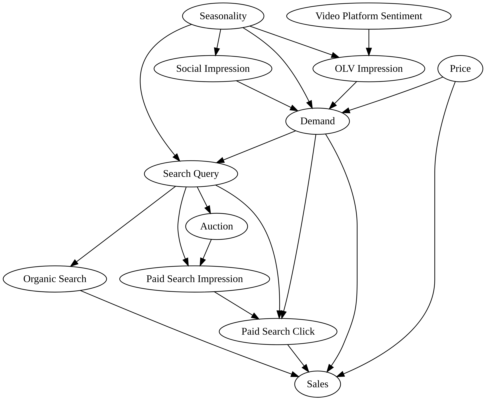

# Data Generation for Demonstrating Multicollinearity


<!-- WARNING: THIS FILE WAS AUTOGENERATED! DO NOT EDIT! -->

<div>



</div>

------------------------------------------------------------------------

<a
href="https://github.com/redam94/common_regression_issues/blob/main/common_regression_issues/synthetic_data/multicollinearity_datagen.py#L17"
target="_blank" style="float:right; font-size:smaller">source</a>

### hill

>  hill (x, K=1, n=1.2)

*Hill tranformation*

<table>
<thead>
<tr>
<th></th>
<th><strong>Type</strong></th>
<th><strong>Default</strong></th>
<th><strong>Details</strong></th>
</tr>
</thead>
<tbody>
<tr>
<td>x</td>
<td></td>
<td></td>
<td>input array</td>
</tr>
<tr>
<td>K</td>
<td>int</td>
<td>1</td>
<td>Half saturation point</td>
</tr>
<tr>
<td>n</td>
<td>float</td>
<td>1.2</td>
<td>Shape parameter</td>
</tr>
</tbody>
</table>

------------------------------------------------------------------------

<a
href="https://github.com/redam94/common_regression_issues/blob/main/common_regression_issues/synthetic_data/multicollinearity_datagen.py#L26"
target="_blank" style="float:right; font-size:smaller">source</a>

### sample_random_data

>  sample_random_data (N_weeks:int, include_hidden_confounds:bool=False,
>                          random_seed:int|None=None)

<table>
<colgroup>
<col style="width: 6%" />
<col style="width: 25%" />
<col style="width: 34%" />
<col style="width: 34%" />
</colgroup>
<thead>
<tr>
<th></th>
<th><strong>Type</strong></th>
<th><strong>Default</strong></th>
<th><strong>Details</strong></th>
</tr>
</thead>
<tbody>
<tr>
<td>N_weeks</td>
<td>int</td>
<td></td>
<td>Number of weeks to generate</td>
</tr>
<tr>
<td>include_hidden_confounds</td>
<td>bool</td>
<td>False</td>
<td>Should hidden confounds be included in the dataset</td>
</tr>
<tr>
<td>random_seed</td>
<td>int | None</td>
<td>None</td>
<td>Random Seed</td>
</tr>
<tr>
<td><strong>Returns</strong></td>
<td><strong>Dataset</strong></td>
<td></td>
<td><strong>Dataset containing the variables described by the above
causal model</strong></td>
</tr>
</tbody>
</table>

``` python
dataset = sample_random_data(156, random_seed=2, include_hidden_confounds=True)
dataset.head()
```

<div><svg style="position: absolute; width: 0; height: 0; overflow: hidden">
<defs>
<symbol id="icon-database" viewBox="0 0 32 32">
<path d="M16 0c-8.837 0-16 2.239-16 5v4c0 2.761 7.163 5 16 5s16-2.239 16-5v-4c0-2.761-7.163-5-16-5z"></path>
<path d="M16 17c-8.837 0-16-2.239-16-5v6c0 2.761 7.163 5 16 5s16-2.239 16-5v-6c0 2.761-7.163 5-16 5z"></path>
<path d="M16 26c-8.837 0-16-2.239-16-5v6c0 2.761 7.163 5 16 5s16-2.239 16-5v-6c0 2.761-7.163 5-16 5z"></path>
</symbol>
<symbol id="icon-file-text2" viewBox="0 0 32 32">
<path d="M28.681 7.159c-0.694-0.947-1.662-2.053-2.724-3.116s-2.169-2.030-3.116-2.724c-1.612-1.182-2.393-1.319-2.841-1.319h-15.5c-1.378 0-2.5 1.121-2.5 2.5v27c0 1.378 1.122 2.5 2.5 2.5h23c1.378 0 2.5-1.122 2.5-2.5v-19.5c0-0.448-0.137-1.23-1.319-2.841zM24.543 5.457c0.959 0.959 1.712 1.825 2.268 2.543h-4.811v-4.811c0.718 0.556 1.584 1.309 2.543 2.268zM28 29.5c0 0.271-0.229 0.5-0.5 0.5h-23c-0.271 0-0.5-0.229-0.5-0.5v-27c0-0.271 0.229-0.5 0.5-0.5 0 0 15.499-0 15.5 0v7c0 0.552 0.448 1 1 1h7v19.5z"></path>
<path d="M23 26h-14c-0.552 0-1-0.448-1-1s0.448-1 1-1h14c0.552 0 1 0.448 1 1s-0.448 1-1 1z"></path>
<path d="M23 22h-14c-0.552 0-1-0.448-1-1s0.448-1 1-1h14c0.552 0 1 0.448 1 1s-0.448 1-1 1z"></path>
<path d="M23 18h-14c-0.552 0-1-0.448-1-1s0.448-1 1-1h14c0.552 0 1 0.448 1 1s-0.448 1-1 1z"></path>
</symbol>
</defs>
</svg>
<style>/* CSS stylesheet for displaying xarray objects in jupyterlab.
 *
 */
&#10;:root {
  --xr-font-color0: var(--jp-content-font-color0, rgba(0, 0, 0, 1));
  --xr-font-color2: var(--jp-content-font-color2, rgba(0, 0, 0, 0.54));
  --xr-font-color3: var(--jp-content-font-color3, rgba(0, 0, 0, 0.38));
  --xr-border-color: var(--jp-border-color2, #e0e0e0);
  --xr-disabled-color: var(--jp-layout-color3, #bdbdbd);
  --xr-background-color: var(--jp-layout-color0, white);
  --xr-background-color-row-even: var(--jp-layout-color1, white);
  --xr-background-color-row-odd: var(--jp-layout-color2, #eeeeee);
}
&#10;html[theme=dark],
html[data-theme=dark],
body[data-theme=dark],
body.vscode-dark {
  --xr-font-color0: rgba(255, 255, 255, 1);
  --xr-font-color2: rgba(255, 255, 255, 0.54);
  --xr-font-color3: rgba(255, 255, 255, 0.38);
  --xr-border-color: #1F1F1F;
  --xr-disabled-color: #515151;
  --xr-background-color: #111111;
  --xr-background-color-row-even: #111111;
  --xr-background-color-row-odd: #313131;
}
&#10;.xr-wrap {
  display: block !important;
  min-width: 300px;
  max-width: 700px;
}
&#10;.xr-text-repr-fallback {
  /* fallback to plain text repr when CSS is not injected (untrusted notebook) */
  display: none;
}
&#10;.xr-header {
  padding-top: 6px;
  padding-bottom: 6px;
  margin-bottom: 4px;
  border-bottom: solid 1px var(--xr-border-color);
}
&#10;.xr-header > div,
.xr-header > ul {
  display: inline;
  margin-top: 0;
  margin-bottom: 0;
}
&#10;.xr-obj-type,
.xr-array-name {
  margin-left: 2px;
  margin-right: 10px;
}
&#10;.xr-obj-type {
  color: var(--xr-font-color2);
}
&#10;.xr-sections {
  padding-left: 0 !important;
  display: grid;
  grid-template-columns: 150px auto auto 1fr 0 20px 0 20px;
}
&#10;.xr-section-item {
  display: contents;
}
&#10;.xr-section-item input {
  display: inline-block;
  opacity: 0;
}
&#10;.xr-section-item input + label {
  color: var(--xr-disabled-color);
}
&#10;.xr-section-item input:enabled + label {
  cursor: pointer;
  color: var(--xr-font-color2);
}
&#10;.xr-section-item input:focus + label {
  border: 2px solid var(--xr-font-color0);
}
&#10;.xr-section-item input:enabled + label:hover {
  color: var(--xr-font-color0);
}
&#10;.xr-section-summary {
  grid-column: 1;
  color: var(--xr-font-color2);
  font-weight: 500;
}
&#10;.xr-section-summary > span {
  display: inline-block;
  padding-left: 0.5em;
}
&#10;.xr-section-summary-in:disabled + label {
  color: var(--xr-font-color2);
}
&#10;.xr-section-summary-in + label:before {
  display: inline-block;
  content: '►';
  font-size: 11px;
  width: 15px;
  text-align: center;
}
&#10;.xr-section-summary-in:disabled + label:before {
  color: var(--xr-disabled-color);
}
&#10;.xr-section-summary-in:checked + label:before {
  content: '▼';
}
&#10;.xr-section-summary-in:checked + label > span {
  display: none;
}
&#10;.xr-section-summary,
.xr-section-inline-details {
  padding-top: 4px;
  padding-bottom: 4px;
}
&#10;.xr-section-inline-details {
  grid-column: 2 / -1;
}
&#10;.xr-section-details {
  display: none;
  grid-column: 1 / -1;
  margin-bottom: 5px;
}
&#10;.xr-section-summary-in:checked ~ .xr-section-details {
  display: contents;
}
&#10;.xr-array-wrap {
  grid-column: 1 / -1;
  display: grid;
  grid-template-columns: 20px auto;
}
&#10;.xr-array-wrap > label {
  grid-column: 1;
  vertical-align: top;
}
&#10;.xr-preview {
  color: var(--xr-font-color3);
}
&#10;.xr-array-preview,
.xr-array-data {
  padding: 0 5px !important;
  grid-column: 2;
}
&#10;.xr-array-data,
.xr-array-in:checked ~ .xr-array-preview {
  display: none;
}
&#10;.xr-array-in:checked ~ .xr-array-data,
.xr-array-preview {
  display: inline-block;
}
&#10;.xr-dim-list {
  display: inline-block !important;
  list-style: none;
  padding: 0 !important;
  margin: 0;
}
&#10;.xr-dim-list li {
  display: inline-block;
  padding: 0;
  margin: 0;
}
&#10;.xr-dim-list:before {
  content: '(';
}
&#10;.xr-dim-list:after {
  content: ')';
}
&#10;.xr-dim-list li:not(:last-child):after {
  content: ',';
  padding-right: 5px;
}
&#10;.xr-has-index {
  font-weight: bold;
}
&#10;.xr-var-list,
.xr-var-item {
  display: contents;
}
&#10;.xr-var-item > div,
.xr-var-item label,
.xr-var-item > .xr-var-name span {
  background-color: var(--xr-background-color-row-even);
  margin-bottom: 0;
}
&#10;.xr-var-item > .xr-var-name:hover span {
  padding-right: 5px;
}
&#10;.xr-var-list > li:nth-child(odd) > div,
.xr-var-list > li:nth-child(odd) > label,
.xr-var-list > li:nth-child(odd) > .xr-var-name span {
  background-color: var(--xr-background-color-row-odd);
}
&#10;.xr-var-name {
  grid-column: 1;
}
&#10;.xr-var-dims {
  grid-column: 2;
}
&#10;.xr-var-dtype {
  grid-column: 3;
  text-align: right;
  color: var(--xr-font-color2);
}
&#10;.xr-var-preview {
  grid-column: 4;
}
&#10;.xr-index-preview {
  grid-column: 2 / 5;
  color: var(--xr-font-color2);
}
&#10;.xr-var-name,
.xr-var-dims,
.xr-var-dtype,
.xr-preview,
.xr-attrs dt {
  white-space: nowrap;
  overflow: hidden;
  text-overflow: ellipsis;
  padding-right: 10px;
}
&#10;.xr-var-name:hover,
.xr-var-dims:hover,
.xr-var-dtype:hover,
.xr-attrs dt:hover {
  overflow: visible;
  width: auto;
  z-index: 1;
}
&#10;.xr-var-attrs,
.xr-var-data,
.xr-index-data {
  display: none;
  background-color: var(--xr-background-color) !important;
  padding-bottom: 5px !important;
}
&#10;.xr-var-attrs-in:checked ~ .xr-var-attrs,
.xr-var-data-in:checked ~ .xr-var-data,
.xr-index-data-in:checked ~ .xr-index-data {
  display: block;
}
&#10;.xr-var-data > table {
  float: right;
}
&#10;.xr-var-name span,
.xr-var-data,
.xr-index-name div,
.xr-index-data,
.xr-attrs {
  padding-left: 25px !important;
}
&#10;.xr-attrs,
.xr-var-attrs,
.xr-var-data,
.xr-index-data {
  grid-column: 1 / -1;
}
&#10;dl.xr-attrs {
  padding: 0;
  margin: 0;
  display: grid;
  grid-template-columns: 125px auto;
}
&#10;.xr-attrs dt,
.xr-attrs dd {
  padding: 0;
  margin: 0;
  float: left;
  padding-right: 10px;
  width: auto;
}
&#10;.xr-attrs dt {
  font-weight: normal;
  grid-column: 1;
}
&#10;.xr-attrs dt:hover span {
  display: inline-block;
  background: var(--xr-background-color);
  padding-right: 10px;
}
&#10;.xr-attrs dd {
  grid-column: 2;
  white-space: pre-wrap;
  word-break: break-all;
}
&#10;.xr-icon-database,
.xr-icon-file-text2,
.xr-no-icon {
  display: inline-block;
  vertical-align: middle;
  width: 1em;
  height: 1.5em !important;
  stroke-width: 0;
  stroke: currentColor;
  fill: currentColor;
}
</style><pre class='xr-text-repr-fallback'>&lt;xarray.Dataset&gt; Size: 520B
Dimensions:                  (Period: 5)
Coordinates:
  * Period                   (Period) datetime64[ns] 40B 2021-01-04 ... 2021-...
Data variables:
    price                    (Period) float64 40B 3.856 3.767 3.767 4.3 4.3
    season                   (Period) float64 40B -0.9613 -0.9732 ... -1.0
    olv_sentiment            (Period) int64 40B 0 0 0 0 0
    social_impressions       (Period) float64 40B 4.516e+03 ... 2.289e+03
    olv_impressions          (Period) float64 40B 1.69e+04 ... 1.227e+04
    demand                   (Period) float64 40B 28.92 29.4 31.64 27.92 26.14
    search_query             (Period) float64 40B 2.182e+06 ... 2.366e+06
    auction                  (Period) float64 40B 0.07852 0.08937 ... 0.0854
    paid_search_impressions  (Period) float64 40B 1.713e+05 ... 2.021e+05
    paid_search_clicks       (Period) float64 40B 669.2 938.3 ... 645.8 636.1
    organic_search           (Period) float64 40B 2.054e+06 ... 2.055e+06
    sales                    (Period) float64 40B 6.47e+03 ... 6.29e+03
Attributes:
    olv_params:     {&#x27;K&#x27;: 0.7960875579897572, &#x27;n&#x27;: 1.0072716356157956}
    social_params:  {&#x27;K&#x27;: 0.9767776434467591, &#x27;n&#x27;: 2.7744792328982424}
    olv_beta:       0.21671224557085256
    social_beta:    0.06881513644667057</pre><div class='xr-wrap' style='display:none'><div class='xr-header'><div class='xr-obj-type'>xarray.Dataset</div></div><ul class='xr-sections'><li class='xr-section-item'><input id='section-556cdb4e-2c1e-498f-a30f-ac75f12ebd49' class='xr-section-summary-in' type='checkbox' disabled ><label for='section-556cdb4e-2c1e-498f-a30f-ac75f12ebd49' class='xr-section-summary'  title='Expand/collapse section'>Dimensions:</label><div class='xr-section-inline-details'><ul class='xr-dim-list'><li><span class='xr-has-index'>Period</span>: 5</li></ul></div><div class='xr-section-details'></div></li><li class='xr-section-item'><input id='section-61d4bfea-e4ae-4bd7-ac55-02e436acdd35' class='xr-section-summary-in' type='checkbox'  checked><label for='section-61d4bfea-e4ae-4bd7-ac55-02e436acdd35' class='xr-section-summary' >Coordinates: <span>(1)</span></label><div class='xr-section-inline-details'></div><div class='xr-section-details'><ul class='xr-var-list'><li class='xr-var-item'><div class='xr-var-name'><span class='xr-has-index'>Period</span></div><div class='xr-var-dims'>(Period)</div><div class='xr-var-dtype'>datetime64[ns]</div><div class='xr-var-preview xr-preview'>2021-01-04 ... 2021-02-01</div><input id='attrs-ccc9d1ba-b794-406b-b16e-e27fc982897f' class='xr-var-attrs-in' type='checkbox' disabled><label for='attrs-ccc9d1ba-b794-406b-b16e-e27fc982897f' title='Show/Hide attributes'><svg class='icon xr-icon-file-text2'><use xlink:href='#icon-file-text2'></use></svg></label><input id='data-c68b5df1-a54b-4ae5-91b4-cfe6870b68f5' class='xr-var-data-in' type='checkbox'><label for='data-c68b5df1-a54b-4ae5-91b4-cfe6870b68f5' title='Show/Hide data repr'><svg class='icon xr-icon-database'><use xlink:href='#icon-database'></use></svg></label><div class='xr-var-attrs'><dl class='xr-attrs'></dl></div><div class='xr-var-data'><pre>array([&#x27;2021-01-04T00:00:00.000000000&#x27;, &#x27;2021-01-11T00:00:00.000000000&#x27;,
       &#x27;2021-01-18T00:00:00.000000000&#x27;, &#x27;2021-01-25T00:00:00.000000000&#x27;,
       &#x27;2021-02-01T00:00:00.000000000&#x27;], dtype=&#x27;datetime64[ns]&#x27;)</pre></div></li></ul></div></li><li class='xr-section-item'><input id='section-3655fce9-8306-42ee-8c96-6e762df7c82f' class='xr-section-summary-in' type='checkbox'  checked><label for='section-3655fce9-8306-42ee-8c96-6e762df7c82f' class='xr-section-summary' >Data variables: <span>(12)</span></label><div class='xr-section-inline-details'></div><div class='xr-section-details'><ul class='xr-var-list'><li class='xr-var-item'><div class='xr-var-name'><span>price</span></div><div class='xr-var-dims'>(Period)</div><div class='xr-var-dtype'>float64</div><div class='xr-var-preview xr-preview'>3.856 3.767 3.767 4.3 4.3</div><input id='attrs-2dcd5da1-c8c9-493d-bb7f-c4e336fcf764' class='xr-var-attrs-in' type='checkbox' disabled><label for='attrs-2dcd5da1-c8c9-493d-bb7f-c4e336fcf764' title='Show/Hide attributes'><svg class='icon xr-icon-file-text2'><use xlink:href='#icon-file-text2'></use></svg></label><input id='data-ffb1e598-57f6-41ba-ac10-cac40ccba0b0' class='xr-var-data-in' type='checkbox'><label for='data-ffb1e598-57f6-41ba-ac10-cac40ccba0b0' title='Show/Hide data repr'><svg class='icon xr-icon-database'><use xlink:href='#icon-database'></use></svg></label><div class='xr-var-attrs'><dl class='xr-attrs'></dl></div><div class='xr-var-data'><pre>array([3.85623064, 3.76666366, 3.76666366, 4.30004006, 4.30004006])</pre></div></li><li class='xr-var-item'><div class='xr-var-name'><span>season</span></div><div class='xr-var-dims'>(Period)</div><div class='xr-var-dtype'>float64</div><div class='xr-var-preview xr-preview'>-0.9613 -0.9732 -0.986 -0.9962 -1.0</div><input id='attrs-d9628b45-7c88-4266-b022-f92117381833' class='xr-var-attrs-in' type='checkbox' disabled><label for='attrs-d9628b45-7c88-4266-b022-f92117381833' title='Show/Hide attributes'><svg class='icon xr-icon-file-text2'><use xlink:href='#icon-file-text2'></use></svg></label><input id='data-caec0d30-fc59-4b38-9adc-e69d21726799' class='xr-var-data-in' type='checkbox'><label for='data-caec0d30-fc59-4b38-9adc-e69d21726799' title='Show/Hide data repr'><svg class='icon xr-icon-database'><use xlink:href='#icon-database'></use></svg></label><div class='xr-var-attrs'><dl class='xr-attrs'></dl></div><div class='xr-var-data'><pre>array([-0.96125225, -0.97320297, -0.9859537 , -0.99622428, -1.        ])</pre></div></li><li class='xr-var-item'><div class='xr-var-name'><span>olv_sentiment</span></div><div class='xr-var-dims'>(Period)</div><div class='xr-var-dtype'>int64</div><div class='xr-var-preview xr-preview'>0 0 0 0 0</div><input id='attrs-365db48e-ce35-48a8-b32b-cb2f24c2c53b' class='xr-var-attrs-in' type='checkbox' disabled><label for='attrs-365db48e-ce35-48a8-b32b-cb2f24c2c53b' title='Show/Hide attributes'><svg class='icon xr-icon-file-text2'><use xlink:href='#icon-file-text2'></use></svg></label><input id='data-99791e3b-7430-440a-a82a-a59c9fc3dacf' class='xr-var-data-in' type='checkbox'><label for='data-99791e3b-7430-440a-a82a-a59c9fc3dacf' title='Show/Hide data repr'><svg class='icon xr-icon-database'><use xlink:href='#icon-database'></use></svg></label><div class='xr-var-attrs'><dl class='xr-attrs'></dl></div><div class='xr-var-data'><pre>array([0, 0, 0, 0, 0])</pre></div></li><li class='xr-var-item'><div class='xr-var-name'><span>social_impressions</span></div><div class='xr-var-dims'>(Period)</div><div class='xr-var-dtype'>float64</div><div class='xr-var-preview xr-preview'>4.516e+03 2.69e+03 ... 2.289e+03</div><input id='attrs-42f63491-99b2-40d3-a021-8034c39354b8' class='xr-var-attrs-in' type='checkbox' disabled><label for='attrs-42f63491-99b2-40d3-a021-8034c39354b8' title='Show/Hide attributes'><svg class='icon xr-icon-file-text2'><use xlink:href='#icon-file-text2'></use></svg></label><input id='data-9f2c012b-378d-4fee-8105-bf452ffb1460' class='xr-var-data-in' type='checkbox'><label for='data-9f2c012b-378d-4fee-8105-bf452ffb1460' title='Show/Hide data repr'><svg class='icon xr-icon-database'><use xlink:href='#icon-database'></use></svg></label><div class='xr-var-attrs'><dl class='xr-attrs'></dl></div><div class='xr-var-data'><pre>array([4516.32985667, 2690.15487369, 4408.82594089,  821.07433792,
       2289.26431861])</pre></div></li><li class='xr-var-item'><div class='xr-var-name'><span>olv_impressions</span></div><div class='xr-var-dims'>(Period)</div><div class='xr-var-dtype'>float64</div><div class='xr-var-preview xr-preview'>1.69e+04 1.443e+04 ... 1.227e+04</div><input id='attrs-8b6d6239-05f7-4bc1-a254-68a989396488' class='xr-var-attrs-in' type='checkbox' disabled><label for='attrs-8b6d6239-05f7-4bc1-a254-68a989396488' title='Show/Hide attributes'><svg class='icon xr-icon-file-text2'><use xlink:href='#icon-file-text2'></use></svg></label><input id='data-5dd143eb-f816-4bb7-acab-6baaf6433961' class='xr-var-data-in' type='checkbox'><label for='data-5dd143eb-f816-4bb7-acab-6baaf6433961' title='Show/Hide data repr'><svg class='icon xr-icon-database'><use xlink:href='#icon-database'></use></svg></label><div class='xr-var-attrs'><dl class='xr-attrs'></dl></div><div class='xr-var-data'><pre>array([16902.29928553, 14428.15003436, 10031.36337111, 12919.47391971,
       12268.58976982])</pre></div></li><li class='xr-var-item'><div class='xr-var-name'><span>demand</span></div><div class='xr-var-dims'>(Period)</div><div class='xr-var-dtype'>float64</div><div class='xr-var-preview xr-preview'>28.92 29.4 31.64 27.92 26.14</div><input id='attrs-1fafde9b-e174-4a12-9fc1-e0b8511921f5' class='xr-var-attrs-in' type='checkbox' disabled><label for='attrs-1fafde9b-e174-4a12-9fc1-e0b8511921f5' title='Show/Hide attributes'><svg class='icon xr-icon-file-text2'><use xlink:href='#icon-file-text2'></use></svg></label><input id='data-e5723920-a57c-4328-a53b-7fce8845b9ce' class='xr-var-data-in' type='checkbox'><label for='data-e5723920-a57c-4328-a53b-7fce8845b9ce' title='Show/Hide data repr'><svg class='icon xr-icon-database'><use xlink:href='#icon-database'></use></svg></label><div class='xr-var-attrs'><dl class='xr-attrs'></dl></div><div class='xr-var-data'><pre>array([28.91586164, 29.39881976, 31.63871304, 27.92203104, 26.14024436])</pre></div></li><li class='xr-var-item'><div class='xr-var-name'><span>search_query</span></div><div class='xr-var-dims'>(Period)</div><div class='xr-var-dtype'>float64</div><div class='xr-var-preview xr-preview'>2.182e+06 3.005e+06 ... 2.366e+06</div><input id='attrs-064233a4-007e-4aac-b51c-b89eeaddd730' class='xr-var-attrs-in' type='checkbox' disabled><label for='attrs-064233a4-007e-4aac-b51c-b89eeaddd730' title='Show/Hide attributes'><svg class='icon xr-icon-file-text2'><use xlink:href='#icon-file-text2'></use></svg></label><input id='data-512ff9d2-3bcb-44bf-a85b-3b928a136a35' class='xr-var-data-in' type='checkbox'><label for='data-512ff9d2-3bcb-44bf-a85b-3b928a136a35' title='Show/Hide data repr'><svg class='icon xr-icon-database'><use xlink:href='#icon-database'></use></svg></label><div class='xr-var-attrs'><dl class='xr-attrs'></dl></div><div class='xr-var-data'><pre>array([2182051.27979312, 3005187.1995009 , 2901400.41364904,
       1465383.57215318, 2366366.85440288])</pre></div></li><li class='xr-var-item'><div class='xr-var-name'><span>auction</span></div><div class='xr-var-dims'>(Period)</div><div class='xr-var-dtype'>float64</div><div class='xr-var-preview xr-preview'>0.07852 0.08937 ... 0.1123 0.0854</div><input id='attrs-d2b2787a-a23c-4c29-88c0-41f40dd79f97' class='xr-var-attrs-in' type='checkbox' disabled><label for='attrs-d2b2787a-a23c-4c29-88c0-41f40dd79f97' title='Show/Hide attributes'><svg class='icon xr-icon-file-text2'><use xlink:href='#icon-file-text2'></use></svg></label><input id='data-6457621d-1b26-47bf-9ee1-e72e751ca3fd' class='xr-var-data-in' type='checkbox'><label for='data-6457621d-1b26-47bf-9ee1-e72e751ca3fd' title='Show/Hide data repr'><svg class='icon xr-icon-database'><use xlink:href='#icon-database'></use></svg></label><div class='xr-var-attrs'><dl class='xr-attrs'></dl></div><div class='xr-var-data'><pre>array([0.07852333, 0.08937114, 0.08316361, 0.11232354, 0.08539509])</pre></div></li><li class='xr-var-item'><div class='xr-var-name'><span>paid_search_impressions</span></div><div class='xr-var-dims'>(Period)</div><div class='xr-var-dtype'>float64</div><div class='xr-var-preview xr-preview'>1.713e+05 2.686e+05 ... 2.021e+05</div><input id='attrs-262c1c3b-dbda-4828-bce4-45502086acab' class='xr-var-attrs-in' type='checkbox' disabled><label for='attrs-262c1c3b-dbda-4828-bce4-45502086acab' title='Show/Hide attributes'><svg class='icon xr-icon-file-text2'><use xlink:href='#icon-file-text2'></use></svg></label><input id='data-9202782c-0a56-440e-a519-828887ec4569' class='xr-var-data-in' type='checkbox'><label for='data-9202782c-0a56-440e-a519-828887ec4569' title='Show/Hide data repr'><svg class='icon xr-icon-database'><use xlink:href='#icon-database'></use></svg></label><div class='xr-var-attrs'><dl class='xr-attrs'></dl></div><div class='xr-var-data'><pre>array([171341.93333533, 268577.00396097, 241290.93840434, 164597.06925048,
       202076.10225716])</pre></div></li><li class='xr-var-item'><div class='xr-var-name'><span>paid_search_clicks</span></div><div class='xr-var-dims'>(Period)</div><div class='xr-var-dtype'>float64</div><div class='xr-var-preview xr-preview'>669.2 938.3 1.133e+03 645.8 636.1</div><input id='attrs-453bb927-d5f6-4e9a-bfd5-51cf5bb9a369' class='xr-var-attrs-in' type='checkbox' disabled><label for='attrs-453bb927-d5f6-4e9a-bfd5-51cf5bb9a369' title='Show/Hide attributes'><svg class='icon xr-icon-file-text2'><use xlink:href='#icon-file-text2'></use></svg></label><input id='data-21569beb-9f03-44bd-83de-1980af839a1d' class='xr-var-data-in' type='checkbox'><label for='data-21569beb-9f03-44bd-83de-1980af839a1d' title='Show/Hide data repr'><svg class='icon xr-icon-database'><use xlink:href='#icon-database'></use></svg></label><div class='xr-var-attrs'><dl class='xr-attrs'></dl></div><div class='xr-var-data'><pre>array([ 669.21744438,  938.33665502, 1132.50226126,  645.80771116,
        636.05519104])</pre></div></li><li class='xr-var-item'><div class='xr-var-name'><span>organic_search</span></div><div class='xr-var-dims'>(Period)</div><div class='xr-var-dtype'>float64</div><div class='xr-var-preview xr-preview'>2.054e+06 2.688e+06 ... 2.055e+06</div><input id='attrs-bde3ba65-2450-4e5b-9ad0-3e662b5306a3' class='xr-var-attrs-in' type='checkbox' disabled><label for='attrs-bde3ba65-2450-4e5b-9ad0-3e662b5306a3' title='Show/Hide attributes'><svg class='icon xr-icon-file-text2'><use xlink:href='#icon-file-text2'></use></svg></label><input id='data-1f15df69-6a16-425e-bad9-7b85c0da369d' class='xr-var-data-in' type='checkbox'><label for='data-1f15df69-6a16-425e-bad9-7b85c0da369d' title='Show/Hide data repr'><svg class='icon xr-icon-database'><use xlink:href='#icon-database'></use></svg></label><div class='xr-var-attrs'><dl class='xr-attrs'></dl></div><div class='xr-var-data'><pre>array([2053759.98996706, 2688297.54792605, 2580925.8707826 ,
       1345931.37962197, 2054808.91711597])</pre></div></li><li class='xr-var-item'><div class='xr-var-name'><span>sales</span></div><div class='xr-var-dims'>(Period)</div><div class='xr-var-dtype'>float64</div><div class='xr-var-preview xr-preview'>6.47e+03 6.702e+03 ... 6.29e+03</div><input id='attrs-fdc5e50c-1ac4-4352-be1e-fb7eb854c864' class='xr-var-attrs-in' type='checkbox' disabled><label for='attrs-fdc5e50c-1ac4-4352-be1e-fb7eb854c864' title='Show/Hide attributes'><svg class='icon xr-icon-file-text2'><use xlink:href='#icon-file-text2'></use></svg></label><input id='data-d56ccb6b-154d-435c-9691-096883fc246b' class='xr-var-data-in' type='checkbox'><label for='data-d56ccb6b-154d-435c-9691-096883fc246b' title='Show/Hide data repr'><svg class='icon xr-icon-database'><use xlink:href='#icon-database'></use></svg></label><div class='xr-var-attrs'><dl class='xr-attrs'></dl></div><div class='xr-var-data'><pre>array([6470.24406348, 6702.13210895, 9193.50249468, 6272.93497578,
       6290.24525121])</pre></div></li></ul></div></li><li class='xr-section-item'><input id='section-4cae2616-f760-43fa-abfa-662d419d150d' class='xr-section-summary-in' type='checkbox'  ><label for='section-4cae2616-f760-43fa-abfa-662d419d150d' class='xr-section-summary' >Indexes: <span>(1)</span></label><div class='xr-section-inline-details'></div><div class='xr-section-details'><ul class='xr-var-list'><li class='xr-var-item'><div class='xr-index-name'><div>Period</div></div><div class='xr-index-preview'>PandasIndex</div><div></div><input id='index-b6f5bae4-ad70-49c4-8828-af5b9589dbca' class='xr-index-data-in' type='checkbox'/><label for='index-b6f5bae4-ad70-49c4-8828-af5b9589dbca' title='Show/Hide index repr'><svg class='icon xr-icon-database'><use xlink:href='#icon-database'></use></svg></label><div class='xr-index-data'><pre>PandasIndex(DatetimeIndex([&#x27;2021-01-04&#x27;, &#x27;2021-01-11&#x27;, &#x27;2021-01-18&#x27;, &#x27;2021-01-25&#x27;,
               &#x27;2021-02-01&#x27;],
              dtype=&#x27;datetime64[ns]&#x27;, name=&#x27;Period&#x27;, freq=&#x27;W-MON&#x27;))</pre></div></li></ul></div></li><li class='xr-section-item'><input id='section-01a6c981-3bbe-4c8d-9786-7cab39aaf7c4' class='xr-section-summary-in' type='checkbox'  checked><label for='section-01a6c981-3bbe-4c8d-9786-7cab39aaf7c4' class='xr-section-summary' >Attributes: <span>(4)</span></label><div class='xr-section-inline-details'></div><div class='xr-section-details'><dl class='xr-attrs'><dt><span>olv_params :</span></dt><dd>{&#x27;K&#x27;: 0.7960875579897572, &#x27;n&#x27;: 1.0072716356157956}</dd><dt><span>social_params :</span></dt><dd>{&#x27;K&#x27;: 0.9767776434467591, &#x27;n&#x27;: 2.7744792328982424}</dd><dt><span>olv_beta :</span></dt><dd>0.21671224557085256</dd><dt><span>social_beta :</span></dt><dd>0.06881513644667057</dd></dl></div></li></ul></div></div>
