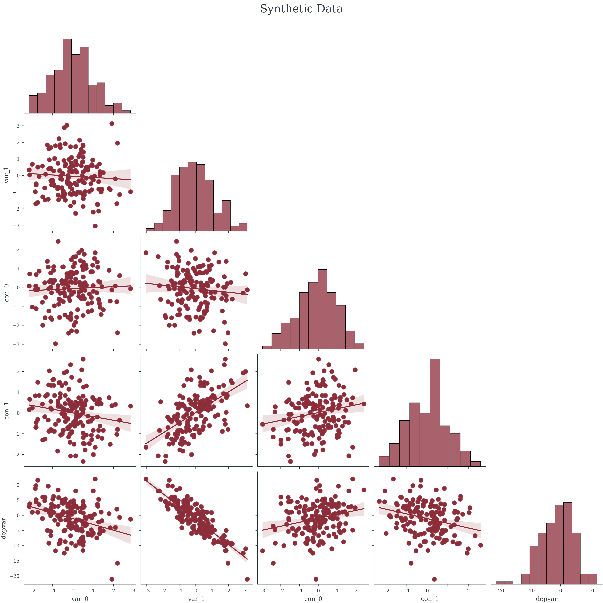
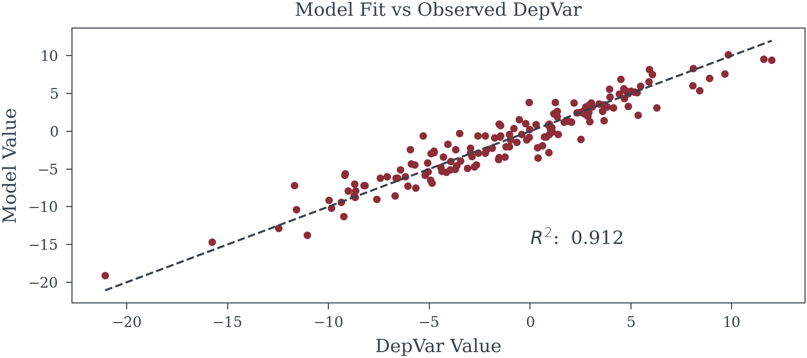
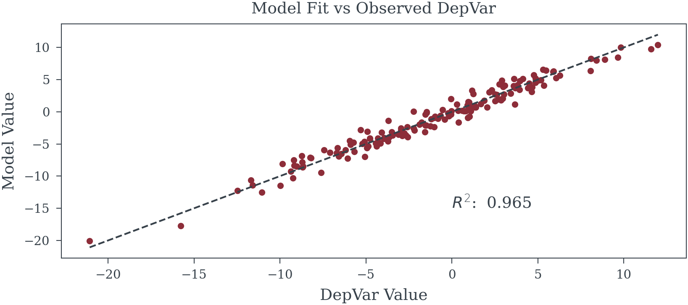

# Simple Regression Data


<!-- WARNING: THIS FILE WAS AUTOGENERATED! DO NOT EDIT! -->

------------------------------------------------------------------------

<a
href="https://github.com/redam94/common_regression_issues/blob/main/common_regression_issues/synthetic_data/simple_regression_data.py#L17"
target="_blank" style="float:right; font-size:smaller">source</a>

### generate_ols_data

>  generate_ols_data (sample_size:int, n_exogenous_vars:int,
>                         n_confounder:int=0, noise_sigma:float=1.0,
>                         random_seed:Optional[int]=None)

*Generate Simple OLS data*

<table>
<colgroup>
<col style="width: 6%" />
<col style="width: 25%" />
<col style="width: 34%" />
<col style="width: 34%" />
</colgroup>
<thead>
<tr>
<th></th>
<th><strong>Type</strong></th>
<th><strong>Default</strong></th>
<th><strong>Details</strong></th>
</tr>
</thead>
<tbody>
<tr>
<td>sample_size</td>
<td>int</td>
<td></td>
<td></td>
</tr>
<tr>
<td>n_exogenous_vars</td>
<td>int</td>
<td></td>
<td>Number of variables with a direct effect on the dep var</td>
</tr>
<tr>
<td>n_confounder</td>
<td>int</td>
<td>0</td>
<td>Number of confounder variables to include</td>
</tr>
<tr>
<td>noise_sigma</td>
<td>float</td>
<td>1.0</td>
<td>Level of un-explained gaussian noise to add</td>
</tr>
<tr>
<td>random_seed</td>
<td>Optional</td>
<td>None</td>
<td>Random seed for reproducability</td>
</tr>
<tr>
<td><strong>Returns</strong></td>
<td><strong>Dataset</strong></td>
<td></td>
<td><strong>Generated Data</strong></td>
</tr>
</tbody>
</table>

``` python
SAMPLE_SIZE = 156
N_INDEPVAR = 2
N_CONFOUNDER = 2
NOISE_SIGMA = 1
RANDOM_SEED = 42

data = generate_ols_data(
    SAMPLE_SIZE, N_INDEPVAR, 
    n_confounder=N_CONFOUNDER,
    noise_sigma=NOISE_SIGMA, 
    random_seed=RANDOM_SEED)
data.head()
```

<div><svg style="position: absolute; width: 0; height: 0; overflow: hidden">
<defs>
<symbol id="icon-database" viewBox="0 0 32 32">
<path d="M16 0c-8.837 0-16 2.239-16 5v4c0 2.761 7.163 5 16 5s16-2.239 16-5v-4c0-2.761-7.163-5-16-5z"></path>
<path d="M16 17c-8.837 0-16-2.239-16-5v6c0 2.761 7.163 5 16 5s16-2.239 16-5v-6c0 2.761-7.163 5-16 5z"></path>
<path d="M16 26c-8.837 0-16-2.239-16-5v6c0 2.761 7.163 5 16 5s16-2.239 16-5v-6c0 2.761-7.163 5-16 5z"></path>
</symbol>
<symbol id="icon-file-text2" viewBox="0 0 32 32">
<path d="M28.681 7.159c-0.694-0.947-1.662-2.053-2.724-3.116s-2.169-2.030-3.116-2.724c-1.612-1.182-2.393-1.319-2.841-1.319h-15.5c-1.378 0-2.5 1.121-2.5 2.5v27c0 1.378 1.122 2.5 2.5 2.5h23c1.378 0 2.5-1.122 2.5-2.5v-19.5c0-0.448-0.137-1.23-1.319-2.841zM24.543 5.457c0.959 0.959 1.712 1.825 2.268 2.543h-4.811v-4.811c0.718 0.556 1.584 1.309 2.543 2.268zM28 29.5c0 0.271-0.229 0.5-0.5 0.5h-23c-0.271 0-0.5-0.229-0.5-0.5v-27c0-0.271 0.229-0.5 0.5-0.5 0 0 15.499-0 15.5 0v7c0 0.552 0.448 1 1 1h7v19.5z"></path>
<path d="M23 26h-14c-0.552 0-1-0.448-1-1s0.448-1 1-1h14c0.552 0 1 0.448 1 1s-0.448 1-1 1z"></path>
<path d="M23 22h-14c-0.552 0-1-0.448-1-1s0.448-1 1-1h14c0.552 0 1 0.448 1 1s-0.448 1-1 1z"></path>
<path d="M23 18h-14c-0.552 0-1-0.448-1-1s0.448-1 1-1h14c0.552 0 1 0.448 1 1s-0.448 1-1 1z"></path>
</symbol>
</defs>
</svg>
<style>/* CSS stylesheet for displaying xarray objects in jupyterlab.
 *
 */
&#10;:root {
  --xr-font-color0: var(--jp-content-font-color0, rgba(0, 0, 0, 1));
  --xr-font-color2: var(--jp-content-font-color2, rgba(0, 0, 0, 0.54));
  --xr-font-color3: var(--jp-content-font-color3, rgba(0, 0, 0, 0.38));
  --xr-border-color: var(--jp-border-color2, #e0e0e0);
  --xr-disabled-color: var(--jp-layout-color3, #bdbdbd);
  --xr-background-color: var(--jp-layout-color0, white);
  --xr-background-color-row-even: var(--jp-layout-color1, white);
  --xr-background-color-row-odd: var(--jp-layout-color2, #eeeeee);
}
&#10;html[theme=dark],
html[data-theme=dark],
body[data-theme=dark],
body.vscode-dark {
  --xr-font-color0: rgba(255, 255, 255, 1);
  --xr-font-color2: rgba(255, 255, 255, 0.54);
  --xr-font-color3: rgba(255, 255, 255, 0.38);
  --xr-border-color: #1F1F1F;
  --xr-disabled-color: #515151;
  --xr-background-color: #111111;
  --xr-background-color-row-even: #111111;
  --xr-background-color-row-odd: #313131;
}
&#10;.xr-wrap {
  display: block !important;
  min-width: 300px;
  max-width: 700px;
}
&#10;.xr-text-repr-fallback {
  /* fallback to plain text repr when CSS is not injected (untrusted notebook) */
  display: none;
}
&#10;.xr-header {
  padding-top: 6px;
  padding-bottom: 6px;
  margin-bottom: 4px;
  border-bottom: solid 1px var(--xr-border-color);
}
&#10;.xr-header > div,
.xr-header > ul {
  display: inline;
  margin-top: 0;
  margin-bottom: 0;
}
&#10;.xr-obj-type,
.xr-array-name {
  margin-left: 2px;
  margin-right: 10px;
}
&#10;.xr-obj-type {
  color: var(--xr-font-color2);
}
&#10;.xr-sections {
  padding-left: 0 !important;
  display: grid;
  grid-template-columns: 150px auto auto 1fr 0 20px 0 20px;
}
&#10;.xr-section-item {
  display: contents;
}
&#10;.xr-section-item input {
  display: inline-block;
  opacity: 0;
}
&#10;.xr-section-item input + label {
  color: var(--xr-disabled-color);
}
&#10;.xr-section-item input:enabled + label {
  cursor: pointer;
  color: var(--xr-font-color2);
}
&#10;.xr-section-item input:focus + label {
  border: 2px solid var(--xr-font-color0);
}
&#10;.xr-section-item input:enabled + label:hover {
  color: var(--xr-font-color0);
}
&#10;.xr-section-summary {
  grid-column: 1;
  color: var(--xr-font-color2);
  font-weight: 500;
}
&#10;.xr-section-summary > span {
  display: inline-block;
  padding-left: 0.5em;
}
&#10;.xr-section-summary-in:disabled + label {
  color: var(--xr-font-color2);
}
&#10;.xr-section-summary-in + label:before {
  display: inline-block;
  content: '►';
  font-size: 11px;
  width: 15px;
  text-align: center;
}
&#10;.xr-section-summary-in:disabled + label:before {
  color: var(--xr-disabled-color);
}
&#10;.xr-section-summary-in:checked + label:before {
  content: '▼';
}
&#10;.xr-section-summary-in:checked + label > span {
  display: none;
}
&#10;.xr-section-summary,
.xr-section-inline-details {
  padding-top: 4px;
  padding-bottom: 4px;
}
&#10;.xr-section-inline-details {
  grid-column: 2 / -1;
}
&#10;.xr-section-details {
  display: none;
  grid-column: 1 / -1;
  margin-bottom: 5px;
}
&#10;.xr-section-summary-in:checked ~ .xr-section-details {
  display: contents;
}
&#10;.xr-array-wrap {
  grid-column: 1 / -1;
  display: grid;
  grid-template-columns: 20px auto;
}
&#10;.xr-array-wrap > label {
  grid-column: 1;
  vertical-align: top;
}
&#10;.xr-preview {
  color: var(--xr-font-color3);
}
&#10;.xr-array-preview,
.xr-array-data {
  padding: 0 5px !important;
  grid-column: 2;
}
&#10;.xr-array-data,
.xr-array-in:checked ~ .xr-array-preview {
  display: none;
}
&#10;.xr-array-in:checked ~ .xr-array-data,
.xr-array-preview {
  display: inline-block;
}
&#10;.xr-dim-list {
  display: inline-block !important;
  list-style: none;
  padding: 0 !important;
  margin: 0;
}
&#10;.xr-dim-list li {
  display: inline-block;
  padding: 0;
  margin: 0;
}
&#10;.xr-dim-list:before {
  content: '(';
}
&#10;.xr-dim-list:after {
  content: ')';
}
&#10;.xr-dim-list li:not(:last-child):after {
  content: ',';
  padding-right: 5px;
}
&#10;.xr-has-index {
  font-weight: bold;
}
&#10;.xr-var-list,
.xr-var-item {
  display: contents;
}
&#10;.xr-var-item > div,
.xr-var-item label,
.xr-var-item > .xr-var-name span {
  background-color: var(--xr-background-color-row-even);
  margin-bottom: 0;
}
&#10;.xr-var-item > .xr-var-name:hover span {
  padding-right: 5px;
}
&#10;.xr-var-list > li:nth-child(odd) > div,
.xr-var-list > li:nth-child(odd) > label,
.xr-var-list > li:nth-child(odd) > .xr-var-name span {
  background-color: var(--xr-background-color-row-odd);
}
&#10;.xr-var-name {
  grid-column: 1;
}
&#10;.xr-var-dims {
  grid-column: 2;
}
&#10;.xr-var-dtype {
  grid-column: 3;
  text-align: right;
  color: var(--xr-font-color2);
}
&#10;.xr-var-preview {
  grid-column: 4;
}
&#10;.xr-index-preview {
  grid-column: 2 / 5;
  color: var(--xr-font-color2);
}
&#10;.xr-var-name,
.xr-var-dims,
.xr-var-dtype,
.xr-preview,
.xr-attrs dt {
  white-space: nowrap;
  overflow: hidden;
  text-overflow: ellipsis;
  padding-right: 10px;
}
&#10;.xr-var-name:hover,
.xr-var-dims:hover,
.xr-var-dtype:hover,
.xr-attrs dt:hover {
  overflow: visible;
  width: auto;
  z-index: 1;
}
&#10;.xr-var-attrs,
.xr-var-data,
.xr-index-data {
  display: none;
  background-color: var(--xr-background-color) !important;
  padding-bottom: 5px !important;
}
&#10;.xr-var-attrs-in:checked ~ .xr-var-attrs,
.xr-var-data-in:checked ~ .xr-var-data,
.xr-index-data-in:checked ~ .xr-index-data {
  display: block;
}
&#10;.xr-var-data > table {
  float: right;
}
&#10;.xr-var-name span,
.xr-var-data,
.xr-index-name div,
.xr-index-data,
.xr-attrs {
  padding-left: 25px !important;
}
&#10;.xr-attrs,
.xr-var-attrs,
.xr-var-data,
.xr-index-data {
  grid-column: 1 / -1;
}
&#10;dl.xr-attrs {
  padding: 0;
  margin: 0;
  display: grid;
  grid-template-columns: 125px auto;
}
&#10;.xr-attrs dt,
.xr-attrs dd {
  padding: 0;
  margin: 0;
  float: left;
  padding-right: 10px;
  width: auto;
}
&#10;.xr-attrs dt {
  font-weight: normal;
  grid-column: 1;
}
&#10;.xr-attrs dt:hover span {
  display: inline-block;
  background: var(--xr-background-color);
  padding-right: 10px;
}
&#10;.xr-attrs dd {
  grid-column: 2;
  white-space: pre-wrap;
  word-break: break-all;
}
&#10;.xr-icon-database,
.xr-icon-file-text2,
.xr-no-icon {
  display: inline-block;
  vertical-align: middle;
  width: 1em;
  height: 1.5em !important;
  stroke-width: 0;
  stroke: currentColor;
  fill: currentColor;
}
</style><pre class='xr-text-repr-fallback'>&lt;xarray.Dataset&gt; Size: 240B
Dimensions:  (Index: 5)
Coordinates:
  * Index    (Index) int64 40B 0 1 2 3 4
Data variables:
    var_0    (Index) float64 40B 0.5611 0.9553 -1.824 0.5083 0.162
    var_1    (Index) float64 40B -1.173 0.6022 -1.697 -1.17 -1.124
    con_0    (Index) float64 40B 1.744 0.828 0.06655 0.9896 0.7824
    con_1    (Index) float64 40B 0.439 -0.2966 -0.6974 -1.178 -0.1907
    depvar   (Index) float64 40B 2.91 -6.19 9.812 2.616 3.067
Attributes:
    true_betas:  {&#x27;var_0&#x27;: -2.081, &#x27;var_1&#x27;: -4.826, &#x27;con_0&#x27;: 0.644, &#x27;con_1&#x27;: ...
    true_alpha:  -1.216</pre><div class='xr-wrap' style='display:none'><div class='xr-header'><div class='xr-obj-type'>xarray.Dataset</div></div><ul class='xr-sections'><li class='xr-section-item'><input id='section-e3c5b2d2-503d-43d6-9756-88d69f61e18e' class='xr-section-summary-in' type='checkbox' disabled ><label for='section-e3c5b2d2-503d-43d6-9756-88d69f61e18e' class='xr-section-summary'  title='Expand/collapse section'>Dimensions:</label><div class='xr-section-inline-details'><ul class='xr-dim-list'><li><span class='xr-has-index'>Index</span>: 5</li></ul></div><div class='xr-section-details'></div></li><li class='xr-section-item'><input id='section-3761f776-6105-465d-a917-7c1ef5b48714' class='xr-section-summary-in' type='checkbox'  checked><label for='section-3761f776-6105-465d-a917-7c1ef5b48714' class='xr-section-summary' >Coordinates: <span>(1)</span></label><div class='xr-section-inline-details'></div><div class='xr-section-details'><ul class='xr-var-list'><li class='xr-var-item'><div class='xr-var-name'><span class='xr-has-index'>Index</span></div><div class='xr-var-dims'>(Index)</div><div class='xr-var-dtype'>int64</div><div class='xr-var-preview xr-preview'>0 1 2 3 4</div><input id='attrs-ca0ec843-218a-4fd2-a5c0-c50ad8de8d6b' class='xr-var-attrs-in' type='checkbox' disabled><label for='attrs-ca0ec843-218a-4fd2-a5c0-c50ad8de8d6b' title='Show/Hide attributes'><svg class='icon xr-icon-file-text2'><use xlink:href='#icon-file-text2'></use></svg></label><input id='data-130874e2-8307-4c4d-9abf-b1c26cb4909d' class='xr-var-data-in' type='checkbox'><label for='data-130874e2-8307-4c4d-9abf-b1c26cb4909d' title='Show/Hide data repr'><svg class='icon xr-icon-database'><use xlink:href='#icon-database'></use></svg></label><div class='xr-var-attrs'><dl class='xr-attrs'></dl></div><div class='xr-var-data'><pre>array([0, 1, 2, 3, 4])</pre></div></li></ul></div></li><li class='xr-section-item'><input id='section-2867390d-734e-463c-8e72-00c2d2cc1030' class='xr-section-summary-in' type='checkbox'  checked><label for='section-2867390d-734e-463c-8e72-00c2d2cc1030' class='xr-section-summary' >Data variables: <span>(5)</span></label><div class='xr-section-inline-details'></div><div class='xr-section-details'><ul class='xr-var-list'><li class='xr-var-item'><div class='xr-var-name'><span>var_0</span></div><div class='xr-var-dims'>(Index)</div><div class='xr-var-dtype'>float64</div><div class='xr-var-preview xr-preview'>0.5611 0.9553 -1.824 0.5083 0.162</div><input id='attrs-63b0f64f-e767-4595-8913-5b3476b762f7' class='xr-var-attrs-in' type='checkbox' disabled><label for='attrs-63b0f64f-e767-4595-8913-5b3476b762f7' title='Show/Hide attributes'><svg class='icon xr-icon-file-text2'><use xlink:href='#icon-file-text2'></use></svg></label><input id='data-745e697d-d436-4cd4-bdca-546e97df2391' class='xr-var-data-in' type='checkbox'><label for='data-745e697d-d436-4cd4-bdca-546e97df2391' title='Show/Hide data repr'><svg class='icon xr-icon-database'><use xlink:href='#icon-database'></use></svg></label><div class='xr-var-attrs'><dl class='xr-attrs'></dl></div><div class='xr-var-data'><pre>array([ 0.56108686,  0.9553213 , -1.82365978,  0.50834594,  0.16202801])</pre></div></li><li class='xr-var-item'><div class='xr-var-name'><span>var_1</span></div><div class='xr-var-dims'>(Index)</div><div class='xr-var-dtype'>float64</div><div class='xr-var-preview xr-preview'>-1.173 0.6022 -1.697 -1.17 -1.124</div><input id='attrs-d910c5ab-ec8e-4857-9525-f3e931cb9188' class='xr-var-attrs-in' type='checkbox' disabled><label for='attrs-d910c5ab-ec8e-4857-9525-f3e931cb9188' title='Show/Hide attributes'><svg class='icon xr-icon-file-text2'><use xlink:href='#icon-file-text2'></use></svg></label><input id='data-40f83940-13bb-4335-875e-4a0bac898280' class='xr-var-data-in' type='checkbox'><label for='data-40f83940-13bb-4335-875e-4a0bac898280' title='Show/Hide data repr'><svg class='icon xr-icon-database'><use xlink:href='#icon-database'></use></svg></label><div class='xr-var-attrs'><dl class='xr-attrs'></dl></div><div class='xr-var-data'><pre>array([-1.17283017,  0.60223973, -1.69651489, -1.16964365, -1.12389828])</pre></div></li><li class='xr-var-item'><div class='xr-var-name'><span>con_0</span></div><div class='xr-var-dims'>(Index)</div><div class='xr-var-dtype'>float64</div><div class='xr-var-preview xr-preview'>1.744 0.828 0.06655 0.9896 0.7824</div><input id='attrs-2feac449-5a20-4673-9f56-1176ad5c13b6' class='xr-var-attrs-in' type='checkbox' disabled><label for='attrs-2feac449-5a20-4673-9f56-1176ad5c13b6' title='Show/Hide attributes'><svg class='icon xr-icon-file-text2'><use xlink:href='#icon-file-text2'></use></svg></label><input id='data-24b8f6c4-a276-4c3d-9b00-b00882768ef9' class='xr-var-data-in' type='checkbox'><label for='data-24b8f6c4-a276-4c3d-9b00-b00882768ef9' title='Show/Hide data repr'><svg class='icon xr-icon-database'><use xlink:href='#icon-database'></use></svg></label><div class='xr-var-attrs'><dl class='xr-attrs'></dl></div><div class='xr-var-data'><pre>array([1.74393453, 0.82798818, 0.06654582, 0.98958393, 0.78235034])</pre></div></li><li class='xr-var-item'><div class='xr-var-name'><span>con_1</span></div><div class='xr-var-dims'>(Index)</div><div class='xr-var-dtype'>float64</div><div class='xr-var-preview xr-preview'>0.439 -0.2966 ... -1.178 -0.1907</div><input id='attrs-c2cf2970-38f0-4c6b-8fb7-556cbada64f0' class='xr-var-attrs-in' type='checkbox' disabled><label for='attrs-c2cf2970-38f0-4c6b-8fb7-556cbada64f0' title='Show/Hide attributes'><svg class='icon xr-icon-file-text2'><use xlink:href='#icon-file-text2'></use></svg></label><input id='data-f9a76e58-8840-41fd-95bd-55f7811482d1' class='xr-var-data-in' type='checkbox'><label for='data-f9a76e58-8840-41fd-95bd-55f7811482d1' title='Show/Hide data repr'><svg class='icon xr-icon-database'><use xlink:href='#icon-database'></use></svg></label><div class='xr-var-attrs'><dl class='xr-attrs'></dl></div><div class='xr-var-data'><pre>array([ 0.43899316, -0.29657095, -0.69742382, -1.17830362, -0.19065106])</pre></div></li><li class='xr-var-item'><div class='xr-var-name'><span>depvar</span></div><div class='xr-var-dims'>(Index)</div><div class='xr-var-dtype'>float64</div><div class='xr-var-preview xr-preview'>2.91 -6.19 9.812 2.616 3.067</div><input id='attrs-a7bdf811-3cef-40e3-b328-55b8900c4ee0' class='xr-var-attrs-in' type='checkbox' disabled><label for='attrs-a7bdf811-3cef-40e3-b328-55b8900c4ee0' title='Show/Hide attributes'><svg class='icon xr-icon-file-text2'><use xlink:href='#icon-file-text2'></use></svg></label><input id='data-e3cdf708-f962-4b08-b953-a114a4f217be' class='xr-var-data-in' type='checkbox'><label for='data-e3cdf708-f962-4b08-b953-a114a4f217be' title='Show/Hide data repr'><svg class='icon xr-icon-database'><use xlink:href='#icon-database'></use></svg></label><div class='xr-var-attrs'><dl class='xr-attrs'></dl></div><div class='xr-var-data'><pre>array([ 2.91048549, -6.19019452,  9.81167712,  2.61633086,  3.06673432])</pre></div></li></ul></div></li><li class='xr-section-item'><input id='section-3a8e861a-b298-4bdb-a489-4a8f7d31c9e8' class='xr-section-summary-in' type='checkbox'  ><label for='section-3a8e861a-b298-4bdb-a489-4a8f7d31c9e8' class='xr-section-summary' >Indexes: <span>(1)</span></label><div class='xr-section-inline-details'></div><div class='xr-section-details'><ul class='xr-var-list'><li class='xr-var-item'><div class='xr-index-name'><div>Index</div></div><div class='xr-index-preview'>PandasIndex</div><div></div><input id='index-2c782505-46a3-47b7-9581-a86c49b9f18a' class='xr-index-data-in' type='checkbox'/><label for='index-2c782505-46a3-47b7-9581-a86c49b9f18a' title='Show/Hide index repr'><svg class='icon xr-icon-database'><use xlink:href='#icon-database'></use></svg></label><div class='xr-index-data'><pre>PandasIndex(Index([0, 1, 2, 3, 4], dtype=&#x27;int64&#x27;, name=&#x27;Index&#x27;))</pre></div></li></ul></div></li><li class='xr-section-item'><input id='section-6ea646b7-897c-4ddb-af99-5ebaac9aa547' class='xr-section-summary-in' type='checkbox'  checked><label for='section-6ea646b7-897c-4ddb-af99-5ebaac9aa547' class='xr-section-summary' >Attributes: <span>(2)</span></label><div class='xr-section-inline-details'></div><div class='xr-section-details'><dl class='xr-attrs'><dt><span>true_betas :</span></dt><dd>{&#x27;var_0&#x27;: -2.081, &#x27;var_1&#x27;: -4.826, &#x27;con_0&#x27;: 0.644, &#x27;con_1&#x27;: 1.02}</dd><dt><span>true_alpha :</span></dt><dd>-1.216</dd></dl></div></li></ul></div></div>



<div class="cell-output cell-output-display">

<table class="simpletable do-not-create-environment cell"
data-quarto-postprocess="true">
<caption>OLS Regression Results</caption>
<tbody>
<tr>
<td data-quarto-table-cell-role="th">Dep. Variable:</td>
<td>depvar</td>
<td data-quarto-table-cell-role="th">R-squared:</td>
<td>0.912</td>
</tr>
<tr>
<td data-quarto-table-cell-role="th">Model:</td>
<td>OLS</td>
<td data-quarto-table-cell-role="th">Adj. R-squared:</td>
<td>0.911</td>
</tr>
<tr>
<td data-quarto-table-cell-role="th">Method:</td>
<td>Least Squares</td>
<td data-quarto-table-cell-role="th">F-statistic:</td>
<td>795.4</td>
</tr>
<tr>
<td data-quarto-table-cell-role="th">Date:</td>
<td>Sat, 09 Nov 2024</td>
<td data-quarto-table-cell-role="th">Prob (F-statistic):</td>
<td>1.43e-81</td>
</tr>
<tr>
<td data-quarto-table-cell-role="th">Time:</td>
<td>18:17:04</td>
<td data-quarto-table-cell-role="th">Log-Likelihood:</td>
<td>-296.16</td>
</tr>
<tr>
<td data-quarto-table-cell-role="th">No. Observations:</td>
<td>156</td>
<td data-quarto-table-cell-role="th">AIC:</td>
<td>598.3</td>
</tr>
<tr>
<td data-quarto-table-cell-role="th">Df Residuals:</td>
<td>153</td>
<td data-quarto-table-cell-role="th">BIC:</td>
<td>607.5</td>
</tr>
<tr>
<td data-quarto-table-cell-role="th">Df Model:</td>
<td>2</td>
<td data-quarto-table-cell-role="th"></td>
<td></td>
</tr>
<tr>
<td data-quarto-table-cell-role="th">Covariance Type:</td>
<td>nonrobust</td>
<td data-quarto-table-cell-role="th"></td>
<td></td>
</tr>
</tbody>
</table>

<table class="simpletable do-not-create-environment cell"
data-quarto-postprocess="true">
<tbody>
<tr>
<td></td>
<td data-quarto-table-cell-role="th">coef</td>
<td data-quarto-table-cell-role="th">std err</td>
<td data-quarto-table-cell-role="th">t</td>
<td data-quarto-table-cell-role="th">P&gt;|t|</td>
<td data-quarto-table-cell-role="th">[0.025</td>
<td data-quarto-table-cell-role="th">0.975]</td>
</tr>
<tr>
<td data-quarto-table-cell-role="th">const</td>
<td>-1.2774</td>
<td>0.131</td>
<td>-9.775</td>
<td>0.000</td>
<td>-1.536</td>
<td>-1.019</td>
</tr>
<tr>
<td data-quarto-table-cell-role="th">var_0</td>
<td>-2.2304</td>
<td>0.134</td>
<td>-16.666</td>
<td>0.000</td>
<td>-2.495</td>
<td>-1.966</td>
</tr>
<tr>
<td data-quarto-table-cell-role="th">var_1</td>
<td>-4.3309</td>
<td>0.116</td>
<td>-37.226</td>
<td>0.000</td>
<td>-4.561</td>
<td>-4.101</td>
</tr>
</tbody>
</table>

<table class="simpletable do-not-create-environment cell"
data-quarto-postprocess="true">
<tbody>
<tr>
<td data-quarto-table-cell-role="th">Omnibus:</td>
<td>1.649</td>
<td data-quarto-table-cell-role="th">Durbin-Watson:</td>
<td>2.158</td>
</tr>
<tr>
<td data-quarto-table-cell-role="th">Prob(Omnibus):</td>
<td>0.438</td>
<td data-quarto-table-cell-role="th">Jarque-Bera (JB):</td>
<td>1.242</td>
</tr>
<tr>
<td data-quarto-table-cell-role="th">Skew:</td>
<td>-0.188</td>
<td data-quarto-table-cell-role="th">Prob(JB):</td>
<td>0.537</td>
</tr>
<tr>
<td data-quarto-table-cell-role="th">Kurtosis:</td>
<td>3.223</td>
<td data-quarto-table-cell-role="th">Cond. No.</td>
<td>1.17</td>
</tr>
</tbody>
</table>

<br/><br/>Notes:<br/>[1] Standard Errors assume that the covariance matrix of the errors is correctly specified.

</div>



<div class="cell-output cell-output-display">

<table class="simpletable do-not-create-environment cell"
data-quarto-postprocess="true">
<caption>OLS Regression Results</caption>
<tbody>
<tr>
<td data-quarto-table-cell-role="th">Dep. Variable:</td>
<td>depvar</td>
<td data-quarto-table-cell-role="th">R-squared:</td>
<td>0.965</td>
</tr>
<tr>
<td data-quarto-table-cell-role="th">Model:</td>
<td>OLS</td>
<td data-quarto-table-cell-role="th">Adj. R-squared:</td>
<td>0.965</td>
</tr>
<tr>
<td data-quarto-table-cell-role="th">Method:</td>
<td>Least Squares</td>
<td data-quarto-table-cell-role="th">F-statistic:</td>
<td>1055.</td>
</tr>
<tr>
<td data-quarto-table-cell-role="th">Date:</td>
<td>Sat, 09 Nov 2024</td>
<td data-quarto-table-cell-role="th">Prob (F-statistic):</td>
<td>3.26e-109</td>
</tr>
<tr>
<td data-quarto-table-cell-role="th">Time:</td>
<td>18:17:04</td>
<td data-quarto-table-cell-role="th">Log-Likelihood:</td>
<td>-223.44</td>
</tr>
<tr>
<td data-quarto-table-cell-role="th">No. Observations:</td>
<td>156</td>
<td data-quarto-table-cell-role="th">AIC:</td>
<td>456.9</td>
</tr>
<tr>
<td data-quarto-table-cell-role="th">Df Residuals:</td>
<td>151</td>
<td data-quarto-table-cell-role="th">BIC:</td>
<td>472.1</td>
</tr>
<tr>
<td data-quarto-table-cell-role="th">Df Model:</td>
<td>4</td>
<td data-quarto-table-cell-role="th"></td>
<td></td>
</tr>
<tr>
<td data-quarto-table-cell-role="th">Covariance Type:</td>
<td>nonrobust</td>
<td data-quarto-table-cell-role="th"></td>
<td></td>
</tr>
</tbody>
</table>

<table class="simpletable do-not-create-environment cell"
data-quarto-postprocess="true">
<tbody>
<tr>
<td></td>
<td data-quarto-table-cell-role="th">coef</td>
<td data-quarto-table-cell-role="th">std err</td>
<td data-quarto-table-cell-role="th">t</td>
<td data-quarto-table-cell-role="th">P&gt;|t|</td>
<td data-quarto-table-cell-role="th">[0.025</td>
<td data-quarto-table-cell-role="th">0.975]</td>
</tr>
<tr>
<td data-quarto-table-cell-role="th">const</td>
<td>-1.2551</td>
<td>0.083</td>
<td>-15.145</td>
<td>0.000</td>
<td>-1.419</td>
<td>-1.091</td>
</tr>
<tr>
<td data-quarto-table-cell-role="th">var_0</td>
<td>-2.1015</td>
<td>0.086</td>
<td>-24.360</td>
<td>0.000</td>
<td>-2.272</td>
<td>-1.931</td>
</tr>
<tr>
<td data-quarto-table-cell-role="th">var_1</td>
<td>-4.8119</td>
<td>0.093</td>
<td>-51.774</td>
<td>0.000</td>
<td>-4.996</td>
<td>-4.628</td>
</tr>
<tr>
<td data-quarto-table-cell-role="th">con_0</td>
<td>0.6550</td>
<td>0.086</td>
<td>7.611</td>
<td>0.000</td>
<td>0.485</td>
<td>0.825</td>
</tr>
<tr>
<td data-quarto-table-cell-role="th">con_1</td>
<td>1.1080</td>
<td>0.110</td>
<td>10.041</td>
<td>0.000</td>
<td>0.890</td>
<td>1.326</td>
</tr>
</tbody>
</table>

<table class="simpletable do-not-create-environment cell"
data-quarto-postprocess="true">
<tbody>
<tr>
<td data-quarto-table-cell-role="th">Omnibus:</td>
<td>1.168</td>
<td data-quarto-table-cell-role="th">Durbin-Watson:</td>
<td>1.685</td>
</tr>
<tr>
<td data-quarto-table-cell-role="th">Prob(Omnibus):</td>
<td>0.558</td>
<td data-quarto-table-cell-role="th">Jarque-Bera (JB):</td>
<td>1.216</td>
</tr>
<tr>
<td data-quarto-table-cell-role="th">Skew:</td>
<td>-0.132</td>
<td data-quarto-table-cell-role="th">Prob(JB):</td>
<td>0.544</td>
</tr>
<tr>
<td data-quarto-table-cell-role="th">Kurtosis:</td>
<td>2.657</td>
<td data-quarto-table-cell-role="th">Cond. No.</td>
<td>2.21</td>
</tr>
</tbody>
</table>

<br/><br/>Notes:<br/>[1] Standard Errors assume that the covariance matrix of the errors is correctly specified.

</div>


