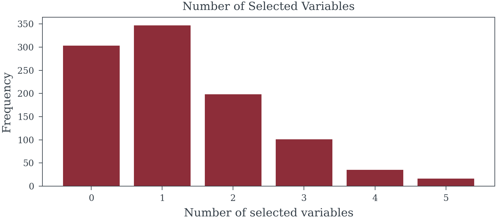
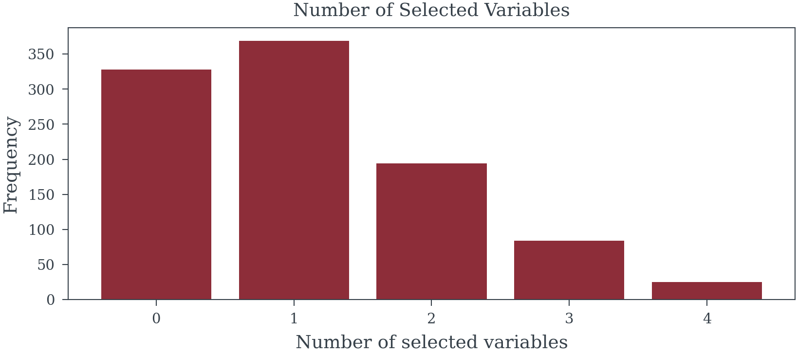
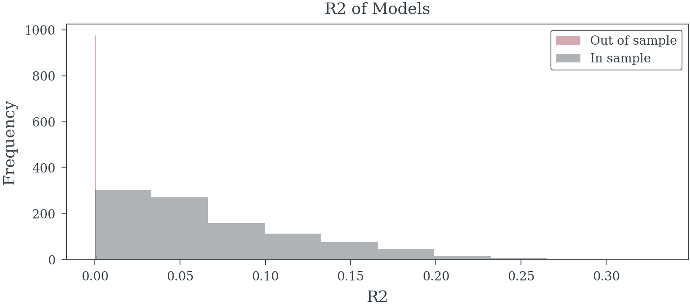
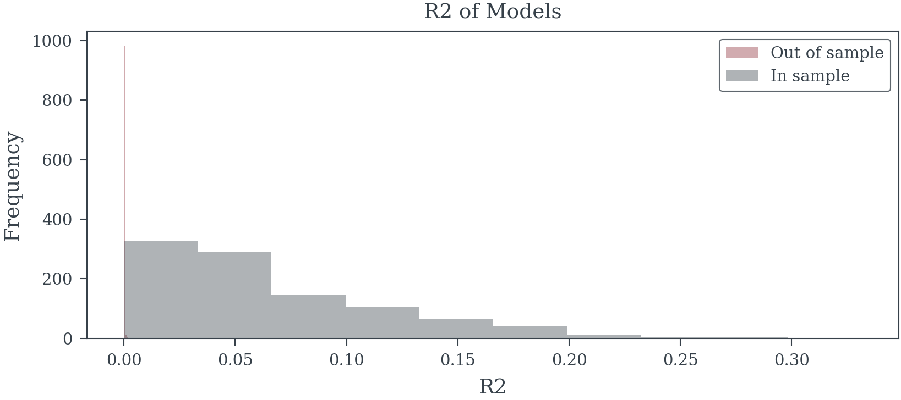
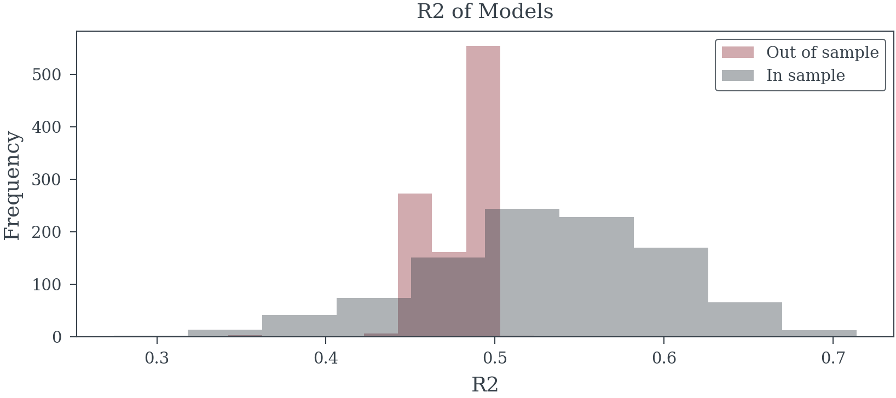
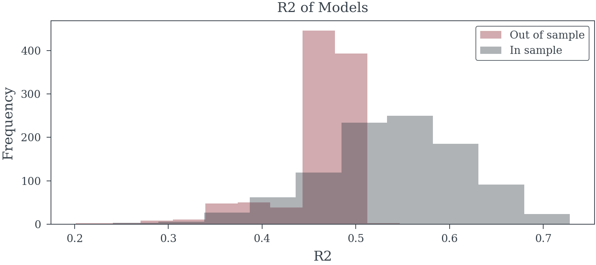
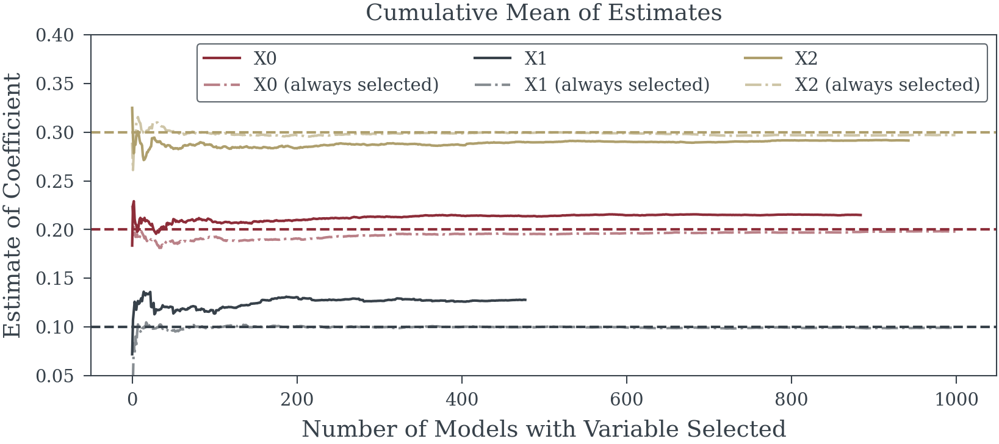

# The Illusion of Significance
Matthew Reda

<!-- WARNING: THIS FILE WAS AUTOGENERATED! DO NOT EDIT! -->

## From Illusion to Insight — TLDR

We’ve all seen it (perhaps even presented it); the perfectly constructed
model with impressive-looking p-values that is used to justify adding
millions in budget to a particular marketing channel. But how much can
we really trust these insights? Statistical modeling approaches that
rely on p-value thresholds (or |t-stat| \> 1) for variable selection
create a fundamental problem: the same data that builds the model also
validates it, creating a circular logic that **inevitably** results in
overconfidence. Methods like stepwise regression don’t just produce
slightly inaccurate models: they systematically generate **biased
coefficients**, **invalid statistical tests**, and **unstable
predictions**. When these flawed models drive budget decisions,
organizations end up misallocating resources based on what amounts to
**statistical mirages** rather than **genuine insights**.

Bayesian statistics offers a more realistic alternative that
acknowledges what traditional methods try to hide. **Uncertainty is
real!** It should inform our decisions and not be artificially removed
through statistical hocus-pocus for a slick deck. By treating parameters
as variables with probability distributions and formally incorporating
prior knowledge, Bayesian methods can help regularize models; prevent
them from making wild claims the data can’t support. Techniques like
spike-and-slab priors let us evaluate which variables truly matter
without arbitrary cutoffs, while Bayesian Model Averaging sensibly
hedges bets across multiple plausible models rather than on a single
one. Though implementing Bayesian approaches does require more
computational power, technical skill, and careful thought about prior
assumptions, the payoff is substantial: **more stable estimates**,
**intuitive uncertainty measures** that stakeholders can actually
understand (seriously what is a confidence interval), and ultimately,
budget allocation **insights** based on reality rather than
**statistical illusions**.

## Introduction: Modeling for Decision Making

### The Hidden Costs of Misspecification: Why Model Selection Matters

Statistical models, particularly within econometrics and marketing
analytics, serve as critical instruments for dissecting complex business
phenomena and guiding strategic decisions. Marketing Mix Modeling (MMM)
stands as a prime example. The insights derived from MMM are frequently
used for two primary purposes: understanding the historical contribution
of different marketing levers and, crucially, optimizing future budget
allocations to maximize return on investment (ROI).

MMM’s use extends beyond prediction toward causal inference:
understanding the “true”, incremental impact of altering a specific
input, such as increasing social advertising spend, on the outcome
variable (i.e. sales). This causal understanding is paramount for
effective budget optimization.

However, standard modeling procedures, particularly those involving
selection based on statistical significance, prioritize in-sample fit
over robustness and causal validity. This focus inadvertently introduces
substantial biases and instability. When models that systematically
misrepresent causal effects guide budget decisions, organizations face
significant resource misallocation that directly impacts profitability.
The aggregated and time-series nature of marketing data further
compounds these challenges, as weekly or monthly observations limit
statistical power while still requiring controls for seasonality,
economic trends, and competitive actions

As marketing analytics continues to drive increasingly larger investment
decisions, the potential damage from flawed model specifications grows
proportionally. This page examines how traditional variable selection
approaches might generate misleading insights and offers a more robust
Bayesian framework for addressing these methodological pitfalls.

### P-Value Selection: Common Pitfalls

The p-value is perhaps the most ubiquitous statistic in empirical
research across many disciplines, including econometrics and marketing
analytics. However, its widespread use is accompanied by pervasive
misuse and misinterpretation. A p-value represents the probability of
observing data as extreme as, or more extreme than, the data actually
obtained, under the assumption that a specific null hypothesis (e.g., a
regression coefficient being zero) is true. It is crucial to recognize
that it does not represent the probability that the null hypothesis is
true, nor the probability that the alternative hypothesis is false,
given the data.

Furthermore, statistical significance, typically declared when a p-value
falls below an arbitrary threshold like 0.05, is not synonymous with
practical, economic, or causal importance. An effect can be
statistically significant but trivially small in magnitude, especially
in large datasets where even minute deviations from the null hypothesis
can yield very small p-values.

Despite these limitations, p-values are frequently employed as the
primary criterion in automated variable selection procedures, such as
forward selection, backward elimination, and stepwise regression. These
algorithms iteratively add or remove predictor variables from a model
based on whether their associated p-values meet a predefined
significance threshold, or based on related criteria like changes in
R-squared or information criteria (AIC, BIC) which themselves have
connections to significance testing. While seemingly objective and
computationally convenient, this reliance on p-values for model
construction introduces several severe pitfalls.

<div>

> **The math behind t-stats**
>
> In the context of linear regression the test statistic for the i-th
> coefficient estimate is given as:
>
> $$
> \frac{\hat{\beta_i}}{\frac{\hat{\sigma}}{\sqrt{n\hat{\text{Var}}\[X_i\]}}\sqrt{VIF_i}}
> $$
>
> It’s clear from the mathematical description of the test statistic
> that:
>
> 1.  Coefficients ($\hat{\beta_i}$) with larger magnitudes — all else
>     being equal — will be more “significant”.
> 2.  Models with lower variance (*σ̂*) will lead to all coefficients
>     being more “significant”.
> 3.  Larger sample sizes (n) will increase all coefficients t-stat.
> 4.  With increased variance in a predictor (*σ̂*) — all else being
>     equal — that predictor will be more “significant”.
> 5.  With increased correlation of covariate *X*<sub>*i*</sub>
>     (*V**I**F*<sub>*i*</sub>) — all else being equal — that predictor
>     will be less “significant”.

</div>

#### Pitfall 1: P-hacking and Data Dredging

This refers to the practice of exploring multiple analytical
choices—testing different variables, functional forms (transformations),
subgroups, outlier handling rules, or data collection stopping
points—and selectively reporting only those combinations that yield
statistically significant p-values. This exploits the “researcher
degrees of freedom” inherent in data analysis. Stepwise regression
procedures automate this process, systematically “dredging” the data for
significant predictors based on p-value thresholds. This will occur even
if multiple regressions aren’t run. For example, if residuals of a model
are peaked at and variables that seem to match that residual pattern are
then added to the model.

#### Pitfall 2: Multiple Comparisons Problem

When numerous variables are tested for inclusion, as in stepwise
methods, the probability of incorrectly finding at least one variable to
be significant purely by chance (a Type I error or false positive)
becomes substantially inflated. The p-values reported by standard
software for the variables in the final selected model are typically not
adjusted for the multitude of tests performed during the selection
process. The probability of encountering at least one false positive
grows exponentially with the number of potential predictors considered.

<div>

> **Helper Functions**
>
> ``` python
> def random_covariance(n_vars):
>     """Create a random covariance matrix with a given correlation."""
>     
>     # Create a random correlation matrix
>     A = np.random.randn(n_vars, n_vars)
>     cov_matrix = np.dot(A, A.T)
>
>     return cov_matrix
>
> def create_data_no_signal(n_samples, n_vars, correlated=True):
>     """Create completely random data with no signal."""
>     
>     mean = np.zeros(n_vars)
>     if correlated:
>         cov = random_covariance(n_signal_vars+n_noise_vars)
>         var = np.diag(cov)
>         # Ensure var of variables is 1
>         cov = cov / np.sqrt(var[:, None] * var[None, :])
>     else:
>         cov = np.eye(n_signal_vars+n_noise_vars)
>
>     X = np.random.multivariate_normal(
>         mean=mean, 
>         cov=cov, 
>         size=n_samples
>         )
>
>     y = np.random.randn(n_samples)
>
>     return pd.DataFrame(X), pd.Series(y)
>
>
>
> def create_data_with_signal(
>     n_samples, 
>     n_signal_vars, 
>     n_noise_vars, 
>     betas = None,
>     correlated = True,
>     noise_level=1):
>     """Create data with a signal in the first n_signal_vars."""
>     
>     mean = np.zeros(n_signal_vars+n_noise_vars)
>     if correlated:
>         cov = random_covariance(n_signal_vars+n_noise_vars)
>         var = np.diag(cov)
>         # Ensure var of variables is 1
>         cov = cov / np.sqrt(var[:, None] * var[None, :])
>     else:
>         cov = np.eye(n_signal_vars+n_noise_vars)
>
>     
>     X = np.random.multivariate_normal(
>         mean=mean, 
>         cov=cov,
>         size=n_samples)
>     
>     if betas is None:
>         betas = np.zeros(n_signal_vars + n_noise_vars)
>         betas[:n_signal_vars] = np.random.randn(n_signal_vars)
>         
>     assert len(betas) == n_signal_vars + n_noise_vars, "betas must have the same length as the number of variables"
>
>     # Create a signal in the first n_signal_vars
>     y = np.dot(X, betas) + np.random.randn(n_samples) * noise_level * np.var(np.dot(X, betas))
>
>     return pd.DataFrame(X), pd.Series(y), betas
>
> def forward_selection(
>     X: pd.DataFrame, y: pd.Series,
>     threshold_in=0.05
> ):
>     """Perform forward selection with p-values to find the best subset of features."""
>     
>     # Initialize variables
>     n_features = X.shape[1]
>     selected_features = []
>     remaining_features = list(X.columns)
>     np.random.shuffle(remaining_features) # Shuffle features to simulate repeated runs
>     
>     # Perform forward selection with p-values
>     while remaining_features:
>         scores_with_candidates = []
>         for candidate in remaining_features:
>             features = selected_features + [candidate]
>             X_subset = X.loc[:, features]
>             model = sm.OLS(y, sm.add_constant(X_subset)).fit()
>             p_value = model.pvalues[candidate]
>             
>             scores_with_candidates.append((p_value, candidate))
>         
>         # Sort scores and select the best candidate
>         scores_with_candidates.sort()
>         best_new_score, best_candidate = scores_with_candidates[0]
>         
>         if best_new_score < threshold_in:
>             selected_features.append(best_candidate)
>             remaining_features.remove(best_candidate)
>         else:
>             break
>     return selected_features
>
> def backward_selection(
>     X: pd.DataFrame, y: pd.Series,
>     threshold_out=0.1
> ):
>     """Perform backward selection with p-values to find the best subset of features."""
>     
>     # Initialize variables
>     selected_features = list(X.columns)
>     
>     # Perform backward selection with p-values
>     while selected_features:
>         features = selected_features
>         X_subset = X.loc[:, features]
>         model = sm.OLS(y, sm.add_constant(X_subset)).fit()
>         
>         # Get the feature with the highest p-value
>         p_values = model.pvalues[1:]  # Exclude intercept
>         max_p_value = p_values.max()
>         
>         if max_p_value > threshold_out:
>             feature_to_remove = p_values.idxmax()
>             selected_features.remove(feature_to_remove)
>         else:
>             break
>     return selected_features
> ```

</div>

<div>

> **Simulate Variable Selection Based on P-Values**
>
> ``` python
> n_trials = 1_000
> n_samples = 100
> n_signal_vars = 3
> n_noise_vars = 20
>
> X, y = create_data_no_signal(
>     n_trials*n_samples,
>     n_signal_vars+n_noise_vars, 
>     correlated=False
> )
>
> X.columns = [f"X{i}" for i in range(X.shape[1])]
> y.name = "y"
> ```
>
> ``` python
> forward_selected_vars = []
> for trial in range(n_trials):
>     trial_df = X.loc[trial*n_samples:(trial+1)*n_samples-1, :]
>     trial_y = y.loc[trial*n_samples:(trial+1)*n_samples-1]
>     forward_selected_vars.append(
>         forward_selection(
>             trial_df, 
>             trial_y, 
>             threshold_in=0.05
>         )
>     )
> ```
>
> ``` python
> backward_selected_vars = []
> for trial in range(n_trials):
>     trial_df = X.loc[trial*n_samples:(trial+1)*n_samples-1, :]
>     trial_y = y.loc[trial*n_samples:(trial+1)*n_samples-1]
>     backward_selected_vars.append(
>         backward_selection(
>             trial_df, 
>             trial_y, 
>             threshold_out=0.05
>         )
>     )
> ```

</div>

<div class="panel-tabset">

## Backward Selection



    Family-wise error rate: 69.7%

## Foward Selection



    Family-wise error rate: 67.2%

</div>

#### Pitfall 3: Overfitting

Models constructed through procedures that aggressively optimize for
in-sample fit based on significance tests tend to overfit the data. They
capture random noise and idiosyncrasies specific to the training sample,
rather than the stable, underlying relationships. Consequently, these
models often exhibit poor predictive performance when applied to new,
independent datasets.

<div class="panel-tabset">

## Backward Selection

<div>

> **Model Analysis**
>
> ``` python
> SELECTION_METHOD = backward_selected_vars
> n_models_with_var = {
>     var: sum([var in selected for selected in SELECTION_METHOD])
>     for var in X.columns
> }
> in_sample_models = [
>     sm.OLS(
>         y.loc[i*n_samples:(i+1)*n_samples-1], 
>         sm.add_constant(X.loc[i*n_samples:(i+1)*n_samples-1, selected])
>         ).fit() 
>         for i, selected in enumerate(SELECTION_METHOD)
>     ]
> out_sample_model = [
>     sm.OLS(
>         y.loc[~i*n_samples:(i+1)*n_samples-1], 
>         sm.add_constant(X.loc[~i*n_samples:(i+1)*n_samples-1, selected])
>         ).fit()
>         for i, selected in enumerate(SELECTION_METHOD)
>     ]
> in_sample_r2 = [model.rsquared for model in in_sample_models]
> out_sample_r2 = [model.rsquared for model in out_sample_model]
> predictions = [
>     model.predict(sm.add_constant(X[selected])) 
>     for selected, model in zip(SELECTION_METHOD, in_sample_models)
> ]
> out_of_sample_mse = [
>     np.mean((
>         y.loc[~trial*n_samples:(trial+1)*n_samples-1] 
>         - pred[~trial*n_samples:(trial+1)*n_samples-1]
>         )**2) 
>     for trial, pred in enumerate(predictions)
> ]
> in_samples_mse = [
>     np.mean((
>         y.loc[trial*n_samples:(trial+1)*n_samples-1] 
>         - pred[trial*n_samples:(trial+1)*n_samples-1]
>         )**2) 
>     for trial, pred in enumerate(predictions)
> ]
> ```

</div>



## Forward Selection

<div>

> **Model Analysis**
>
> ``` python
> SELECTION_METHOD = forward_selected_vars
> n_models_with_var = {
>     var: sum([var in selected for selected in SELECTION_METHOD])
>     for var in X.columns
> }
> in_sample_models = [
>     sm.OLS(
>         y.loc[i*n_samples:(i+1)*n_samples-1], 
>         sm.add_constant(X.loc[i*n_samples:(i+1)*n_samples-1, selected])
>         ).fit() 
>         for i, selected in enumerate(SELECTION_METHOD)
>     ]
> out_sample_model = [
>     sm.OLS(
>         y.loc[~i*n_samples:(i+1)*n_samples-1], 
>         sm.add_constant(X.loc[~i*n_samples:(i+1)*n_samples-1, selected])
>         ).fit()
>         for i, selected in enumerate(SELECTION_METHOD)
>     ]
> in_sample_r2 = [model.rsquared for model in in_sample_models]
> out_sample_r2 = [model.rsquared for model in out_sample_model]
> predictions = [
>     model.predict(sm.add_constant(X[selected])) 
>     for selected, model in zip(SELECTION_METHOD, in_sample_models)
> ]
> out_of_sample_mse = [
>     np.mean((
>         y.loc[~trial*n_samples:(trial+1)*n_samples-1] 
>         - pred[~trial*n_samples:(trial+1)*n_samples-1]
>         )**2) 
>     for trial, pred in enumerate(predictions)
> ]
> in_samples_mse = [
>     np.mean((
>         y.loc[trial*n_samples:(trial+1)*n_samples-1] 
>         - pred[trial*n_samples:(trial+1)*n_samples-1]
>         )**2) 
>     for trial, pred in enumerate(predictions)
> ]
> ```

</div>



</div>

<div>

> **Simulation with Signal**
>
> ``` python
> betas = np.array([.2, .1, .3] + [0]*n_noise_vars)
>
> X_signal, y_signal, betas = create_data_with_signal(
>     n_trials*n_samples,
>     n_signal_vars, 
>     n_noise_vars, 
>     correlated=True,
>     betas=betas, 
>     noise_level=3
> )
> X_signal.columns = [f"X{i}" for i in range(X_signal.shape[1])]
> y_signal.name = "y"
> ```
>
> ``` python
> forward_selected_signal_vars = []
> for trial in range(n_trials):
>     trial_df = X_signal.loc[trial*n_samples:(trial+1)*n_samples-1, :]
>     trial_y = y_signal.loc[trial*n_samples:(trial+1)*n_samples-1]
>     forward_selected_signal_vars.append(
>         forward_selection(
>             trial_df, 
>             trial_y, 
>             threshold_in=0.05
>         )
>     )
> ```
>
> ``` python
> backward_selected_signal_vars = []
> for trial in range(n_trials):
>     trial_df = X_signal.loc[trial*n_samples:(trial+1)*n_samples-1, :]
>     trial_y = y_signal.loc[trial*n_samples:(trial+1)*n_samples-1]
>     backward_selected_signal_vars.append(
>         backward_selection(
>             trial_df, 
>             trial_y, 
>             threshold_out=0.05
>         )
>     )
> ```

</div>

<div class="panel-tabset">

## Forward Selection

<div>

> **Model Analysis**
>
> ``` python
> SELECTION_METHOD = forward_selected_signal_vars
>
> in_sample_models = [
>     sm.OLS(
>         y_signal.loc[i*n_samples:(i+1)*n_samples-1], 
>         sm.add_constant(X_signal.loc[i*n_samples:(i+1)*n_samples-1, selected])
>         ).fit() 
>         for i, selected in enumerate(SELECTION_METHOD)
>     ]
> out_sample_model = [
>     sm.OLS(
>         y_signal.loc[~i*n_samples:(i+1)*n_samples-1], 
>         sm.add_constant(X_signal.loc[~i*n_samples:(i+1)*n_samples-1, selected])
>         ).fit()
>         for i, selected in enumerate(SELECTION_METHOD)
>     ]
> in_sample_r2 = [model.rsquared for model in in_sample_models]
> out_sample_r2 = [model.rsquared for model in out_sample_model]
> predictions = [
>     model.predict(sm.add_constant(X_signal[selected])) 
>     for selected, model in zip(SELECTION_METHOD, in_sample_models)
> ]
> out_of_sample_mse = [
>     np.mean((
>         y_signal.loc[~trial*n_samples:(trial+1)*n_samples-1] 
>         - pred[~trial*n_samples:(trial+1)*n_samples-1]
>         )**2) 
>     for trial, pred in enumerate(predictions)
> ]
> in_samples_mse = [
>     np.mean((
>         y_signal.loc[trial*n_samples:(trial+1)*n_samples-1] 
>         - pred[trial*n_samples:(trial+1)*n_samples-1]
>         )**2) 
>     for trial, pred in enumerate(predictions)
> ]
> ```

</div>



## Backward Selection

<div>

> **Model Analysis**
>
> ``` python
> SELECTION_METHOD = backward_selected_signal_vars
>
> in_sample_models = [
>     sm.OLS(
>         y_signal.loc[i*n_samples:(i+1)*n_samples-1], 
>         sm.add_constant(X_signal.loc[i*n_samples:(i+1)*n_samples-1, selected])
>         ).fit() 
>         for i, selected in enumerate(SELECTION_METHOD)
>     ]
> out_sample_model = [
>     sm.OLS(
>         y_signal.loc[~i*n_samples:(i+1)*n_samples-1], 
>         sm.add_constant(X_signal.loc[~i*n_samples:(i+1)*n_samples-1, selected])
>         ).fit()
>         for i, selected in enumerate(SELECTION_METHOD)
>     ]
> in_sample_r2 = [model.rsquared for model in in_sample_models]
> out_sample_r2 = [model.rsquared for model in out_sample_model]
> predictions = [
>     model.predict(sm.add_constant(X_signal[selected])) 
>     for selected, model in zip(SELECTION_METHOD, in_sample_models)
> ]
> out_of_sample_mse = [
>     np.mean((
>         y_signal.loc[~trial*n_samples:(trial+1)*n_samples-1] 
>         - pred[~trial*n_samples:(trial+1)*n_samples-1]
>         )**2) 
>     for trial, pred in enumerate(predictions)
> ]
> in_samples_mse = [
>     np.mean((
>         y_signal.loc[trial*n_samples:(trial+1)*n_samples-1] 
>         - pred[trial*n_samples:(trial+1)*n_samples-1]
>         )**2) 
>     for trial, pred in enumerate(predictions)
> ]
> ```

</div>



</div>

#### Pitfall 4: Biased Coefficient Estimates

The regression coefficients associated with the variables selected
through stepwise or p-value driven methods are systematically biased,
typically inflated in magnitude (biased away from zero). This bias
arises because the selection process inherently favors variables that,
perhaps partly due to random sampling variation, exhibited stronger
relationships with the outcome in the specific dataset used for model
building.



#### Pitfall 5: Invalid Standard Errors, Confidence Intervals, and P-values

The standard errors calculated for the coefficients in the final,
selected model are systematically underestimated. This leads to
confidence intervals that are falsely narrow, suggesting greater
precision than is warranted, and p-values that are artificially small,
exaggerating statistical significance. Standard statistical inference
relies on the assumption that the model structure was specified before
examining the data. Applying these inferential tools after the model has
been selected based on the data violates this fundamental assumption,
rendering the resulting p-values, confidence intervals, and standard
errors statistically invalid without specialized (and often complex)
adjustments for the selection process.

    Coverage of 95% confidence interval for X0: 85.3%
    Coverage of 95% confidence interval for X1: 80.1%
    Coverage of 95% confidence interval for X2: 83.1%

#### Pitfall 6: Model Instability

The set of variables chosen by stepwise procedures can be highly
sensitive to small perturbations in the data, particularly when
predictor variables are correlated, a common issue in MMM. A slight
change in the dataset might lead to a substantially different selected
model.

    Selection frequency of model Y ~ X0 + X1 + X2: 17.8%
    Selection frequency of model Y ~ X0 + X2: 12.2%
    Selection frequency of model Y ~ X0 + X2 + X18: 1.4%
    Selection frequency of model Y ~ X0 + X2 + X22: 1.1%
    Selection frequency of model Y ~ X0 + X2 + X5: 1.1%
    Selection frequency of model Y ~ X0 + X1 + X2 + X21: 0.9%
    Selection frequency of model Y ~ X0 + X2 + X15: 0.9%
    Selection frequency of model Y ~ X0 + X1 + X2 + X15: 0.8%
    Selection frequency of model Y ~ X0 + X1 + X2 + X19: 0.8%
    Selection frequency of model Y ~ X0 + X2 + X4: 0.7%
    Selection frequency of other models: 62.3%

#### Pitfall 7: Issues with Variable Transformations

The problems extend beyond selecting which variables to include;
selecting the form of variables (e.g., choosing between linear,
logarithmic, c-curve, or s-curve terms) based on p-values or fit
statistics introduces the same risks. Optimizing transformations based
on in-sample fit can lead to overfitting and results that do not
generalize.

The root cause of these numerous pitfalls lies in the practice of using
the same dataset for both model specification (choosing variables,
choosing transformations) and subsequent statistical inference
(calculating coefficients, standard errors, p-values, CIs). Frequentist
statistical inference is predicated on the idea of evaluating a
pre-specified hypothesis or model against the data. When the data itself
is used to iteratively search for and construct the model that best fits
it, the assumptions underpinning the calculation of p-values and
confidence intervals are violated. The model is no longer a fixed entity
being tested; it is a product of the data exploration process.
Performing inference on this data-derived model as if it were
pre-specified leads to a systematic underestimation of uncertainty and
an overestimation of the significance and magnitude of the included
effects.

### Consequences for Causal Interpretation and Decision Accuracy

The statistical pathologies induced by p-value driven variable selection
have profound negative consequences, particularly when models are
intended to inform causal understanding and guide high-stakes decisions
like budget allocation.

Firstly, these methods are susceptible to identifying spurious
correlations as statistically significant relationships. In time-series
contexts like MMM, variables often exhibit trends or seasonality. Two
variables trending together (e.g., ice cream sales and drowning
incidents both rising in summer) can show a strong statistical
correlation even without a direct causal link. P-value based selection,
blind to the underlying causal structure, may readily incorporate such
spurious predictors, muddying the interpretation of genuine effects and
potentially reducing the precision of estimates for truly relevant
variables.

Secondly, the arbitrary nature of significance thresholds can lead to
omitted variable bias. A variable that is a genuine cause of the outcome
and is correlated with included predictors (a confounder) might be
excluded from the model simply because its p-value in the specific
sample happens to fall above the 0.05 threshold. Omitting necessary
confounders is a well-known source of bias in estimating the causal
effects of the remaining variables.

Thirdly, automated selection procedures lack awareness of the causal
roles variables play. They cannot distinguish between confounders (which
should generally be included to block backdoor paths), mediators (which
lie on the causal pathway and whose inclusion biases estimates of total
effects), or colliders (which can induce spurious associations if
conditioned upon). Selecting variables based solely on statistical
association with the outcome, without considering the underlying causal
graph (DAG), can lead to the inclusion of inappropriate variables
(mediators, colliders) or the exclusion of necessary ones (confounders),
severely compromising the model’s ability to yield valid causal
estimates.

These issues culminate in poor budget allocation decisions. The biased
coefficients resulting from p-value driven selection provide a distorted
picture of marketing effectiveness. ROI estimates for some channels
might be artificially inflated, while others might be underestimated or
even incorrectly estimated as negative. Allocating budgets based on
these flawed estimates inevitably leads to suboptimal resource
deployment, wasting money on ineffective channels and underinvesting in
potentially high-return activities. The overconfidence stemming from
falsely narrow confidence intervals further compounds this risk, leading
decision-makers to believe their flawed estimates are more precise than
they truly are.

Finally, the instability and sample-specificity of models built using
these techniques contribute to a lack of reproducibility. A model
selected based on the idiosyncrasies of one dataset is unlikely to
perform well or yield the same variable set when applied to new data,
hindering cumulative learning and reliable business forecasting. In
summary, the reliance on p-values for variable and transformation
selection, while computationally convenient, fundamentally undermines
the goal of building reliable and causally interpretable models for
decision support. The resulting biases in coefficient estimates and the
invalidity of standard statistical inferences directly translate into
poor decision-making, particularly in the context of budget optimization
where accurate estimation of incremental impact is essential.

## Core Statistical Challenges in MMM Selection

The selection of factors and transformations in MMM faces a confluence
of statistical difficulties:

- **Multiple Testing Problem:** Simultaneously testing numerous
  potential external factors and functional forms for media variables
  drastically increases the probability of false positives (Type I
  errors). Standard significance thresholds (e.g., p \< 0.05) are
  inadequate for controlling the overall error rate across such
  extensive testing.

- **Post-Selection Inference (PSI) Invalidity:** Standard statistical
  inference (p-values, confidence intervals) lacks theoretical validity
  when applied after model components have been selected using the same
  data. These post-selection metrics are often biased (e.g., p-values
  too small, confidence intervals too narrow), failing to maintain their
  nominal error rates or coverage probabilities.

- **Time-Series Complications:** MMM data’s time-series nature
  introduces further challenges:

  - *Autocorrelation:* Residuals are often correlated over time,
    violating standard regression assumptions and rendering OLS p-values
    inaccurate.

  - *Non-stationarity:* Trends in variables can lead to spurious
    regression—finding significant relationships where none exist
    causally.

  - *Seasonality:* Unaccounted-for seasonal patterns can induce spurious
    correlations. These properties can invalidate the significance tests
    used during selection, compounding the problem.

### Multiple Testing Problem

### Post-Selection Inference (PSI) Invalidity

### Time-Series Complications

## Common Problematic Selection Practices in MMM

Several widely used methodologies are particularly susceptible to the
challenges outlined above:

- **Stepwise Regression:** Automated procedures (forward, backward,
  bidirectional) iteratively add/remove variables based on significance
  thresholds. These are highly prone to multiple testing errors and
  instability, especially with autocorrelated or non-stationary
  time-series data, potentially selecting variables based on spurious
  correlations or invalid tests.

- **Significance-Based Transformation Selection:** Testing numerous
  functional forms (e.g., hundreds of adstock decays or saturation
  curves) for each media variable and selecting the one yielding the
  “most significant” coefficient represents a severe form of multiple
  testing, risking the selection of forms that fit noise.

- **Correlation Screening / Univariate Tests:** Selecting external
  factors based on simple correlations or individual significance tests
  ignores multicollinearity and is highly vulnerable to spurious
  findings driven by trends or seasonality, while also failing to
  account for multiple comparisons.

- **Best Subset Selection:** While potentially better if using
  information criteria (AIC/BIC), evaluating numerous model subsets
  still incurs a multiple testing burden and remains vulnerable to
  underlying time-series issues if not properly addressed within the
  model structure.

## Consequences of Flawed Selection in MMM

Employing naive selection methods and subsequent inference leads to
significant practical problems:

- **Misattribution of ROI & Effects:** Biased estimates for marketing
  coefficients (ROI) and potentially inaccurate representations of media
  dynamics (adstock, saturation).

- **Flawed Budget Allocation:** Suboptimal marketing investment
  decisions stemming from unreliable ROI figures.

- **Poor Understanding of Business Drivers:** Incorrect identification
  of baseline factors (trends, seasonality, macroeconomics) and media
  response patterns.

- **Model Instability & Non-Reproducibility:** Selected factors and
  transformations may vary considerably with data updates, reducing
  model credibility.

- **Overfitting:** Models capture noise specific to the historical data,
  resulting in poor predictive performance for forecasting or
  simulations.

- **Misinterpretation of Control Factor Coefficients:** Attributing
  causal effects to the coefficients of baseline or control factors
  (e.g., macroeconomic variables, competitor activity) included in the
  model. These factors are typically observational and likely confounded
  themselves; their coefficients primarily reflect statistical
  association and adjustment needed to isolate media effects, not
  necessarily isolated causal impacts. This misinterpretation is related
  to the “Table 2 fallacy,” where coefficients from a multivariable
  model are improperly treated as independent causal effects.

## Recommended Approaches and Considerations

Addressing these challenges requires more robust methodologies:

- **Rigorous Time-Series Handling:** Explicitly model or remove
  seasonality (e.g., dummies, Fourier terms, decomposition); test for
  and address non-stationarity (e.g., differencing); incorporate
  theoretically sound lags for media (adstock) and potentially external
  variables.

- **Regularization Methods (LASSO, Ridge, Elastic Net):** Handle many
  predictors simultaneously, perform coefficient shrinkage and implicit
  variable selection, often yielding more stable results than stepwise
  methods. Must be applied in conjunction with appropriate time-series
  structures.

- **Information Criteria (AIC, BIC):** Use for comparing non-nested
  models that correctly account for time-series properties, providing a
  more principled approach than p-value thresholds alone.

- **Time-Series Cross-Validation:** Employ methods like rolling-origin
  validation to assess out-of-sample predictive performance robustly.

- **Bayesian Frameworks:** Offer a probabilistic approach to
  uncertainty.

  - *Priors on Functional Forms:* Incorporate prior knowledge or average
    over plausible media transformations (adstock/saturation) instead of
    hard selection.

  - *Sparsity-Inducing Priors (e.g., Regularized Horseshoe):* Provide
    principled variable selection for external factors by shrinking
    irrelevant coefficients while retaining influential ones, directly
    modeling inclusion uncertainty.

- **Causal Inference Techniques:** Explore advanced time-series methods
  if the primary goal is establishing causal links (use with caution).

- **Domain Knowledge & Theory:** Prioritize pre-selecting candidate
  factors and transformation ranges based on business logic, economic
  theory, and prior research. Validate final model components for
  plausibility and stability.

<div>

> **Improper Use of Domain Knowledge**
>
> Exogenous factors in MMM are frequently confounded with media
> variables or other unobserved drivers. Consequently, the estimated
> coefficient for an exogenous variable may not represent its direct
> causal impact on the outcome but rather the statistical adjustment
> necessary to deconfound the estimated media effects. Rejecting such a
> variable because its coefficient sign contradicts simple causal
> expectations might inadvertently remove a necessary control variable,
> potentially leading to more biased estimates of media effectiveness.

</div>

Adopting these more rigorous approaches is fundamental to developing
media mix models that are statistically sound, reliable, and
strategically valuable.
