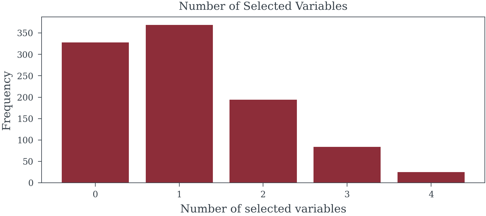

# The Illusion of Significance
Matthew Reda

<!-- WARNING: THIS FILE WAS AUTOGENERATED! DO NOT EDIT! -->

## From Illusion to Insight — TLDR

We’ve all seen it (perhaps even presented it); the perfectly constructed
model with impressive-looking p-values that is used to justify adding
millions in budget to a particular marketing channel. But how much can
we really trust these insights? Statistical modeling approaches that
rely on p-value thresholds (or |t-stat| \> 1) for variable selection
create a fundamental problem: the same data that builds the model also
validates it, creating a circular logic that **inevitably** results in
overconfidence. Methods like stepwise regression don’t just produce
slightly inaccurate models: they systematically generate **biased
coefficients**, **invalid statistical tests**, and **unstable
predictions**. When these flawed models drive budget decisions,
organizations end up misallocating resources based on what amounts to
**statistical mirages** rather than **genuine insights**.

Bayesian statistics offers a more realistic alternative that
acknowledges what traditional methods try to hide. **Uncertainty is
real!** It should inform our decisions and not be artificially removed
through statistical hocus-pocus for a slick deck. By treating parameters
as variables with probability distributions and formally incorporating
prior knowledge, Bayesian methods can help regularize models; prevent
them from making wild claims the data can’t support. Techniques like
spike-and-slab priors let us evaluate which variables truly matter
without arbitrary cutoffs, while Bayesian Model Averaging sensibly
hedges bets across multiple plausible models rather than on a single
one. Though implementing Bayesian approaches does require more
computational power, technical skill, and careful thought about prior
assumptions, the payoff is substantial: **more stable estimates**,
**intuitive uncertainty measures** that stakeholders can actually
understand (seriously what is a confidence interval), and ultimately,
budget allocation **insights** based on reality rather than
**statistical illusions**.

## Introduction: Modeling for Decision Making

### The Hidden Costs of Misspecification: Why Model Selection Matters

Statistical models, particularly within econometrics and marketing
analytics, serve as critical instruments for dissecting complex business
phenomena and guiding strategic decisions. Marketing Mix Modeling (MMM)
stands as a prime example. The insights derived from MMM are frequently
used for two primary purposes: understanding the historical contribution
of different marketing levers and, crucially, optimizing future budget
allocations to maximize return on investment (ROI).

MMM’s use extends beyond prediction toward causal inference:
understanding the “true”, incremental impact of altering a specific
input, such as increasing social advertising spend, on the outcome
variable (i.e. sales). This causal understanding is paramount for
effective budget optimization.

However, standard modeling procedures, particularly those involving
selection based on statistical significance, prioritize in-sample fit
over robustness and causal validity. This focus inadvertently introduces
substantial biases and instability. When models that systematically
misrepresent causal effects guide budget decisions, organizations face
significant resource misallocation that directly impacts profitability.
The aggregated and time-series nature of marketing data further
compounds these challenges, as weekly or monthly observations limit
statistical power while still requiring controls for seasonality,
economic trends, and competitive actions

As marketing analytics continues to drive increasingly larger investment
decisions, the potential damage from flawed model specifications grows
proportionally. This page examines how traditional variable selection
approaches might generate misleading insights and offers a more robust
Bayesian framework for addressing these methodological pitfalls.

### The P-Value Trap: Why Significance Testing Misleads Model Selection

While p-values remain ubiquitous in statistical analysis, their
application in model selection creates systematic distortions. The
p-value measures the probability of observing data equally or more
extreme than what was collected, assuming the null hypothesis holds
true. Yet this metric becomes deeply problematic when used as a
selection criterion.

**Critical misconceptions persist:** Statistical significance doesn’t
equate to practical importance. Large datasets can render trivial
effects “significant,” while genuinely important relationships may fail
arbitrary thresholds. When automated procedures like stepwise regression
rely on p-values for variable selection, they introduce cascading
failures:

#### The Seven Deadly Sins of P-Value Selection

<div>

> **The math behind t-stats**
>
> In the context of linear regression the test statistic for the i-th
> coefficient estimate is given as:
>
> $$
> \frac{\hat{\beta_i}}{\frac{\hat{\sigma}}{\sqrt{n\hat{\text{Var}}\[X_i\]}}\sqrt{VIF_i}}
> $$
>
> It’s clear from the mathematical description of the test statistic
> that:
>
> 1.  Coefficients ($\hat{\beta_i}$) with larger magnitudes — all else
>     being equal — will be more “significant”.
> 2.  Models with lower variance (*σ̂*) will lead to all coefficients
>     being more “significant”.
> 3.  Larger sample sizes (n) will increase all coefficients t-stat.
> 4.  With increased variance in a predictor (*σ̂*) — all else being
>     equal — that predictor will be more “significant”.
> 5.  With increased correlation of covariate *X*<sub>*i*</sub>
>     (*V**I**F*<sub>*i*</sub>) — all else being equal — that predictor
>     will be less “significant”.

</div>

**1. Systematized Cherry-Picking**  
Stepwise procedures systematically explore variable combinations until
finding “significant” patterns. This automated search through analytical
choices—different predictors, transformations, and
specifications—guarantees finding patterns that appear meaningful but
often reflect random noise. Even examining residuals to guide variable
addition constitutes this problematic practice.

**2. The Multiplicity Trap**  
Testing numerous variables inflates false discovery rates exponentially.
When evaluating 20 potential predictors, the chance of incorrectly
declaring at least one significant approaches certainty. Standard
software reports unadjusted p-values, hiding the true extent of multiple
testing performed during selection.

<div>

> **Helper Functions**
>
> ``` python
> def random_covariance(n_vars):
>     """Create a random covariance matrix with a given correlation."""
>     
>     # Create a random correlation matrix
>     A = np.random.randn(n_vars, n_vars)
>     cov_matrix = np.dot(A, A.T)
>
>     return cov_matrix
>
> def create_data_no_signal(n_samples, n_vars, correlated=True):
>     """Create completely random data with no signal."""
>     
>     mean = np.zeros(n_vars)
>     if correlated:
>         cov = random_covariance(n_signal_vars+n_noise_vars)
>         var = np.diag(cov)
>         # Ensure var of variables is 1
>         cov = cov / np.sqrt(var[:, None] * var[None, :])
>     else:
>         cov = np.eye(n_signal_vars+n_noise_vars)
>
>     X = np.random.multivariate_normal(
>         mean=mean, 
>         cov=cov, 
>         size=n_samples
>         )
>
>     y = np.random.randn(n_samples)
>
>     return pd.DataFrame(X), pd.Series(y)
>
>
>
> def create_data_with_signal(
>     n_samples, 
>     n_signal_vars, 
>     n_noise_vars, 
>     betas = None,
>     correlated = True,
>     noise_level=1):
>     """Create data with a signal in the first n_signal_vars."""
>     
>     mean = np.zeros(n_signal_vars+n_noise_vars)
>     if correlated:
>         cov = random_covariance(n_signal_vars+n_noise_vars)
>         var = np.diag(cov)
>         # Ensure var of variables is 1
>         cov = cov / np.sqrt(var[:, None] * var[None, :])
>     else:
>         cov = np.eye(n_signal_vars+n_noise_vars)
>
>     
>     X = np.random.multivariate_normal(
>         mean=mean, 
>         cov=cov,
>         size=n_samples)
>     
>     if betas is None:
>         betas = np.zeros(n_signal_vars + n_noise_vars)
>         betas[:n_signal_vars] = np.random.randn(n_signal_vars)
>         
>     assert len(betas) == n_signal_vars + n_noise_vars, "betas must have the same length as the number of variables"
>
>     # Create a signal in the first n_signal_vars
>     y = np.dot(X, betas) + np.random.randn(n_samples) * noise_level * np.var(np.dot(X, betas))
>
>     return pd.DataFrame(X), pd.Series(y), betas
>
> def forward_selection(
>     X: pd.DataFrame, y: pd.Series,
>     threshold_in=0.05
> ):
>     """Perform forward selection with p-values to find the best subset of features."""
>     
>     # Initialize variables
>     n_features = X.shape[1]
>     selected_features = []
>     remaining_features = list(X.columns)
>     np.random.shuffle(remaining_features) # Shuffle features to simulate repeated runs
>     
>     # Perform forward selection with p-values
>     while remaining_features:
>         scores_with_candidates = []
>         for candidate in remaining_features:
>             features = selected_features + [candidate]
>             X_subset = X.loc[:, features]
>             model = sm.OLS(y, sm.add_constant(X_subset)).fit()
>             p_value = model.pvalues[candidate]
>             
>             scores_with_candidates.append((p_value, candidate))
>         
>         # Sort scores and select the best candidate
>         scores_with_candidates.sort()
>         best_new_score, best_candidate = scores_with_candidates[0]
>         
>         if best_new_score < threshold_in:
>             selected_features.append(best_candidate)
>             remaining_features.remove(best_candidate)
>         else:
>             break
>     return selected_features
>
> def backward_selection(
>     X: pd.DataFrame, y: pd.Series,
>     threshold_out=0.1
> ):
>     """Perform backward selection with p-values to find the best subset of features."""
>     
>     # Initialize variables
>     selected_features = list(X.columns)
>     
>     # Perform backward selection with p-values
>     while selected_features:
>         features = selected_features
>         X_subset = X.loc[:, features]
>         model = sm.OLS(y, sm.add_constant(X_subset)).fit()
>         
>         # Get the feature with the highest p-value
>         p_values = model.pvalues[1:]  # Exclude intercept
>         max_p_value = p_values.max()
>         
>         if max_p_value > threshold_out:
>             feature_to_remove = p_values.idxmax()
>             selected_features.remove(feature_to_remove)
>         else:
>             break
>     return selected_features
> ```

</div>

<div>

> **Simulate Variable Selection Based on P-Values**
>
> ``` python
> n_trials = 1_000
> n_samples = 100
> n_signal_vars = 3
> n_noise_vars = 20
>
> X, y = create_data_no_signal(
>     n_trials*n_samples,
>     n_signal_vars+n_noise_vars, 
>     correlated=False
> )
>
> X.columns = [f"X{i}" for i in range(X.shape[1])]
> y.name = "y"
> ```
>
> ``` python
> forward_selected_vars = []
> for trial in range(n_trials):
>     trial_df = X.loc[trial*n_samples:(trial+1)*n_samples-1, :]
>     trial_y = y.loc[trial*n_samples:(trial+1)*n_samples-1]
>     forward_selected_vars.append(
>         forward_selection(
>             trial_df, 
>             trial_y, 
>             threshold_in=0.05
>         )
>     )
> ```
>
> ``` python
> backward_selected_vars = []
> for trial in range(n_trials):
>     trial_df = X.loc[trial*n_samples:(trial+1)*n_samples-1, :]
>     trial_y = y.loc[trial*n_samples:(trial+1)*n_samples-1]
>     backward_selected_vars.append(
>         backward_selection(
>             trial_df, 
>             trial_y, 
>             threshold_out=0.05
>         )
>     )
> ```

</div>

<div class="panel-tabset">

## Backward Selection


    Family-wise error rate: 69.7%

## Foward Selection



    Family-wise error rate: 67.2%

</div>

**3. Chasing Ghosts in the Data**  
Selection procedures optimize for patterns specific to the training
sample, capturing random fluctuations rather than stable relationships.
This aggressive pursuit of in-sample fit produces models that fail
catastrophically on new data.

<div class="panel-tabset">

## Backward Selection

<div>

> **Model Analysis**
>
> ``` python
> SELECTION_METHOD = backward_selected_vars
> n_models_with_var = {
>     var: sum([var in selected for selected in SELECTION_METHOD])
>     for var in X.columns
> }
> in_sample_models = [
>     sm.OLS(
>         y.loc[i*n_samples:(i+1)*n_samples-1], 
>         sm.add_constant(X.loc[i*n_samples:(i+1)*n_samples-1, selected])
>         ).fit() 
>         for i, selected in enumerate(SELECTION_METHOD)
>     ]
> out_sample_model = [
>     sm.OLS(
>         y.loc[~i*n_samples:(i+1)*n_samples-1], 
>         sm.add_constant(X.loc[~i*n_samples:(i+1)*n_samples-1, selected])
>         ).fit()
>         for i, selected in enumerate(SELECTION_METHOD)
>     ]
> in_sample_r2 = [model.rsquared for model in in_sample_models]
> out_sample_r2 = [model.rsquared for model in out_sample_model]
> predictions = [
>     model.predict(sm.add_constant(X[selected])) 
>     for selected, model in zip(SELECTION_METHOD, in_sample_models)
> ]
> out_of_sample_mse = [
>     np.mean((
>         y.loc[~trial*n_samples:(trial+1)*n_samples-1] 
>         - pred[~trial*n_samples:(trial+1)*n_samples-1]
>         )**2) 
>     for trial, pred in enumerate(predictions)
> ]
> in_samples_mse = [
>     np.mean((
>         y.loc[trial*n_samples:(trial+1)*n_samples-1] 
>         - pred[trial*n_samples:(trial+1)*n_samples-1]
>         )**2) 
>     for trial, pred in enumerate(predictions)
> ]
> ```

</div>


## Forward Selection

<div>

> **Model Analysis**
>
> ``` python
> SELECTION_METHOD = forward_selected_vars
> n_models_with_var = {
>     var: sum([var in selected for selected in SELECTION_METHOD])
>     for var in X.columns
> }
> in_sample_models = [
>     sm.OLS(
>         y.loc[i*n_samples:(i+1)*n_samples-1], 
>         sm.add_constant(X.loc[i*n_samples:(i+1)*n_samples-1, selected])
>         ).fit() 
>         for i, selected in enumerate(SELECTION_METHOD)
>     ]
> out_sample_model = [
>     sm.OLS(
>         y.loc[~i*n_samples:(i+1)*n_samples-1], 
>         sm.add_constant(X.loc[~i*n_samples:(i+1)*n_samples-1, selected])
>         ).fit()
>         for i, selected in enumerate(SELECTION_METHOD)
>     ]
> in_sample_r2 = [model.rsquared for model in in_sample_models]
> out_sample_r2 = [model.rsquared for model in out_sample_model]
> predictions = [
>     model.predict(sm.add_constant(X[selected])) 
>     for selected, model in zip(SELECTION_METHOD, in_sample_models)
> ]
> out_of_sample_mse = [
>     np.mean((
>         y.loc[~trial*n_samples:(trial+1)*n_samples-1] 
>         - pred[~trial*n_samples:(trial+1)*n_samples-1]
>         )**2) 
>     for trial, pred in enumerate(predictions)
> ]
> in_samples_mse = [
>     np.mean((
>         y.loc[trial*n_samples:(trial+1)*n_samples-1] 
>         - pred[trial*n_samples:(trial+1)*n_samples-1]
>         )**2) 
>     for trial, pred in enumerate(predictions)
> ]
> ```

</div>


</div>

<div>

> **Simulation with Signal**
>
> ``` python
> betas = np.array([.2, .1, .3] + [0]*n_noise_vars)
>
> X_signal, y_signal, betas = create_data_with_signal(
>     n_trials*n_samples,
>     n_signal_vars, 
>     n_noise_vars, 
>     correlated=True,
>     betas=betas, 
>     noise_level=3
> )
> X_signal.columns = [f"X{i}" for i in range(X_signal.shape[1])]
> y_signal.name = "y"
> ```
>
> ``` python
> forward_selected_signal_vars = []
> for trial in range(n_trials):
>     trial_df = X_signal.loc[trial*n_samples:(trial+1)*n_samples-1, :]
>     trial_y = y_signal.loc[trial*n_samples:(trial+1)*n_samples-1]
>     forward_selected_signal_vars.append(
>         forward_selection(
>             trial_df, 
>             trial_y, 
>             threshold_in=0.05
>         )
>     )
> ```
>
> ``` python
> backward_selected_signal_vars = []
> for trial in range(n_trials):
>     trial_df = X_signal.loc[trial*n_samples:(trial+1)*n_samples-1, :]
>     trial_y = y_signal.loc[trial*n_samples:(trial+1)*n_samples-1]
>     backward_selected_signal_vars.append(
>         backward_selection(
>             trial_df, 
>             trial_y, 
>             threshold_out=0.05
>         )
>     )
> ```

</div>

<div class="panel-tabset">

## Forward Selection

<div>

> **Model Analysis**
>
> ``` python
> SELECTION_METHOD = forward_selected_signal_vars
>
> in_sample_models = [
>     sm.OLS(
>         y_signal.loc[i*n_samples:(i+1)*n_samples-1], 
>         sm.add_constant(X_signal.loc[i*n_samples:(i+1)*n_samples-1, selected])
>         ).fit() 
>         for i, selected in enumerate(SELECTION_METHOD)
>     ]
> out_sample_model = [
>     sm.OLS(
>         y_signal.loc[~i*n_samples:(i+1)*n_samples-1], 
>         sm.add_constant(X_signal.loc[~i*n_samples:(i+1)*n_samples-1, selected])
>         ).fit()
>         for i, selected in enumerate(SELECTION_METHOD)
>     ]
> in_sample_r2 = [model.rsquared for model in in_sample_models]
> out_sample_r2 = [model.rsquared for model in out_sample_model]
> predictions = [
>     model.predict(sm.add_constant(X_signal[selected])) 
>     for selected, model in zip(SELECTION_METHOD, in_sample_models)
> ]
> out_of_sample_mse = [
>     np.mean((
>         y_signal.loc[~trial*n_samples:(trial+1)*n_samples-1] 
>         - pred[~trial*n_samples:(trial+1)*n_samples-1]
>         )**2) 
>     for trial, pred in enumerate(predictions)
> ]
> in_samples_mse = [
>     np.mean((
>         y_signal.loc[trial*n_samples:(trial+1)*n_samples-1] 
>         - pred[trial*n_samples:(trial+1)*n_samples-1]
>         )**2) 
>     for trial, pred in enumerate(predictions)
> ]
> ```

</div>


## Backward Selection

<div>

> **Model Analysis**
>
> ``` python
> SELECTION_METHOD = backward_selected_signal_vars
>
> in_sample_models = [
>     sm.OLS(
>         y_signal.loc[i*n_samples:(i+1)*n_samples-1], 
>         sm.add_constant(X_signal.loc[i*n_samples:(i+1)*n_samples-1, selected])
>         ).fit() 
>         for i, selected in enumerate(SELECTION_METHOD)
>     ]
> out_sample_model = [
>     sm.OLS(
>         y_signal.loc[~i*n_samples:(i+1)*n_samples-1], 
>         sm.add_constant(X_signal.loc[~i*n_samples:(i+1)*n_samples-1, selected])
>         ).fit()
>         for i, selected in enumerate(SELECTION_METHOD)
>     ]
> in_sample_r2 = [model.rsquared for model in in_sample_models]
> out_sample_r2 = [model.rsquared for model in out_sample_model]
> predictions = [
>     model.predict(sm.add_constant(X_signal[selected])) 
>     for selected, model in zip(SELECTION_METHOD, in_sample_models)
> ]
> out_of_sample_mse = [
>     np.mean((
>         y_signal.loc[~trial*n_samples:(trial+1)*n_samples-1] 
>         - pred[~trial*n_samples:(trial+1)*n_samples-1]
>         )**2) 
>     for trial, pred in enumerate(predictions)
> ]
> in_samples_mse = [
>     np.mean((
>         y_signal.loc[trial*n_samples:(trial+1)*n_samples-1] 
>         - pred[trial*n_samples:(trial+1)*n_samples-1]
>         )**2) 
>     for trial, pred in enumerate(predictions)
> ]
> ```

</div>


</div>

**4. Systematic Bias in Effect Sizes**  
Selected variables exhibit inflated coefficients—not because they’re
truly important, but because the selection process favors variables that
randomly showed stronger associations. This “winner’s curse”
systematically overstates the magnitude of selected effects.


**5. False Precision**  
Post-selection standard errors understate true uncertainty. Confidence
intervals appear misleadingly narrow, and p-values seem artificially
compelling. These metrics assume the model was pre-specified, not
constructed through data exploration, rendering them fundamentally
invalid.

    Coverage of 95% confidence interval for X0: 85.3%
    Coverage of 95% confidence interval for X1: 80.1%
    Coverage of 95% confidence interval for X2: 83.1%

**6. Fragile Foundations**  
Minor data perturbations can dramatically alter selected variables,
especially with correlated predictors common in marketing data. Models
that shift drastically with small changes provide unreliable foundations
for business decisions.

    Selection frequency of model Y ~ X0 + X1 + X2: 17.8%
    Selection frequency of model Y ~ X0 + X2: 12.2%
    Selection frequency of model Y ~ X0 + X2 + X18: 1.4%
    Selection frequency of model Y ~ X0 + X2 + X22: 1.1%
    Selection frequency of model Y ~ X0 + X2 + X5: 1.1%
    Selection frequency of model Y ~ X0 + X1 + X2 + X21: 0.9%
    Selection frequency of model Y ~ X0 + X2 + X15: 0.9%
    Selection frequency of model Y ~ X0 + X1 + X2 + X15: 0.8%
    Selection frequency of model Y ~ X0 + X1 + X2 + X19: 0.8%
    Selection frequency of model Y ~ X0 + X2 + X4: 0.7%
    Selection frequency of other models: 62.3%

**7. Transformation Theater**  
Selecting functional forms (logarithmic, polynomial, adstock curves)
based on significance compounds these problems. Testing hundreds of
possible transformations virtually guarantees finding spurious patterns
that optimize noise rather than signal.

**The fundamental flaw:** Using the same data for both model
construction and inference violates core statistical principles. When
data drives model specification, subsequent p-values and confidence
intervals lose their theoretical justification. The model becomes a
product of exploration, not a hypothesis to test.

### When Statistical Illusions Drive Business Decisions

The fundamental flaws in p-value driven selection cascade into
real-world consequences that directly undermine business objectives.
These aren’t merely theoretical concerns—they systematically distort our
understanding of marketing effectiveness and lead to predictably poor
outcomes.

**False Signals Masquerading as Insights**

Time-series data creates fertile ground for statistical mirages. When
ice cream sales and drowning incidents both spike in summer, naive
selection procedures eagerly identify “significant” relationships
without recognizing the underlying seasonal driver. In MMM contexts,
these spurious associations proliferate: variables that merely share
trends or seasonal patterns get misidentified as meaningful predictors.
Each false inclusion not only clutters the model but actively degrades
our ability to estimate genuine marketing effects with precision.

**The Hidden Cost of Arbitrary Thresholds**

Significance cutoffs create a binary world where p = 0.049 means
inclusion and p = 0.051 means exclusion—despite these values being
functionally identical. This arbitrary boundary systematically excludes
genuine causal factors that happen to fall just above the threshold in a
particular sample. When these excluded variables correlate with included
predictors, their omission biases every remaining coefficient. The model
doesn’t just miss one relationship; it distorts all others.

**Causal Blindness in Automated Selection**

Statistical algorithms operate without causal awareness, unable to
distinguish between fundamentally different types of relationships:

- **Confounders** that must be included to block spurious associations
- **Mediators** whose inclusion obscures the total effects we seek to
  measure  
- **Colliders** that create artificial associations when mistakenly
  conditioned upon

Procedures that select variables based solely on statistical association
routinely include variables that poison causal interpretation
(mediators, colliders) while excluding those essential for valid
inference (confounders). The resulting model becomes a causal minefield
where coefficients represent unknown mixtures of direct effects,
indirect pathways, and induced biases.

**The Analyst’s Dilemma: When Wrong Becomes Right**

Perhaps most insidiously, these flawed models create organizational
inertia that perpetuates their errors. Analysts face immense pressure to
ensure their updated models produce the same high-level conclusions as
previous efforts—that TV drives 30% of sales, that digital ROI is 2.5x,
that seasonality accounts for 15% of variance. This leads to a troubling
pattern of behaviors:

- **Reverse Engineering Results:** When new data suggests different
  attribution patterns, analysts manipulate model specifications until
  familiar conclusions emerge—adjusting adstock parameters, saturation
  curves, or control variables not for statistical validity but to
  reproduce expected ROI rankings
- **Strategic Time Splitting:** Models that attribute “too much” or “too
  little” to certain channels get subdivided into multiple time periods,
  fracturing the data until each segment yields the “correct” share of
  voice
- **Selective Variable Inclusion:** External factors get added or
  removed based on how they shift attribution between channels, using
  statistical significance as cover for what amounts to results
  manipulation
- **Transformation Shopping:** Analysts cycle through combinations of
  functional forms until the model produces ROI estimates and
  attribution percentages that align with organizational beliefs

This creates a vicious cycle where each generation of models must
reproduce not just any results, but the specific business conclusions
that stakeholders have internalized. “TV should drive 25-35% of sales”
becomes an unquestionable truth that models must confirm rather than
test.

**From Flawed Models to Failed Strategies**

These statistical distortions translate directly into business failures.
Biased coefficients paint a fantasy landscape of marketing
effectiveness—some channels appear artificially powerful while others
seem worthless or even harmful. Budget optimization based on these
illusions inevitably fails: money flows to channels whose effectiveness
was overstated while truly profitable opportunities starve for
investment. The false confidence provided by inappropriately narrow
confidence intervals compounds the damage, encouraging aggressive
reallocation based on estimates that are both wrong and wrongly certain.

**The Reproducibility Crisis in Practice**

Models built on sample-specific quirks fail to generalize. When next
quarter’s data arrives, the carefully selected variable set often
produces wildly different results—or the selection procedure itself
chooses entirely different variables. Rather than acknowledging this
instability as evidence of flawed methodology, analysts scramble to
manipulate the new model until it reproduces familiar attribution
patterns and ROI hierarchies. This stability theater destroys
organizational learning: teams spend more effort confirming past
conclusions than discovering new truths. Strategic planning becomes
impossible when the “insights” guiding it are actually fossilized
artifacts of historical data mining.

**The compound effect is devastating:** flawed statistical procedures
produce unstable models with biased coefficients, which generate
incorrect ROI estimates that become organizational “truth,” leading to
poor budget allocation and ultimately reduced business performance. What
begins as a methodological shortcut evolves into an institutional
pathology where being consistently wrong becomes preferable to admitting
uncertainty.

### The Reality Gap: When Exploratory Analysis Masquerades as Causal Insight

Modern Marketing Mix Modeling exists in a troubling state of
methodological confusion. Practitioners routinely present their models
as **predictive engines** capable of forecasting future performance,
while stakeholders interpret and apply these same models as **causal
instruments** for optimizing budget allocation. The uncomfortable truth
is that most MMM implementations are, at best, **sophisticated
exploratory analyses** dressed up in the language of prediction and
causation.

This disconnect between claims and capabilities creates a cascade of
poor decisions. When exploratory models—built through p-value mining and
post-hoc selection—are treated as causal truth, organizations
systematically misallocate resources based on statistical mirages. The
biased coefficients and overfitted relationships that emerge from flawed
selection procedures don’t merely represent academic concerns; they
translate directly into wasted marketing spend and missed opportunities.

**Perhaps most perniciously, these flawed models become the benchmarks
against which new methodologies are evaluated.** When a novel approach
produces different results from traditional stepwise regression, it’s
often dismissed as “inconsistent with established models” rather than
recognized as potentially more accurate. This creates a self-reinforcing
cycle where statistical illusions become institutionalized truths, and
genuine improvements are rejected for failing to reproduce familiar
biases.

The path forward requires honest acknowledgment of what current MMM
practices actually deliver: exploratory insights that might suggest
interesting patterns but cannot reliably predict future outcomes or
identify causal relationships. Until the field adopts more rigorous
methodologies—whether through Bayesian frameworks, proper
regularization, or genuine causal inference techniques—we must stop
pretending that models built on circular logic and data dredging can
guide multi-million dollar decisions. **The stakes are too high, and the
methods too flawed, to continue conflating exploration with
explanation.**

## The Path Forward: Getting Comfortable with Uncertainty

### The Uncertainty Laundering Machine

Statistician Andrew Gelman offers a devastating critique of how
statistics is abused that perfectly captures the MMM crisis:

> “The ethics comes in if we think of this entire journal publication
> system as a sort of machine for laundering uncertainty: researchers
> start with junk data (for example, poorly-thought-out experiments on
> college students, or surveys of online Mechanical Turk participants)
> and then work with the data, straining out the null results and
> reporting what is statistically significant, in a process analogous to
> the notorious mortgage lenders of the mid-2000s, who created
> high-value ‘tranches’ out of subprime loans. The loan crisis
> precipitated an economic recession, and I doubt the replication crisis
> will trigger such a crash in science. But I see a crucial similarity
> in that technical methods (structured finance for mortgages;
> statistical significance for scientific research) were being used to
> create value out of thin air.”

This analogy illuminates exactly what’s happening in MMM. We start with
inherently uncertain, observational data—weekly sales figures confounded
by countless factors, media spend that varies with business strategy,
competitive actions we can’t fully observe. Then we run this “junk data”
through our statistical machinery, straining out the non-significant
variables, p-hacking our way to impressive results, and packaging the
survivors as “insights.”

**Just as subprime mortgages got repackaged as AAA-rated securities,
uncertain correlations get transformed into “proven” ROI figures.** The
technical sophistication of the process—the complex adstock
transformations, the multi-stage regression models, the impressive
p-values—serves the same function as the financial engineering of the
2000s: it launders uncertainty, creating an appearance of value and
reliability that doesn’t actually exist.

### The MMM Value Mirage

In marketing analytics, this laundering process follows a predictable
pattern:

1.  **Start with messy reality:** Aggregated time series with ~200
    observations, dozens of correlated variables, unobserved confounders
2.  **Apply the machinery:** Stepwise regression, transformation
    selection, significance testing
3.  **Strain out uncertainty:** Discard “non-significant” variables,
    ignore wide confidence intervals, suppress unstable results
4.  **Package as certainty:** “TV delivers 3.2x ROI (p \< 0.001)”

The organization receives what appears to be valuable
intelligence—precise ROI estimates, clear attribution percentages,
“data-driven” recommendations. But like those mortgage-backed
securities, the value is illusory. We’ve used technical methods to
create certainty out of thin air.

### From False Precision to Honest Ignorance

The marketing analytics industry has become addicted not just to
certainty, but to this process of manufacturing it. Stakeholders demand
precise ROI figures, and analysts have built an entire
infrastructure—not to find truth, but to launder the fundamental
uncertainty of marketing effectiveness into seemingly solid insights.
The narrow confidence intervals and impressive p-values aren’t evidence
of precision; they’re the output of a machine designed to hide
uncertainty, not quantify it.

**The first step forward is dismantling the laundering machine.** We
must stop using statistical sophistication to obscure uncertainty and
start using it for its proper purpose: to honestly quantify and
communicate what we don’t know. Real marketing effects are messy,
context-dependent, and riddled with uncertainty. Any methodology that
claims otherwise is selling false comfort rather than actionable
insight.

### Why Uncertainty Is Your Friend, Not Your Enemy

Uncertainty isn’t a flaw to be hidden—it’s crucial information that
should guide decision-making. Consider two scenarios:

1.  **Traditional approach:** “TV ROI is 3.2x”
2.  **Honest approach:** “TV ROI is likely between 1.5x and 5x, with our
    best estimate at 3x”

The second statement contains more useful information. It acknowledges
that TV might be marginally profitable or highly lucrative, suggesting a
portfolio approach rather than an all-or-nothing strategy. The
traditional approach’s false precision encourages overconfident bets
based on point estimates that are likely wrong.

**Uncertainty quantification enables better decisions:**

- **Portfolio thinking:** Wide credible intervals suggest
  diversification
- **Experimentation priorities:** High uncertainty indicates where tests
  would be most valuable
- **Risk management:** Understanding the range of possible outcomes
  prevents catastrophic misallocation
- **Stakeholder trust:** Acknowledging limitations builds more
  credibility than false precision

### Bayesian Methods: Where Uncertainty Is a Feature, Not a Bug

Bayesian approaches offer a natural framework for embracing uncertainty.
Rather than producing single “best” models with spurious precision,
Bayesian methods:

- **Quantify parameter uncertainty:** Every coefficient comes with a
  full probability distribution, not just a point estimate
- **Propagate uncertainty honestly:** Uncertainty in parameters flows
  through to uncertainty in predictions and decisions
- **Incorporate prior knowledge:** Historical information and business
  constraints enter through priors, not through p-hacking
- **Average over possibilities:** Instead of selecting one model,
  Bayesian Model Averaging acknowledges multiple plausible realities

When implemented properly, these methods produce results that might
initially disappoint those seeking false precision: “Digital marketing
ROI is probably positive (85% probability above 1.0x) with a median
estimate of 1.8x and substantial uncertainty (90% credible interval:
0.7x to 4.2x).” Yet this honest assessment provides far more value than
a precisely wrong point estimate.

### Practical Steps Toward Uncertainty-Aware MMM

**1. Reframe the Conversation**

- Stop asking “What’s the exact ROI?” and start asking “What range of
  ROIs is plausible?”
- Replace “Which model is correct?” with “What do multiple reasonable
  models suggest?”
- Shift from “Prove this channel works” to “How confident are we about
  this channel’s effectiveness?”

**2. Adopt Robust Methodologies**

- Implement regularization techniques that acknowledge coefficient
  uncertainty
- Use Bayesian methods with thoughtful priors based on accumulated
  knowledge
- Employ ensemble approaches that combine multiple models rather than
  selecting one
- Validate through hold-out testing that honestly assesses predictive
  uncertainty

**3. Visualize Uncertainty**

- Replace tables of point estimates with distributional plots
- Show credible/confidence intervals prominently, not as footnotes
- Use scenario planning based on uncertainty ranges
- Create decision rules that explicitly account for uncertainty levels

**4. Build Organizational Comfort**

- Educate stakeholders that uncertainty is information, not incompetence
- Celebrate decisions that acknowledge and plan for uncertainty
- Reward analysts who surface uncomfortable uncertainties over those who
  provide false comfort
- Create processes that use uncertainty to guide experimentation
  priorities

### The Competitive Advantage of Honest Uncertainty

Organizations that embrace uncertainty gain a paradoxical advantage: by
admitting what they don’t know, they make better decisions than
competitors clinging to false precision. They:

- **Avoid catastrophic bets** based on spuriously precise estimates
- **Identify genuine opportunities** that uncertainty-averse competitors
  miss
- **Build resilient strategies** that perform well across plausible
  scenarios
- **Learn faster** by focusing experimentation where uncertainty is
  highest
- **Adapt more quickly** when reality diverges from estimates

### A New Standard for MMM Excellence

The future of marketing analytics lies not in ever-more-sophisticated
methods for manufacturing certainty, but in frameworks that honestly
quantify and communicate what we don’t know. Excellence should be
measured not by how narrow our confidence intervals are, but by how well
our uncertainty estimates reflect reality.

This requires a fundamental shift: from viewing uncertainty as a problem
to solve, to recognizing it as essential information for
decision-making. Only by getting comfortable with uncertainty can we
move beyond the statistical theater that currently dominates MMM and
toward methods that genuinely improve marketing effectiveness.

**The path forward is clear:** Embrace uncertainty, quantify it
honestly, and use it to make more robust decisions. The
alternative—continuing to pretend we know more than we do—has already
proven its capacity for expensive failure.

## From Statistical Theater to Decision Science: A Synthetic Case Study

### Introduction: Two Paradigms, Two Futures

To illustrate the stark contrast between current practices and what’s
possible, we present a synthetic case study of a hypothetical consumer
brand allocating $50 million across marketing channels. We’ll analyze
the same dataset through two fundamentally different lenses:

**The Status Quo:** A traditional frequentist approach that relies on
stepwise selection, p-value thresholds, and point estimates—the
statistical laundering machine in action.

**The Alternative:** A Bayesian causal framework that explicitly models
uncertainty, incorporates domain knowledge, and acknowledges multiple
plausible realities—an honest attempt to support decision-making under
uncertainty.

This isn’t merely an academic exercise. The differences in these
approaches translate directly into millions of dollars in marketing
effectiveness. One path leads to overconfident bets based on statistical
mirages; the other to robust strategies that perform well across the
range of plausible truths. The following analysis demonstrates not just
why change is necessary, but what that change looks like in practice.

### 1. The Business Context and Data Generating Process

- Company background and marketing challenge
- True underlying causal structure (hidden from analysts)
- Simulated data generation with realistic confounders
- Observable variables vs. latent factors

<div>

> **Synthetic Data Generation**
>
> ``` python
> def hill_transformation(x, alpha=1, k=0.5):
>     """
>     Hill saturation transformation
>     x: media spend (scaled 0-1)
>     alpha: shape parameter (<=1 for c-shaped curve, >1 for s-shaped)
>     k: half-saturation point
>     """
>     return x**alpha / (x**alpha + k**alpha)
>
> def model_simulate(
>     X: pd.DataFrame,
>     coeffs_main: pd.Series,
>     intercept: float,
>     alphas: pd.Series,
>     k_values: pd.Series,
>     media_maxes: pd.Series,
>     noise_level: float = 0.1,
>     random_seed: int = 42,
> ):
>     np.random.seed(random_seed)
>     X = X.copy()
>     media_vars = list(alphas.index)
>     X_scaled = X[media_vars] / (media_maxes + 1e-10)
>     
>     for media_var in media_vars:
>         X[media_var] = hill_transformation(X_scaled[media_var], alpha=alphas[media_var], k=k_values[media_var])
>     
>     contribution = X*coeffs_main
>     y_mean = X.dot(coeffs_main) + intercept
>
>     y_sample = y_mean + np.random.normal(0, noise_level, size=len(y_mean))
>
>     return X, y_mean, contribution, y_sample
>
> def generate_synthetic_mmm_data(
>     n_weeks=156, 
>     n_media=5, 
>     random_seed=42
>     ):
>     """
>     Generate realistic MMM data with complex causal structure including mediator, confounders and colliders
>     n_weeks: 3 years of weekly data
>     """
>     np.random.seed(random_seed)
>     # Time index
>     t = np.arange(n_weeks)
>     
>     # ========================================
>     # CONFOUNDERS (affect both media spend and sales)
>     # ========================================
>     
>     # 1. Seasonality - drives both promotional activity and natural sales patterns
>     seasonality = 0.3 * np.sin(2 * np.pi * t / 52) + 0.1 * np.sin(4 * np.pi * t / 52)
>     
>     # 2. Macroeconomic conditions - affects marketing budgets and consumer spending
>     gdp_growth = 0.02 + 0.01 * np.sin(2 * np.pi * t / 104) + np.random.normal(0, 1, n_weeks).cumsum() / n_weeks
>     unemployment = 5.0 + 2.0 * np.sin(2 * np.pi * t / 156 + 1.5) + np.random.normal(0, 0.2, n_weeks)
>     consumer_confidence = 100 + 10 * gdp_growth * 10 - 2 * unemployment + np.random.normal(0, 3, n_weeks)
>     
>     # 3. Major retail events - drive both promotional spend and sales
>     holidays = np.zeros(n_weeks)
>     black_friday = [(w % 52 == 47) for w in range(n_weeks)]
>     christmas = [(w % 52 >= 50) or (w % 52 <= 1) for w in range(n_weeks)]
>     holidays[black_friday] = 1.5
>     holidays[christmas] = 1.0
>     
>     # 4. Competitor promotional intensity - triggers reactive spending and affects sales
>     competitor_promos = 0.3 + 0.2 * np.sin(2 * np.pi * t / 13) + 0.1 * np.random.randn(n_weeks).cumsum() / n_weeks
>     competitor_promos = np.clip(competitor_promos, 0, 1)
>     
>     # 5. Product lifecycle stage - affects marketing strategy and natural demand
>     product_age = t / 52  # Years since launch
>     product_lifecycle = np.exp(-product_age / 2) * 0.5 + 0.5  # Decaying newness effect
>     
>     # ========================================
>     # SALES DRIVERS (affect sales but NOT media spend)
>     # ========================================
>     
>     # 1. Distribution gains - more stores carrying product
>     distribution_points = 1000 + 10 * t + np.random.normal(0, 20, n_weeks).cumsum()
>     distribution_index = distribution_points / distribution_points[0]
>     
>     # 2. Product quality improvements (e.g., ratings)
>     quality_score = 4.0 + 0.02 * t / n_weeks + 0.1 * np.random.randn(n_weeks).cumsum() / n_weeks
>     quality_score = np.clip(quality_score, 3.5, 5.0)
>     
>     # 3. Word of mouth momentum (builds over time, not marketing driven)
>     wom_momentum = 0.1 * (1 - np.exp(-t / 26)) + 0.05 * np.random.randn(n_weeks).cumsum() / n_weeks
>     wom_momentum = np.clip(wom_momentum, 0, 0.3)
>     
>     # ========================================
>     # RED HERRINGS (correlated but don't affect sales)
>     # ========================================
>     
>     # 1. Weather patterns (correlate with seasonality but don't drive sales)
>     temperature = 60 + 25 * np.sin(2 * np.pi * t / 52) + np.random.normal(0, 7, n_weeks)
>     precipitation = 2 + 1.5 * np.sin(2 * np.pi * t / 52 + 3) + np.abs(np.random.normal(0, 0.5, n_weeks))
>     
>     # 2. Stock market index (correlates with economy but doesn't directly drive sales)
>     stock_index = 10000 + 50 * t + 500 * gdp_growth.cumsum() + 200 * np.random.randn(n_weeks).cumsum()
>     
>     # 3. Social media followers (grows over time but doesn't drive sales)
>     social_followers = 10000 * (1 + 0.02 * t + 0.1 * np.random.randn(n_weeks).cumsum() / n_weeks)
>     social_followers = np.maximum(social_followers, 10000)
>     
>     # 4. Website traffic (correlates with media but doesn't independently drive sales)
>     base_traffic = 50000 + 500 * t
>     
>     # 5. Number of SKUs (correlates with time but doesn't affect aggregate sales)
>     num_skus = 10 + np.floor(t / 26) + np.random.binomial(2, 0.1, n_weeks).cumsum()
>     
>     # ========================================
>     # MEDIA SPEND GENERATION
>     # ========================================
>     
>     media_names = ['TV', 'Digital', 'Social', 'Radio', 'Print']
>     media_spend_raw = np.zeros((n_weeks, n_media))
>     
>     # Budget influenced by confounders
>     total_budget_index = (1.0 + 
>                          0.2 * consumer_confidence / 100 + 
>                          0.6 * holidays + 
>                          0.4 * product_lifecycle - 
>                          0.15 * competitor_promos)
>     
>     # TV: Traditional, holiday-focused, reactive to competition
>     media_spend_raw[:, 0] = (200000 * (total_budget_index *
>                             (0.4 + 0.3 * holidays + 0.2 * seasonality - 0.1 * competitor_promos)) *
>                             (1 + 0.2 * np.random.randn(n_weeks)))
>     
>     # Digital: Growing trend, responsive to GDP
>     media_spend_raw[:, 1] = (150000 * (total_budget_index *
>                             (0.3 + 0.05 * t / n_weeks + 0.2 * gdp_growth * 10)) *
>                             (1 + 0.3 * np.random.randn(n_weeks)))
>     
>     # Social: Volatile, product-launch focused
>     media_spend_raw[:, 2] = (80000 * (total_budget_index * 
>                             (0.2 + 0.4 * product_lifecycle - 0.2 * holidays)) *
>                             (1 + 0.5 * np.random.randn(n_weeks)))
>     
>     # Radio: Steady with seasonal pattern
>     media_spend_raw[:, 3] = (50000 * (total_budget_index *
>                             0.3 + 0.2 * seasonality) *
>                             (1 + 0.4 * np.random.randn(n_weeks)))
>     
>     # Print: Declining trend, older demographic
>     media_spend_raw[:, 4] = (40000 * total_budget_index * 
>                             (0.4 - 0.1 * t / n_weeks) *
>                             (1 + 0.3 * np.random.randn(n_weeks)))
>     
>     # Ensure non-negative
>     media_spend_raw = np.maximum(media_spend_raw, 0)
>     
>     # Scale and transform
>     media_spend_scaled = media_spend_raw / (media_spend_raw.max(axis=0) + 1e-10)
>     media_transformed = np.zeros_like(media_spend_scaled)
>     
>     # Different saturation parameters by channel
>     alphas = [1.0, 2.0, 1.4, 1.0, 1.2]
>     k_values = [0.4, 0.3, 0.35, 0.5, 0.6]
>     
>     for i in range(n_media):
>         media_transformed[:, i] = hill_transformation(media_spend_scaled[:, i], alphas[i], k_values[i])
>     
>     # Update website traffic based on digital spend (red herring - correlates but doesn't cause sales)
>     website_traffic = base_traffic + 1000 * media_transformed[:, 1] + 500 * media_transformed[:, 2]
>     
>     # ========================================
>     # MEDIATOR VARIABLE (Media → Purchase Intent → Sales)
>     # ========================================
>     
>     # Purchase intent is driven by media spend (especially TV and Digital)
>     # This represents the percentage of consumers intending to purchase
>     purchase_intent_base = 0.15  # 15% base intent
>
>     indirect_media_effects = np.array([0.12, 0.10, 0.08, 0.04, 0.02])  # Indirect media effects on intent
>     # Media drives purchase intent
>     purchase_intent = (purchase_intent_base +
>                       0.12 * media_transformed[:, 0] +    # TV has strong effect on intent
>                       0.10 * media_transformed[:, 1] +    # Digital also drives intent
>                       0.08 * media_transformed[:, 2] +    # Social moderate effect
>                       0.04 * media_transformed[:, 3] +    # Radio small effect
>                       0.02 * media_transformed[:, 4] +    # Print minimal effect
>                       0.05 * seasonality +                # Some seasonal variation
>                       0.03 * np.random.randn(n_weeks))   # Random noise
>     
>     purchase_intent = np.clip(purchase_intent, 0, 0.6)  # Cap at 60% intent
>     
>     # ========================================
>     # TRUE SALES GENERATION (Multiplicative Model)
>     # ========================================
>     
>     
>     
>     # Direct media effects (excluding path through purchase intent)
>     # These are smaller because some effect goes through the mediator
>     direct_media_effects = np.array([0.08, 0.08, 0.04, 0.04, 0.02])
>
>     
>     # Effect of purchase intent on sales
>     purchase_intent_effect = 2.0  # Strong effect of intent on sales
>
>     # True TOTAL media effects (including path through purchase intent)
>     true_total_media_effects = indirect_media_effects * purchase_intent_effect + direct_media_effects 
>
>     # Base sales (log scale)
>     log_base_sales = 6.0  # exp(6) ~ 403 base sales
>     
>     # Build sales from true drivers only
>     log_sales = (log_base_sales + 
>                 # Confounders
>                 0.25 * seasonality +
>                 0.15 * (consumer_confidence - 100) / 20 +
>                 0.35 * holidays +
>                 -0.20 * (competitor_promos - 0.5) +
>                 0.10 * product_lifecycle +
>                 # Sales-only drivers  
>                 0.30 * np.log(distribution_index) +
>                 0.20 * (quality_score - 4.0) +
>                 0.15 * wom_momentum +
>                 # MEDIATOR effect
>                 purchase_intent_effect * (purchase_intent - purchase_intent_base))
>     
>     # Add DIRECT media effects only
>     for i in range(n_media):
>         log_sales += direct_media_effects[i] * media_transformed[:, i]
>     
>     # Add noise
>     log_sales += np.random.normal(0, 0.02, n_weeks)
>     
>     # Convert to sales
>     sales = np.exp(log_sales)
>     
>     # ========================================
>     # COLLIDER (affected by both media and sales)
>     # ========================================
>     
>     # Brand awareness surveys - caused by both advertising and sales success
>     brand_awareness = (20 +  # Base awareness
>                       15 * (media_transformed[:, 0] + 0.5 * media_transformed[:, 1]) +  # TV and Digital drive awareness
>                       10 * (sales / sales.mean() - 1) +  # Success drives awareness
>                       5 * np.random.randn(n_weeks))  # Noise
>     brand_awareness = np.clip(brand_awareness, 0, 100)
>     
>     # ========================================
>     # CREATE DATAFRAME
>     # ========================================
>     
>     data = pd.DataFrame({
>         'week': t,
>         'sales': sales,
>         'log_sales': log_sales,
>         
>         # Confounders
>         'seasonality': seasonality,
>         'gdp_growth': gdp_growth,
>         'unemployment': unemployment,
>         'consumer_confidence': consumer_confidence,
>         'holidays': holidays,
>         'competitor_promos': competitor_promos,
>         'product_lifecycle': product_lifecycle,
>         
>         # Sales drivers (not media drivers)
>         'distribution_index': distribution_index,
>         'quality_score': quality_score,
>         'word_of_mouth': wom_momentum,
>         
>         # Red herrings (don't affect sales)
>         'temperature': temperature,
>         'precipitation': precipitation,
>         'stock_index': stock_index,
>         'social_followers': social_followers,
>         'website_traffic': website_traffic,
>         'num_skus': num_skus,
>         
>         # MEDIATOR
>         'purchase_intent': purchase_intent,
>         
>         # Collider
>         'brand_awareness': brand_awareness
>     })
>     
>     # Add media variables
>     for i, name in enumerate(media_names):
>         data[f'{name}_spend'] = media_spend_raw[:, i]
>         data[f'{name}_spend_scaled'] = media_spend_scaled[:, i]
>         data[f'{name}_transformed'] = media_transformed[:, i]
>     
>     # Create some derived features that stepwise might pick up
>     data['temp_squared'] = data['temperature'] ** 2
>     data['awareness_change'] = data['brand_awareness'].diff().fillna(0)
>     data['intent_change'] = data['purchase_intent'].diff().fillna(0)
>     data['spend_total'] = media_spend_raw.sum(axis=1)
>     
>     return data, true_total_media_effects, direct_media_effects, {"indirect": indirect_media_effects,"alphas": alphas, "k_values": k_values} , media_names
> ```

</div>

<div>

> **True Market Structure**
>
> <div>
>
>  src="02_the_illusion_of_significance_files/figure-commonmark/dot-figure-1.png"
> style="width:7in;height:5in" />
>
> </div>
>
> ``` python
> # Generate the data
> data, true_total_effects, true_direct_effects, params, media_names = generate_synthetic_mmm_data(random_seed=12, n_weeks=362)
>
> print(f"\nTrue TOTAL media effects (including indirect path): {dict(zip(media_names, true_total_effects))}")
> print(f"True DIRECT media effects (excluding mediator path): {dict(zip(media_names, true_direct_effects))}")
> ```
>
>
>     True TOTAL media effects (including indirect path): {'TV': np.float64(0.32), 'Digital': np.float64(0.28), 'Social': np.float64(0.2), 'Radio': np.float64(0.12), 'Print': np.float64(0.06)}
>     True DIRECT media effects (excluding mediator path): {'TV': np.float64(0.08), 'Digital': np.float64(0.08), 'Social': np.float64(0.04), 'Radio': np.float64(0.04), 'Print': np.float64(0.02)}
>
> ``` python
> plt.plot(data['TV_spend'].sort_values(), cont['TV_spend'].sort_values()*100, label='TV Spend Contribution', color='C0', alpha=0.6)
> plt.plot(data['Digital_spend'].sort_values(), cont['Digital_spend'].sort_values()*100, label='Digital Spend Contribution', color='C1', alpha=0.6)
> plt.plot(data['Social_spend'].sort_values(), cont['Social_spend'].sort_values()*100, label='Social Spend Contribution', color='C2', alpha=0.6)
> plt.plot(data['Print_spend'].sort_values(), cont['Print_spend'].sort_values()*100, label='Print Spend Contribution', color='C3', alpha=0.6)
> plt.plot(data['Radio_spend'].sort_values(), cont['Radio_spend'].sort_values()*100, label='Radio Spend Contribution', color='C4', alpha=0.6)
> plt.xlabel("Spend")
> plt.ylabel("% Lift to Sales")
> plt.title("Media Spend Contribution to Sales")
> plt.legend();
> ```
>
> 

</div>

<div class="panel-tabset">

## GDP


## Unemployment


## CCI


## Sales


</div>

<div class="panel-tabset">

## Digital


## Print


## Social


## TV


## Radio


</div>

### 2. Approach A: The Frequentist P-Value Theater

#### 2.1 The Analyst’s Ritual

- Variable selection via stepwise regression
- Transformation shopping for media curves
- Chasing significance across model specifications

<div>

> **Base Variable Selection Code**
>
> ``` python
> def prepare_features_for_selection(data, media_names):
>     """
>     Prepare all possible features for stepwise selection
>     """
>     features = pd.DataFrame()
>     media_features = pd.DataFrame()
>     
>     # Media variables (transformed) (assuming transformation is already known)
>     # for name in media_names:
>     #     features[f'{name}'] = data[f'{name}_transformed']
>     
>     # All potential control variables (mixing good and bad)
>     control_vars = [
>         #'seasonality', # True Seasonality is often un-observed
>         'gdp_growth', 'unemployment', 'consumer_confidence',
>         'holidays', 'competitor_promos', 'product_lifecycle',
>         'distribution_index', 'quality_score', 'word_of_mouth',
>         'temperature', 'precipitation', 'stock_index',
>         'social_followers', 'website_traffic', 'num_skus',
>         'purchase_intent',  # The MEDIATOR!
>         'brand_awareness',  # The collider!
>         'temp_squared', 'awareness_change', 'intent_change' # 'spend_total'
>     ]
>     
>     for var in control_vars:
>         if var in data.columns:
>             features[var] = data[var]
>     
>     # # Add some interaction terms (fishing expedition)
>     # features['TV_x_holidays'] = data['TV_transformed'] * data['holidays']
>     # features['Digital_x_confidence'] = data['Digital_transformed'] * data['consumer_confidence'] / 100
>     # features['Social_x_lifecycle'] = data['Social_transformed'] * data['product_lifecycle']
>     # features['TV_x_intent'] = data['TV_transformed'] * data['purchase_intent']  # Interaction with mediator!
>     for media in media_names:
>         media_features[f"{media}_transformed"] = data[f'{media}_transformed']
>     for media, half_sat, n in product(media_names, np.linspace(0.3, 0.8, 6), np.linspace(1.0, 2.0, 11)):
>         media_features[f'{media}_{half_sat:0.2f}_{n:0.2f}'] = hill_transformation(data[f'{media}_spend_scaled'], n, half_sat)
>         # add lagged variables for more complexity
>         if media in media_names[:2]:
>             media_features[f'{media}_{half_sat:0.2f}_{n:0.2f}_lag1'] = media_features[f'{media}_{half_sat:0.2f}_{n:0.2f}'].shift(1).fillna(0)
>     
>     # # Add lagged variables (more complexity)
>     # for name in media_names[:2]:  # Just TV and Digital to avoid too many variables
>     #     features[f'{name}_lag1'] = data[f'{name}_transformed'].shift(1).fillna(0)
>     
>     # Time trends
>     features['trend'] = np.arange(len(data)) / len(data)
>     features['trend_sq'] = features['trend'] ** 2
>     features['log_distribution_index'] = np.log(features['distribution_index'])
>     return features, media_features
>
> def stepwise_selection(X, y, threshold_in=0.05, threshold_out=0.10, verbose=True):
>     """
>     Forward-backward stepwise selection based on p-values
>     """
>     included = []
>     excluded = list(X.columns)
>     
>     best_aic = np.inf
>     
>     if verbose:
>         print("\nStarting stepwise selection...")
>         print(f"Total candidate variables: {len(excluded)}")
>         print("-" * 80)
>     
>     step = 0
>     while True:
>         changed = False
>         
>         # Forward step
>         excluded_copy = excluded.copy()
>         best_pvalue = threshold_in + 1
>         best_feature = None
>         
>         for feature in excluded_copy:
>             features = included + [feature]
>             X_subset = X[features]
>             X_with_const = sm.add_constant(X_subset, has_constant='add')
>             
>             try:
>                 model = sm.OLS(y, X_with_const).fit()
>                 p_value = model.pvalues[feature]
>                 
>                 if p_value < best_pvalue:
>                     best_pvalue = p_value
>                     best_feature = feature
>                     best_aic_candidate = model.aic
>             except:
>                 continue
>         
>         if best_feature and best_pvalue < threshold_in:
>             included.append(best_feature)
>             excluded.remove(best_feature)
>             changed = True
>             step += 1
>             best_aic = best_aic_candidate
>             
>             if verbose:
>                 print(f"Step {step:3d} - ADDED '{best_feature:25s}' (p={best_pvalue:.4f}, AIC={best_aic:.1f})")
>         
>         # Backward step
>         if len(included) > 0:
>             X_subset = X[included]
>             X_with_const = sm.add_constant(X_subset, has_constant='add')
>             model = sm.OLS(y, X_with_const).fit()
>             
>             # Find worst p-value
>             pvalues = model.pvalues[1:]  # Exclude intercept
>             worst_pvalue = pvalues.max()
>             worst_feature = pvalues.idxmax()
>             
>             if worst_pvalue > threshold_out:
>                 included.remove(worst_feature)
>                 excluded.append(worst_feature)
>                 changed = True
>                 step += 1
>                 
>                 # Refit without removed variable
>                 X_subset_new = X[included]
>                 X_with_const_new = sm.add_constant(X_subset_new, has_constant='add')
>                 model_new = sm.OLS(y, X_with_const_new).fit()
>                 best_aic = model_new.aic
>                 
>                 if verbose:
>                     print(f"Step {step:3d} - REMOVED '{worst_feature:25s}' (p={worst_pvalue:.4f}, AIC={best_aic:.1f})")
>         
>         if not changed:
>             break
>     
>     if verbose:
>         print("-" * 80)
>         print(f"Final model includes {len(included)} variables")
>
>     return included
> ```

</div>

<div>

> **Code to Select Media Transform**
>
> ``` python
> def select_best_transformed_media_features(features, media_features, y, media_names, base_features):
>     """
>     Select best transformed media features based on p-values
>     """
>     selected_media = []
>     total_features = features.copy()
>     total_features[media_features.columns] = media_features
>     
>     for media_name in media_names:
>         best_tvalue = -np.inf
>         best_transform = ""
>         for transform in media_features.columns:
>             if not media_name in transform:
>                 continue
>             X_subset = total_features[[transform] + base_features]
>             X_with_const = sm.add_constant(X_subset, has_constant='add')
>
>             try:
>                 model = sm.OLS(y, X_with_const).fit()
>                 t_value = model.tvalues[transform]
>                 if t_value > best_tvalue:
>                     best_tvalue = t_value
>                     best_transform = transform
>             except:
>                 if best_transform == "":
>                     best_transform = transform
>                 continue
>         
>         selected_media.append(best_transform)
>
>     
>     
>     return selected_media
> ```

</div>

**Select Base Variables**

<div class="cell-output cell-output-stdout">


    Starting stepwise selection...
    Total candidate variables: 23
    --------------------------------------------------------------------------------
    Step   1 - ADDED 'holidays                 ' (p=0.0000, AIC=-386.9)
    Step   2 - ADDED 'purchase_intent          ' (p=0.0000, AIC=-692.8)
    Step   3 - ADDED 'stock_index              ' (p=0.0000, AIC=-904.5)
    Step   4 - ADDED 'precipitation            ' (p=0.0000, AIC=-1048.8)
    Step   5 - ADDED 'competitor_promos        ' (p=0.0000, AIC=-1185.2)
    Step   6 - ADDED 'consumer_confidence      ' (p=0.0000, AIC=-1334.3)
    Step   7 - ADDED 'log_distribution_index   ' (p=0.0000, AIC=-1499.1)
    Step   8 - REMOVED 'stock_index              ' (p=0.4308, AIC=-1500.5)
    Step   9 - ADDED 'temperature              ' (p=0.0000, AIC=-1519.1)
    Step  10 - ADDED 'intent_change            ' (p=0.0158, AIC=-1523.1)
    Step  11 - ADDED 'brand_awareness          ' (p=0.0164, AIC=-1527.0)
    --------------------------------------------------------------------------------
    Final model includes 9 variables

    ================================================================================
    FREQUENTIST SELECTED BASE MODEL
    ================================================================================

     Base Model Fit: R2 = 0.980 DW = 1.501

    Selected Variables by Type:
                  Variable                Type  Coefficient  Std Error P-value    VIF
                  holidays          Confounder     0.355744   0.005805   <0.01   1.67
           purchase_intent            MEDIATOR     2.455619   0.053301   <0.01 102.03
             precipitation         RED HERRING    -0.027437   0.003015   <0.01  22.07
         competitor_promos          Confounder    -0.204070   0.011011   <0.01   5.48
       consumer_confidence          Confounder     0.007367   0.000338   <0.01 161.88
    log_distribution_index Derived/Interaction     0.257806   0.006050   <0.01   8.27
               temperature         RED HERRING     0.000785   0.000172   <0.01  43.61
             intent_change            MEDIATOR    -0.100636   0.037900   <0.01   1.82
           brand_awareness            COLLIDER     0.000702   0.000291   0.016  32.50

</div>

The base variables look reasonable there are no variables that can’t be
justified even `intent_change` being negative could be interpreted as
meaningful. Now that the base is mostly set it is time to add some media
variables.

<div class="cell-output cell-output-stdout">


     Base Model Fit: R2 = 0.983 DW = 1.477

    Selected Variables by Type:
                  Variable                Type  Coefficient  Std Error P-value    VIF
                  holidays          Confounder     0.316224   0.008403   <0.01   3.95
           purchase_intent            MEDIATOR     2.230874   0.059442   <0.01 156.94
             precipitation         RED HERRING    -0.025306   0.002824   <0.01  22.55
         competitor_promos          Confounder    -0.197373   0.010458   <0.01   5.65
       consumer_confidence          Confounder     0.006896   0.000326   <0.01 194.23
    log_distribution_index Derived/Interaction     0.271841   0.006066   <0.01  11.36
               temperature         RED HERRING     0.000844   0.000165   <0.01  48.88
             intent_change            MEDIATOR    -0.072703   0.035560   0.042   1.89
           brand_awareness            COLLIDER     0.000284   0.000277   0.306  34.24
              TV_0.30_1.10               MEDIA     0.154601   0.028456   <0.01  78.08
       Digital_transformed               MEDIA     0.061313   0.010551   <0.01  14.19
          Social_0.30_1.80               MEDIA     0.012201   0.007102   0.087   8.41
           Radio_0.30_1.00               MEDIA     0.041594   0.011881   <0.01  20.55
           Print_0.70_2.00               MEDIA     0.026433   0.013734   0.055   7.94

</div>

Remove `conusmer_confidence` because of high VIF (reguardles of wether
they are an important control or have a low P-value).


     Base Model Fit: R2 = 0.961 DW = 1.363

    Selected Variables by Type:
                  Variable                Type  Coefficient  Std Error P-value    VIF
                  holidays          Confounder     0.274952   0.014279   <0.01   4.91
           purchase_intent            MEDIATOR     2.271407   0.089305   <0.01 134.09
             precipitation         RED HERRING    -0.021244   0.004244   <0.01  13.94
         competitor_promos          Confounder    -0.223028   0.015643   <0.01   5.70
    log_distribution_index Derived/Interaction     0.220188   0.008361   <0.01  11.08
               temperature         RED HERRING     0.000934   0.000249   <0.01  38.55
             intent_change            MEDIATOR    -0.184374   0.053043   <0.01   1.52
           brand_awareness            COLLIDER     0.001045   0.000413   0.012  31.88
              TV_0.40_2.00               MEDIA     0.130986   0.031692   <0.01  21.52
         Digital_0.30_1.30               MEDIA     0.161488   0.020682   <0.01  22.40
          Social_0.80_2.00               MEDIA     0.013254   0.017932   0.460   3.84
           Radio_0.30_1.00               MEDIA     0.038889   0.017930   0.031  20.03
           Print_0.80_2.00               MEDIA     0.060873   0.023353   <0.01   6.75

Social’s impact is really small and the p-value is too large perhaps the
effect doesn’t act independently of other Digital channels so combine
them. Leave them on seperate s-curves because they might still saturate
differently. Also `purchase_intent` VIF is also too high so we will
remove that too.


     Base Model Fit: R2 = 0.880 DW = 1.295

    Selected Variables by Type:
                                                 Variable                Type  Coefficient  Std Error P-value   VIF
                                                 holidays          Confounder     0.341947   0.015059   <0.01  1.65
                                            precipitation         RED HERRING    -0.033155   0.007353   <0.01 12.22
                                        competitor_promos          Confounder    -0.256500   0.026846   <0.01  5.53
                                   log_distribution_index Derived/Interaction     0.173744   0.014187   <0.01 10.89
                                              temperature         RED HERRING     0.002032   0.000428   <0.01 27.28
                                            intent_change            MEDIATOR     0.693345   0.076326   <0.01  1.21
                                          brand_awareness            COLLIDER     0.002543   0.000705   <0.01 29.09
    Social+Digital Social_0.80_1.00 + Digital_transformed Derived/Interaction     0.251795   0.020300   <0.01 16.08
                                        TV_0.30_1.70_lag1               MEDIA     0.138343   0.029999   <0.01 11.68
                                          Radio_0.30_1.00               MEDIA     0.119849   0.030732   <0.01 17.83
                                          Print_0.80_2.00               MEDIA     0.095220   0.040978   0.010  6.53

Since the variable Social+Digital were combined we treat Social and
Digital as if they both have the same coefficient estimate in the model.
This is not standard statistical practice but it makes for contribution
and ROI reporting easier.

<div class="cell-output cell-output-stdout">


    ================================================================================
    MEDIA EFFECTS: TRUTH vs ESTIMATED
    ================================================================================

    MEDIATOR (purchase_intent) included in model: False

    Media Effect Comparison:
    --------------------------------------------------------------------------------

    TV:
      True TOTAL effect:  0.3200
      True DIRECT effect: 0.0800
      Estimated effect:   0.1383 ± 0.0300
      Comparing to TOTAL effect: Bias = -56.8%
      95% CI: [0.0795, 0.1971]

    Digital:
      True TOTAL effect:  0.2800
      True DIRECT effect: 0.0800
      Estimated effect:   0.2518 ± 0.0203
      Comparing to TOTAL effect: Bias = -10.1%
      95% CI: [0.2120, 0.2916]

    Social:
      True TOTAL effect:  0.2000
      True DIRECT effect: 0.0400
      Estimated effect:   0.2518 ± 0.0203
      Comparing to TOTAL effect: Bias = +25.9%
      95% CI: [0.2120, 0.2916]

    Radio:
      True TOTAL effect:  0.1200
      True DIRECT effect: 0.0400
      Estimated effect:   0.1198 ± 0.0307
      Comparing to TOTAL effect: Bias = -0.1%
      95% CI: [0.0596, 0.1801]

    Print:
      True TOTAL effect:  0.0600
      True DIRECT effect: 0.0200
      Estimated effect:   0.0952 ± 0.0410
      Comparing to TOTAL effect: Bias = +58.7%
      95% CI: [0.0149, 0.1755]

    ================================================================================
    PROBLEMATIC SELECTIONS
    ================================================================================

    Variables that bias causal interpretation:
      - precipitation (RED HERRING): coef=-0.0332, p=<0.01
        → No causal effect on sales, reduces precision
      - temperature (RED HERRING): coef=0.0020, p=<0.01
        → No causal effect on sales, reduces precision
      - intent_change (MEDIATOR): coef=0.6933, p=<0.01
        → Blocks indirect media effects, causing underestimation
      - brand_awareness (COLLIDER): coef=0.0025, p=<0.01
        → Creates spurious associations between media and sales

    Important sales drivers MISSED: ['distribution_index', 'quality_score', 'word_of_mouth']

    CONFOUNDERS MISSED media estimates will be biased: ['seasonality', 'gdp_growth', 'unemployment', 'consumer_confidence', 'product_lifecycle']

</div>

<div>

> **Best Case Frequentest Model**
>
> <div class="cell-output cell-output-display">
>
> <table class="simpletable do-not-create-environment cell"
> data-quarto-postprocess="true">
> <caption>OLS Regression Results</caption>
> <tbody>
> <tr>
> <td data-quarto-table-cell-role="th">Dep. Variable:</td>
> <td>log_sales</td>
> <td data-quarto-table-cell-role="th">R-squared:</td>
> <td>0.896</td>
> </tr>
> <tr>
> <td data-quarto-table-cell-role="th">Model:</td>
> <td>OLS</td>
> <td data-quarto-table-cell-role="th">Adj. R-squared:</td>
> <td>0.893</td>
> </tr>
> <tr>
> <td data-quarto-table-cell-role="th">Method:</td>
> <td>Least Squares</td>
> <td data-quarto-table-cell-role="th">F-statistic:</td>
> <td>251.2</td>
> </tr>
> <tr>
> <td data-quarto-table-cell-role="th">Date:</td>
> <td>Tue, 27 May 2025</td>
> <td data-quarto-table-cell-role="th">Prob (F-statistic):</td>
> <td>1.75e-163</td>
> </tr>
> <tr>
> <td data-quarto-table-cell-role="th">Time:</td>
> <td>00:09:32</td>
> <td data-quarto-table-cell-role="th">Log-Likelihood:</td>
> <td>478.70</td>
> </tr>
> <tr>
> <td data-quarto-table-cell-role="th">No. Observations:</td>
> <td>362</td>
> <td data-quarto-table-cell-role="th">AIC:</td>
> <td>-931.4</td>
> </tr>
> <tr>
> <td data-quarto-table-cell-role="th">Df Residuals:</td>
> <td>349</td>
> <td data-quarto-table-cell-role="th">BIC:</td>
> <td>-880.8</td>
> </tr>
> <tr>
> <td data-quarto-table-cell-role="th">Df Model:</td>
> <td>12</td>
> <td data-quarto-table-cell-role="th"></td>
> <td></td>
> </tr>
> <tr>
> <td data-quarto-table-cell-role="th">Covariance Type:</td>
> <td>nonrobust</td>
> <td data-quarto-table-cell-role="th"></td>
> <td></td>
> </tr>
> </tbody>
> </table>
>
> <table class="simpletable do-not-create-environment cell"
> data-quarto-postprocess="true">
> <tbody>
> <tr>
> <td></td>
> <td data-quarto-table-cell-role="th">coef</td>
> <td data-quarto-table-cell-role="th">std err</td>
> <td data-quarto-table-cell-role="th">t</td>
> <td data-quarto-table-cell-role="th">P&gt;|t|</td>
> <td data-quarto-table-cell-role="th">[0.025</td>
> <td data-quarto-table-cell-role="th">0.975]</td>
> </tr>
> <tr>
> <td data-quarto-table-cell-role="th">const</td>
> <td>6.1410</td>
> <td>0.128</td>
> <td>48.096</td>
> <td>0.000</td>
> <td>5.890</td>
> <td>6.392</td>
> </tr>
> <tr>
> <td data-quarto-table-cell-role="th">seasonality</td>
> <td>0.3489</td>
> <td>0.020</td>
> <td>17.761</td>
> <td>0.000</td>
> <td>0.310</td>
> <td>0.387</td>
> </tr>
> <tr>
> <td data-quarto-table-cell-role="th">gdp_growth</td>
> <td>-0.1560</td>
> <td>0.238</td>
> <td>-0.656</td>
> <td>0.512</td>
> <td>-0.624</td>
> <td>0.312</td>
> </tr>
> <tr>
> <td data-quarto-table-cell-role="th">unemployment</td>
> <td>0.0069</td>
> <td>0.003</td>
> <td>2.020</td>
> <td>0.044</td>
> <td>0.000</td>
> <td>0.014</td>
> </tr>
> <tr>
> <td data-quarto-table-cell-role="th">consumer_confidence</td>
> <td>0.0067</td>
> <td>0.001</td>
> <td>5.906</td>
> <td>0.000</td>
> <td>0.004</td>
> <td>0.009</td>
> </tr>
> <tr>
> <td data-quarto-table-cell-role="th">holidays</td>
> <td>0.3246</td>
> <td>0.022</td>
> <td>14.873</td>
> <td>0.000</td>
> <td>0.282</td>
> <td>0.368</td>
> </tr>
> <tr>
> <td data-quarto-table-cell-role="th">competitor_promos</td>
> <td>-0.2119</td>
> <td>0.025</td>
> <td>-8.333</td>
> <td>0.000</td>
> <td>-0.262</td>
> <td>-0.162</td>
> </tr>
> <tr>
> <td data-quarto-table-cell-role="th">product_lifecycle</td>
> <td>-0.7336</td>
> <td>0.059</td>
> <td>-12.426</td>
> <td>0.000</td>
> <td>-0.850</td>
> <td>-0.618</td>
> </tr>
> <tr>
> <td data-quarto-table-cell-role="th">TV_transformed</td>
> <td>0.3961</td>
> <td>0.079</td>
> <td>5.024</td>
> <td>0.000</td>
> <td>0.241</td>
> <td>0.551</td>
> </tr>
> <tr>
> <td data-quarto-table-cell-role="th">Digital_transformed</td>
> <td>0.3162</td>
> <td>0.025</td>
> <td>12.508</td>
> <td>0.000</td>
> <td>0.266</td>
> <td>0.366</td>
> </tr>
> <tr>
> <td data-quarto-table-cell-role="th">Social_transformed</td>
> <td>0.1903</td>
> <td>0.019</td>
> <td>10.044</td>
> <td>0.000</td>
> <td>0.153</td>
> <td>0.228</td>
> </tr>
> <tr>
> <td data-quarto-table-cell-role="th">Radio_transformed</td>
> <td>0.1743</td>
> <td>0.032</td>
> <td>5.471</td>
> <td>0.000</td>
> <td>0.112</td>
> <td>0.237</td>
> </tr>
> <tr>
> <td data-quarto-table-cell-role="th">Print_transformed</td>
> <td>0.0509</td>
> <td>0.042</td>
> <td>1.200</td>
> <td>0.231</td>
> <td>-0.033</td>
> <td>0.134</td>
> </tr>
> </tbody>
> </table>
>
> <table class="simpletable do-not-create-environment cell"
> data-quarto-postprocess="true">
> <tbody>
> <tr>
> <td data-quarto-table-cell-role="th">Omnibus:</td>
> <td>0.631</td>
> <td data-quarto-table-cell-role="th">Durbin-Watson:</td>
> <td>1.911</td>
> </tr>
> <tr>
> <td data-quarto-table-cell-role="th">Prob(Omnibus):</td>
> <td>0.730</td>
> <td data-quarto-table-cell-role="th">Jarque-Bera (JB):</td>
> <td>0.730</td>
> </tr>
> <tr>
> <td data-quarto-table-cell-role="th">Skew:</td>
> <td>-0.018</td>
> <td data-quarto-table-cell-role="th">Prob(JB):</td>
> <td>0.694</td>
> </tr>
> <tr>
> <td data-quarto-table-cell-role="th">Kurtosis:</td>
> <td>2.783</td>
> <td data-quarto-table-cell-role="th">Cond. No.</td>
> <td>6.49e+03</td>
> </tr>
> </tbody>
> </table>
>
> <br/><br/>Notes:<br/>[1] Standard Errors assume that the covariance matrix of the errors is correctly specified.<br/>[2] The condition number is large, 6.49e+03. This might indicate that there are<br/>strong multicollinearity or other numerical problems.
>
> </div>

</div>

<div class="panel-tabset">

## Current Methodology


## Ideal Model


</div>

- **2.2 The Illusion of Precision**
  - Final model results and “significant” findings
  - Narrow confidence intervals and impressive p-values
  - ROI rankings and attribution claims
- **2.3 The Recommended Strategy**
  - Budget reallocation based on point estimates
  - Projected lift and business case

#### 3. Approach B: Bayesian Causal Reasoning

- **3.1 Mapping the Causal Landscape**
  - Eliciting stakeholder beliefs and concerns
  - Constructing multiple plausible DAGs
  - Identifying testable implications
- **3.2 Principled Variable Selection**
  - Spike-and-slab priors for uncertain relationships
  - Posterior inclusion probabilities vs. p-values
  - Handling confounders, mediators, and colliders
- **3.3 Embracing Model Uncertainty**
  - Bayesian Model Averaging across DAGs
  - Posterior distributions of causal effects
  - Sensitivity analysis to untestable assumptions

#### 4. From Uncertainty to Decisions

- **4.1 Decision Theory Meets Marketing**
  - Utility functions and business objectives
  - Expected value vs. robust optimization
  - Portfolio theory for marketing mix
- **4.2 The Uncertainty-Aware Strategy**
  - Allocation recommendations with credible intervals
  - Hedging across model uncertainty
  - Value of information analysis

#### 5. The Moment of Truth: Comparing Outcomes

- **5.1 Revealed Reality**
  - The true data generating process exposed
  - How each approach performed against truth
- **5.2 Financial Impact**
  - ROI achieved by each strategy
  - Cost of false certainty quantified
- **5.3 Robustness Analysis**
  - Performance across alternative scenarios
  - When each approach fails catastrophically

#### 6. Lessons for Practice

- **6.1 Why the Frequentist Approach Failed**
  - Specific mechanisms of failure
  - Warning signs that were ignored
- **6.2 Why the Bayesian Approach (Mostly) Succeeded**
  - How uncertainty quantification prevented disasters
  - Where even good methods struggle
- **6.3 Implementation Roadmap**
  - Practical steps for organizations
  - Common obstacles and solutions
  - Building institutional knowledge

#### 7. Beyond the Case Study: Implications for MMM

- The scalability question
- Computational and expertise requirements
- The organizational change challenge
- A new standard for marketing analytics

## Consequences of Flawed Selection in MMM

Employing naive selection methods and subsequent inference leads to
significant practical problems:

- **Misattribution of ROI & Effects:** Biased estimates for marketing
  coefficients (ROI) and potentially inaccurate representations of media
  dynamics (adstock, saturation).

- **Flawed Budget Allocation:** Suboptimal marketing investment
  decisions stemming from unreliable ROI figures.

- **Poor Understanding of Business Drivers:** Incorrect identification
  of baseline factors (trends, seasonality, macroeconomics) and media
  response patterns.

- **Model Instability & Non-Reproducibility:** Selected factors and
  transformations may vary considerably with data updates, reducing
  model credibility.

- **Overfitting:** Models capture noise specific to the historical data,
  resulting in poor predictive performance for forecasting or
  simulations.

- **Misinterpretation of Control Factor Coefficients:** Attributing
  causal effects to the coefficients of baseline or control factors
  (e.g., macroeconomic variables, competitor activity) included in the
  model. These factors are typically observational and likely confounded
  themselves; their coefficients primarily reflect statistical
  association and adjustment needed to isolate media effects, not
  necessarily isolated causal impacts. This misinterpretation is related
  to the “Table 2 fallacy,” where coefficients from a multivariable
  model are improperly treated as independent causal effects.

## Recommended Approaches and Considerations

Addressing these challenges requires more robust methodologies:

- **Rigorous Time-Series Handling:** Explicitly model or remove
  seasonality (e.g., dummies, Fourier terms, decomposition); test for
  and address non-stationarity (e.g., differencing); incorporate
  theoretically sound lags for media (adstock) and potentially external
  variables.

- **Regularization Methods (LASSO, Ridge, Elastic Net):** Handle many
  predictors simultaneously, perform coefficient shrinkage and implicit
  variable selection, often yielding more stable results than stepwise
  methods. Must be applied in conjunction with appropriate time-series
  structures.

- **Information Criteria (AIC, BIC):** Use for comparing non-nested
  models that correctly account for time-series properties, providing a
  more principled approach than p-value thresholds alone.

- **Time-Series Cross-Validation:** Employ methods like rolling-origin
  validation to assess out-of-sample predictive performance robustly.

- **Bayesian Frameworks:** Offer a probabilistic approach to
  uncertainty.

  - *Priors on Functional Forms:* Incorporate prior knowledge or average
    over plausible media transformations (adstock/saturation) instead of
    hard selection.

  - *Sparsity-Inducing Priors (e.g., Regularized Horseshoe):* Provide
    principled variable selection for external factors by shrinking
    irrelevant coefficients while retaining influential ones, directly
    modeling inclusion uncertainty.

- **Causal Inference Techniques:** Explore advanced time-series methods
  if the primary goal is establishing causal links (use with caution).

- **Domain Knowledge & Theory:** Prioritize pre-selecting candidate
  factors and transformation ranges based on business logic, economic
  theory, and prior research. Validate final model components for
  plausibility and stability.

<div>

> **Improper Use of Domain Knowledge**
>
> Exogenous factors in MMM are frequently confounded with media
> variables or other unobserved drivers. Consequently, the estimated
> coefficient for an exogenous variable may not represent its direct
> causal impact on the outcome but rather the statistical adjustment
> necessary to deconfound the estimated media effects. Rejecting such a
> variable because its coefficient sign contradicts simple causal
> expectations might inadvertently remove a necessary control variable,
> potentially leading to more biased estimates of media effectiveness.

</div>

Adopting these more rigorous approaches is fundamental to developing
media mix models that are statistically sound, reliable, and
strategically valuable.
