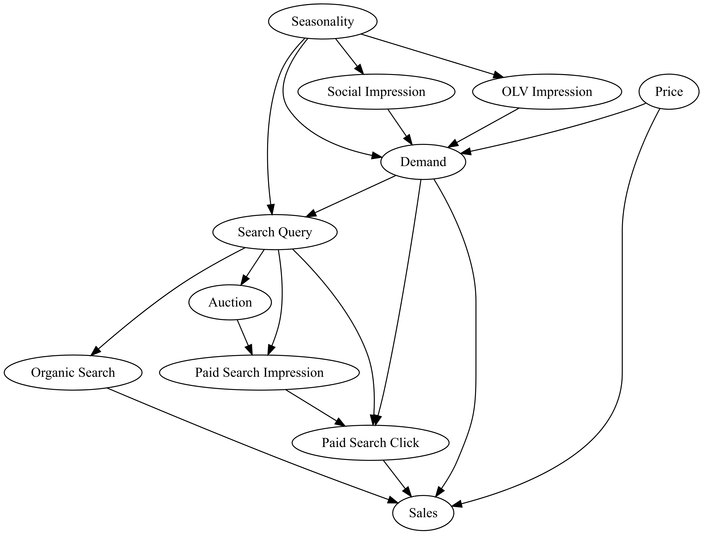
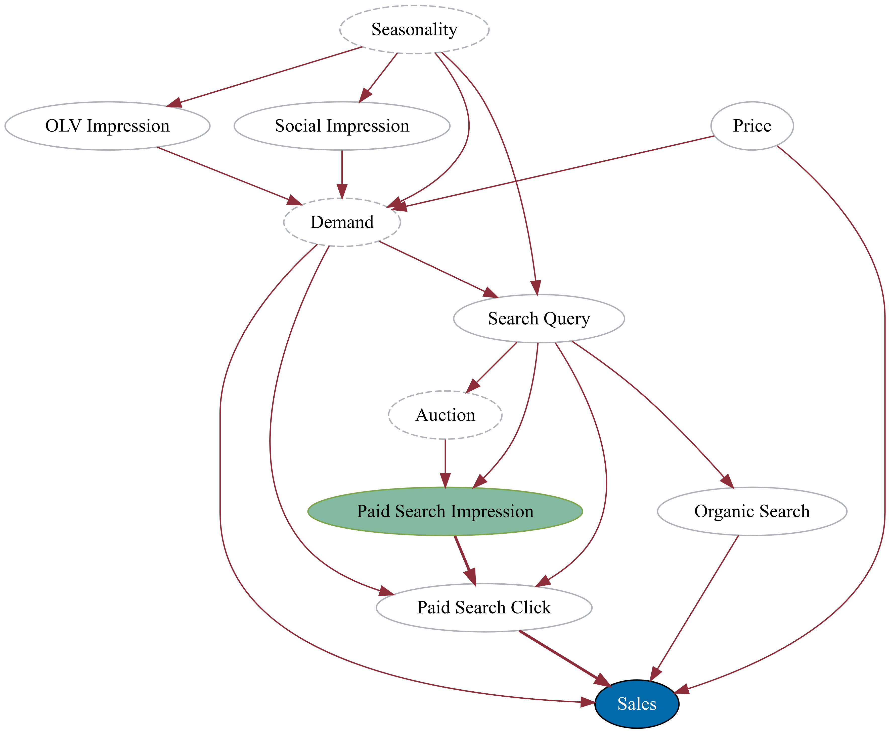
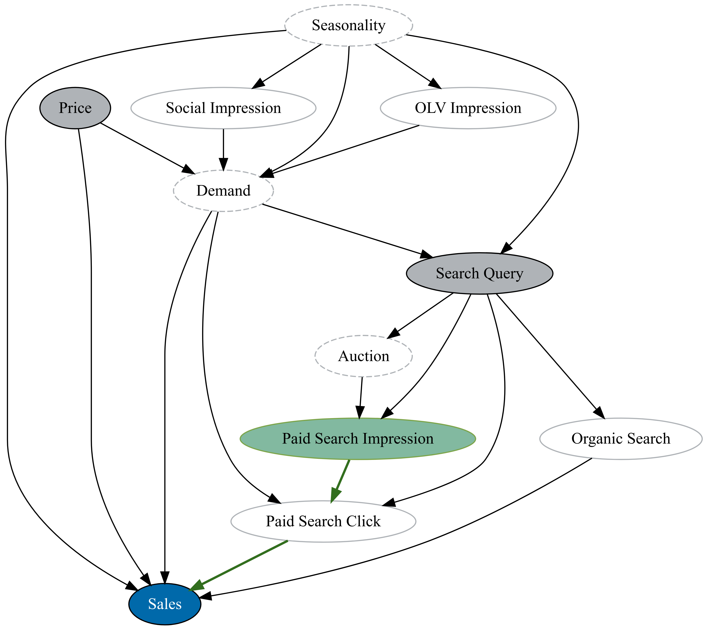
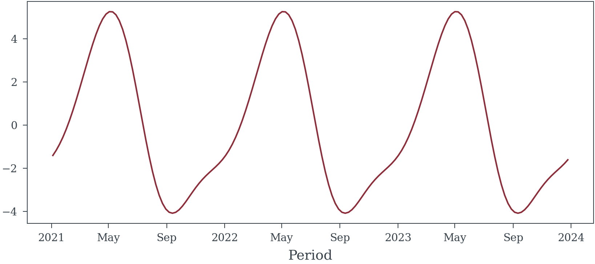

# When is Multicollinearity an Issue?


<!-- WARNING: THIS FILE WAS AUTOGENERATED! DO NOT EDIT! -->

## The Causal Model (and Related Syntax)

I will be using
<a href="#fig-causal-graph" class="quarto-xref">Figure 1</a> for the
rest of the examples on this page.

Edges will be colored to highlight if they represent causal paths (green
<button disabled style="background-color: #326E1E; height: 13px; width: 11px;"></button>),
biasing paths (red
<button disabled style="background-color: #8D2D39; height: 13px; width: 11px;"></button>),
or non-causal paths (black
<button disabled style="background-color: #000000; height: 13px; width: 11px;"></button>).
See
<a href="#fig-causal-graph-paid-search" class="quarto-xref">Figure 2</a>
and <a href="#fig-causal-graph-paid-search-adjusted"
class="quarto-xref">Figure 3</a>

Nodes that represent exposures (things for which we would like to know
the effect of) will be filled with a green
(<button disabled style="background-color: #82B9A0; height: 13px; width: 11px;"></button>)
background. The outcome variable of interest will be filled with a blue
background
(<button disabled style="background-color: #0069AA; height: 13px; width: 11px;"></button>).
Variables that are adjusted for are filled with a light gray color
(<button disabled style="background-color: #AFB3B7; height: 13px; width: 11px;"></button>)
Nodes with a dashed outline are difficult if not impossible to directly
observe. Nodes that are not filled and have a solid outline are
variables for which we have data (or for which data can be aqcuired).

<div class="panel-tabset">

## Causal Model

<div>



</div>

## Un-Adjusted

<div>



</div>

## Correctly Adjusted

<div>



</div>

</div>

------------------------------------------------------------------------

### sample_random_data

>      sample_random_data (N_weeks:int, include_hidden_confounds:bool=False,
>                          random_seed:int|None=None)

<table>
<colgroup>
<col style="width: 6%" />
<col style="width: 25%" />
<col style="width: 34%" />
<col style="width: 34%" />
</colgroup>
<thead>
<tr class="header">
<th></th>
<th><strong>Type</strong></th>
<th><strong>Default</strong></th>
<th><strong>Details</strong></th>
</tr>
</thead>
<tbody>
<tr class="odd">
<td>N_weeks</td>
<td>int</td>
<td></td>
<td>Number of weeks to generate</td>
</tr>
<tr class="even">
<td>include_hidden_confounds</td>
<td>bool</td>
<td>False</td>
<td>Should hidden confounds be included in the dataset</td>
</tr>
<tr class="odd">
<td>random_seed</td>
<td>int | None</td>
<td>None</td>
<td>Random Seed</td>
</tr>
<tr class="even">
<td><strong>Returns</strong></td>
<td><strong>Dataset</strong></td>
<td></td>
<td><strong>Dataset containing the variables described by the above
causal model</strong></td>
</tr>
</tbody>
</table>

``` python
sample_random_data(156, random_seed=3).plot()
```


